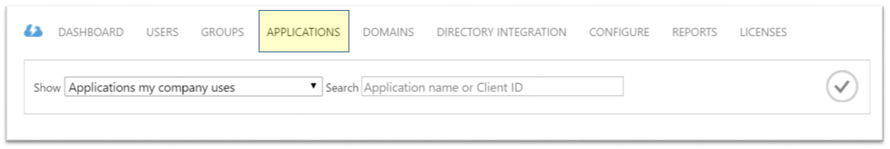
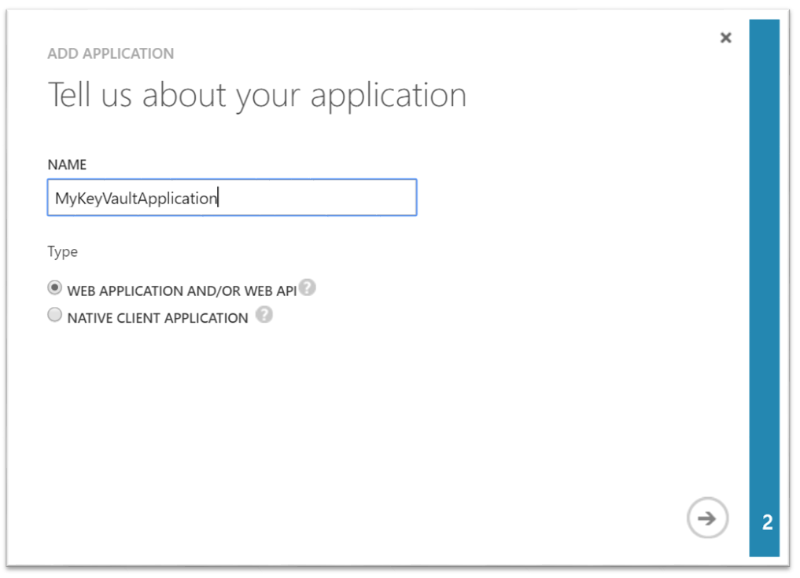
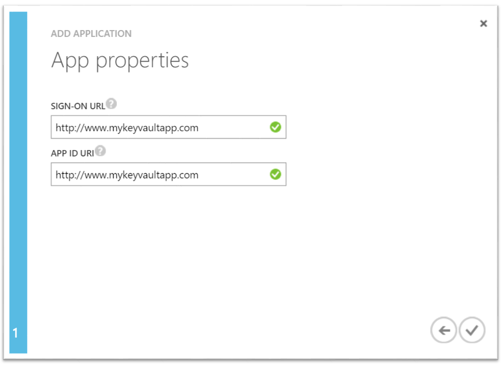
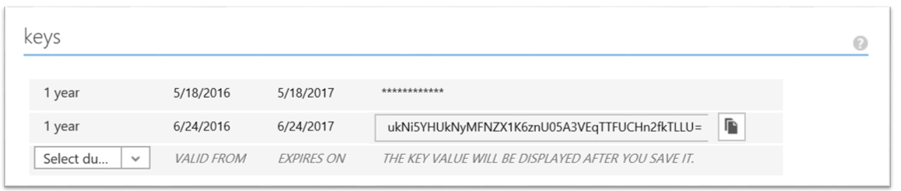

<properties
	pageTitle="How to setup Key Vault with end to end key rotation and auditing | Microsoft Azure"
	description="Use this how-to to help you get setup with key rotation and monitoring key vault logs"
	services="key-vault, automation,app-service\logic"
	documentationCenter=""
	authors="swgriffith"
	manager=""
	tags=""/>

<tags
	ms.service="key-vault"
	ms.workload="identity"
	ms.tgt_pltfrm="na"
	ms.devlang="na"
	ms.topic="article"
	ms.date="07/05/2016"
	ms.author="jodehavi;stgriffi"/>
#How to setup Key Vault with end to end key rotation and auditing

##Introduction

After creating your Azure Key Vault, you will be able to start leveraging that vault to store your Keys and Secrets. Your applications no longer need to persist your keys or secrets, but rather will request them from the key vault as needed. This allows you to update keys and secrets without impacting the behavior of your application, which opens up a breadth of possibilities around your key and secret management behavior.

This article walks through an example of leveraging Azure Key Vault to store a secret, in this case an Azure Storage Account key which is accessed by an application. It will also demonstrate implementation of a scheduled rotation of that storage account key. Finally, it will walk through a demonstration of how to monitor the key vault audit logs and raise alerts when unexpected requests are made.

> \[AZURE.NOTE\] This tutorial is not intended to explain in detail the initial set up of your Azure Key Vault. For this information, see [Get started with Azure Key Vault](key-vault-get-started.md). Or, for Cross-Platform Command-Line Interface instructions, see [this equivalent tutorial](key-vault-manage-with-cli.md).

##Setting up KeyVault

In order to enable an application to retrieve a secret from Azure Key Vault, you must first create the secret and upload it to your vault. This can be accomplished easily via PowerShell as shown below.

Start an Azure PowerShell session and sign in to your Azure account with the following command:

```powershell
Login-AzureRmAccount
```

In the pop-up browser window, enter your Azure account user name and password. Azure PowerShell will get all the subscriptions that are associated with this account and by default, uses the first one.

If you have multiple subscriptions, you might have to specify a specific one that was used to create your Azure Key Vault. Type the following to see the subscriptions for your account:

```powershell
Get-AzureRmSubscription
```

Then, to specify the subscription that's associated with your key vault you will be logging, type:

```powershell
Set-AzureRmContext -SubscriptionId <subscriptionID> 
```

As this article demonstrates storing of a storage account key as a secret, you will need to get that storage account key.

```powershell
Get-AzureRmStorageAccountKey -ResourceGroupName <resourceGroupName> -Name <storageAccountName>
```

After retrieving your secret, in this case your storage account key, you will need to convert that to a secure string and then create a secret with that value in your key vault.

```powershell
$secretvalue = ConvertTo-SecureString <storageAccountKey> -AsPlainText -Force

Set-AzureKeyVaultSecret -VaultName <vaultName> -Name <secretName> -SecretValue $secretvalue
```
Next you will want to get the URI for the secret you just created. This will be used in a later step when you are calling the Key Vault to retrieve your secret. Run the following PowerShell command and make note of the ‘Id’ value, which is the secret URI.

```powershell
Get-AzureKeyVaultSecret –VaultName <vaultName>
```

##Setting up Application

Now that you have a secret stored you will want to retrieve that secret and use it from code. There are a few steps required to achieve this, the first and most important of which is registering your application with Azure Active Directory and then telling Azure Key Vault your application information so that it can allow requests from your application.

> \[AZURE.NOTE\] Your application must be created on the same Azure Active Directory tenant as your Key Vault. 

First open the applications tab of Azure Active Directory



Choose ‘Add’ to add a new application to your Azure AD


Leave the application type as ‘Web Application AND/OR WEB API’ and give your application a name.



Give your application a ‘Sign-On URL’ and an ‘App ID URI’. These can be anything you want for this demo, and can be changed later if needed.



Once the application is added to Azure AD, you will be brought into the application page. From that point click on the ‘Configure’ tab and then find and copy the ‘Client ID’ value. Make note of the client ID for later steps.

Next you will need to generate a key for your application to be able to interact with your Azure AD. You can create this under the ‘Keys’ section in the ‘Configuration’ tab. Make note of the the newly generated key from your Azure AD application for use in a later step.



Before establishing any calls from your application into Key Vault you will need to tell the Key Vault about your application and its’ permissions. The following command takes the vault name and the client ID from your Azure AD app and grants ‘Get’ access to your key vault for the application.

```powershell
Set-AzureRmKeyVaultAccessPolicy -VaultName <vaultName> -ServicePrincipalName <clientIDfromAzureAD> -PermissionsToSecrets Get
```

At this point you are ready to start building your application calls. In your application you will first need to install the NuGet packages required to interact with Azure Key Vault and Azure Active Directory. From the Visual Studio Package Manager console enter the following commands. Note that at the writing of this article the current version of the ActiveDirectory package is 3.10.305231913, so you may want to confirm the latest version and update accordingly.

```powershell
Install-Package Microsoft.IdentityModel.Clients.ActiveDirectory -Version 3.10.305231913

Install-Package Microsoft.Azure.KeyVault
```

In your application code, create a class to hold the method for your Active Directory authentication. In this example that class is called ‘Utils’. You will then need to add the following using.

```csharp
using Microsoft.IdentityModel.Clients.ActiveDirectory;
```

Next, add the following method to retrieve the JWT token from Azure AD. For maintainability you may want to move the hard coded string values into your web or application configuration.

```csharp
public async static Task<string> GetToken(string authority, string resource, string scope)
{
    var authContext = new AuthenticationContext(authority);

    ClientCredential clientCred = new ClientCredential("<AzureADApplicationClientID>","<AzureADApplicationClientKey>");

    AuthenticationResult result = await authContext.AcquireTokenAsync(resource, clientCred);

    if (result == null)

    throw new InvalidOperationException("Failed to obtain the JWT token");

    return result.AccessToken;
}
```

Finally, you can add the necessary code to call Key Vault and retrieve your secret value. First you must add the following using statement.

```csharp
using Microsoft.Azure.KeyVault;
```

Next you will add the method calls to invoke Key Vault and retrieve your secret. In this method you will provide the secret URI which you saved in a previous step. Note the use of the GetToken method from the Utils class created above.
    
```csharp
var kv = new KeyVaultClient(new KeyVaultClient.AuthenticationCallback(Utils.GetToken));

var sec = kv.GetSecretAsync(<SecretID>).Result.Value;
```

When you run your application, you should now be authenticating to Azure Active Directory and then retrieving your secret value from your Azure Key Vault.

##Key Rotation using Azure Automation

There are various options for implementing a rotation strategy for values you store as Azure Key Vault secrets. Secrets can be rotated as part of a manual process, they may be rotated programatically by leveraging API calls, or they may be rotated by way of an automation script. For the purposes of this article we will be leveraging Azure PowerShell combined with Azure Automation to change an Azure Storage Account access key, and then we will update a key vault secret with that new key. 

In order to allow Azure Automation to set secret values in your key vault you will need to get the client ID for the connection named 'AzureRunAsConnection' which was created when you established your Azure Automation instance. You can get to this ID by choosing 'Assets' from your Azure Automation instance. From there you choose 'Connections' and then select the 'AzureRunAsConnection' service principle. You will want to take note of the 'Application ID'. 


While you are still in the Assets window you will also want to choose 'Modules'. From modules you will select 'Gallery' and then search for and 'Import' updated versions of each of the following modules.

	Azure
	Azure.Storage	
	AzureRM.Profile
	AzureRM.KeyVault
	AzureRM.Automation
	AzureRM.Storage
	
> \[AZURE.NOTE\] At the writing of this article only the above noted modules needed to be updated for the script shared below. If you find that your automation job is failing, you should confirm that you have all necessary modules and their dependencies imported.

After you have retrieved the application ID for your Azure Automation connection, you will need to tell your Azure Key Vault that this application has access to update secrets in your vault. This can be accomplished with the following PowerShell command.

```powershell
Set-AzureRmKeyVaultAccessPolicy -VaultName <vaultName> -ServicePrincipalName <applicationIDfromAzureAutomation> -PermissionsToSecrets Set
```

Next you will select the 'Runbooks' resource under your Azure Automation instance and select 'Add a Runbook'. Select 'Quick Create'. Name your runbook and select 'PowerShell' as the runbook type. Optionally add a description. Finally, click 'Create'.


In the editor pane for your new runbook you will paste the following PowerShell script.

```powershell
$connectionName = "AzureRunAsConnection"
try
{
    # Get the connection "AzureRunAsConnection "
    $servicePrincipalConnection=Get-AutomationConnection -Name $connectionName         

    "Logging in to Azure..."
    Add-AzureRmAccount `
        -ServicePrincipal `
        -TenantId $servicePrincipalConnection.TenantId `
        -ApplicationId $servicePrincipalConnection.ApplicationId `
        -CertificateThumbprint $servicePrincipalConnection.CertificateThumbprint 
    "Login complete."
}
catch {
    if (!$servicePrincipalConnection)
    {
        $ErrorMessage = "Connection $connectionName not found."
        throw $ErrorMessage
    } else{
        Write-Error -Message $_.Exception
        throw $_.Exception
    }
}

#Optionally you may set the following as parameters
$StorageAccountName = <storageAccountName>
$RGName = <storageAccountResourceGroupName>
$VaultName = <keyVaultName>
$SecretName = <keyVaultSecretName>

#Key name. For example key1 or key2 for the storage account
New-AzureRmStorageAccountKey -ResourceGroupName $RGName -StorageAccountName $StorageAccountName -KeyName "key2" -Verbose
$SAKeys = Get-AzureRmStorageAccountKey -ResourceGroupName $RGName -Name $StorageAccountName

$secretvalue = ConvertTo-SecureString $SAKeys[1].Value -AsPlainText -Force

$secret = Set-AzureKeyVaultSecret -VaultName $VaultName -Name $SecretName -SecretValue $secretvalue
```

From the editor pane you can choose 'Test pane' to test your script. Once the script is running without error you can select the 'Publish' option, and then you can apply a schedule for the runbook back at the runbook configuration pane.

##Key Vault Auditing pipeline

When you setup an Azure Key Vault you can turn on auditing to collect logs on access requests made to the Key Vault. These logs are stored in a designated Azure Storage account and can then be pulled out, monitored and analyzed. Below walks through a scenario that leverages Azure Functions, Azure Logic Apps and Key Vault audit logs to create a pipeline to send an email when secrets from the vault are retrieved by an app that does match the app id of the web app.

First, you will need to enable logging on your Key Vault. This can be done via the following PowerShell commands (full details can be seen [here](key-vault-logging.md)):

```powershell
$sa = New-AzureRmStorageAccount -ResourceGroupName <resourceGroupName> -Name <storageAccountName> -Type Standard\_LRS -Location 'East US'
$kv = Get-AzureRmKeyVault -VaultName '<vaultName>' 
Set-AzureRmDiagnosticSetting -ResourceId $kv.ResourceId -StorageAccountId $sa.Id -Enabled $true -Categories AuditEvent
```

Once this is enabled, then audit logs will start collecting into the designated storage account. These logs will contain events on how and when your Key Vaults are accessed, and by whom. 

> \[AZURE.NOTE\] You can access your logging information at most, 10 minutes after the key vault operation. In most cases, it will be quicker than this.

The next step is to [create an Azure Service Bus queue](../service-bus/service-bus-dotnet-get-started-with-queues.md). This will be where key vault audit logs are pushed. Once on the queue, the Logic App will pick them up and act on them. To create a Service Bus is relatively straight-forward and below are the high level steps:

1. Create a Service Bus namespace (if you already have one that you want to use for this then skip to step 2).
2. Browse to the Service Bus in the portal and select the namespace you want to create the queue in.
3. Select New and choose Service Bus -> Queue and enter the required details.
4. Grab the Service Bus connection information by choosing the namespace and clicking _Connection Information_. You will need this information for the next part.

Next, you will [create an Azure Function](../azure-functions/functions-create-first-azure-function.md) to poll the Key Vault logs within the storage account and pick up new events. This will be a function that is triggered on a schedule.

Create an Azure Function (choose New -> Function App in the portal). During creation you can use an existing hosting plan or create a new one. You could also opt for dynamic hosting. More details on Function hosting options can be found [here](../azure-functions/functions-scale.md).

When the Azure Function is created, navigate to it and choose a timer function and C\# then click **Create** from the start screen.


In the _Develop_ tab, replace the run.csx code with the following:

```csharp
#r "Newtonsoft.Json"

using System;
using Microsoft.WindowsAzure.Storage;
using Microsoft.WindowsAzure.Storage.Auth;
using Microsoft.WindowsAzure.Storage.Blob;
using Microsoft.ServiceBus.Messaging; 
using System.Text;

public static void Run(TimerInfo myTimer, TextReader inputBlob, TextWriter outputBlob, TraceWriter log) 
{ 
    log.Info("Starting");

    CloudStorageAccount sourceStorageAccount = new CloudStorageAccount(new StorageCredentials("<STORAGE_ACCOUNT_NAME>", "<STORAGE_ACCOUNT_KEY>"), true);

    CloudBlobClient sourceCloudBlobClient = sourceStorageAccount.CreateCloudBlobClient();

    var connectionString = "<SERVICE_BUS_CONNECTION_STRING>";
    var queueName = "<SERVICE_BUS_QUEUE_NAME>";

    var sbClient = QueueClient.CreateFromConnectionString(connectionString, queueName);

    DateTime dtPrev = DateTime.UtcNow;
    if(inputBlob != null)
    {
        var txt = inputBlob.ReadToEnd();

        if(!string.IsNullOrEmpty(txt))
        {
            dtPrev = DateTime.Parse(txt);
            log.Verbose($"SyncPoint: {dtPrev.ToString("O")}");
        }
        else
        {
            dtPrev = DateTime.UtcNow;
            log.Verbose($"Sync point file didnt have a date. Setting to now.");
        }
    }

    var now = DateTime.UtcNow;

    string blobPrefix = "insights-logs-auditevent/resourceId=/SUBSCRIPTIONS/<SUBSCRIPTION_ID>/RESOURCEGROUPS/<RESOURCE_GROUP_NAME>/PROVIDERS/MICROSOFT.KEYVAULT/VAULTS/<KEY_VAULT_NAME>/y=" + now.Year +"/m="+now.Month.ToString("D2")+"/d="+ (now.Day).ToString("D2")+"/h="+(now.Hour).ToString("D2")+"/m=00/";

    log.Info($"Scanning:  {blobPrefix}");

    IEnumerable<IListBlobItem> blobs = sourceCloudBlobClient.ListBlobs(blobPrefix, true);

    log.Info($"found {blobs.Count()} blobs");

    foreach(var item in blobs)
    {
        if (item is CloudBlockBlob)
        {
            CloudBlockBlob blockBlob = (CloudBlockBlob)item;

            log.Info($"Syncing: {item.Uri}");

            string sharedAccessUri = GetContainerSasUri(blockBlob);

            CloudBlockBlob sourceBlob = new CloudBlockBlob(new Uri(sharedAccessUri));

            string text;
            using (var memoryStream = new MemoryStream())
            {
                sourceBlob.DownloadToStream(memoryStream);
                text = System.Text.Encoding.UTF8.GetString(memoryStream.ToArray());
            }

            dynamic dynJson = JsonConvert.DeserializeObject(text);

            //required to order by time as they may not be in the file
            var results = ((IEnumerable<dynamic>) dynJson.records).OrderBy(p => p.time);

            foreach (var jsonItem in results)
            {
                DateTime dt = Convert.ToDateTime(jsonItem.time);

                if(dt>dtPrev){
                    log.Info($"{jsonItem.ToString()}");

                    var payloadStream = new MemoryStream(Encoding.UTF8.GetBytes(jsonItem.ToString()));
                    //When sending to ServiceBus, use the payloadStream and set keeporiginal to true
                    var message = new BrokeredMessage(payloadStream, true);
                    sbClient.Send(message);
                    dtPrev = dt;
                }
            }
        }
    }
    outputBlob.Write(dtPrev.ToString("o"));
}

static string GetContainerSasUri(CloudBlockBlob blob) 
{
    SharedAccessBlobPolicy sasConstraints = new SharedAccessBlobPolicy();

    sasConstraints.SharedAccessStartTime = DateTime.UtcNow.AddMinutes(-5);
    sasConstraints.SharedAccessExpiryTime = DateTime.UtcNow.AddHours(24);
    sasConstraints.Permissions = SharedAccessBlobPermissions.Read;

    //Generate the shared access signature on the container, setting the constraints directly on the signature.
    string sasBlobToken = blob.GetSharedAccessSignature(sasConstraints);

    //Return the URI string for the container, including the SAS token.
    return blob.Uri + sasBlobToken;
}
```
> \[AZURE.NOTE\] Make sure to replace the variables in the code above to point to your storage account where the Key Vault logs are written, to the Service Bus you created earlier and to the specific path to the key vault storage logs.

The function picks up the latest log file from the storage account where the Key Vault logs are written, grabs the latest events from that file and pushes them to a Service Bus queue. Since a single file could have multiple events, e.g. over a full hour, then we create a _sync.txt_ file that the function also looks at to determine the time stamp of the last event that was picked up. This will ensure that we don't push the same event multiple times. This _sync.txt_ file simply contains a timestamp for the last encountered event. The logs, when loaded, have to be sorted based on the timestamp to ensure they are ordered correctly.

For this function, we reference a couple of additional libraries that are not available out of the box in Azure Functions. To include these, we need Azure Functions to pull them using nuget. Choose the _View Files_ option 


and add a new file called _project.json_ with following content:

```json
    {
      "frameworks": {
        "net46":{
          "dependencies": {
                "WindowsAzure.Storage": "7.0.0",
                "WindowsAzure.ServiceBus":"3.2.2"
          }
        }
       }
    }
```
Upon _Save_ this will trigger Azure Functions to download the required binaries. 

Switch to the **Integrate** tab and give the timer parameter a meaningful name to use within the function. In the code above, it expects the timer to be called _myTimer_. Specify a [CRON expression](../app-service-web/web-sites-create-web-jobs.md#CreateScheduledCRON) as follows: 0 \* \* \* \* \* for the timer which will cause the function to run once a minute. 

In the same **Integrate** tab, add an input which will be of type _Azure Blob Storage_. This will point to the _sync.txt_ file that contains the timestamp of the last event looked at by the function. This will be made available within the function by the parameter name. In the code above, the Azure Blob Storage input expects the parameter name to be _inputBlob_. Choose the storage account where the _sync.txt_ file will reside (it could be the same or a different storage account) and in the path field, provide the path where the file lives, in the format of {container-name}/path/to/sync.txt.

Add an output which will be of type _Azure Blob Storage_ output. This will also point to the _sync.txt_ file you just defined in the input. This will be used by the function to write the timestamp of the last event looked at. The code above expects this paramter to be called _outputBlob_.

At this point the function is ready. Make sure to switch back to the **Develop** tab and _Save_ the code. Check the output window for any compilation errors and correct those accordingly. If it compiles, then the code should now be running and every minute will check the Key Vault logs and push any new events onto the defined Service Bus queue. You should see logging information write out to the log window everytime the function is triggered.

###Azure Logic App

Next we will need to create an Azure Logic App that will pick up the events that the function is pushing to the Service Bus queue, parse the content and send an email based on a condition being matched.

[Create a Logic App](../app-service-logic/app-service-logic-create-a-logic-app.md) by going to New -> Logic App. 

Once the Logic App is created, navigate to it and choose _edit_. Within the Logic App editor, choose the _Service Bus Queue_ managed api and enter your Service Bus credentials to connect it to the queue.


Next choose to _Add a condition_. In the condition, switch to the _advanced editor_ and enter the following, replacing the APP_ID with the actual APP_ID of your web app:

```
@equals('<APP_ID>', json(decodeBase64(triggerBody()['ContentData']))['identity']['claim']['appid'])
```

This expression essentially will return **false** if the **appid** property from the incoming event (which is the body of the Service Bus message) is not the **appid** of the app. 

Now, create an action under the _If no, do nothing..._ option.


For the action, choose _Office 365 - send email_. Fill out the fields to create an email to send when the defined condition returns false. If you do not have Office 365 you could look at alternatives to achieve the same.

At this point you have an end to end pipeline that, once a minute, will look for new Key Vault audit logs. Any new logs it finds, it will push them to a Service Bus Queue. The Logic App will be triggered as soon as a new message lands in the queue and if the appid within the event does not match the app id of the calling application then send an email. 