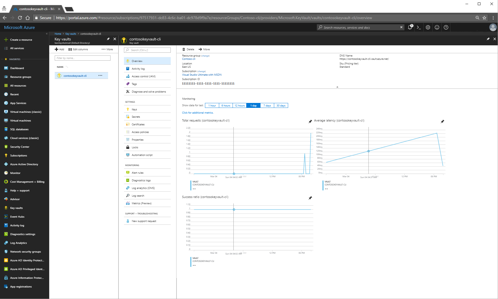
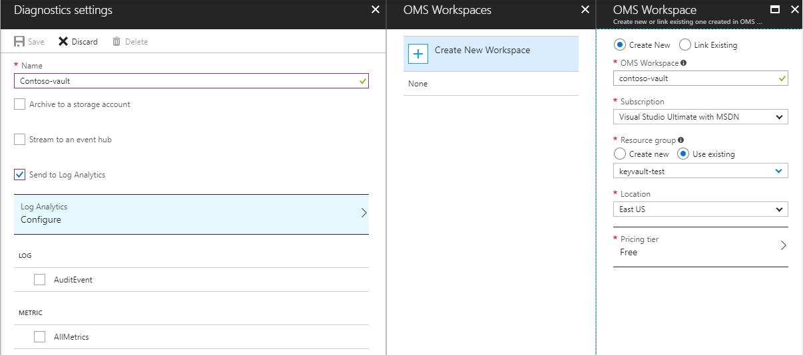

# What is Azure Key Vault?

You have passwords, connection strings and other pieces of information that are needed to keep your applications working. You want to make sure that this information is available but that it is secured. This is where Azure Key Vault can help. Azure Key Vault can help you securely store and manage application secrets.
Azure Key Vault is a cloud service that works as a secure secrets store. Key Vault allows you to create multiple secure containers, called vaults. These vaults are backed by hardware security modules (HSMs). Vaults help reduce the chances of accidental loss of security information by centralizing the storage of application secrets. Key Vaults also control and log the access to anything stored in them. Azure Key Vault can handle requesting and renewing TLS certificates, providing the features required for a robust certificate lifecycle management solution.

>[!IMPORTANT] 
> Azure Key vault is designed to support application keys and secrets. Key Vault is not intended to be used as a store for user passwords.

Why use Azure Key Vault?

- **Centralize application secrets:** Centralizing application secrets helps reduce the risk of accidental data loss. Secrets no longer need to be included in the code or configuration files.  

- **Security:** Keys are safeguarded by Azure, using industry-standard algorithms, key lengths, and hardware security modules (HSMs). The HSMs used are FIPS 140-2 Level 2 validated. 

- **Monitoring:** Azure Key Vault includes logging capabilities. You can configure Key Vault so that you can monitor how and when your Key Vaults are accessed and by whom.  

- **Simplified administration of application secrets:** Azure Key Vault takes away the need to purchase and manage HSMs. It still allows you to have all the control you need over your security information without additional management overhead.   

- **Integration with other Azure services:** Several Azure services have functionality that take advantage of Azure Key Vault.

>[!NOTE]
> Azure Key Vault is billed per transaction and it is available in two tiers. The standard tier offers software (software-based HSM) protected keys only while the premium tier allows you manage both software and hardware protected keys. For more information on pricing please visit the [Key Vault pricing page]( https://azure.microsoft.com/pricing/details/key-vault/)

## Centralization of application secrets:

Centralizing storage of application secrets in Azure Key Vault allows you to control their distribution. This greatly reduces the chances that secrets may be accidentally leaked. When using Key Vault, application developers no longer need to store security information in their application. This eliminates the need to make this information part of the code. For example, an application may need to connect to a database. Instead of storing the connection string in the app codes, store it securely in Key Vault.  

Your applications can securely access the information they need by using URIs that allow them to retrieve specific versions of a secret after the application’s key or secret is stored in Azure Key Vault. This happens without having to write custom code to protect any of the secret information. 

## Security:

Access to a key vault requires proper authentication and authorization before a caller (user or application) can get access. Authentication establishes the identity of the caller, while authorization determines the operations that they are allowed to perform.

Authentication is done via Azure Active Directory. Authorization may be done via role-based access control (RBAC) or Key Vault access policy. RBAC is used when dealing with the management of the vaults and key vault access policy is used when attempting to access data stored in a vault.

Azure Key Vaults may be either software- or hardware-HSM protected. For situations where you require added assurance you can import or generate keys in hardware security modules (HSMs) that never leave the HSM boundary. Microsoft uses Thales hardware security modules. You can use Thales tools to move a key from your HSM to Azure Key Vault. 

Finally, Azure Key Vault is designed so that Microsoft does not see or extract your keys.

## Monitoring

Once that you have created a couple of Key Vaults you will want to monitor how and when your keys and secrets are being accessed. You can do this by enabling logging for Key Vault. You can configure Azure Key Vault to:

- Archive to a storage account
- Stream to an event hub
- Send the logs to Log Analytics

You have control over your logs and you may secure them by restricting access and you may also delete logs that you no longer need.
Key Vault logs contain several fields such as time, resource ID, etc. The operationName field documents the REST API command that was used. For example, authentication, reading information from the Key Vault, deleting and more.

## Simplified administration of application secrets

When storing valuable data, you must take several steps. Security information must be secured, it must follow a lifecycle, it must be highly available. Azure Key Vault simplifies a lot of this by:

- Removing the need for in-house knowledge of HSMs
- Scaling up on short notice to meet your organization’s usage spikes.
- Replicating the contents of your Key Vault within a region and to a secondary region. This ensures high availability and takes away the need of any action from the administrator to trigger the fail over.
- Providing standards Azure administration options via the portal, Azure CLI and PowerShell. 
- Automating certain tasks on certificates that you purchase from Public CAs, such as enroll and renew. 

In addition, Azure Key Vaults allow you to segregate application secrets. Applications may access only the vault that they are allowed to access, and they may only perform the actions that the application identity has been allowed to perform. You can create an Azure Key Vault per application and restrict the secrets stored in a Key Vault to a specific application and team of developers.

## Integration with other Azure services

Given that it is a secure store in Azure Key Vault has been used to simplify scenarios like [Azure Disk Encryption](../security/azure-security-disk-encryption.md), the [always encrypted]( https://docs.microsoft.com/sql/relational-databases/security/encryption/always-encrypted-database-engine) functionality in SQL server and Azure SQL, [Azure web apps]( https://docs.microsoft.com/azure/app-service/web-sites-purchase-ssl-web-site) and Key Vault itself can integrate with storage accounts, event hubs and log analytics.
