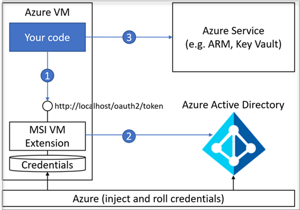

---
title: What is Azure Key Vault? | Microsoft Docs
description: Azure Key Vault helps safeguard cryptographic keys and secrets used by cloud applications and services. By using Azure Key Vault, customers can encrypt keys and secrets (such as authentication keys, storage account keys, data encryption keys, .PFX files, and passwords) by using keys that are protected by hardware security modules (HSMs).
services: key-vault
documentationcenter: ''
author: barclayn
manager: mbaldwin
tags: azure-resource-manager

ms.assetid: e759df6f-0638-43b1-98ed-30b3913f9b82
ms.service: key-vault
ms.workload: identity
ms.tgt_pltfrm: na
ms.devlang: na
ms.topic: conceptual
ms.date: 09/05/2018
ms.author: barclayn

---
# What is Azure Key Vault?

Azure Key Vault helps solve the following problems
- **Secrets Management** - Azure Key Vault can be used to Securely store and tightly control access to tokens, passwords, certificates, API keys, and other secrets
- **Key Management** - Azure Key Vault can also be used as a Key Management solution. Azure Key Vault makes it easy to create and control the encryption keys used to encrypt your data. 
- **Certificate Management** - Azure Key Vault is also a service that lets you easily provision, manage, and deploy public and private Secure Sockets Layer/Transport Layer Security (SSL/TLS) certificates for use with Azure and your internal connected resources. 
- **Store secrets backed by Hardware Security Modules** - The secrets and keys can be protected either by software or FIPS 140-2 Level 2 validates HSMs

## Basic concepts

Azure Key Vault is a tool for securely storing and accessing secrets. A secret is anything that you want to tightly control access to, such as API keys, passwords, or certificates. A **Vault** is logical group of secrets. Now to do any operations with Key Vault you first need to authenticate to it. 

Fundamentally there are 3 ways to authenticate to Key Vault

1. **Using [managed identities for Azure resources](https://docs.microsoft.com/en-us/azure/active-directory/managed-identities-azure-resources/overview)** (**Recommended and Best Practice**): When you deploy an App on a Virtual Machine in Azure, you can assign an identity to your Virtual Machine that has access to Key Vault. You can also assign identities to other azure resources that are listed [here](https://docs.microsoft.com/en-us/azure/active-directory/managed-identities-azure-resources/overview). The benefit with this approach is the app / service is not managing the rotation of the first secret. Azure automatically rotates the identity. 
2. **Using Service Principal and Certificate:** The 2nd option is to use a Service Principal and an associated certificate that has access to Key Vault. The onus of rotating the certificate is on the application owner or developer and hence this is not recommended
3. **Using Service Principal and Secret:** The 3rd option (not preferred option) is to use a Service Principal and a secret to authenticate to Key Vault

Here are some key terms:
- **Tenant**: A tenant is the organization that owns and manages a specific instance of Microsoft cloud services. It’s most often used in an exact manner to refer to the set of Azure and Office 365 services for an organization.
- **Vault owner**: A vault owner can create a key vault and gain full access and control over it. The vault owner can also set up auditing to log who accesses secrets and keys. Administrators can control the key lifecycle. They can roll to a new version of the key, back it up, and do related tasks.
- **Vault consumer**: A vault consumer can perform actions on the assets inside the key vault when the vault owner grants the consumer access. The available actions depend on the permissions granted.
- **Resource**: A resource is a manageable item that's available through Azure. Some common resources are a virtual machine, storage account, web app, database, and virtual network, but there are many more.
- **Resource group**: A resource group is a container that holds related resources for an Azure solution. The resource group can include all the resources for the solution, or only those resources that you want to manage as a group. You decide how you want to allocate resources to resource groups, based on what makes the most sense for your organization.
- **Service Principal** - In order to access resources that are secured by an Azure AD tenant, the entity that requires access must be represented by a security principal. This is true for both users (user principal) and applications (service principal). The security principal defines the access policy and permissions for the user/application in that tenant. This enables core features such as authentication of the user/application during sign-in, and authorization during resource access.
- **[Azure Active Directory (Azure AD)](../active-directory/active-directory-whatis.md)**: Azure AD is the Active Directory service for a tenant. Each directory has one or more domains. A directory can have many subscriptions associated with it, but only one tenant. 
- **Azure tenant ID**: A tenant ID is a unique way to identify an Azure AD instance within an Azure subscription.
- **Managed identities for Azure resources**: Azure Key Vault provides a way to securely store credentials and other keys and secrets, but your code needs to authenticate to Key Vault to retrieve them. Using a managed identity makes solving this problem simpler by giving Azure services an automatically managed identity in Azure AD. You can use this identity to authenticate to Key Vault or any service that supports Azure AD authentication, without having any credentials in your code. For more information, see the image below and the [managed identities for Azure resources overview](../active-directory/managed-identities-azure-resources/overview.md).

    

## Key Vault roles

Use the following table to better understand how Key Vault can help to meet the needs of developers and security administrators.

| Role | Problem statement | Solved by Azure Key Vault |
| --- | --- | --- |
| Developer for an Azure application |“I want to write an application for Azure that uses keys for signing and encryption, but I want these keys to be external from my application so that the solution is suitable for an application that is geographically distributed.   I want these keys and secrets to be protected, without having to write the code myself. I also want these keys and secrets to be easy for me to use from my applications, with optimal performance.” |√ Keys are stored in a vault and invoked by URI when needed.   √ Keys are safeguarded by Azure, using industry-standard algorithms, key lengths, and hardware security modules.   √ Keys are processed in HSMs that reside in the same Azure datacenters as the applications. This method provides better reliability and reduced latency than keys that reside in a separate location, such as on-premises. |
| Developer for software as a service (SaaS) |“I don’t want the responsibility or potential liability for my customers’ tenant keys and secrets.   I want customers to own and manage their keys so that I can concentrate on doing what I do best, which is providing the core software features.” |√ Customers can import their own keys into Azure, and manage them. When a SaaS application needs to perform cryptographic operations by using their customers’ keys, Key Vault does these operations on behalf of the application. The application does not see the customers’ keys. |
| Chief security officer (CSO) |“I want to know that our applications comply with FIPS 140-2 Level 2 HSMs for secure key management.   I want to make sure that my organization is in control of the key lifecycle and can monitor key usage.   And although we use multiple Azure services and resources, I want to manage the keys from a single location in Azure.” |√ HSMs are FIPS 140-2 Level 2 validated.  √ Key Vault is designed so that Microsoft does not see or extract your keys.  √ Key usage is logged in near real time.  √ The vault provides a single interface, regardless of how many vaults you have in Azure, which regions they support, and which applications use them. |

Anybody with an Azure subscription can create and use key vaults. Although Key Vault benefits developers and security administrators, it can be implemented and managed by an organization’s administrator who manages other Azure services for an organization. For example, this administrator can sign in with an Azure subscription, create a vault for the organization in which to store keys, and then be responsible for operational tasks, such as:

* Create or import a key or secret
* Revoke or delete a key or secret
* Authorize users or applications to access the key vault, so they can then manage or use its keys and secrets
* Configure key usage (for example, sign or encrypt)
* Monitor key usage

This administrator would then provide developers with URIs to call from their applications, and provide their security administrator with key usage logging information. 

![Overview of Azure Key Vault][1]

Developers can also manage the keys directly, by using APIs. For more information, see [the Key Vault developer's guide](key-vault-developers-guide.md).

## Next steps

For a getting-started tutorial for an administrator, see [Get started with Azure Key Vault](key-vault-get-started.md).

For more information about usage logging for Key Vault, see [Azure Key Vault logging](key-vault-logging.md).

For more information about using keys and secrets with Azure Key Vault, see [About keys, secrets, and certificates](https://msdn.microsoft.com/library/azure/dn903623\(v=azure.1\).aspx).

<!--Image references-->
[1]: ./media/key-vault-whatis/AzureKeyVault_overview.png
Azure Key Vault is available in most regions. For more information, see the [Key Vault pricing page](https://azure.microsoft.com/pricing/details/key-vault/).
