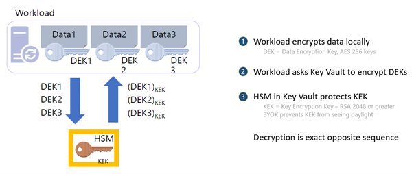

# Azure Key Vault Managed HSM – Control your data in the cloud

At Microsoft, we value, protect, and defend privacy. We believe in transparency, so that people and organizations can control their data and have meaningful choices in how it is used. We empower and defend the privacy choices of every person who uses our products and services. In this blog, we will take a deep dive on Microsoft’s [Azure Key Vault Managed HSM’s](./overview.md) security controls for encryption and how it provides additional safeguards and technical measures to help our customers meet compliance. Encryption is one of the key technical measures to achieve sole control of your data.

Microsoft’s Azure fortifies your data through state-of-the-art encryption technologies for both data at rest and in transit. Our encryption products erect barriers against unauthorized access to the data including two or more independent encryption layers to protect against compromises of any one layer. In addition, Azure has clearly defined, well-established responses, policies and processes, strong contractual commitments, and strict physical, operational, and infrastructure security controls to provide our customers the ultimate control of their data in the cloud. The fundamental premise of Azure’s key management strategy is to give our customers more control over their data with [Zero Trust](https://www.microsoft.com/security/business/zero-trust) posture with advanced enclave technologies, hardware security modules and identity isolation that reduces Microsoft’s access to customer keys and data.

**Encryption at Rest** provides data protection for stored data at rest and required by organizations need for data governance and compliance efforts. Microsoft’s compliance portfolio is the broadest in all public clouds worldwide with Industry standards and government regulations such as the [HIPAA](https://www.hhs.gov/hipaa/for-professionals/security/laws-regulations/index.html),  [General Data Protection Regulation](https://gdpr.eu/), and [FIPS (Federal Information Processing Standards) 140-2 and 3](https://csrc.nist.gov/publications/detail/fips/140/2/final). These standards and regulations lay out specific safeguards regarding data protection and encryption requirements and in most cases a mandatory measure required for compliance.

## How does Encryption at Rest work?

**Azure Key Vault** services provide encryption and key management solutions that safeguard cryptographic keys, certificates and other secrets used by cloud applications and services to protect and control data encrypted at rest. Secure key management is essential to protect and control data in the cloud. Azure offers various solutions for managing and controlling access to encryption keys, thereby giving you a choice and flexibility to meet stringent data protection and compliance needs.

- Azure Platform Encryption is a ***Platform Managed*** encryption solution that encrypts with host level encryption. Platform managed keys are encryption keys that are generated, stored, managed entirely by Azure.
- Encryption with ***Customer Managed*** keys are keys created, read, deleted, updated and/or administered entirely by the customer. Customer Managed keys can be stored in a cloud key management service as shown below
- **Azure Key Vault (AKV Standard)** encrypts with a software key and is FIPS 140-2 Level 1 compliant
- **Azure Key Vault (AKV Premium)** encrypts with a FIPS 140-2 Level 2 hardware security module (HSM) protected keys
- **Azure Key Vault Managed HSM** encrypts with a single tenant FIPS 140-2 Level 3 hardware security module (HSM) protected keys and is fully managed by Microsoft and provides customers with the sole control of the cryptographic keys

For added assurance, AKV Premium and AKV Managed HSM support importing HSM-protected keys from an on-premises HSM commonly referred to as [*Bring your own key (BYOK)*](../keys/hsm-protected-keys-byok.md)

## Portfolio of Azure Key Management products

	
| | Azure Key Vault Standard | Azure Key Vault Premium | Azure Key Vault Managed HSM|
|:-|-|-|-|
|**Tenancy**|Multi-Tenant|Multi-Tenant|Single-Tenant|
|**Compliance**|FIPS 140-2 level 1|FIPS 140-2 level 2|FIPS 140-2 level 3|
|**High Availability**|Automatic|Automatic|Automatic|
|**Use cases**|Encryption at Rest|Encryption at Rest|Encryption at Rest|
| **Key Controls**|Customer|Customer|Customer|
|**Root of trust control**|Microsoft|Microsoft|Customer|

**Azure Key Vault** is a cloud service for securely storing and accessing secrets. A secret is anything that you want to tightly control access to, such as API keys, passwords, certificates, or cryptographic keys. Key Vault service supports two types of containers:

- Vaults
    - Standard Tier - Vaults support storing secrets, certificates and software backed keys.
    - Premium Tier - Vaults support storing secrets, certificates, software and HSM-backed keys.
- Managed Hardware Security Module (HSM)
    - Managed HSM only support HSM-backed keys

See [Azure Key Vault Concepts](../general/basic-concepts.md) and [Azure Key Vault REST API overview](https://github.com/MicrosoftDocs/azure-docs/blob/main/articles/key-vault/general/about-keys-secrets-certificates.md) for details.

## What is Azure Key Vault Managed HSM?

Azure Key Vault Managed HSM (Hardware Security Module) is a fully managed, highly available, single-tenant, standards-compliant cloud service with a customer-controlled security domain that enables you to store cryptographic keys for your cloud applications, using FIPS 140-2 Level 3 validated HSMs

## How does Azure Key Vault Managed HSM protect your keys?

Azure Key Vault Managed HSM uses a defense in depth and [zero trust](https://www.microsoft.com/security/business/zero-trust?rtc=1) security posture that uses multiple layers including **physical**, **technical**, and **administrative** security controls to protect and defend your data.

**Azure Key Vault and Azure Key Vault Managed HSM are designed, deployed and operated such that Microsoft and its agents are precluded from accessing, using or extracting any data stored in the service, including cryptographic keys.**
 
**Customer keys that are securely created and/or securely imported into the HSM devices, unless set otherwise by the customer, are not marked extractable and are never visible in plaintext to Microsoft systems, employees, or our agents.**

**The Key Vault team explicitly does not have operating procedures for granting such access to Microsoft and its agents, even if authorized by a customer.**

**We will not attempt to defeat customer-controlled encryption features like Azure Key Vault or Azure Key Vault Managed HSM. If faced with a legal demand to do so, we would challenge such a demand on any lawful basis, consistent with our customer commitments as outlined in this [blog](https://blogs.microsoft.com/on-the-issues/2020/11/19/defending-your-data-edpb-gdpr/).**

Let us take a deep dive on how the security controls are implemented.

**Physical Security Controls** – The core of the Managed HSM offering is the hardware security module (HSM) which is a specialized, hardened, tamper resistant, high entropy dedicated cryptographic processor that is validated to FIPS 140-2 level 3 standard. All components of the HSM are further covered in hardened epoxy and a metal casing to keep your keys safe from an attacker. The HSMs are housed in racks of servers across several data centers, regions, and geographies. These geographically dispersed datacentres comply with key industry standards such as [ISO/IEC 27001:2013](/azure/compliance/offerings/offering-iso-27001) and [NIST SP 800-53](../../governance/policy/samples/nist-sp-800-53-r4.md) for security and reliability.

Microsoft designs, builds, and operates datacenters in a way that strictly controls physical access to the areas where your keys and data are stored. Additional layers of [physical security](../../security/fundamentals/physical-security.md) such as tall concrete and steel fences, dead bolted steel doors, thermal alarm systems, closed-circuit live camera monitoring, 24x7 security personnel presence, need to access basis per floor with approval, rigorous staff training, biometrics, background checks, access request and approval are mandated. In addition, the HSM devices and the related servers are caged locked with cameras filming the front and the back of the servers with tightly controlled access.

**Technical Security Controls** – There are several layers of technical controls around the managed HSM that further protects your key material but most importantly prevents Microsoft from accessing the key material.

- **Confidentiality** – The Managed HSM Service run inside a trusted execution environment built on Intel Software Guards Extension (SGX) and offers enhanced protection from internal and external attackers through hardware isolation that protects data in use. Enclaves are secured portions of the hardware's processor and memory. You cannot view data or code inside the enclave, even with a debugger. If untrusted code tries to change content in enclave memory, SGX disables the environment and denies the operations. These unique capabilities help you protect your cryptographic key material from being accessible in the clear. In addition, [Azure confidential computing](../../confidential-computing/overview.md) offers solutions to enable the isolation of your sensitive data while it is being processed in the cloud.
- **Security Domain** - The [security domain](./security-domain.md) (SD) is an encrypted blob that contains extremely sensitive cryptographic information that contains artifacts such as the HSM backup, user credentials, the signing key, and the data encryption key unique to your managed HSM. The SD is generated in the managed HSM hardware, and the service software enclaves at the initialization time. Once the managed HSM is provisioned, you must create at least 3 RSA key pairs and send the public keys to the service when requesting the Security Domain download. Once the Security Domain is downloaded, the Managed HSM moves into an activated state and ready for consumption. Microsoft personnel have no way of recovering the security domain, nor can they access your keys without the security domain.
- **Access controls and Authorization** – Access to a managed HSM is controlled through two interfaces: the management plane and the data plane. The management plane is where you manage the HSM itself. Operations in this plane include creating and deleting managed HSMs and retrieving managed HSM properties. The data plane is where you work with the data stored in a managed HSM -- that is HSM-backed encryption keys. You can add, delete, modify, and use keys to perform cryptographic operations, manage role assignments to control access to the keys, create a full HSM backup, restore full backup, and manage security domain from the data plane interface. To access a managed HSM in either plane, all callers must have proper authentication and authorization. Authentication establishes the identity of the caller. Authorization determines which operations the caller can execute. A caller can be any one of the security principals defined in Azure Active Directory - user, group, service principal or managed identity. Both planes use Azure Active Directory for authentication. For authorization they use different systems as follows
    - The management plane uses Azure role-based access control -- Azure RBAC (role-based access control) -- an authorization system built on Azure Resource Manager
    - The data plane uses a managed HSM-level RBAC (Managed HSM local RBAC) -- an authorization system implemented and enforced at the managed HSM level. The local RBAC control model allows designated HSM administrators to have complete control over their HSM pool that even the management group, subscription, or resource group administrators cannot override.
- **Encryption in Transit** – All traffic to and from the Managed HSM is always encrypted with TLS (Transport Layer Security versions 1.3 and 1.2 are supported) to protect against data tampering and eavesdropping where the TLS termination happens inside the SGX enclave and not in the untrusted host
- **Firewalls** - Managed HSM can be configured to restrict who can reach the service in the first place, which further shrinks the attack surface. We allow you to configure Managed HSM to deny access from the public internet and only allow traffic from trusted Azure services (such as Azure Storage)
- **Private Endpoints** – By enabling a private endpoint, you are bringing the Managed HSM service into your virtual network allowing you to isolate that service only to trusted endpoints like your VNET and Azure Services. All traffic to and from your HSM will travel along the secure Microsoft backbone network without having to traverse the public internet.
- **Monitoring and Logging** - The outermost layer of protection is the monitoring and logging capabilities of Managed HSM. With Azure Monitor service, you can check your logs for analytics and alerts to ensure that access patterns conform with your expectations. This allows members of your security team to have visibility into what is happening within the Managed HSM service. If something does not look right, you can always roll your keys or revoke permissions.
- **Bring Your Own Key (BYOK)** - BYOK enables Azure customers to use any supported on-premises HSMs to generate keys and import them into the Managed HSM. Some customers prefer to use on-premises HSMs to generate keys to meet regulatory and compliance requirements. BYOK enables secure transfer of HSM-protected key to the Managed HSM. The key to be transferred never exists outside an HSM in plaintext form. During the import process, the key material is protected with a key held in the Managed HSM.
- **External HSM** - A handful of our customers have come to us where they would like to explore the option of the HSM outside of the Azure cloud to keep the data and keys segregated with an external HSM either on the 3rd party cloud or on-premises. While a 3rd party HSM outside of Azure seems to give more control over keys to customers, it introduces several concerns such as latency causing performance issues, SLA issues caused by issues with the 3rd party HSM, and maintenance and training costs. In addition, key Azure features such as soft delete and purge protection cannot be leveraged by a 3rd party HSM. We will continue to evaluate this technical option with our customers to help them navigate the complex security and compliance landscape.

**Administrative Security Controls –**

- Microsoft’s strong commitment to challenge government requests to [defend your data](https://blogs.microsoft.com/on-the-issues/2020/11/19/defending-your-data-edpb-gdpr/)
- **Contractual obligations** around security and customer data protection as discussed in [Microsoft Trust Center](https://www.microsoft.com/trust-center?rtc=1) 
- **[Cross region replication](../../availability-zones/cross-region-replication-azure.md)**   - Managed HSM is introducing new functionality (geo-replication) very soon that will allow you to deploy HSMs in a secondary region
- **Disaster Recovery** - Azure offers an end-to-end backup and disaster recovery solution that is simple, secure, scalable and cost-effective
    - [Business continuity management program](../../availability-zones/business-continuity-management-program.md)
    - [Azure Site Recovery](../../site-recovery/index.yml)
    - [Azure backup](../../backup/index.yml) - Planned integration with the Managed HSM
    - [Azure well-architected framework](/azure/architecture/framework/)
- **[Microsoft Security Response Center](https://www.microsoft.com/msrc) (MSRC)** - Managed HSM service administration tightly integrated with MSRC
    - Security monitoring for unexpected administrative operations with full 24/7 security response
- **[Cloud Resilient and Secure Supply Chain](https://azure.microsoft.com/blog/advancing-reliability-through-a-resilient-cloud-supply-chain/)** - Advancing reliability through a resilient cloud supply chain
- **[Regulatory Compliance built-in initiative](../../governance/policy/samples/built-in-initiatives.md#regulatory-compliance)** - Compliance in Azure Policy provides built-in initiative definitions to view a list of the controls and compliance domains based on responsibility (Customer, Microsoft, Shared). For Microsoft-responsible controls, we provide additional details of our audit results based on third-party attestation and our implementation details to achieve that compliance
- **[Audit reports](https://servicetrust.microsoft.com/ViewPage/MSComplianceGuideV3)** - Resources to help information security and compliance professionals understand cloud features, and to verify technical compliance and control requirements
- **Assume Breach philosophy** – we assume that any component could be compromised at any time, and design and test appropriately, including regular Red Team/Blue Team exercises ([Attack simulation in Microsoft 365 - Microsoft Service Assurance | Microsoft Docs](/compliance/assurance/assurance-monitoring-and-testing))

In conclusion, the Azure Key Vault Managed HSM offers robust physical, technical, and administrative security controls and provides you with sole control over your key material for a scalable, centralized cloud key management solution that help satisfy growing compliance, security, and privacy needs and most importantly provides encryption safeguards required for compliance. Our customers can be assured that we are committed to ensuring their data will be protected with transparency about our practices as we progress toward the implementation of the EU Data Boundary.

 
For more information, reach out to your Azure account team to facilitate a discussion with the Azure Key Management product team