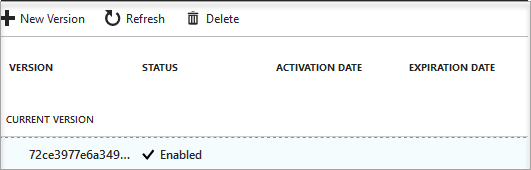

# Quickstart: Create a Key Vault using the Azure portal

Azure Key Vaults may be created and managed through the Azure portal. In this quickstart, you create a Key vault. Once that you have a Key Vault, you will store a secret.

If you don't have an Azure subscription, create a [free account](https://azure.microsoft.com/free/?WT.mc_id=A261C142F) before you begin.

## Log into Azure

Log in to the Azure portal at http://portal.azure.com.

## Create a Key Vault

1. Select the **Create a resource** option on the upper left-hand corner of the Azure portal

    
2. In the Search box enter **Key Vault**.
3. From the results list, choose **Key Vault**.
4. On the Key Vault section, choose **Create**.
5. On the **Create key vault** section provide the following information:
    - **Name**: A unique vault name.
    - **Subscription**: Choose the subscription that you will be using for this quickstart.
    - Under **Resource Group** choose **Create new** and enter a resource group name.
    - In the **Location** pull-down menu choose a location.
    - Check the **Pin to dashboard** checkbox.
    - Leave the other options to their defaults.
6. After providing the information above, select **Create**.

Take note of the two properties listed below:

* **Vault Name**: In the example, this is **ContosoKeyVault**. You will use this name for other Key Vault cmdlets.
* **Vault URI**: In the example, this is https://contosokeyvault.vault.azure.net/. Applications that use your vault through its REST API must use this URI.

Your Azure account is the only account allowed to do anything in this new Key Vault.

## Adding a secret to Key Vault

To add a secret to the vault, you just need to take a couple of additional steps. In this case we add a password that could be used by an application. The password is called **SQLPassword** and we store the value of **Pa$$w0rd** in it.

1. On the Key Vault properties page select **Secrets**.
2. Click on **Generate/Import**.
3. On the **Create a secret** screen choose the following:
    - **Upload options**: Manual.
    - **Name**: SQLPassword.
    - **Value**: Pa$$w0rd.
    - Leave the other values to their defaults. Click **Create**.

Once that you receive the message that the secret has been successfully created you may click on it on the list. You can then see some of the properties. If you click on the current version you can see the value you specified in the previous step.

## Clean up resources

When no longer needed, delete the resource group and this deletes the Key Vault and related resources. To delete the resource group through the portal:

1. Enter the name of your resource group in the Search box at the top of the portal. When you see the resource group used in this QuickStart in the search results, select it.
2. Select **Delete resource group**.
3. In the **TYPE THE RESOURCE GROUP NAME:** box type in the name of the resource group and select **Delete**.

>[!IMPORTANT]
> Other Key Vault quickstarts and tutorials build upon this quickstart. If you plan to continue on to work with subsequent quickstarts and tutorials, you may wish to leave these resources in place.

## Next steps

In this quickstart, you have created a Key Vault and stored a secret. To learn more about Key Vault and how you can use it with your applications continue to the tutorial for web applications working with Key Vault.

> [!div class="nextstepaction"]
> [Use Azure Key Vault from a Web Application](key-vault-use-from-web-application.md)
> [Configure an Azure web application to read a secret from Key vault](tutorial-web-application-keyvault.md)
