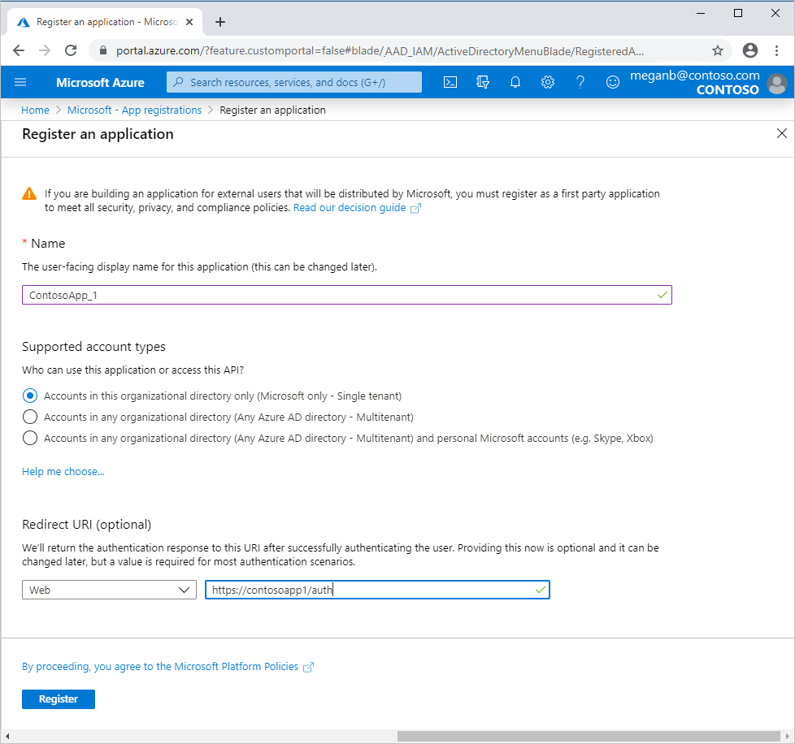
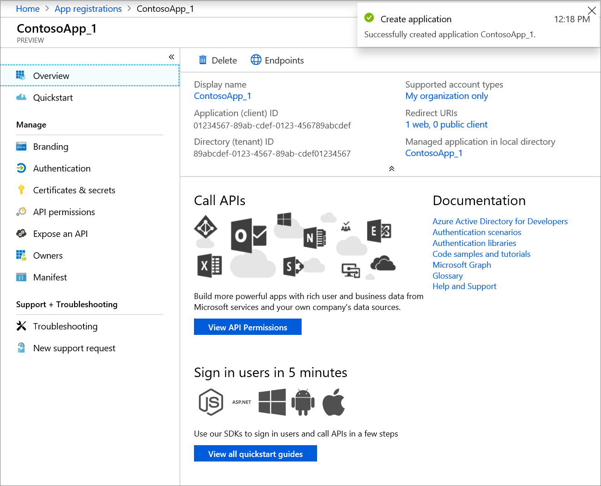
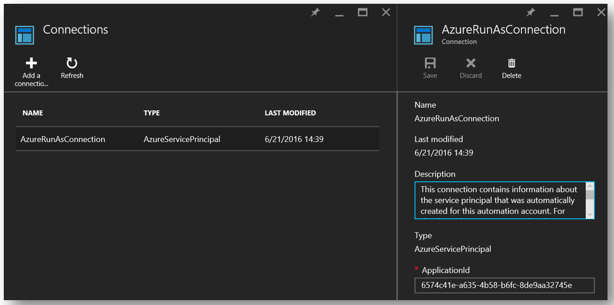
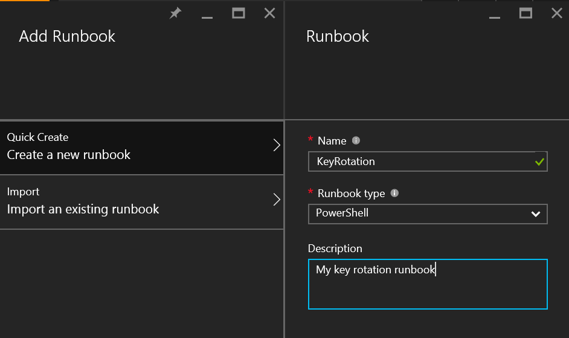
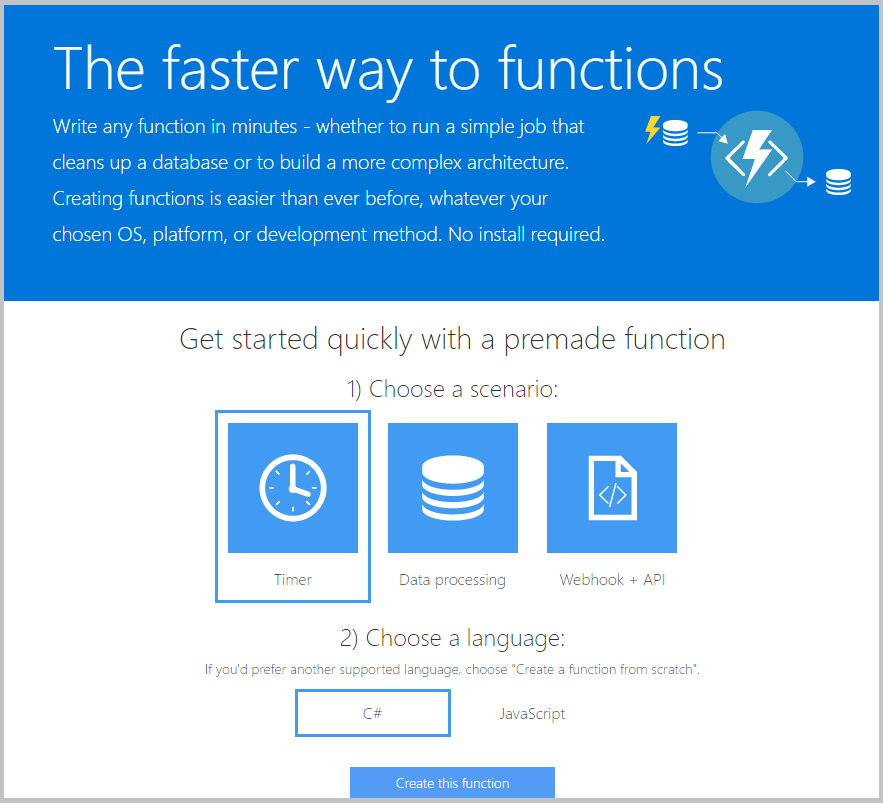
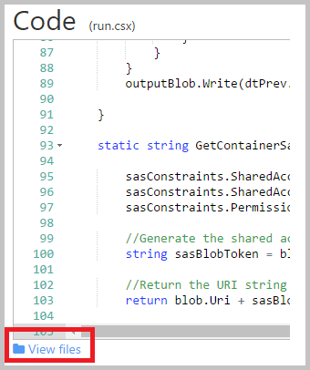
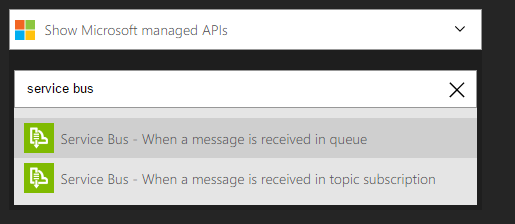
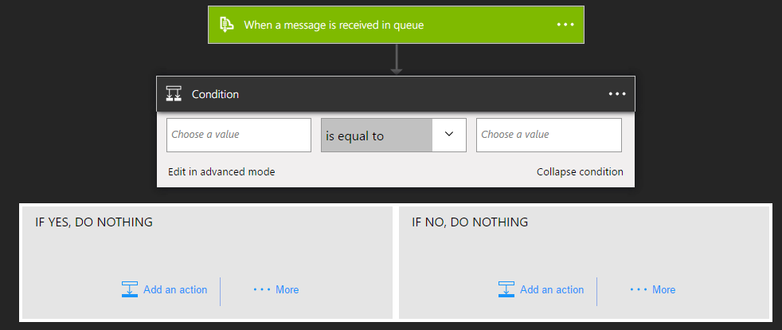

---
title: Set up Azure Key Vault with end-to-end key rotation and auditing | Microsoft Docs
description: Use this how-to guide to help you set up key rotation and monitor key vault logs.
services: key-vault
author: msmbaldwin
manager: rkarlin
tags: ''

ms.service: key-vault
ms.subservice: secrets
ms.topic: conceptual
ms.date: 01/07/2019
ms.author: mbaldwin

---
# Set up Azure Key Vault with key rotation and auditing

## Introduction

After you have a key vault, you can start using it to store keys and secrets. Your applications no longer need to persist your keys or secrets, but can request them from the vault as needed. A key vault allows you to update keys and secrets without affecting the behavior of your application, which opens up a breadth of possibilities for your key and secret management.

This article walks through how to implement a scheduled rotation of storage account keys, monitor the key vault audit logs, and raise alerts when unexpected requests are made. 

You must first create a key vault using the method of your choice:

- [Set and retrieve a secret from Azure Key Vault using Azure CLI](quick-create-cli.md)
- [Set and retrieve a secret from Azure Key Vault using Azure PowerShell](quick-create-powershell.md)
- [Set and retrieve a secret from Azure Key Vault using Azure portal](quick-create-portal.md)


## Store a secret

To enable an application to retrieve a secret from Key Vault, you must first create the secret and upload it to your vault.

Start an Azure PowerShell session and sign in to your Azure account with the following command:

```powershell
Connect-AzAccount
```

In the pop-up browser window, enter the username and password for your Azure account. PowerShell will get all the subscriptions that are associated with this account. PowerShell uses the first one by default.

If you have multiple subscriptions, you might have to specify the one that was used to create your key vault. Enter the following to see the subscriptions for your account:

```powershell
Get-AzSubscription
```

To specify the subscription that's associated with the key vault you'll be logging, enter:

```powershell
Set-AzContext -SubscriptionId <subscriptionID>
```

Because this article demonstrates storing a storage account key as a secret, you must get that storage account key.

```powershell
Get-AzStorageAccountKey -ResourceGroupName <resourceGroupName> -Name <storageAccountName>
```

After retrieving your secret (in this case, your storage account key), you must convert that key to a secure string, and then create a secret with that value in your key vault.

```powershell
$secretvalue = ConvertTo-SecureString <storageAccountKey> -AsPlainText -Force

Set-AzKeyVaultSecret -VaultName <vaultName> -Name <secretName> -SecretValue $secretvalue
```

Next, get the URI for the secret you created. You'll need this URI in a later step to call the key vault and retrieve your secret. Run the following PowerShell command and make note of the ID value, which is the secret's URI:

```powershell
Get-AzKeyVaultSecret –VaultName <vaultName>
```

## Set up the application

Now that you have a secret stored, you can use code to retrieve and use it after performing a few more steps.

First, you must register your application with Azure Active Directory. Then tell Key Vault your application information so that it can allow requests from your application.

> [!NOTE]
> Your application must be created on the same Azure Active Directory tenant as your key vault.

1. Sign in to the [Azure portal](https://portal.azure.com) using either a work or school account or a personal Microsoft account.
1. If your account gives you access to more than one tenant, select your account in the upper right corner. Set your portal session to the Azure AD tenant that you want.
1. Search for and select **Azure Active Directory**. Under **Manage**, select **App registrations**.
1. Select **New registration**.
1. In **Register an application**, enter a meaningful application name to display to users.
1. Specify who can use the application, as follows:

    | Supported account types | Description |
    |-------------------------|-------------|
    | **Accounts in this organizational directory only** | Select this option if you're building a line-of-business (LOB) application. This option isn't available if you're not registering the application in a directory.<br><br>This option maps to Azure AD only single-tenant.<br><br>This option is the default unless you're registering the app outside of a directory. In cases where the app is registered outside of a directory, the default is Azure AD multi-tenant and personal Microsoft accounts. |
    | **Accounts in any organizational directory** | Select this option if you would like to target all business and educational customers.<br><br>This option maps to an Azure AD only multi-tenant.<br><br>If you registered the app as Azure AD only single-tenant, you can update it to be Azure AD multi-tenant and back to single-tenant through the **Authentication** page. |
    | **Accounts in any organizational directory and personal Microsoft accounts** | Select this option to target the widest set of customers.<br><br>This option maps to Azure AD multi-tenant and personal Microsoft accounts.<br><br>If you registered the app as Azure AD multi-tenant and personal Microsoft accounts, you can't change this setting in the UI. Instead, you must use the application manifest editor to change the supported account types. |

1. Under **Redirect URI (optional)**, select the type of app you're building: **Web** or **Public client (mobile & desktop)**. Then enter the redirect URI, or reply URL, for your application.

    * For web applications, provide the base URL of your app. For example, `https://localhost:31544` might be the URL for a web app running on your local machine. Users would use this URL to sign in to a web client application.
    * For public client applications, provide the URI used by Azure AD to return token responses. Enter a value specific to your application, such as `myapp://auth`.

1. When finished, select **Register**.

    

Azure AD assigns a unique application, or client, ID to your app. The portal opens your application's **Overview** page. Note the **Application (client) ID** value.

To add  capabilities to your application, you can select other configuration options including branding, certificates and secrets, API permissions, and more.



Before you establish any calls from your application into the key vault, you must tell the key vault about your application and its permissions. The following command uses the vault name and the **Application (client) ID** from your Azure Active Directory app to grant the application **Get** access to your key vault.

```powershell
Set-AzKeyVaultAccessPolicy -VaultName <vaultName> -ServicePrincipalName <clientIDfromAzureAD> -PermissionsToSecrets Get
```

You're now ready to start building your application calls. In your application, you must install the NuGet packages that are required to interact with Azure Key Vault and Azure Active Directory. From the Visual Studio Package Manager console, enter the following commands. At the writing of this article, the current version of the Azure Active Directory package is 3.10.305231913, so confirm the latest version and update as needed.

```powershell
Install-Package Microsoft.IdentityModel.Clients.ActiveDirectory -Version 3.10.305231913

Install-Package Microsoft.Azure.KeyVault
```

In your application code, create a class to hold the method for your Azure Active Directory authentication. In this example, that class is called **Utils**. Add the following `using` statement:

```csharp
using Microsoft.IdentityModel.Clients.ActiveDirectory;
```

Next, add the following method to retrieve the JWT token from Azure Active Directory. For maintainability, you might want to move the hard-coded string values into your web or application configuration.

```csharp
public async static Task<string> GetToken(string authority, string resource, string scope)
{
    var authContext = new AuthenticationContext(authority);

    ClientCredential clientCred = new ClientCredential("<AzureADApplicationClientID>","<AzureADApplicationClientKey>");

    AuthenticationResult result = await authContext.AcquireTokenAsync(resource, clientCred);

    if (result == null)

    throw new InvalidOperationException("Failed to obtain the JWT token");

    return result.AccessToken;
}
```

Add the necessary code to call Key Vault and retrieve your secret value. First, you must add the following `using` statement:

```csharp
using Microsoft.Azure.KeyVault;
```

Add the method calls to invoke Key Vault and retrieve your secret. In this method, you provide the secret URI that you saved in a previous step. Note the use of the **GetToken** method from the **Utils** class you created previously.

```csharp
var kv = new KeyVaultClient(new KeyVaultClient.AuthenticationCallback(Utils.GetToken));

var sec = kv.GetSecretAsync(<SecretID>).Result.Value;
```

When you run your application, you should now be authenticating to Azure Active Directory and then retrieving your secret value from Azure Key Vault.

## Key rotation using Azure Automation

> [!IMPORTANT]
> Azure Automation runbooks still require the use of the `AzureRM` module.

You are now ready to set up a rotation strategy for the values you store as Key Vault secrets. Secrets can be rotated in several ways:

- As part of a manual process
- Programmatically by using API calls
- Through an Azure Automation script

For the purposes of this article, you'll use PowerShell combined with Azure Automation to change an Azure storage account's access key. You'll then update a key vault secret with that new key.

To allow Azure Automation to set secret values in your key vault, you must get the client ID for the connection named **AzureRunAsConnection**. This connection was created when you established your Azure Automation instance. To find this ID, select **Assets** from your Azure Automation instance. From there, select **Connections**, and then select the **AzureRunAsConnection** service principal. Make note of the **ApplicationId** value.



In **Assets**, select **Modules**. Select **Gallery**, and then search for and import updated versions of each of the following modules:

    Azure
    Azure.Storage
    AzureRM.Profile
    AzureRM.KeyVault
    AzureRM.Automation
    AzureRM.Storage

> [!NOTE]
> At the writing of this article, only the previously noted modules needed to be updated for the following script. If your automation job fails, confirm that you've imported all necessary modules and their dependencies.

After you've retrieved the application ID for your Azure Automation connection, you must tell your key vault that this application has permission to update secrets in your vault. Use the following PowerShell command:

```powershell
Set-AzKeyVaultAccessPolicy -VaultName <vaultName> -ServicePrincipalName <applicationIDfromAzureAutomation> -PermissionsToSecrets Set
```

Next, select **Runbooks** under your Azure Automation instance, and then select **Add Runbook**. Select **Quick Create**. Name your runbook, and select **PowerShell** as the runbook type. You can add a description. Finally, select **Create**.



Paste the following PowerShell script in the editor pane for your new runbook:

```powershell
$connectionName = "AzureRunAsConnection"
try
{
    # Get the connection "AzureRunAsConnection"
    $servicePrincipalConnection=Get-AutomationConnection -Name $connectionName         

    "Logging in to Azure..."
    Connect-AzureRmAccount `
        -ServicePrincipal `
        -TenantId $servicePrincipalConnection.TenantId `
        -ApplicationId $servicePrincipalConnection.ApplicationId `
        -CertificateThumbprint $servicePrincipalConnection.CertificateThumbprint
    "Login complete."
}
catch {
    if (!$servicePrincipalConnection)
    {
        $ErrorMessage = "Connection $connectionName not found."
        throw $ErrorMessage
    } else{
        Write-Error -Message $_.Exception
        throw $_.Exception
    }
}

# Optionally you can set the following as parameters
$StorageAccountName = <storageAccountName>
$RGName = <storageAccountResourceGroupName>
$VaultName = <keyVaultName>
$SecretName = <keyVaultSecretName>

#Key name. For example key1 or key2 for the storage account
New-AzureRmStorageAccountKey -ResourceGroupName $RGName -Name $StorageAccountName -KeyName "key2" -Verbose
$SAKeys = Get-AzureRmStorageAccountKey -ResourceGroupName $RGName -Name $StorageAccountName

$secretvalue = ConvertTo-SecureString $SAKeys[1].Value -AsPlainText -Force

$secret = Set-AzureKeyVaultSecret -VaultName $VaultName -Name $SecretName -SecretValue $secretvalue
```

In the editor pane, select **Test pane** to test your script. After the script runs without error, you can select **Publish**, and then you can apply a schedule for the runbook in the runbook configuration pane.

## Key Vault auditing pipeline

When you set up a key vault, you can turn on auditing to collect logs on access requests made to the key vault. These logs are stored in a designated Azure storage account and can be pulled out, monitored, and analyzed. The following scenario uses Azure functions, Azure logic apps, and key-vault audit logs to create a pipeline that sends an email when an app that doesn't match the app ID of the web app retrieves secrets from the vault.

First, you must enable logging on your key vault. Use the following PowerShell commands. (You can see the full details in  [this article about key-vault-logging](../general/logging.md).)

```powershell
$sa = New-AzStorageAccount -ResourceGroupName <resourceGroupName> -Name <storageAccountName> -Type Standard\_LRS -Location 'East US'
$kv = Get-AzKeyVault -VaultName '<vaultName>'
Set-AzDiagnosticSetting -ResourceId $kv.ResourceId -StorageAccountId $sa.Id -Enabled $true -Category AuditEvent
```

After logging is enabled, audit logs start being stored in the designated storage account. These logs contain events about how and when your key vaults are accessed, and by whom.

> [!NOTE]
> You can access your logging information 10 minutes after the key vault operation. It will often be available sooner than that.

The next step is to [create an Azure Service Bus queue](../../service-bus-messaging/service-bus-dotnet-get-started-with-queues.md). This queue is where key-vault audit logs are pushed. When the audit-log messages are in the queue, the logic app picks them up and acts on them. Create a Service Bus instance with the following steps:

1. Create a Service Bus namespace (if you already have one that you want to use, skip to step 2).
2. Browse to the Service Bus instance in the Azure portal and select the namespace you want to create the queue in.
3. Select **Create a resource** > **Enterprise Integration** > **Service Bus**, and then enter the required details.
4. Find the Service Bus connection information by selecting the namespace and then selecting **Connection Information**. You'll need this information for the next section.

Next, [create an Azure function](../../azure-functions/functions-create-first-azure-function.md) to poll the key vault logs within the storage account and pick up new events. This function will be triggered on a schedule.

To create an Azure function app, select **Create a resource**, search the marketplace for **Function App**, and then select **Create**. During creation, you can use an existing hosting plan or create a new one. You can also opt for dynamic hosting. For more information about the hosting options for Azure Functions, see [How to scale Azure Functions](../../azure-functions/functions-scale.md).

After the Azure function app is created, go to it, and select the **Timer** scenario and **C\#** for the language. Then select **Create this function**.



On the **Develop** tab, replace the run.csx code with the following:

```csharp
#r "Newtonsoft.Json"

using System;
using Microsoft.WindowsAzure.Storage;
using Microsoft.WindowsAzure.Storage.Auth;
using Microsoft.WindowsAzure.Storage.Blob;
using Microsoft.ServiceBus.Messaging;
using System.Text;

public static void Run(TimerInfo myTimer, TextReader inputBlob, TextWriter outputBlob, TraceWriter log)
{
    log.Info("Starting");

    CloudStorageAccount sourceStorageAccount = new CloudStorageAccount(new StorageCredentials("<STORAGE_ACCOUNT_NAME>", "<STORAGE_ACCOUNT_KEY>"), true);

    CloudBlobClient sourceCloudBlobClient = sourceStorageAccount.CreateCloudBlobClient();

    var connectionString = "<SERVICE_BUS_CONNECTION_STRING>";
    var queueName = "<SERVICE_BUS_QUEUE_NAME>";

    var sbClient = QueueClient.CreateFromConnectionString(connectionString, queueName);

    DateTime dtPrev = DateTime.UtcNow;
    if(inputBlob != null)
    {
        var txt = inputBlob.ReadToEnd();

        if(!string.IsNullOrEmpty(txt))
        {
            dtPrev = DateTime.Parse(txt);
            log.Verbose($"SyncPoint: {dtPrev.ToString("O")}");
        }
        else
        {
            dtPrev = DateTime.UtcNow;
            log.Verbose($"Sync point file didn't have a date. Setting to now.");
        }
    }

    var now = DateTime.UtcNow;

    string blobPrefix = "insights-logs-auditevent/resourceId=/SUBSCRIPTIONS/<SUBSCRIPTION_ID>/RESOURCEGROUPS/<RESOURCE_GROUP_NAME>/PROVIDERS/MICROSOFT.KEYVAULT/VAULTS/<KEY_VAULT_NAME>/y=" + now.Year +"/m="+now.Month.ToString("D2")+"/d="+ (now.Day).ToString("D2")+"/h="+(now.Hour).ToString("D2")+"/m=00/";

    log.Info($"Scanning:  {blobPrefix}");

    IEnumerable<IListBlobItem> blobs = sourceCloudBlobClient.ListBlobs(blobPrefix, true);

    log.Info($"found {blobs.Count()} blobs");

    foreach(var item in blobs)
    {
        if (item is CloudBlockBlob)
        {
            CloudBlockBlob blockBlob = (CloudBlockBlob)item;

            log.Info($"Syncing: {item.Uri}");

            string sharedAccessUri = GetContainerSasUri(blockBlob);

            CloudBlockBlob sourceBlob = new CloudBlockBlob(new Uri(sharedAccessUri));

            string text;
            using (var memoryStream = new MemoryStream())
            {
                sourceBlob.DownloadToStream(memoryStream);
                text = System.Text.Encoding.UTF8.GetString(memoryStream.ToArray());
            }

            dynamic dynJson = JsonConvert.DeserializeObject(text);

            //Required to order by time as they might not be in the file
            var results = ((IEnumerable<dynamic>) dynJson.records).OrderBy(p => p.time);

            foreach (var jsonItem in results)
            {
                DateTime dt = Convert.ToDateTime(jsonItem.time);

                if(dt>dtPrev){
                    log.Info($"{jsonItem.ToString()}");

                    var payloadStream = new MemoryStream(Encoding.UTF8.GetBytes(jsonItem.ToString()));
                    //When sending to ServiceBus, use the payloadStream and set keeporiginal to true
                    var message = new BrokeredMessage(payloadStream, true);
                    sbClient.Send(message);
                    dtPrev = dt;
                }
            }
        }
    }
    outputBlob.Write(dtPrev.ToString("o"));
}

static string GetContainerSasUri(CloudBlockBlob blob)
{
    SharedAccessBlobPolicy sasConstraints = new SharedAccessBlobPolicy();

    sasConstraints.SharedAccessStartTime = DateTime.UtcNow.AddMinutes(-5);
    sasConstraints.SharedAccessExpiryTime = DateTime.UtcNow.AddHours(24);
    sasConstraints.Permissions = SharedAccessBlobPermissions.Read;

    //Generate the shared access signature on the container, setting the constraints directly on the signature.
    string sasBlobToken = blob.GetSharedAccessSignature(sasConstraints);

    //Return the URI string for the container, including the SAS token.
    return blob.Uri + sasBlobToken;
}
```

> [!NOTE]
> Change the variables in the preceding code to point to your storage account where the key vault logs are written, to the Service Bus instance you created earlier, and to the specific path to the key-vault storage logs.

The function picks up the latest log file from the storage account where the key vault logs are written, grabs the latest events from that file, and pushes them to a Service Bus queue. 

Because a single file can have multiple events, you should create a sync.txt file that the function also looks at to determine the time stamp of the last event that was picked up. Using this file ensures that you don't push the same event multiple times. 

The sync.txt file contains a time stamp for the last-encountered event. When the logs are loaded, they must be sorted based on their time stamps to ensure that they're ordered correctly.

For this function, we reference a couple additional libraries that aren't available out of the box in Azure Functions. To include these libraries, we need Azure Functions to pull them by using NuGet. Under the **Code** box, select **View Files**.



Add a file called project.json with the following content:

```json
    {
      "frameworks": {
        "net46":{
          "dependencies": {
                "WindowsAzure.Storage": "7.0.0",
                "WindowsAzure.ServiceBus":"3.2.2"
          }
        }
       }
    }
```

After you select **Save**, Azure Functions will download the required binaries.

Switch to the **Integrate** tab and give the timer parameter a meaningful name to use within the function. In the preceding code, the function expects the timer to be called *myTimer*. Specify a [CRON expression](../../app-service/webjobs-create.md#CreateScheduledCRON) for the timer as follows: `0 * * * * *`. This expression will cause the function to run once a minute.

On the same **Integrate** tab, add an input of the type **Azure Blob storage**. This input will point to the sync.txt file that contains the time stamp of the last event looked at by the function. This input will be accessed within the function by using the parameter name. In the preceding code, the Azure Blob storage input expects the parameter name to be *inputBlob*. Select the storage account where the sync.txt file will be located (it could be the same or a different storage account). In the path field, provide the path to the file in the format `{container-name}/path/to/sync.txt`.

Add an output of the type **Azure Blob storage**. This output will point to the sync.txt file you defined in the input. This output is used by the function to write the time stamp of the last event looked at. The preceding code expects this parameter to be called *outputBlob*.

The function is now ready. Make sure to switch back to the **Develop** tab and save the code. Check the output window for any compilation errors and correct them as needed. If the code compiles, then the code should now be checking the key vault logs every minute and pushing any new events into the defined Service Bus queue. You should see logging information write out to the log window every time the function is triggered.

### Azure logic app

Next, you must create an Azure logic app that picks up the events that the function is pushing to the Service Bus queue, parses the content, and sends an email based on a condition being matched.

[Create a logic app](../../logic-apps/quickstart-create-first-logic-app-workflow.md) by selecting **Create a resource** > **Integration** > **Logic App**.

After the logic app is created, go to it and select **Edit**. In the logic app editor, select **Service Bus Queue** and enter your Service Bus credentials to connect it to the queue.



Select **Add a condition**. In the condition, switch to the advanced editor and enter the following code. Replace *APP_ID* with the actual app ID of your web app:

```
@equals('<APP_ID>', json(decodeBase64(triggerBody()['ContentData']))['identity']['claim']['appid'])
```

This expression essentially returns **false** if the *appid* from the incoming event (which is the body of the Service Bus message) isn't the *appid* of the app.

Now, create an action under **IF NO, DO NOTHING**.



For the action, select **Office 365 - send email**. Fill out the fields to create an email to send when the defined condition returns **false**. If you don't have Office 365, look for alternatives to achieve the same results.

You now have an end-to-end pipeline that looks for new key-vault audit logs once a minute. It pushes new logs it finds to a Service Bus queue. The logic app is triggered when a new message lands in the queue. If the *appid* within the event doesn't match the app ID of the calling application, it sends an email.
