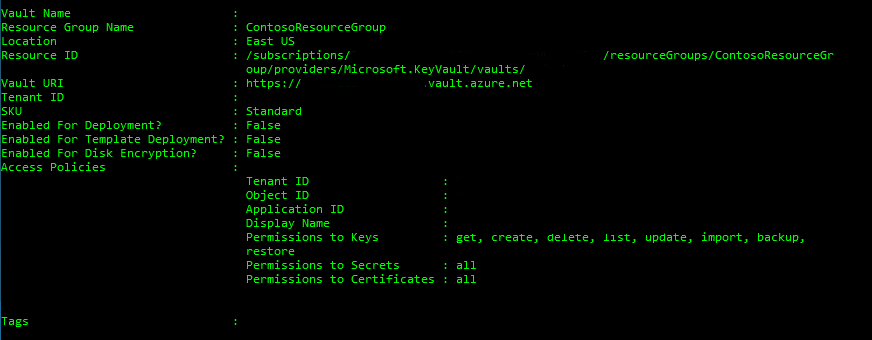

---
title: "Quickstart: Set & retrieve a secret from Key Vault using PowerShell"
description: In this quickstart, learn how to create, retrieve, and delete secrets from an Azure Key Vault using Azure PowerShell.
services: key-vault
author: msmbaldwin
manager: rkarlin
tags: azure-resource-manager

ms.service: key-vault
ms.subservice: secrets
ms.topic: quickstart
ms.custom: mvc
ms.date: 11/08/2019
ms.author: mbaldwin
#Customer intent:As a security admin who is new to Azure, I want to use Key Vault to securely store keys and passwords in Azure

---
# Quickstart: Set and retrieve a secret from Azure Key Vault using PowerShell

[!INCLUDE [updated-for-az](../../../includes/updated-for-az.md)]

Azure Key Vault is a cloud service that works as a secure secrets store. You can securely store keys, passwords, certificates, and other secrets. For more information on Key Vault, you may review the [Overview](../general/overview.md). In this quickstart, you use PowerShell to create a key vault. You then store a secret in the newly created vault.

If you don't have an Azure subscription, create a [free account](https://azure.microsoft.com/free/?WT.mc_id=A261C142F) before you begin.

[!INCLUDE [cloud-shell-try-it.md](../../../includes/cloud-shell-try-it.md)]

If you choose to install and use PowerShell locally, this tutorial requires Azure PowerShell module version 1.0.0 or later. Type `$PSVersionTable.PSVersion` to find the version. If you need to upgrade, see [Install Azure PowerShell module](/powershell/azure/install-az-ps). If you are running PowerShell locally, you also need to run `Login-AzAccount` to create a connection with Azure.

```azurepowershell-interactive
Login-AzAccount
```

## Create a resource group

Create an Azure resource group with [New-AzResourceGroup](/powershell/module/az.resources/new-azresourcegroup). A resource group is a logical container into which Azure resources are deployed and managed. 

```azurepowershell-interactive
New-AzResourceGroup -Name ContosoResourceGroup -Location EastUS
```

## Create a Key Vault

Next you create a Key Vault. When doing this step, you need some information:

Although we use "Contoso KeyVault2" as the name for our Key Vault throughout this quickstart, you must use a unique name.

- **Vault name** Contoso-Vault2.
- **Resource group name** ContosoResourceGroup.
- **Location** East US.

```azurepowershell-interactive
New-AzKeyVault -Name 'Contoso-Vault2' -ResourceGroupName 'ContosoResourceGroup' -Location 'East US'
```

The output of this cmdlet shows properties of the newly created key vault. Take note of the two properties listed below:

* **Vault Name**: In the example that is **Contoso-Vault2**. You will use this name for other Key Vault cmdlets.
* **Vault URI**: In this example that is https://Contoso-Vault2.vault.azure.net/. Applications that use your vault through its REST API must use this URI.

After vault creation your Azure account is the only account allowed to do anything on this new vault.



## Give your user account permissions to manage secrets in Key Vault

Use the Azure PowerShell Set-AzKeyVaultAccessPolicy cmdlet to update the Key Vault access policy and grant secret permissions to your user account.
```azurepowershell-interactive
Set-AzKeyVaultAccessPolicy -VaultName 'Contoso-Vault2' -UserPrincipalName 'user@domain.com' -PermissionsToSecrets get,set,delete
```

## Adding a secret to Key Vault

To add a secret to the vault, you just need to take a couple of steps. In this case, you add a password that could be used by an application. The password is called **ExamplePassword** and stores the value of **hVFkk965BuUv** in it.

First convert the value of **hVFkk965BuUv** to a secure string by typing:

```azurepowershell-interactive
$secretvalue = ConvertTo-SecureString 'hVFkk965BuUv' -AsPlainText -Force
```

Then, type the PowerShell commands below to create a secret in Key Vault called **ExamplePassword** with the value **hVFkk965BuUv** :

```azurepowershell-interactive
$secret = Set-AzKeyVaultSecret -VaultName 'Contoso-Vault2' -Name 'ExamplePassword' -SecretValue $secretvalue
```

To view the value contained in the secret as plain text:

```azurepowershell-interactive
(Get-AzKeyVaultSecret -vaultName "Contoso-Vault2" -name "ExamplePassword").SecretValueText
```

Now, you have created a Key Vault, stored a secret, and retrieved it.

## Clean up resources

 Other quickstarts and tutorials in this collection build upon this quickstart. If you plan to continue on to work with other quickstarts and tutorials, you may want to leave these resources in place.

When no longer needed, you can use the [Remove-AzResourceGroup](/powershell/module/az.resources/remove-azresourcegroup) command to remove the resource group, Key Vault, and all related resources.

```azurepowershell-interactive
Remove-AzResourceGroup -Name ContosoResourceGroup
```

## Next steps

In this quickstart you created a Key Vault and stored a secret in it. To learn more about Key Vault and how to integrate it with your applications, continue on to the articles below.

- Read an [Overview of Azure Key Vault](../general/overview.md)
- See the reference for the [Azure PowerShell Key Vault cmdlets](/powershell/module/az.keyvault/?view=azps-2.6.0#key_vault)
- Review [Azure Key Vault best practices](../general/best-practices.md)
