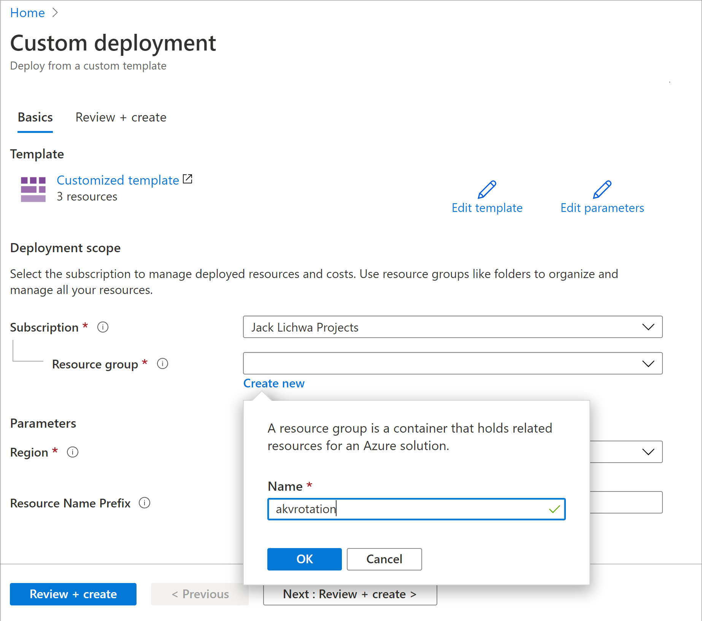
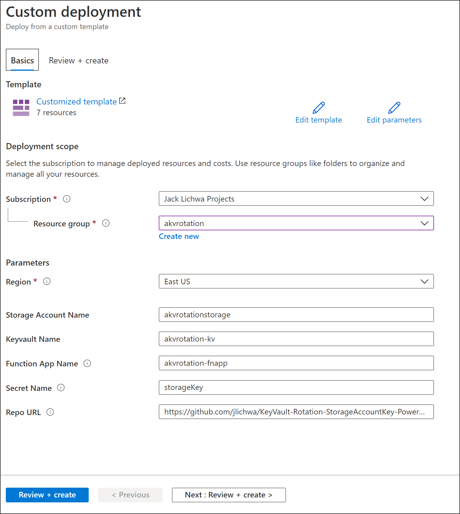
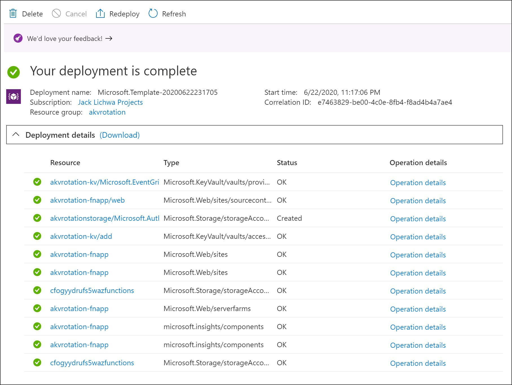
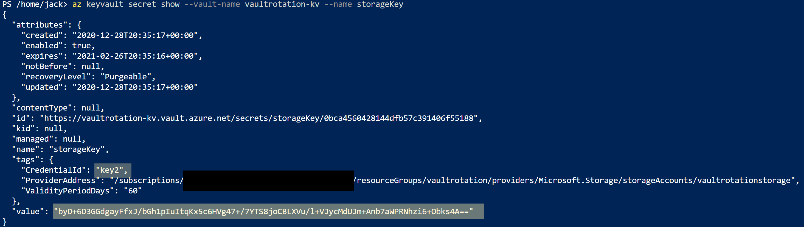
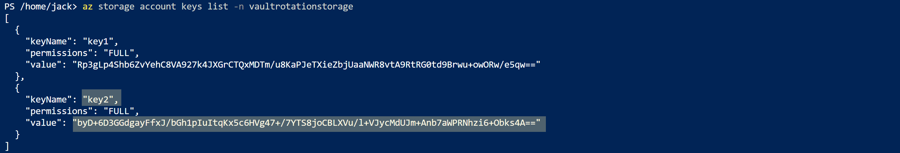
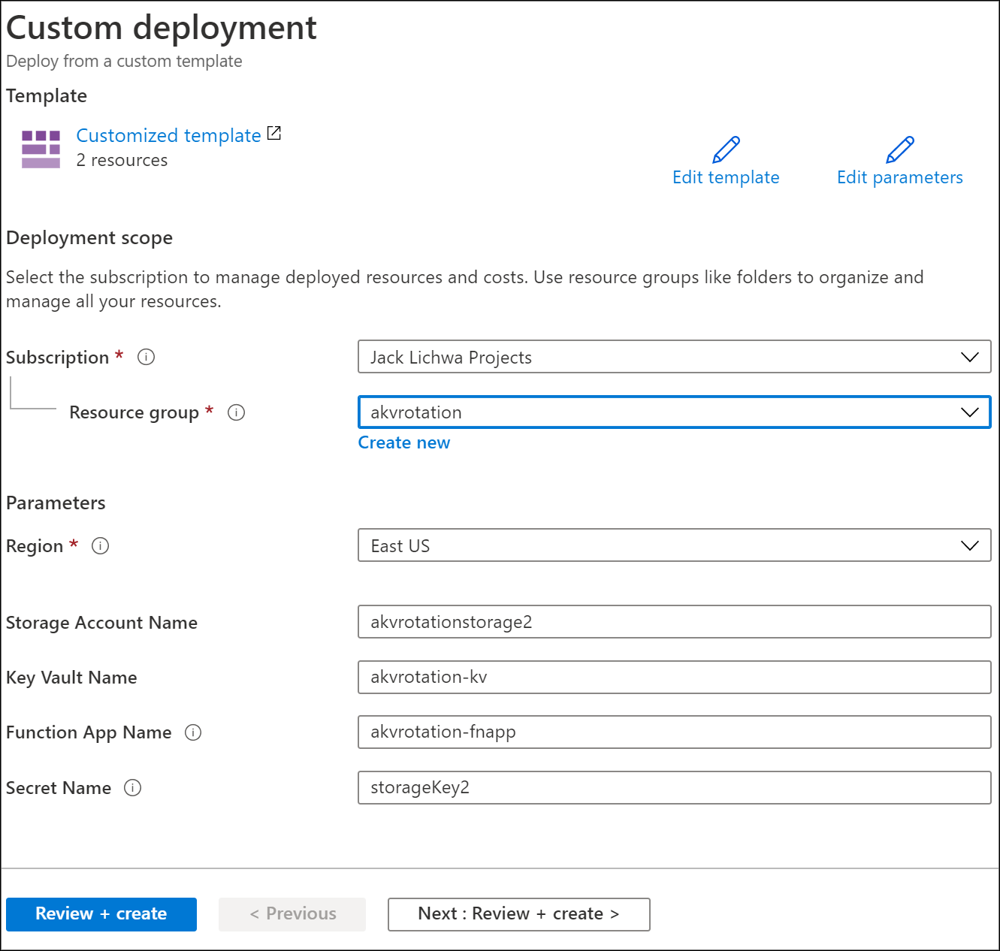
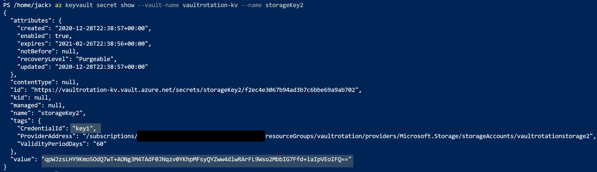
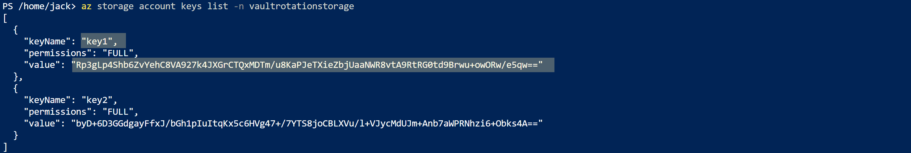

# Automate the rotation of a secret for resources that use dual credential authentication

The best way to authenticate to Azure services is by using a [managed identity](../general/managed-identity.md), but there are some scenarios where that isn't an option. In those cases, access keys or passwords are used. Access keys and passwords should be rotated frequently.

This tutorial shows how to automate the periodic rotation of secrets for databases and services that use dual credential authentication. Specifically, this tutorial rotates Azure Storage account keys stored in Azure Key Vault as secrets using a function triggered by Azure Event Grid notification. :

> [!NOTE]
> Storage Account Keys can be automatically managed in Key Vault by providing shared access signature tokens for delegated access to Storage Account. There are services which require storage account connection string with access key and for that scenario this solution is recommended


In above solution, Azure Key Vault stores Storage Account individual access keys as versions of the same secret alternating between primary and secondary key in subsequent versions. As one access key is stored in latest version of the secret, alternate key gets regenerated and added to Key Vault as new and latest version of the secret. That solution provides applications entire rotation cycle to refresh to newest regenerated key. 

1. 30 days before the expiration date of a secret, Key Vault publishes the "near expiry" event to Event Grid.
1. Event Grid checks the event subscriptions and uses HTTP POST to call the function app endpoint subscribed to the event.
1. The function app identifies alternate key (other than latest) and calls Storage Account to regenerate it
1. The function app adds new regenerated key to Azure Key Vault as new version of the secret.

## Prerequisites
* An Azure subscription - [create one for free](https://azure.microsoft.com/free/?WT.mc_id=A261C142F).
* Azure Key Vault
* Two Azure Storage Accounts

Below deployment link can be used, if you don't have existing key vault and storage accounts:
<br><a href="https://portal.azure.com/#create/Microsoft.Template/uri/https%3A%2F%2Fraw.githubusercontent.com%2Fjlichwa%2FKeyVault-Rotation-StorageAccountKey-PowerShell%2Fmaster%2Farm-templates%2FInitial-Setup%2Fazuredeploy.json" target="_blank">
    
</a>

1. Under **Resource group**, select **Create new**. Name the group **akvrotation** and click **Ok**.
1. Select **Review+Create**.
1. Select **Create**

    

You'll now have a key vault, and two storage accounts. You can verify this setup in the Azure CLI by running the following command:

```azurecli
az resource list -o table -g akvrotation
```

The result will look something the following output:

```console
Name                     ResourceGroup         Location    Type                               Status
-----------------------  --------------------  ----------  ---------------------------------  --------
akvrotation-kv         akvrotation      eastus      Microsoft.KeyVault/vaults
akvrotationstorage     akvrotation      eastus      Microsoft.Storage/storageAccounts
akvrotationstorage2    akvrotation      eastus      Microsoft.Storage/storageAccounts
```

## Create and deploy storage account key rotation function

Next, create a function app with a system-managed identity, in addition to the other required components, and deploy storage account key rotation functions

The function app rotation functions require these components and configuration:
- An Azure App Service plan
- A storage account required for function app trigger management
- An access policy to access secrets in Key Vault
- Assign Storage Account Key Operator Service role to function app to access Storage Account access keys
- Storage Account key rotation functions with event trigger and http trigger (on-demand rotation)
- EventGrid event subscription for **SecretNearExpiry** event

1. Select the Azure template deployment link: 
<br><a href="https://portal.azure.com/#create/Microsoft.Template/uri/https%3A%2F%2Fraw.githubusercontent.com%2Fjlichwa%2FKeyVault-Rotation-StorageAccountKey-PowerShell%2Fmaster%2Farm-templates%2FFunction%2Fazuredeploy.json" target="_blank">
    
</a>

1. In the **Resource group** list, select **akvrotation**.
1. In the **Storage Account Name**, type the storage account name with access keys to rotate
1. In the **Key Vault Name**,  type the key vault name
1. In the **Function App Name**,  type the function app name
1. In the **Secret Name**,  type secret name where access keys would be stored
1. In the **Repo Url**, type function code GitHub location (**https://github.com/jlichwa/KeyVault-Rotation-StorageAccountKey-PowerShell.git**)
1. Select **Review+Create**.
1. Select **Create**

   

After you complete the preceding steps, you'll have a storage account, a server farm, a function app, application insights. You should see below screen once deployment completed:
   
> [!NOTE]
> In case of any failures you can click **Redeploy** to finish deployment of remaining components.


Deployment templates and rotation functions code can be found on [GitHub](https://github.com/jlichwa/KeyVault-Rotation-StorageAccountKey-PowerShell).

## Add Storage Account access key to Key Vault

First, set your access policy to grant *manage secrets* permissions to users:

```azurecli
az keyvault set-policy --upn <email-address-of-user> --name akvrotation-kv --secret-permissions set delete get list
```

You can now create a new secret with a Storage Account access key as value. You will also need the Storage Account resource ID, secret validity period, and the key ID to add to secret, so rotation function can regenerate key in Storage Account.

Retrieve Storage Account resource ID. Value can be found under `id` property
```azurecli
az storage account show -n akvrotationstorage
```

List the Storage Account access keys to retrieve key values

```azurecli
az storage account keys list -n akvrotationstorage 
```

Populate retrieved values for **key1Value** and **storageAccountResourceId**

```azurecli
$tomorrowDate = (get-date).AddDays(+1).ToString("yyy-MM-ddThh:mm:ssZ")
az keyvault secret set --name storageKey --vault-name akvrotation-kv --value <key1Value> --tags "CredentialId=key1" "ProviderAddress=<storageAccountResourceId>" "ValidityPeriodDays=60" --expires $tomorrowDate
```

Creating a secret with a short expiration date will publish a `SecretNearExpiry` event within several minutes, which will in turn trigger the function to rotate the secret.

You can verify that access keys are regenerated by retrieving and comparing Storage Account keys and Key Vault secret.

You can show secret information using below command:
```azurecli
az keyvault secret show --vault-name akvrotation-kv --name storageKey
```
Notice that `CredentialId` is updated to alternate `keyName` and `value` is regenerated


Retrieve access keys to validate value
```azurecli
az storage account keys list -n akvrotationstorage 
```


## Add additional Storage Accounts for rotation

Same function app can be reused to rotate multiple Storage Accounts. 

Adding additional storage account keys for rotation to existing function requires:
- Assign Storage Account Key Operator Service role to function app to access Storage Account access keys
- EventGrid event subscription for **SecretNearExpiry** event

1. Select the Azure template deployment link: 
<br><a href="https://portal.azure.com/#create/Microsoft.Template/uri/https%3A%2F%2Fraw.githubusercontent.com%2Fjlichwa%2FKeyVault-Rotation-StorageAccountKey-PowerShell%2Fmaster%2Farm-templates%2FAdd-Event-Subscription%2Fazuredeploy.json" target="_blank">
    
</a>

1. In the **Resource group** list, select **akvrotation**.
1. In the **Storage Account Name**, type the storage account name with access keys to rotate
1. In the **Key Vault Name**,  type the key vault name
1. In the **Function App Name**,  type the function app name
1. In the **Secret Name**,  type secret name where access keys would be stored
1. Select **Review+Create**.
1. Select **Create**

   

### Add Another Storage Account access key to Key Vault

Retrieve Storage Account resource ID. Value can be found under `id` property
```azurecli
az storage account show -n akvrotationstorage2
```

List the Storage Account access keys to retrieve key2 value

```azurecli
az storage account keys list -n akvrotationstorage2 
```

Populate retrieved values for **key2Value** and **storageAccountResourceId**

```azurecli
$tomorrowDate = (get-date).AddDays(+1).ToString("yyy-MM-ddThh:mm:ssZ")
az keyvault secret set --name storageKey2 --vault-name akvrotation-kv --value <key2Value> --tags "CredentialId=key2" "ProviderAddress=<storageAccountResourceId>" "ValidityPeriodDays=60" --expires $tomorrowDate
```

Show secret information using below command:
```azurecli
az keyvault secret show --vault-name akvrotation-kv --name storageKey2
```
Notice that `CredentialId` is updated to alternate `keyName` and `value` is regenerated


Retrieve access keys to validate value
```azurecli
az storage account keys list -n akvrotationstorage 
```


## Available Key Vault dual credential rotation functions

- [Storage Account](https://github.com/jlichwa/KeyVault-Rotation-StorageAccountKey-PowerShell)
- [Redis Cache](https://github.com/jlichwa/KeyVault-Rotation-RedisCacheKey-PowerShell)

## Learn more
- Overview: [Monitoring Key Vault with Azure Event Grid (preview)](../general/event-grid-overview.md)
- How to: [Create your first function in the Azure portal](../../azure-functions/functions-create-first-azure-function.md)
- How to: [Receive email when a key vault secret changes](../general/event-grid-logicapps.md)
- [Azure Event Grid event schema for Azure Key Vault (preview)](../../event-grid/event-schema-key-vault.md)
