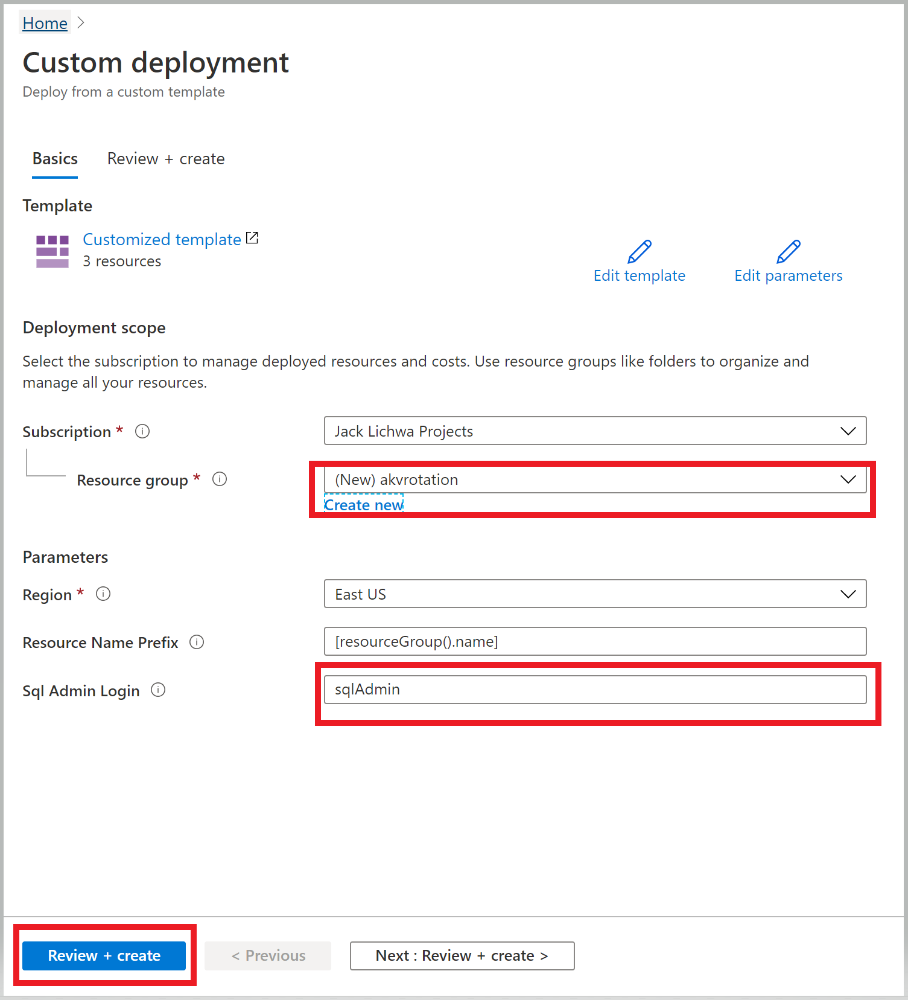
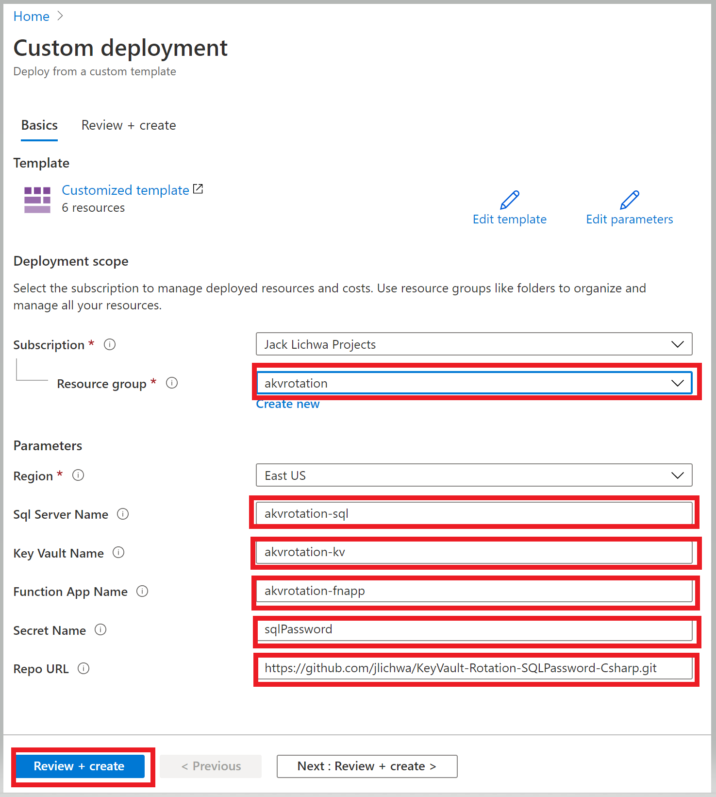
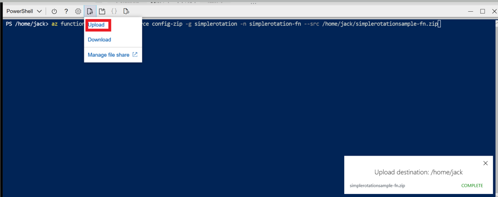
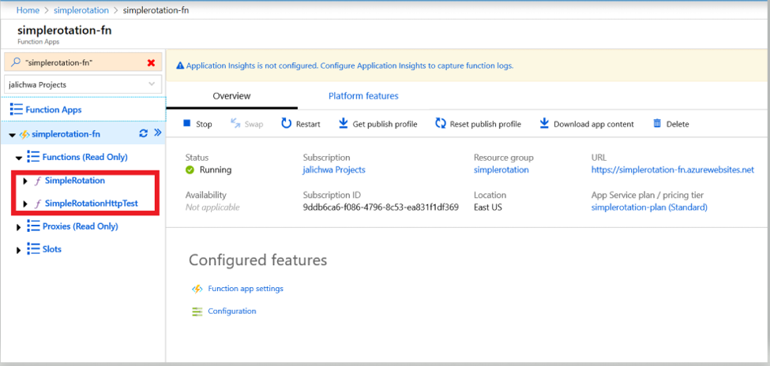
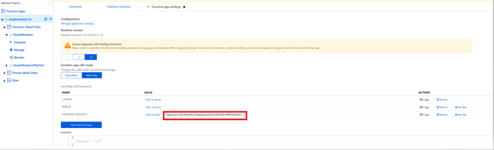
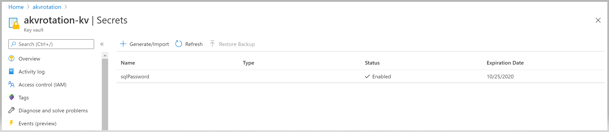
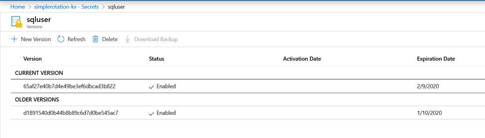
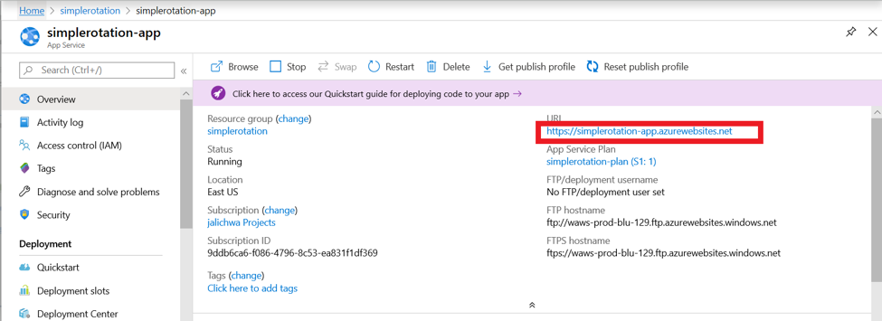

# Automate the rotation of a secret for resources that use single-user/single-password authentication

The best way to authenticate to Azure services is by using a [managed identity](../general/managed-identity.md), but there are some scenarios where that isn't an option. In those cases, access keys or secrets are used. You should periodically rotate access keys or secrets.

This tutorial shows how to automate the periodic rotation of secrets for databases and services that use single-user/single-password authentication. Specifically, this tutorial rotates SQL Server passwords stored in Azure Key Vault by using a function triggered by Azure Event Grid notification:


1. Thirty days before the expiration date of a secret, Key Vault publishes the "near expiry" event to Event Grid.
1. Event Grid checks the event subscriptions and uses HTTP POST to call the function app endpoint subscribed to the event.
1. The function app receives the secret information, generates a new random password, and creates a new version for the secret with the new password in Key Vault.
1. The function app updates SQL Server with the new password.

> [!NOTE]
> There could be a lag between steps 3 and 4. During that time, the secret in Key Vault won't be able to authenticate to SQL Server. 
> In case of a failure of any of the steps, Event Grid retries for two hours.

## Create a key vault and SQL Server instance

The first step is to create a key vault and a SQL Server instance and database and store the SQL Server admin password in Key Vault.

This tutorial uses an existing Azure Resource Manager template to create components. You can find the code here: [Basic Secret Rotation Template Sample](https://github.com/jlichwa/azure-keyvault-basicrotation-tutorial/tree/master/arm-templates).

1. Select the Azure template deployment link: 
<br><a href="https://portal.azure.com/#create/Microsoft.Template/uri/https%3A%2F%2Fraw.githubusercontent.com%2Fjlichwa%2Fazure-keyvault-basicrotation-tutorial%2Fmaster%2Farm-templates%2Finitial-setup%2Fazuredeploy.json" target="_blank"> </a>
1. Under **Resource group**, select **Create new**. Name the group **simplerotation**.
1. Select **Purchase**.

    

You'll now have a key vault, a SQL Server instance, and a SQL database. You can verify this setup in the Azure CLI by running the following command:

```azurecli
az resource list -o table
```

The result will look something the following output:

```console
Name                     ResourceGroup         Location    Type                               Status
-----------------------  --------------------  ----------  ---------------------------------  --------
simplerotation-kv          simplerotation      eastus      Microsoft.KeyVault/vaults
simplerotation-sql         simplerotation      eastus      Microsoft.Sql/servers
simplerotation-sql/master  simplerotation      eastus      Microsoft.Sql/servers/databases
```

## Create a function app

Next, create a function app with a system-managed identity, in addition to the other required components.

The function app requires these components:
- An Azure App Service plan
- A storage account
- An access policy to access secrets in Key Vault via function app managed identity

1. Select the Azure template deployment link: 
<br><a href="https://portal.azure.com/#create/Microsoft.Template/uri/https%3A%2F%2Fraw.githubusercontent.com%2Fjlichwa%2Fazure-keyvault-basicrotation-tutorial%2Fmaster%2Farm-templates%2Ffunction-app%2Fazuredeploy.json" target="_blank"></a>
1. In the **Resource group** list, select **simplerotation**.
1. Select **Purchase**.

   

After you complete the preceding steps, you'll have a storage account, a server farm, and a function app. You can verify this setup in the Azure CLI by running the following command:

```azurecli
az resource list -o table
```

The result will look something like the following output:

```console
Name                     ResourceGroup         Location    Type                               Status
-----------------------  --------------------  ----------  ---------------------------------  --------
simplerotation-kv          simplerotation       eastus      Microsoft.KeyVault/vaults
simplerotation-sql         simplerotation       eastus      Microsoft.Sql/servers
simplerotation-sql/master  simplerotation       eastus      Microsoft.Sql/servers/databases
simplerotationstrg         simplerotation       eastus      Microsoft.Storage/storageAccounts
simplerotation-plan        simplerotation       eastus      Microsoft.Web/serverFarms
simplerotation-fn          simplerotation       eastus      Microsoft.Web/sites
```

For information on how to create a function app and use managed identity to access Key Vault, see [Create a function app from the Azure portal](../../azure-functions/functions-create-function-app-portal.md) and [Provide Key Vault authentication with a managed identity](../general/managed-identity.md).

### Rotation function
The function uses an event to trigger the rotation of a secret by updating Key Vault and the SQL database.

#### Function trigger event

This function reads event data and runs the rotation logic:

```csharp
public static class SimpleRotationEventHandler
{
    [FunctionName("SimpleRotation")]
       public static void Run([EventGridTrigger]EventGridEvent eventGridEvent, ILogger log)
       {
            log.LogInformation("C# Event trigger function processed a request.");
            var secretName = eventGridEvent.Subject;
            var secretVersion = Regex.Match(eventGridEvent.Data.ToString(), "Version\":\"([a-z0-9]*)").Groups[1].ToString();
            var keyVaultName = Regex.Match(eventGridEvent.Topic, ".vaults.(.*)").Groups[1].ToString();
            log.LogInformation($"Key Vault Name: {keyVaultName}");
            log.LogInformation($"Secret Name: {secretName}");
            log.LogInformation($"Secret Version: {secretVersion}");

            SeretRotator.RotateSecret(log, secretName, secretVersion, keyVaultName);
        }
}
```

#### Secret rotation logic
This rotation method reads database information from the secret, creates a new version of the secret, and updates the database with the new secret:

```csharp
public class SecretRotator
    {
       private const string UserIdTagName = "UserID";
       private const string DataSourceTagName = "DataSource";
       private const int SecretExpirationDays = 31;

    public static void RotateSecret(ILogger log, string secretName, string secretVersion, string keyVaultName)
    {
           //Retrieve current secret
           var kvUri = "https://" + keyVaultName + ".vault.azure.net";
           var client = new SecretClient(new Uri(kvUri), new DefaultAzureCredential());
           KeyVaultSecret secret = client.GetSecret(secretName, secretVersion);
           log.LogInformation("Secret Info Retrieved");
        
           //Retrieve secret info
           var userId = secret.Properties.Tags.ContainsKey(UserIdTagName) ?  
                        secret.Properties.Tags[UserIdTagName] : "";
           var datasource = secret.Properties.Tags.ContainsKey(DataSourceTagName) ? 
                            secret.Properties.Tags[DataSourceTagName] : "";
           log.LogInformation($"Data Source Name: {datasource}");
           log.LogInformation($"User Id Name: {userId}");
        
           //Create new password
           var randomPassword = CreateRandomPassword();
           log.LogInformation("New Password Generated");
        
           //Check DB connection using existing secret
           CheckServiceConnection(secret);
           log.LogInformation("Service Connection Validated");
                    
           //Create new secret with generated password
           CreateNewSecretVersion(client, secret, randomPassword);
           log.LogInformation("New Secret Version Generated");
        
           //Update DB password
           UpdateServicePassword(secret, randomPassword);
           log.LogInformation("Password Changed");
           log.LogInformation($"Secret Rotated Succesffuly");
    }
}
```
You can find the complete code on [GitHub](https://github.com/jlichwa/azure-keyvault-basicrotation-tutorial/tree/master/rotation-function).

#### Function deployment

1. Download the function app zip file from [GitHub](https://github.com/jlichwa/azure-keyvault-basicrotation-tutorial/raw/master/simplerotationsample-fn.zip).

1. Upload the simplerotationsample-fn.zip file to Azure Cloud Shell.

   
1. Use this Azure CLI command to deploy the zip file to the function app:

   ```azurecli
   az functionapp deployment source config-zip -g simplerotation -n simplerotation-fn --src /home/{firstname e.g jack}/simplerotationsample-fn.zip
   ```

After the function is deployed, you should see two functions under simplerotation-fn:



## Add an event subscription for the SecretNearExpiry event

Copy the function app's `eventgrid_extension` key:

   

   

Use the copied `eventgrid_extension` key and your subscription ID in the following command to create an Event Grid subscription for `SecretNearExpiry` events:

```azurecli
az eventgrid event-subscription create --name simplerotation-eventsubscription --source-resource-id "/subscriptions/<subscription-id>/resourceGroups/simplerotation/providers/Microsoft.KeyVault/vaults/simplerotation-kv" --endpoint "https://simplerotation-fn.azurewebsites.net/runtime/webhooks/EventGrid?functionName=SimpleRotation&code=<extension-key>" --endpoint-type WebHook --included-event-types "Microsoft.KeyVault.SecretNearExpiry"
```

## Add the secret to Key Vault
Set your access policy to grant *manage secrets* permissions to users:

```azurecli
az keyvault set-policy --upn <email-address-of-user> --name simplerotation-kv --secret-permissions set delete get list
```

Create a new secret with tags that contain the SQL database data source and the user ID. Include an expiration date that's set for tomorrow.

```azurecli
$tomorrowDate = (get-date).AddDays(+1).ToString("yyy-MM-ddThh:mm:ssZ")
az keyvault secret set --name sqluser --vault-name simplerotation-kv --value "Simple123" --tags "UserID=azureuser" "DataSource=simplerotation-sql.database.windows.net" --expires $tomorrowDate
```

Creating a secret with a short expiration date will immediately publish a `SecretNearExpiry` event, which will in turn trigger the function to rotate the secret.

## Test and verify
After few minutes, the `sqluser` secret should automatically rotate.

To verify that the secret has rotated, go to **Key Vault** > **Secrets**:



Open the **sqluser** secret and view the original and rotated versions:



### Create a web app

To verify the SQL credentials, create a web app. This web app will get the secret from Key Vault, extract SQL database information and credentials from the secret, and test the connection to SQL Server.

The web app requires these components:
- A web app with system-managed identity
- An access policy to access secrets in Key Vault via web app managed identity

1. Select the Azure template deployment link: 
<br><a href="https://portal.azure.com/#create/Microsoft.Template/uri/https%3A%2F%2Fraw.githubusercontent.com%2Fjlichwa%2Fazure-keyvault-basicrotation-tutorial%2Fmaster%2Farm-templates%2Fweb-app%2Fazuredeploy.json" target="_blank"> </a>
1. Select the **simplerotation** resource group.
1. Select **Purchase**.

### Deploy the web app

You can find source code for the web app on [GitHub](https://github.com/jlichwa/azure-keyvault-basicrotation-tutorial/tree/master/test-webapp).

To deploy the web app, complete these steps:

1. Download the function app zip file from [GitHub](https://github.com/jlichwa/azure-keyvault-basicrotation-tutorial/raw/master/simplerotationsample-app.zip).
1. Upload the simplerotationsample-app.zip file to Azure Cloud Shell.
1. Use this Azure CLI command to deploy the zip file to the function app:

   ```azurecli
   az webapp deployment source config-zip -g simplerotation -n simplerotation-app --src /home/{firstname e.g jack}/simplerotationsample-app.zip
   ```

### Open the web app

Go to the deployed application and select the URL:
 


When the application opens in the browser, you will see the **Generated Secret Value** and a **Database Connected** value of *true*.

## Learn more

- Overview: [Monitoring Key Vault with Azure Event Grid (preview)](../general/event-grid-overview.md)
- How to: [Receive email when a key vault secret changes](../general/event-grid-logicapps.md)
- [Azure Event Grid event schema for Azure Key Vault (preview)](../../event-grid/event-schema-key-vault.md)
