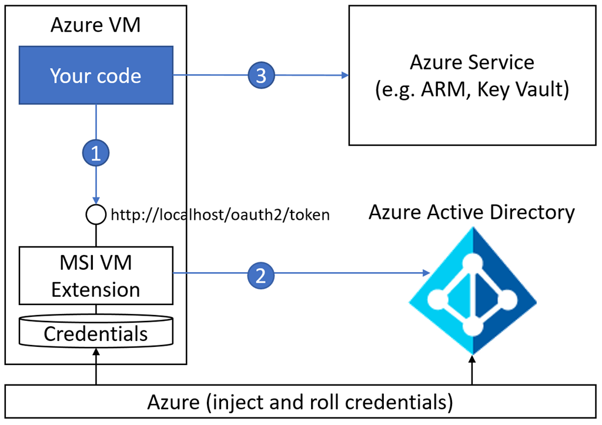

# Tutorial: Use Azure Key Vault with a Windows virtual machine in .NET

Azure Key Vault helps you to protect secrets such as API keys, the database connection strings you need to access your applications, services, and IT resources.

In this tutorial, you learn how to get a console application to read information from Azure Key Vault. To do so, you use managed identities for Azure resources. 

The tutorial shows you how to:

> [!div class="checklist"]
> * Create a resource group.
> * Create a key vault.
> * Add a secret to the key vault.
> * Retrieve a secret from the key vault.
> * Create an Azure virtual machine.
> * Enable a [managed identity](../active-directory/managed-identities-azure-resources/overview.md) for the Virtual Machine.
> * Assign permissions to the VM identity.

Before you begin, read [Key Vault basic concepts](key-vault-whatis.md#basic-concepts). 

If you don’t have an Azure subscription, create a [free account](https://azure.microsoft.com/free/?WT.mc_id=A261C142F).

## Prerequisites

For Windows, Mac, and Linux:
  * [Git](https://git-scm.com/downloads)
  * This tutorial requires that you run the Azure CLI locally. You must have the Azure CLI version 2.0.4 or later installed. Run `az --version` to find the version. If you need to install or upgrade the CLI, see [Install Azure CLI 2.0](https://review.docs.microsoft.com/cli/azure/install-azure-cli).

## About Managed Service Identity

Azure Key Vault stores credentials securely, so they're not displayed in your code. However, you need to authenticate to Azure Key Vault to retrieve your keys. To authenticate to Key Vault, you need a credential. It's a classic bootstrap dilemma. Managed Service Identity (MSI) solves this issue by providing a _bootstrap identity_ that simplifies the process.

When you enable MSI for an Azure service, such as Azure Virtual Machines, Azure App Service, or Azure Functions, Azure creates a [service principal](key-vault-whatis.md#basic-concepts). MSI does this for the instance of the service in Azure Active Directory (Azure AD) and injects the service principal credentials into that instance. 



Next, to get an access token, your code calls a local metadata service that's available on the Azure resource. To authenticate to an Azure Key Vault service, your code uses the access token that it gets from the local MSI endpoint. 

## Create resources and assign permissions

Before you start coding you need to create some resources, put a secret into your key vault, and assign permissions.

### Sign in to Azure

To sign in to Azure by using the Azure CLI, enter:

```azurecli
az login
```

### Create a resource group

An Azure resource group is a logical container into which Azure resources are deployed and managed. Create a resource group by using the [az group create](/cli/azure/group#az-group-create) command. 

This example creates a resource group in the West US location:

```azurecli
# To list locations: az account list-locations --output table
az group create --name "<YourResourceGroupName>" --location "West US"
```

Your newly created resource group will be used throughout this tutorial.

### Create a key vault and populate it with a secret

Create a key vault in your resource group by providing the [az keyvault create](/cli/azure/keyvault?view=azure-cli-latest#az-keyvault-create) command with the following information:

* Key vault name: a string of 3 to 24 characters that can contain only numbers (0-9), letters (a-z, A-Z), and hyphens (-)
* Resource group name
* Location: **West US**

```azurecli
az keyvault create --name "<YourKeyVaultName>" --resource-group "<YourResourceGroupName>" --location "West US"
```
At this point, your Azure account is the only one that's authorized to perform operations on this new key vault.

Now add a secret to your key vault using the [az keyvault secret set](/cli/azure/keyvault/secret?view=azure-cli-latest#az-keyvault-secret-set) command


To create a secret in the key vault called **AppSecret**, enter the following command:

```azurecli
az keyvault secret set --vault-name "<YourKeyVaultName>" --name "AppSecret" --value "MySecret"
```

This secret stores the value **MySecret**.

### Create a virtual machine
Create a virtual machine by using one of the following methods:

* [The Azure CLI](https://docs.microsoft.com/azure/virtual-machines/windows/quick-create-cli)
* [PowerShell](https://docs.microsoft.com/azure/virtual-machines/windows/quick-create-powershell)
* [The Azure portal](https://docs.microsoft.com/azure/virtual-machines/windows/quick-create-portal)

### Assign an identity to the VM
Create a system-assigned identity for the virtual machine with the [az vm identity assign](/cli/azure/vm/identity?view=azure-cli-latest#az-vm-identity-assign) command:

```azurecli
az vm identity assign --name <NameOfYourVirtualMachine> --resource-group <YourResourceGroupName>
```

Note the system-assigned identity that's displayed in the following code. The output of the preceding command would be: 

```azurecli
{
  "systemAssignedIdentity": "xxxxxxxx-xxxx-xxxx-xxxx-xxxxxxxxxxxx",
  "userAssignedIdentities": {}
}
```

### Assign permissions to the VM identity
Assign the previously created identity permissions to your key vault with the [az keyvault set-policy](/cli/azure/keyvault?view=azure-cli-latest#az-keyvault-set-policy) command:

```azurecli
az keyvault set-policy --name '<YourKeyVaultName>' --object-id <VMSystemAssignedIdentity> --secret-permissions get list
```

### Sign in to the virtual machine

To sign in to the virtual machine, follow the instructions in [Connect and sign in to an Azure virtual machine running Windows](https://docs.microsoft.com/azure/virtual-machines/windows/connect-logon).

## Set up the console app

Create a console app and install the required packages using the `dotnet` command.

### Install .NET Core

To install .NET Core, go to the [.NET downloads](https://www.microsoft.com/net/download) page.

### Create and run a sample .NET app

Open a command prompt.

You can print "Hello World" to the console by running the following commands:

```console
dotnet new console -o helloworldapp
cd helloworldapp
dotnet run
```

### Install the packages

 From the console window, install the .NET packages required for this quickstart:

 ```console
dotnet add package System.IO;
dotnet add package System.Net;
dotnet add package System.Text;
dotnet add package Newtonsoft.Json;
dotnet add package Newtonsoft.Json.Linq;
```

## Edit the console app

Open the *Program.cs* file and add these packages:

```csharp
using System;
using System.IO;
using System.Net;
using System.Text;
using Newtonsoft.Json;
using Newtonsoft.Json.Linq;
```

Edit the class file to contain the code in the following two-step process:

1. Fetch a token from the local MSI endpoint on the VM. Doing so also fetches a token from Azure AD.
1. Pass the token to your key vault, and then fetch your secret. 

```csharp
 class Program
    {
        static void Main(string[] args)
        {
            // Step 1: Get a token from the local (URI) Managed Service Identity endpoint, which in turn fetches it from Azure AD
            var token = GetToken();

            // Step 2: Fetch the secret value from your key vault
            System.Console.WriteLine(FetchSecretValueFromKeyVault(token));
        }

        static string GetToken()
        {
            WebRequest request = WebRequest.Create("http://169.254.169.254/metadata/identity/oauth2/token?api-version=2018-02-01&resource=https%3A%2F%2Fvault.azure.net");
            request.Headers.Add("Metadata", "true");
            WebResponse response = request.GetResponse();
            return ParseWebResponse(response, "access_token");
        }

        static string FetchSecretValueFromKeyVault(string token)
        {
            WebRequest kvRequest = WebRequest.Create("https://<YourVaultName>.vault.azure.net/secrets/<YourSecretName>?api-version=2016-10-01");
            kvRequest.Headers.Add("Authorization", "Bearer "+  token);
            WebResponse kvResponse = kvRequest.GetResponse();
            return ParseWebResponse(kvResponse, "value");
        }

        private static string ParseWebResponse(WebResponse response, string tokenName)
        {
            string token = String.Empty;
            using (Stream stream = response.GetResponseStream())
            {
                StreamReader reader = new StreamReader(stream, Encoding.UTF8);
                String responseString = reader.ReadToEnd();

                JObject joResponse = JObject.Parse(responseString);    
                JValue ojObject = (JValue)joResponse[tokenName];             
                token = ojObject.Value.ToString();
            }
            return token;
        }
    }
```

The preceding code shows you how to do operations with Azure Key Vault in a Windows virtual machine.

## Clean up resources

When they are no longer needed, delete the virtual machine and your key vault.

## Next steps

> [!div class="nextstepaction"]
> [Azure Key Vault REST API](https://docs.microsoft.com/rest/api/keyvault/)
