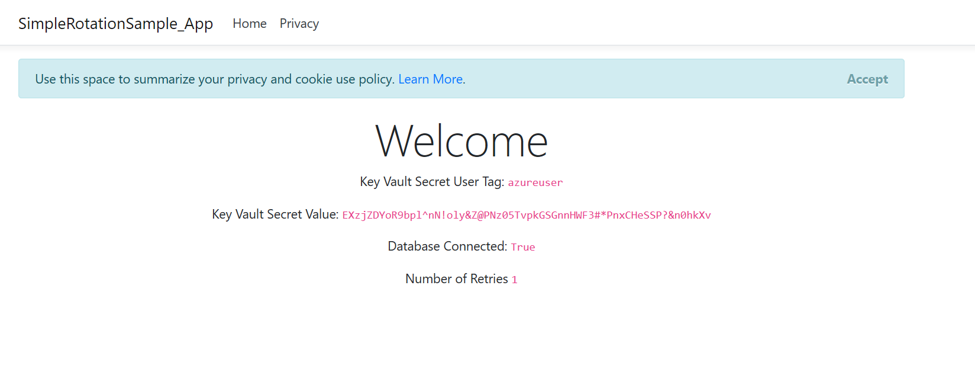

---
title: Single User/Password Rotation Tutorial
description: Use this how-to guide to help you set up key rotation and monitor key vault logs.
services: key-vault
author: msmbaldwin
manager: rkarlin
tags: ''

ms.service: key-vault
ms.topic: conceptual
ms.date: 01/26/2020
ms.author: mbaldwin

---
# Automate the rotation of a single user/password secret

Although the best way to authenticate to Azure services is by using an [managed identity](managed-identity.md), there are some scenarios where this is not an option. In these cases, access keys or secrets are used. Access keys or secrets should be periodically rotated.

This tutorial demonstrates how to automate the periodic rotation of secrets for databases and services with single user/password authentication. Specifically, this scenario rotates SQL server passwords stored in key vault using a function triggered by Event Grid notification:


1. Thirty days before 30 days before the expiration date of a secret, Key Vault publish the "near expiry" event to Event Grid .
1. Event Grid checks the event subscriptions and, using http post, calls the Function App endpoint subscribed to this event.
1. The function App receives secret information, generates new random password, and create a new version for the secret with a new password in Key Vault.
1. The function App updates SQL with new password.

Note: There could be a lag between step 3 and 4 and during that time secret in Key Vault would not be valid to authenticate to SQL. In case of failure in any of the steps Event Grid retries for 2 hours.

## Setup

## Create a key vault and SQL server

Before we begin, we must create a Key Vault, create a SQL Server and database, and store the SQL Server admin password in Key Vault.

This tutorial uses a pre-created Azure Resource Manager template to create components. You can find entire code here: [Basic Secret Rotation Template Sample](https://github.com/jlichwa/azure-keyvault-basicrotation-tutorial/tree/master/arm-templates).

1. Use the Azure Resource Manager template to create components by selecting this link: [Deploy](https://portal.azure.com/#create/Microsoft.Template/uri/https%3A%2F%2Fraw.githubusercontent.com%2Fjlichwa%2Fazure-keyvault-basicrotation-tutorial%2Fmaster%2Farm-templates%2Finitial-setup%2Fazuredeploy.json)
1. For "Resource Group", select "Create New" and give it the name "simplerotation".
1. Select "Purchase".

  

After completing these steps, you will have a key vault, a SQL server, and a SQL database. You can verify this in an Azure CLI terminal by running:

```azurecli
az resource list -o table
```

The results will look something this:

```console
Name                     ResourceGroup         Location    Type                               Status
-----------------------  --------------------  ----------  ---------------------------------  --------
simplerotation-kv             simplerotation             eastus      Microsoft.KeyVault/vaults
simplerotation-sql            simplerotation             eastus      Microsoft.Sql/servers
simplerotation-sql/master     simplerotation             eastus      Microsoft.Sql/servers/databases
```

## Create Function App

You must now create a Function App with a with system managed identity, as well as the additional required components: 

Function app requires below components and configuration:
- App Service Plan
- Storage Account
- Access policy to access secrets in Key Vault using Function App Managed Identity

Use the Azure Resource Manager template to create components by selecting this link: [Deploy](https://portal.azure.com/#create/Microsoft.Template/uri/https%3A%2F%2Fraw.githubusercontent.com%2Fjlichwa%2Fazure-keyvault-basicrotation-tutorial%2Fmaster%2Farm-templates%2Ffunction-app%2Fazuredeploy.json)
1. For "Resource Group", select "simplerotation".
1. Select "Purchase".

   

After completing the steps above, you will have a storage account, a server farm, and a Function App.  You can verify this in an Azure CLI terminal by running:

```azurecli
az resource list -o table
```

The results will look something this:
Name                     ResourceGroup         Location    Type                               Status
-----------------------  --------------------  ----------  ---------------------------------  --------
simplerotation-kv             simplerotation             eastus      Microsoft.KeyVault/vaults
simplerotation-sql            simplerotation             eastus      Microsoft.Sql/servers
simplerotation-sql/master     simplerotation             eastus      Microsoft.Sql/servers/databases
simplerotationstrg            simplerotation             eastus      Microsoft.Storage/storageAccounts
simplerotation-plan           simplerotation             eastus      Microsoft.Web/serverFarms
simplerotation-fn             simplerotation             eastus      Microsoft.Web/sites

For information how to create Function App and using Managed Identity to access Key Vault, see [Create a function app from the Azure portal](../azure-functions/functions-create-function-app-portal.md) and [Provide Key Vault authentication with a managed identity](managed-identity.md)

### Rotation function and deployment

Rotation function is using event grid as a trigger, retrieves secret information and executes rotation:

```
public static class SimpleRotationEventHandler
{
[FunctionName("SimpleRotation")]
       public static void Run([EventGridTrigger]EventGridEvent eventGridEvent, ILogger log)
       {
            log.LogInformation("C# Event trigger function processed a request.");
            var secretName = eventGridEvent.Subject;
            var secretVersion = Regex.Match(eventGridEvent.Data.ToString(), "Version\":\"([a-z0-9]*)").Groups[1].ToString();
            var keyVaultName = Regex.Match(eventGridEvent.Topic, ".vaults.(.*)").Groups[1].ToString();
            log.LogInformation($"Key Vault Name: {keyVaultName}");
            log.LogInformation($"Secret Name: {secretName}");
            log.LogInformation($"Secret Version: {secretVersion}");

            SeretRotator.RotateSecret(log, secretName, secretVersion, keyVaultName);
        }
}
```

Rotation method reads database information from secret, create new version of secret and updates database with new secret.

```
public class SeretRotator
    {
       private const string UserIdTagName = "UserID";
       private const string DataSourceTagName = "DataSource";
       private const int SecretExpirationDays = 31;

public static void RotateSecret(ILogger log, string secretName, string secretVersion, string keyVaultName)
{
//Retrieve Current Secret
       var kvUri = "https://" + keyVaultName + ".vault.azure.net";
       	var client = new SecretClient(new Uri(kvUri), new DefaultAzureCredential());
       KeyVaultSecret secret = client.GetSecret(secretName, secretVersion);
       log.LogInformation("Secret Info Retrieved");
	
       //Retrieve Secret Info
       var userId = secret.Properties.Tags.ContainsKey(UserIdTagName) ?  
                    secret.Properties.Tags[UserIdTagName] : "";
       var datasource = secret.Properties.Tags.ContainsKey(DataSourceTagName) ? 
                        secret.Properties.Tags[DataSourceTagName] : "";
       log.LogInformation($"Data Source Name: {datasource}");
       log.LogInformation($"User Id Name: {userId}");
	
       //create new password
       var randomPassword = CreateRandomPassword();
       log.LogInformation("New Password Generated");
	
       //Check db connection using existing secret
       CheckServiceConnection(secret);
       log.LogInformation("Service Connection Validated");
	            
       //Create new secret with generated password
       CreateNewSecretVersion(client, secret, randomPassword);
       log.LogInformation("New Secret Version Generated");
	
              //Update db password
       UpdateServicePassword(secret, randomPassword);
       log.LogInformation("Password Changed");
       log.LogInformation($"Secret Rotated Succesffuly");
}
}
```

You can find entire code here:
https://github.com/jlichwa/azure-keyvault-basicrotation-tutorial/tree/master/rotation-function

Download function app zip file:
https://github.com/jlichwa/azure-keyvault-basicrotation-tutorial/raw/master/simplerotationsample-fn.zip

Upload file simplerotationsample-fn.zip to Cloud Shell 
 
Use below CLI command to deploy zip file to function app:

```azurecli
az functionapp deployment source config-zip -g simplerotation -n simplerotation-fn --src /home/{firstname e.g jack}/simplerotationsample-fn.zip
```

After deployment you should notice two functions under simplerotation-fn:


### Add event subscription for “SecretNearExpiry” event

Copy function app eventgrid_extension key.


Replace copied key and your subscription id in below command to create event grid subscription for SecretNearExpiry events.

```azurecli
az eventgrid event-subscription create --name simplerotation-eventsubscription --source-resource-id "/subscriptions/{subscriptionId}/resourceGroups/simplerotation/providers/Microsoft.KeyVault/vaults/simplerotation-kv" --endpoint "https://simplerotation-fn.azurewebsites.net/runtime/webhooks/EventGrid?functionName=SimpleRotation&code={key}" --endpoint-type WebHook --included-event-types "Microsoft.KeyVault.SecretNearExpiry"
```

### Add secret to Key Vault
Set access policy to give permission to manage secrets for user

```azurecli
az keyvault set-policy --upn "{email e.g. jalichwa@microsoft.com}" --name simplerotation-kv --secret-permissions set delete get list
```

Create new secret with tags containing sql database datasource and user id with expiration date for tomorrow. 

```azurecli
$tomorrowDate = (get-date).AddDays(+1).ToString("yyy-MM-ddThh:mm:ssZ")
az keyvault secret set --name sqluser --vault-name simplerotation-kv --value "Simple123" --tags "UserID=azureuser" "DataSource=simplerotation-sql.database.windows.net" --expires $tomorrowDate
```

Creating secret with short expiration date would immediately publish SecretNearExpiry event which would trigger function to rotate the secret.

### Test and verify
After few minutes sqluser secret should automatically rotate. 

To verify secret rotation verification, go to Key Vault>Secrets

  

Open sqluser secret to see initial and rotated version

   

To verify SQL credentials, use a web application. The web application will get secret from key vault, extract sql database information and credentials from secret and test connection to sql.

## Create Web App

Web app requires below components and configuration:
- Web App with System Managed Identity
- Access policy to access secrets in Key Vault using Web App Managed Identity

Azure Resource Manager template to create components:
[Deploy](https://portal.azure.com/#create/Microsoft.Template/uri/https%3A%2F%2Fraw.githubusercontent.com%2Fjlichwa%2Fazure-keyvault-basicrotation-tutorial%2Fmaster%2Farm-templates%2Fweb-app%2Fazuredeploy.json)
- Select ‘simplerotation’ resource group
- Click Purchase

### Deploy Web App

Source code:
https://github.com/jlichwa/azure-keyvault-basicrotation-tutorial/tree/master/test-webapp

1. Download function app zip file:
https://github.com/jlichwa/azure-keyvault-basicrotation-tutorial/raw/master/simplerotationsample-app.zip
1. Upload file simplerotationsample-app.zip to Cloud Shell
1. Use below CLI command to deploy zip file to function app:

   ```azurecli
   az webapp deployment source config-zip -g simplerotation -n simplerotation-app --src /home/{firstname e.g jack}/simplerotationsample-app.zip
   ```

#### Open web Application

Go to deployed application and click URL
 


Generated Secret Value should be shown with Database Connected as true.


