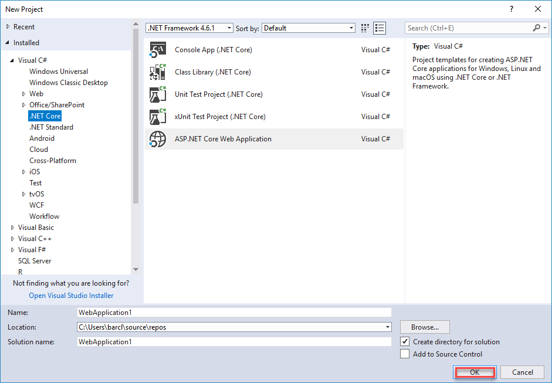
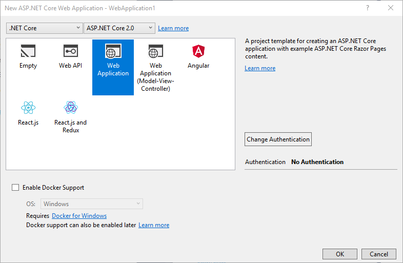

# Tutorial: Configure an Azure web application to read a secret from Key Vault

In this tutorial, you go over the necessary steps for getting an Azure web application to read information from Key vault using managed identities for Azure resources. You learn how to:

> [!div class="checklist"]
> * Create a Key Vault.
> * Store a secret in Key Vault.
> * Create an Azure web Application.
> * Enable a managed identity for the web application.
> * Grant the required permissions for the application to read data from Key vault.

If you don't have an Azure subscription, create a [free account](https://azure.microsoft.com/free/?WT.mc_id=A261C142F) before you begin.

[!INCLUDE [cloud-shell-try-it.md](../../includes/cloud-shell-try-it.md)]

If you choose to install and use the CLI locally, this tutorial requires that you are running the Azure CLI version 2.0.4 or later. Run `az --version` to find the version. If you need to install or upgrade, see [Install the Azure CLI]( /cli/azure/install-azure-cli).

To log in to the Azure using the CLI, you can type:

```azurecli
az login
```

## Create resource group

Create a resource group with the [az group create](/cli/azure/group#az-group-create) command. An Azure resource group is a logical container into which Azure resources are deployed and managed.

The following example creates a resource group named *ContosoResourceGroup* in the *eastus* location.

```azurecli
# To list locations: az account list-locations --output table
az group create --name "ContosoResourceGroup" --location "East US"
```

The resource group you just created is used throughout this tutorial.

## Create an Azure Key Vault

Next you create a Key Vault in the resource group created in the previous step. Although “ContosoKeyVault” is used as the name for the Key Vault throughout this tutorial, you have to use a unique name. Provide the following information:

* Vault name **ContosoKeyVault**.
* Resource group name **ContosoResourceGroup**.
* The location **East US**.

```azurecli
az keyvault create --name "ContosoKeyVault" --resource-group "ContosoResourceGroup" --location "East US"
```

The output of this command shows properties of the newly created Key Vault. Take note of the two properties listed below:

* **Vault Name**: In the example, this is **ContosoKeyVault**. You will use the name of your Key Vault for all Key Vault commands.
* **Vault URI**: In the example, this is https://<YourKeyVaultName>.vault.azure.net/. Applications that use your vault through its REST API must use this URI.

>[!IMPORTANT]
> If you get the error Parameter 'vault_name' must conform to the following pattern: '^[a-zA-Z0-9-]{3,24}$' The -name param value was not unique or did not conform to a string composed of alpha-numeric characters from 3 to 24 long.

At this point, your Azure account is the only one authorized to perform any operations on this new vault.

## Add a secret to key vault

We're adding a secret to help illustrate how this works. You could be storing a SQL connection string or any other information that you need to keep securely but make available to your application. In this tutorial, the password will be called **AppSecret** and will store the value of **MySecret** in it.

Type the commands below to create a secret in Key Vault called **AppSecret** that will store the value **MySecret**:

```azurecli
az keyvault secret set --vault-name "ContosoKeyVault" --name "AppSecret" --value "MySecret"
```

To view the value contained in the secret as plain text:

```azurecli
az keyvault secret show --name "AppSecret" --vault-name "ContosoKeyVault"
```

This command shows the secret information including the URI. After completing these steps, you should have a URI to a secret in an Azure Key Vault. Make note of this information. You need it in a later step.

## Create a web app

In this section you create an ASP.NET MVC application and deploy it in Azure as a Web App. For more information about Azure Web Apps, see [Web Apps overview](../app-service/app-service-web-overview.md).

1. In Visual Studio, create a project by selecting **File > New > Project**. 

2. In the **New Project** dialog, select **Visual C# > Web > ASP.NET Core Web Application**.

3. Name the application **WebKeyVault**, and then select **OK**.
   >[!IMPORTANT]
   > You must name the app WebKeyVault so the code you copy and paste will match the namespace. If you named the site anything else you will need to modify the code to match the site name.

    

4. You can deploy any type of ASP.NET Core web app to Azure. For this tutorial, select the **Web Application** template, and make sure authentication is set to **No Authentication**.

    

5. Select **OK**.

6. Once the ASP.NET Core project is created, the ASP.NET Core welcome page is displayed, providing numerous links to resources to help you get started.

7. From the menu, select **Debug > Start without Debugging** to run the web app locally.

## Modify the web app

There are two NuGet packages that your web application needs to have installed. To install them, follow the steps below:

1. In solution explorer right-click on your website name.
2. Select **Manage NuGet packages for solution...**
3. Select the check box next to the search box. **Include prerelease**
4. Search for the three NuGet packages listed below and accept for them to be added to your solution:

    * [Microsoft.Azure.Services.AppAuthentication](https://www.nuget.org/packages/Microsoft.Azure.Services.AppAuthentication) - makes it easy to fetch access tokens for Service-to-Azure-Service authentication scenarios. 
    * [Microsoft.Azure.KeyVault](https://www.nuget.org/packages/Microsoft.Azure.KeyVault) - contains methods for interacting with Key Vault.
    * [Microsoft.Extensions.Configuration.AzureKeyVault](https://www.nuget.org/packages/Microsoft.Extensions.Configuration.AzureKeyVault/) - contains `IConfiguration` extensions for Azure Key Vault

5. Use the Solution Explorer to open `Program.cs` and replace the contents of the Program.cs file with the following code. Substitute ```<YourKeyVaultName>``` with the name of your key vault:

    ```csharp
    
    using Microsoft.AspNetCore;
    using Microsoft.AspNetCore.Hosting;
    using Microsoft.Azure.KeyVault;
    using Microsoft.Azure.Services.AppAuthentication;
    using Microsoft.Extensions.Configuration;
    using Microsoft.Extensions.Configuration.AzureKeyVault;
    
    namespace WebKeyVault
    {
       public class Program
       {
           public static void Main(string[] args)
           {
               BuildWebHost(args).Run();
           }

           public static IWebHost BuildWebHost(string[] args) =>
           WebHost.CreateDefaultBuilder(args)
               .ConfigureAppConfiguration((ctx, builder) =>
               {
                   var keyVaultEndpoint = GetKeyVaultEndpoint();
                   if (!string.IsNullOrEmpty(keyVaultEndpoint))
                   {
                       var azureServiceTokenProvider = new AzureServiceTokenProvider();
                       var keyVaultClient = new KeyVaultClient(
                           new KeyVaultClient.AuthenticationCallback(
                               azureServiceTokenProvider.KeyVaultTokenCallback));
                       builder.AddAzureKeyVault(
                           keyVaultEndpoint, keyVaultClient, new DefaultKeyVaultSecretManager());
                   }
               }
            ).UseStartup<Startup>()
             .Build();

           private static string GetKeyVaultEndpoint() => "https://<YourKeyVaultName>.vault.azure.net";
         }
    }
    ```

6. Use Solution Explorer to navigate to the **Pages** section and open `About.cshtml`. Replace the contents of **About.cshtml.cs** with the code below:

    ```csharp
    
    using Microsoft.AspNetCore.Mvc.RazorPages;
    using Microsoft.Extensions.Configuration;
    
    namespace WebKeyVault.Pages
    {
        public class AboutModel : PageModel
        {
            public AboutModel(IConfiguration configuration)
            {
                _configuration = configuration;
            }
    
            private readonly IConfiguration _configuration = null;
            public string Message { get; set; }
    
            public void OnGet()
            {
                Message = "My key val = " +  _configuration["AppSecret"];
            }
        }
    }
    
    ```

7. From the main menu, choose **Debug** > **Start without Debugging**. When the browser appears, navigate to the **About** page. The value for the AppSecret is displayed.

>[!IMPORTANT]
> If you get a HTTP Error 502.5 - Process Failure message
> > then verify the name of the Key Vault specified in `Program.cs`

## Publish the web application to Azure

1. Above the editor, select **WebKeyVault**.
2. Select **Publish** then **Start**.
3. Create a new **App Service**, select **Publish**.
4. Select **Create**.

>[!IMPORTANT]
> A browser window opens and you will see a 502.5 - Process Failure message. This is expected. You will need to grant the application identity rights to read secrets from Key Vault.

## Enable a managed identity for the web app

Azure Key Vault provides a way to securely store credentials and other keys and secrets, but your code needs to authenticate to Key Vault to retrieve them. [Managed identities for Azure resources overview](../active-directory/managed-identities-azure-resources/overview.md) makes solving this problem simpler, by giving Azure services an automatically managed identity in Azure Active Directory (Azure AD). You can use this identity to authenticate to any service that supports Azure AD authentication, including Key Vault, without having any credentials in your code.

1. Return to the Azure CLI
2. Run the assign-identity command to create the identity for this application:

```azurecli
az webapp identity assign --name "WebKeyVault" --resource-group "ContosoResourcegroup"
```

>[!NOTE]
>This command is the equivalent of going to the portal and switching the **Identity / System assigned** setting to **On** in the web application properties.

## Grant rights to the application identity

Using the Azure portal, go to the Key Vault's access policies, and grant yourself Secret Management access to the Key Vault. This will allow you to run the application on your local development machine.

1. Search for your Key Vault in the **Search Resources** dialog box in the Azure portal.
2. Select **Access policies**.
3. Select **Add New**, in the **Secret permissions** section select **Get** and **List**.
4. Select **Select Principal**, and add the application identity. It will have the same name as the application.
5. Choose **Ok**.

Now your account in Azure and the application identity have rights to read information from Key Vault. When you refresh the page, you should see the landing page of the site. If you select **About**, you see the value you stored in Key Vault.

## Clean up resources

To delete a resource group and all its resources, use the **az group delete** command.

  ```azurecli
  az group delete -n "ContosoResourceGroup"
  ```

## Next steps

> [!div class="nextstepaction"]
> [Azure Key Vault Developer's Guide](key-vault-developers-guide.md)
