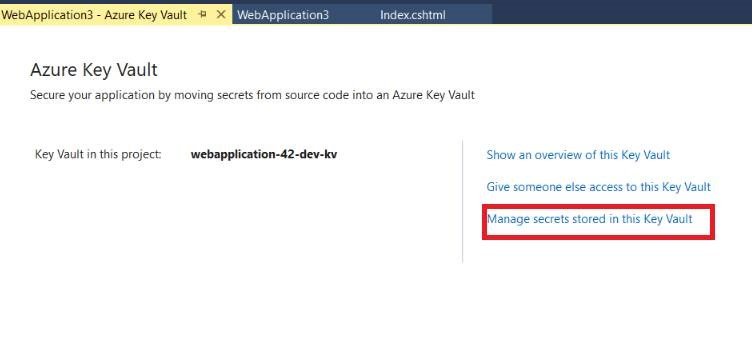
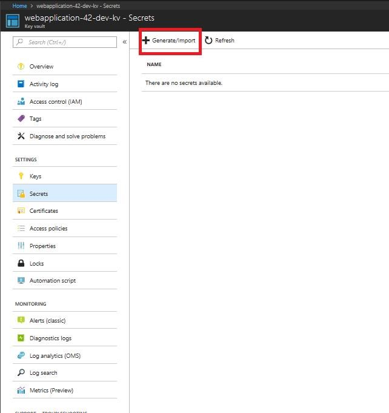
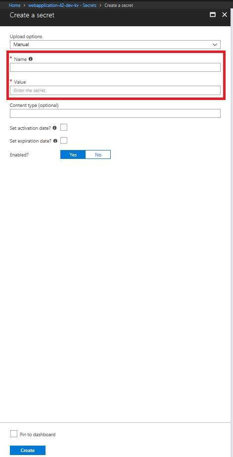

# Get started with Key Vault Connected Service in Visual Studio (ASP.NET Projects)

> [!div class="op_single_selector"]
> - [Getting Started](vs-key-vault-aspnet-get-started.md)
> - [What Happened](vs-key-vault-aspnet-what-happened.md)

This article provides additional guidance after you've added Key Vault to an ASP.NET MVC project through the **Add Connected Services** command in Visual Studio. If you've not already added the service to your project, you can do so at any time by following the instructions in [Add Key Vault to your web application by using Visual Studio Connected Services](vs-key-vault-add-connected-service.md).

See [What happened to my ASP.NET project?](vs-key-vault-aspnet-core-what-happened.md) for the changes made to your project when adding the connected service.

## After you connect

1. Add a secret in your Key Vault in Azure. To get to the right place in the portal, click on the link for **Manage secrets stored in this Key Vault**. If you closed the page or the project, you can navigate to it in the [Azure portal](https://portal.azure.com) by choosing **All Services**, under **Security**, choose **Key Vault**, then choose the Key Vault you just created.

   

1. In the Key Vault section for the key vault you created, choose **Secrets**, then **Generate/Import**.

   

1. Enter a secret, such as **MySecret**, and give it any string value as a test, then choose the **Create** button.

   
 
1. (optional) Enter another secret, but this time put it into a category by naming it **Secrets--MySecret**. This syntax specifies a category **Secrets** that contains a secret **MySecret**.

1. Modify web.config as follows. The keys are placeholders that will be replaced by the AzureKeyVault ConfigurationBuilder with the values of secrets in Key Vault.

   ```xml
     <appSettings configBuilders="AzureKeyVault">
       <add key="webpages:Version" value="3.0.0.0" />
       <add key="webpages:Enabled" value="false" />
       <add key="ClientValidationEnabled" value="true" />
       <add key="UnobtrusiveJavaScriptEnabled" value="true" />
       <add key="MySecret" value="dummy1"/>
       <add key="Secrets--MySecret" value="dummy2"/>
     </appSettings>
   ```

1. In the HomeController, in the About controller method, add the following lines to retrieve the secret and store it in the ViewBag.
 
   ```csharp
            var secret = ConfigurationManager.AppSettings["MySecret"];
            var secret2 = ConfigurationManager.AppSettings["Secrets--MySecret"];
            ViewBag.Secret = $"Secret: {secret}";
            ViewBag.Secret2 = $"Secret2: {secret2}";
   ```

1. In the About.cshtml view, add the following to display the value of the secret (for testing only).

   ```csharp
      <h3>@ViewBag.Secret</h3>
      <h3>@ViewBag.Secret2</h3>
   ```

Congratulations, you have now enabled your web app to use Key Vault to access securely stored secrets.

## Clean up resources

When no longer needed, delete the resource group. This deletes the Key Vault and related resources. To delete the resource group through the portal:

1. Enter the name of your resource group in the Search box at the top of the portal. When you see the resource group used in this QuickStart in the search results, select it.
2. Select **Delete resource group**.
3. In the **TYPE THE RESOURCE GROUP NAME:** box type in the name of the resource group and select **Delete**.

# Next steps

Learn more about developing with Key Vault in the [Key Vault Developer's Guide](key-vault-developers-guide.md)