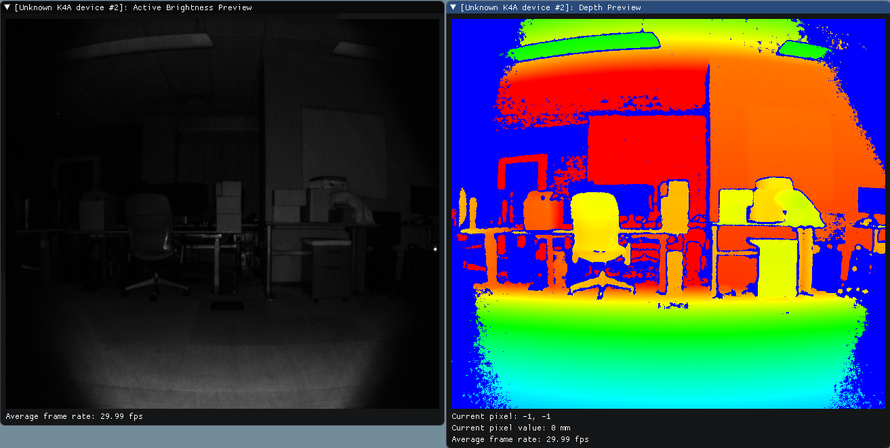
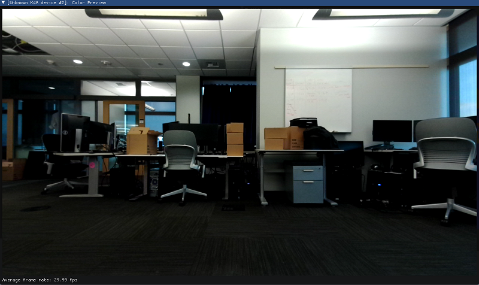
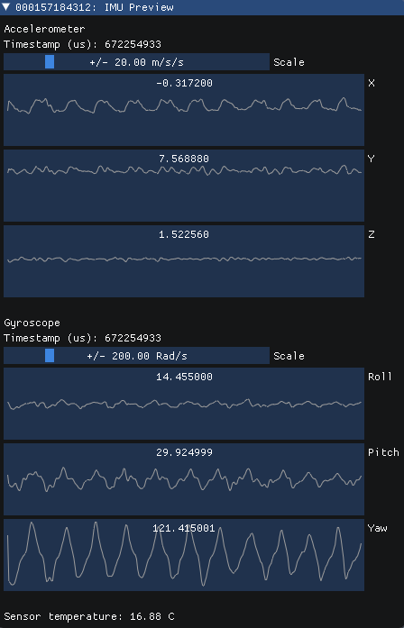
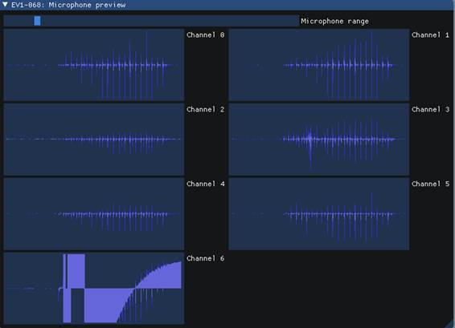

---
title: Azure Kinect Sensor Viewer
description: Kinect for Azure sensor data stream viewer homepage
author: joylital
ms.author: joylital
ms.date: 12/8/2018
keywords: Kinect, sensor, viewer, visualization, depth, rgb, color, imu, audio, microphone, point cloud
---

# Azure Kinect Viewer

Azure Kinect viewer application can be used to visualize all device data streams to
* Verify sensors are working correctly
* Help positioning the device
* Experiment with camera settings

The tool works also as sample application on how to use API and enables to configured device properties or read information out from device.

>[!NOTE]
>Tool is currently under active development and features being added. Please check/update the tool regularly to take benefit of added functionality.

## Using viewer

### Setup

You need following binaries to run the application:
```
- K4Aviewer.exe 
- k4a.dll 
- DepthEngine.dll 
- libusb-1.0.dll
```

Connect Azure Kinect DK with host PC using supplied USB cable and power to wall outlet.

### Start application

1. Launch the application by running K4AViewer.exe
2. Select open, if device is not visible click refresh 
3. Click Start 

Using default setting should get all sensors streaming, move around windows if necessary to see all of them.

## Checking device firmare version

Device Firmware Version can be accessed in configuration window, see below image



For example in this case Depth Camera ISP is running FW 1.4.40.

## Depth Camera

The depth camera viewer will show two windows - one called "Active Brightness", which will have a greyscale
image showing IR brightness and another called "Depth", which has a colorized representation of the depth data.
Hovering over the Depth window will show the value of the depth sensor at the pixel under your cursor.
Average frame rate from the depth camera over the last two seconds is also shown.
Note that this frame rate is constrained by the app frame rate, so if the app is struggling to maintain framerate, this may under report the sensor framerate.





## RGB Camera

Color camera view



You can control RGB camera settings from the configuration window during the streaming



## Inertial Measurement Unit (IMU)

The IMU window has two components - an accelerometer and a gyroscope.

The top half is the accelerometer and shows linear acceleration in meters/second^2.  It includes acceleration
from gravity, so if it's lying flat on a table the Z axis will probably show around -9.8m/s^2.

The bottom half is the gyrsocope portion and shows rotational movement in radians/second



## Microphone input

The microphone view shows a representation of the sound heard on each microphone.  If there's no sound, the graph
will be empty.  If there is sound, you'll see a dark blue waveform with a (usually smaller) light blue waveform
overlaid on top of it.

The dark wave represents the minimum and maximum values observed by the microphone over that time slice.  The light
wave represents the root mean square of the values observed by the microphone over that time slice.



## Point cloud visualisation

Depth visualized in 3D



you can move in the image using instructed keys. Currently point cloud is fixed to single resolution and window is not resiable, this as well as RGB point cloud support is under development.

## External synchronization control

You can use viewer to set device as standalone (default), master or subordinate mode when configuring multi-device synchronization.
When changing configuration or inserting/removing synchronization cable, click refresh to update.



See also [External synchronization setup guide](external-sync.md)

## Playing back recording

This is not supported yet. See [recording quickstart](k4a-recordplayback.md) on how to use available players to playback recording.

## Known issues/troubleshooting

* Opening multiple color cameras at once isn't supported yet and may hang/crash.
* Showing microphone data with multiple devices connected at once isn't supported yet and may show data from the wrong microphone.
* There are performance problems when running the RGB camera in 4K mode
* The UI is rudimentary/subject to overhaul.  It doesn't currently place/size windows in a way that shows all information (there's some stacking), and this is exacerbated when using high camera resolutions (framerate info can get obscured).
* Due to an API limitation, you can't refresh the device list while any device windows are open.
* Unexpected device disconnects are not handled properly yet and can cause hangs/crashes.

See also [troubleshooting](troubleshooting.md)





