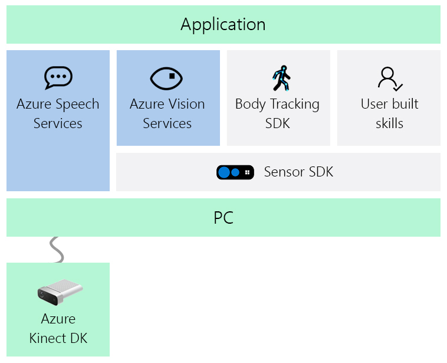

# About Azure Kinect DK

 

Azure Kinect DK is a developer kit with advanced AI sensors that provide sophisticated computer vision and speech models.  Kinect contains a depth sensor, spatial microphone array with a video camera, and orientation sensor as an all in-one small device with multiple modes, options, and software development kits (SDKs). It is available for purchase in [Microsoft online store](https://www.microsoft.com/p/azure-kinect-dk/8pp5vxmd9nhq).

The Azure Kinect DK development environment consists of the following multiple SDKs:

- Sensor SDK for low-level sensor and device access.
- Body Tracking SDK for tracking bodies in 3D.
- Azure AI Speech SDK for enabling microphone access and Azure cloud-based speech services.

In addition, Cognitive Vision services can be used with the device RGB camera.

   

## Azure Kinect Sensor SDK

The Azure Kinect Sensor SDK provides low-level sensor access for Azure Kinect DK hardware sensors and device configuration.

To learn more about Azure Kinect Sensor SDK, see [Using Sensor SDK](about-sensor-sdk.md).

### Azure Kinect Sensor SDK features

The Sensor SDK has the following features that work once installed and run on the Azure Kinect DK:

- Depth camera access and mode control (a passive IR mode, plus wide and narrow field-of-view depth modes) 
- RGB camera access and control (for example, exposure and white balance) 
- Motion sensor (gyroscope and accelerometer) access 
- Synchronized Depth-RGB camera streaming with configurable delay between cameras 
- External device synchronization control with configurable delay offset between devices 
- Camera frame meta-data access for image resolution, timestamp, etc. 
- Device calibration data access 

### Azure Kinect Sensor SDK tools

The following tools are available in the Sensor SDK:

- A viewer tool to monitor device data streams and configure different modes.
- A sensor recording tool and playback reader API that uses the Matroska container format.
- An Azure Kinect DK firmware update tool.

## Azure Kinect Body Tracking SDK

The Body Tracking SDK includes a Windows library and runtime to track bodies in 3D when used with the Azure Kinect DK hardware.

### Azure Kinect Body Tracking features

The following body-tracking features are available on the accompanying SDK:

- Provides body segmentation.
- Contains an anatomically correct skeleton for each partial or full body in FOV.
- Offers a unique identity for each body.
- Can track bodies over time.

### Azure Kinect Body Tracking tools

- Body Tracker has a viewer tool to track bodies in 3D.

## Azure AI Speech SDK

The Speech SDK enables Azure-connected speech services.

### Speech services

- Speech-to-text
- Speech translation
- Text-to-Speech

>[!NOTE]
>The Azure Kinect DK does not have speakers.

For additional details and information, visit [Speech Service documentation](../ai-services/speech-service/index.yml).

## Vision services

The following [Azure Cognitive Vision Services](https://azure.microsoft.com/services/cognitive-services/directory/vision/) provide Azure services that can identify and analyze content within images and videos.

- [Computer vision](https://azure.microsoft.com/services/cognitive-services/computer-vision/)
- [Face](https://azure.microsoft.com/services/cognitive-services/face/)
- [Video indexer](https://azure.microsoft.com/services/media-services/video-indexer/)
- [Content moderator](https://azure.microsoft.com/services/cognitive-services/content-moderator/)
- [Custom vision](https://azure.microsoft.com/services/cognitive-services/custom-vision-service/)

Services evolve and improve constantly, so remember to check regularly for new or additional [Azure AI services](https://azure.microsoft.com/services/cognitive-services/) to improve your application. For an early look on emerging new services, check out the [Azure AI services labs](https://labs.cognitive.microsoft.com/).

## Azure Kinect hardware requirements

The Azure Kinect DK integrates Microsoft's latest sensor technology into single USB connected accessory. For more information, see [Azure Kinect DK Hardware Specification](hardware-specification.md).

## Next steps

You now have an overview of Azure Kinect DK. The next step is to dive in and set it up!

> [!div class="nextstepaction"]
>[Quickstart: Set up Azure Kinect DK](set-up-azure-kinect-dk.md)
