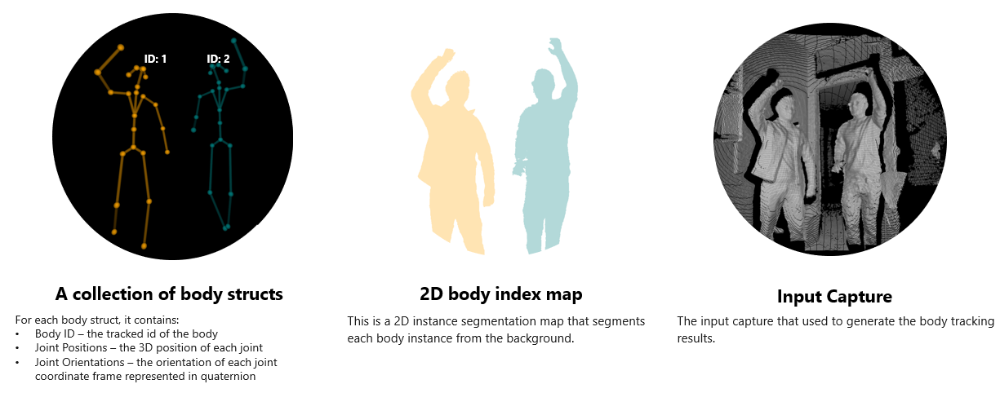

# Access data in body frame

This article describes the data contained in a body frame and the functions to access the data.

The following functions are covered:

- [k4abt_frame_get_body_id()](https://microsoft.github.io/Azure-Kinect-Body-Tracking/release/0.9.x/group__btfunctions_ga673def22c3e3d4683a5702d8fe3cdc5e.html#ga673def22c3e3d4683a5702d8fe3cdc5e)
- [k4abt_frame_get_body_index_map()](https://microsoft.github.io/Azure-Kinect-Body-Tracking/release/0.9.x/group__btfunctions_ga0e4f2d0d7e330d444de7070fb1fee4f6.html#ga0e4f2d0d7e330d444de7070fb1fee4f6)
- [k4abt_frame_get_body_skeleton()](https://microsoft.github.io/Azure-Kinect-Body-Tracking/release/0.9.x/group__btfunctions_ga7ef3f65827c9d21dac0caef572cc6c23.html#ga7ef3f65827c9d21dac0caef572cc6c23)
- [k4abt_frame_get_capture()](https://microsoft.github.io/Azure-Kinect-Body-Tracking/release/0.9.x/group__btfunctions_gad9eef11f6496bbfe997536c374217d9a.html#gad9eef11f6496bbfe997536c374217d9a)
- [k4abt_frame_get_num_bodies()](https://microsoft.github.io/Azure-Kinect-Body-Tracking/release/0.9.x/group__btfunctions_ga485b3a0f29e61c75f2e3d8b78b345ea9.html#ga485b3a0f29e61c75f2e3d8b78b345ea9)
- [k4abt_frame_get_timestamp_usec()](https://microsoft.github.io/Azure-Kinect-Body-Tracking/release/0.9.x/group__btfunctions_ga4c7d92c9f1b4e4a4b928736fb315f918.html#ga4c7d92c9f1b4e4a4b928736fb315f918)

## Key components of a body frame

Each body frame contains a collection of body structs, a 2D body index map, and the input capture that generated this result.



## Access the collection of body structs

Multiple bodies might be detected in a single capture. You can query the number of bodies by calling the [k4abt_frame_get_num_bodies()](https://microsoft.github.io/Azure-Kinect-Body-Tracking/release/0.9.x/group__btfunctions_ga485b3a0f29e61c75f2e3d8b78b345ea9.html#ga485b3a0f29e61c75f2e3d8b78b345ea9) function.

```C
size_t num_bodies = k4abt_frame_get_num_bodies(body_frame);
```

You use the [k4abt_frame_get_body_id()](https://microsoft.github.io/Azure-Kinect-Body-Tracking/release/0.9.x/group__btfunctions_ga673def22c3e3d4683a5702d8fe3cdc5e.html#ga673def22c3e3d4683a5702d8fe3cdc5e) and [k4abt_frame_get_body_skeleton()](https://microsoft.github.io/Azure-Kinect-Body-Tracking/release/0.9.x/group__btfunctions_ga7ef3f65827c9d21dac0caef572cc6c23.html#ga7ef3f65827c9d21dac0caef572cc6c23l) functions to iterate through each body index to find the body ID and joint position/orientation information.

```C
for (size_t i = 0; i < num_bodies; i++)
{
    k4abt_skeleton_t skeleton;
    k4abt_frame_get_body_skeleton(body_frame, i, &skeleton);
    uint32_t id = k4abt_frame_get_body_id(body_frame, i);
}
```

## Access the body index map

You use the [k4abt_frame_get_body_index_map()](https://microsoft.github.io/Azure-Kinect-Body-Tracking/release/0.9.x/group__btfunctions_ga0e4f2d0d7e330d444de7070fb1fee4f6.html#ga0e4f2d0d7e330d444de7070fb1fee4f6) function to access the body index map. Refer to [body index map](body-index-map.md) for detailed explanation of the body index map. Make sure to release the body index map when it is no longer needed.

```C
k4a_image_t body_index_map = k4abt_frame_get_body_index_map(body_frame);
...  // Do your work with the body index map
k4a_image_release(body_index_map);
```

## Access the input capture

The body tracker is an asynchronous API. The original capture may already have been released by the time the result is popped. Use the [k4abt_frame_get_capture()](https://microsoft.github.io/Azure-Kinect-Body-Tracking/release/0.9.x/group__btfunctions_gad9eef11f6496bbfe997536c374217d9a.html#gad9eef11f6496bbfe997536c374217d9a) function to query the 
input capture used to generate this body tracking result. The reference count for the k4a_capture_t is increased each time this function is called. Use [k4a_capture_release()](https://microsoft.github.io/Azure-Kinect-Sensor-SDK/master/group___functions_ga0ed6f74ec403c3eac1b8ef3afb32cee6.html#ga0ed6f74ec403c3eac1b8ef3afb32cee6) function when the capture is no longer needed.

```C
k4a_capture_t input_capture = k4abt_frame_get_capture(body_frame);
... // Do your work with the input capture
k4a_capture_release(input_capture);
```

## Next steps

> [!div class="nextstepaction"]
>[Azure Kinect Body Tracking SDK](https://microsoft.github.io/Azure-Kinect-Sensor-SDK/master/index.html)