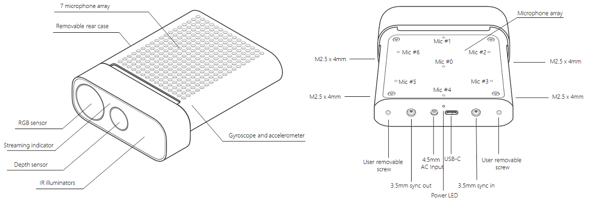
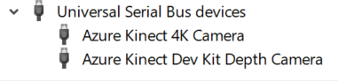

---
title: Azure Kinect DK
description: Azure Kinect DK specifications and capabilities
author: joylital
ms.author: joylital
ms.date: 10/02/2018
keywords: Azure Kinect, specs, capabilities, depth, color, RGB, IMU, microphone, array, depth
---

# Azure Kinect DK

>[!IMPORTANT]
>Please remember that Azure Kinect DK name and form factor are confidential. Note also that product is under development and specs are subject to change anytime without warning.



Azure Kinect DK integrates Microsoft latest sensor technology into single USB connected accessory.

## Product dimensions and weight

Dimensions: 103 x 39 x 126 mm

Weight: 440 g



## Operating environment

Azure Kinect DK is designed to work reliably indoors in following operational device environment:
- Ambient temperature 0-35 C
- Humidity (non-condensing) 8-90 %RH
- Ambient light level 10-2500 Lux

## Depth camera supported operating modes

Microsoft inhouse designed 1MPixel Time-of-flight depth camera, supported modes
 
 | Mode            | Resolution | FOI       | FPS                | Operating range* | Exposure time |
|-----------------|------------|-----------|--------------------|------------------|---------------|
| NFOV unbinned   | 640x576    | 75°x65°   | 0, 5, 15, 30       | 0.5 - 3.86 m       | 12.8 ms        |
| NFOV 2x2 binned | 320x288    | 75°x65°   | 0, 5, 15, 30       | 0.5 - 5.46 m       | 12.8 ms        |
| WFOV 2x2 binned | 512x512    | 120°x120° | 0, 5, 15, 30       | 0.25 - 2.88 m      | 12.8 ms        |
| WFOV unbinned   | 1024x1024  | 120°x120° | 0, 5, 15           | 0.25 - 2.21 m      | 20.3 ms        |
| Passive IR      | 1024x1024  | N/A       | 0, 5, 15, 30       | N/A              | 1.6 ms         |

*15% to 95% reflectivity, 2.2 mW/cm^2/nm, 𝝈 <= 17 mm. Depth provided outside of indicated range depending on object reflectivity

## Color camera supported operating modes

Azure Kinect DK include OV12A10 12MP CMOS sensor rolling shutter sensor. Native operating modes are listed in below table:

|             RGB Camera Resolution (HxV)  |          Aspect Ratio  |          Format Options   |          Frame Rates (FPS)  |          Nominal FOV (HxV)(post-processed)  |
|------------------------------------------|------------------------|---------------------------|-----------------------------|---------------------------------------------|
|       3840x2160                          |          16:9          |          MJPEG            |          0, 5, 15, 30       |          90x59                              |
|       2560x1440                          |          16:9          |          MJPEG            |          0, 5, 15, 30       |          90x59                              |
|       1920x1080                          |          16:9          |          MJPEG            |          0, 5, 15, 30       |          90x59                              |
|       1280x720                           |          16:9          |          MJPEG/YUY2/NV12  |          0, 5, 15, 30       |          90x59                              |
|       4096x3072                          |          4:3           |          MJPEG             |          0, 5, 15           |          90x74.3                            |
|       2048x1536                          |          4:3           |          MJPEG             |          0, 5, 15, 30       |          90x74.3                            |

Camera is identified as regular UVC camera and works on Windows without any SDK installed.

Note! SDK exposes BGRA mode that is converted from MJPEG on host CPU. This is not native more and causes CPU load when used.


## Motion sensor (IMU)

IMU is LSM6DSMUS and includes both accelerometer and gyroscope, both sampled at 1.6kHz and reported to host at 208Hz rate.

## Microphone array

7-Microphone circular array, this is identified as standard USB2.0 class device and works with Windows without any SDK installed.

Specification:
- Sensitivity: -22 dBFS (94 dB SPL, 1 kHz)
- Signal to noise ratio	> 65 dB

## USB

Azure Kinect DK is a USB3 composite device which exposes following hardware endpoints to the operating system:

Vendor ID is 0x045E (Microsoft), Product ID table below:

|    USB Interface        |    PNP IP    |     Notes            |
|-------------------------|--------------|----------------------|
|    USB3.1 Gen1 Hub    |    0x097A    |    The   main hub    |
|    USB2.0 Hub         |    0x097B    |    HS   USB          |
|    Depth camera          |    0x097C    |    USB3.0            |
|    Color camera            |    0x097D    |    USB3.0            |
|    Microphones                |    0x097E    |    HS   USB          |



## Indicators

Device has camera streaming indicator on front of the device that is software configuration for RGB and Depth cameras

Status LED behind the device indicates device state:
- Solid white indicates device is powered and operating normally
- Blinking amber that device does not have sufficient power to operate (e.g. powered through USB Type A)
- Blinking white that device is powered but do not have USB3 data connection

## Powering Device

Device can be powered using inbox power supply and USB Type C to A cable or using Type-C to C cable for both power and data.

Type C to C cable is not included inbox.

>[!NOTE]
> USB cables do matter and it is recommended to use high quality cables and verify functionality before deploying unit remotely

Tips for selecting good type-C to Type-C cable:
- Use USB certified cable (https://www.usb.org/products), must support both power and data
- Passive cable should be less than 1.5m in length, for longer cables use active cable 
- The cable shall support no less than >1.5A, else you need connect external PSU

Verifying cable:
- Connect device with cable to host PC
- Validate all devices enumerate correctly in Windows device manager. Depth and RGB camera as example below



- Validate that cable is able to stream reliably all sensors in Azure Kinect Viewer, with following settings:
    - Depth camera: NFOV unbinned
    - RGB Camera: 2160p
    - Microphones and IMU enabled

## Power consumption

Up to 5.9W, power consumption is use case dependent.

## Calibration

Device is factory calibrated and calibration data is available programmatically using Sensor SDK.

## External syncronization

Device includes 3.5mm synchronization pins that can be used to daisy chain multiple units together and have coordinated Depth/RGB camera triggering.
Compatible cable is not included in box and must be purchased separately, cable requirements:
- 3.5mm tip Male-to-male cable ("3.5mm audio cable")
- Maximum cable length < 10m
- Both stereo or mono cable are acceptable.

More details on getting started with [external synchronization](external-sync.md)

## Device recovery

Device firmware can be reset to original firmware using button underneath the lock pin.



To perform recovery see [instructions here](azurekinect-fw-recovery.md)


## See also
 * [Using Sensor SDK](sensor-sdk.md)
 * [Host PC minimum requirement](system-requirements.md)
 * [Setup hardware](set-up-hardware.md)

