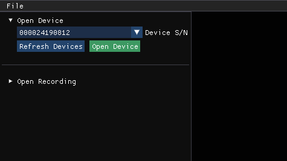
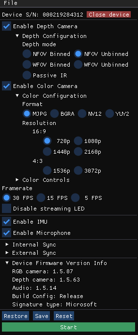
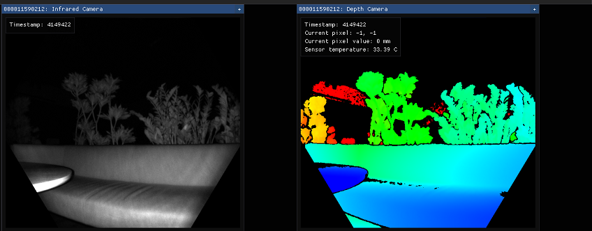
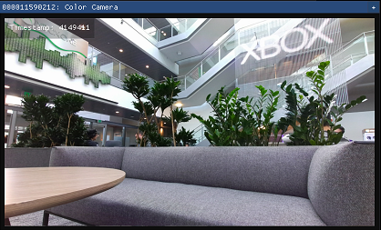
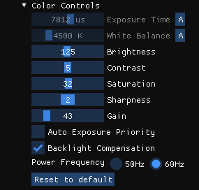
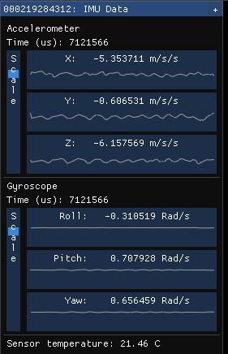
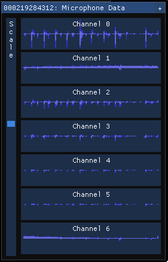
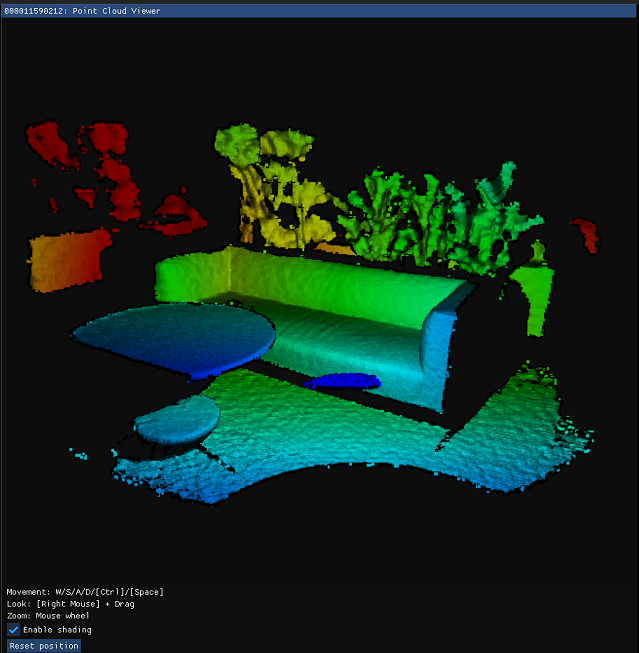

# Azure Kinect Viewer

The Azure Kinect Viewer, found under the installed tools directory as `k4aviewer.exe` (for example, `C:\Program Files\Azure Kinect SDK vX.Y.Z\tools\k4aviewer.exe`, where `X.Y.Z` is the installed version of the SDK), can be used to visualize all device data streams to:

* Verify sensors are working correctly.
* Help positioning the device.
* Experiment with camera settings.
* Read device configuration.
* Playback recordings made with [Azure Kinect Recorder](azure-kinect-recorder.md).

Azure Kinect Viewer is [open source](https://github.com/microsoft/Azure-Kinect-Sensor-SDK/tree/develop/tools/k4aviewer) and can be used as an example for how to use the APIs.

## Use viewer

The viewer can operate in two modes: with live data from the sensor or from recorded data ([Azure Kinect Recorder](azure-kinect-recorder.md)).

### Start application

Launch the application by running `k4aviewer.exe`.

### Use the viewer with live data

1. In the **Open Device** section, select the **Serial Number** of the device to open. Then, select **Refresh**, if the device is missing.
2. Select the **Open Device** button.
3. Select **Start** to begin streaming data with the default settings.

### Use the viewer with recorded data

In **Open Recording** section, navigate to the recorded file, and select it.

## Check device firmware version

Access the device firmware version in the configuration window, as shown in the following image.

For example, in this case, the depth camera ISP is running FW 1.5.63.

## Depth camera

The depth camera viewer will show two windows:

* One is called *Active Brightness* that is a grayscale image showing IR brightness.
* The second is called *Depth*, which has a colorized representation of the depth data.

Hover your cursor, at the pixel in the depth window, to see the value of the depth sensor, as shown below.

## RGB camera

The image below shows the color camera view.

You can control RGB camera settings from the configuration window during the streaming.

## Inertial Measurement Unit (IMU)

The IMU window has two components, an accelerometer and a gyroscope.

The top half is the accelerometer and shows linear acceleration in meters/second2.  It includes acceleration from gravity, so if it's lying flat on a table, the Z axis will probably show around -9.8 m/s2.

The bottom half is the gyroscope portion and shows rotational movement in radians/second

## Microphone input

The microphone view shows a representation of the sound heard on each microphone. If there's no sound, the graph is shown as empty, otherwise, you'll see a dark blue waveform with a light blue waveform overlaid on top of it.

The dark wave represents the minimum and maximum values observed by the microphone over that time slice. The light wave represents the root mean square of the values observed by the microphone over that time slice.

## Point cloud visualization

Depth visualized in 3D lets you move in the image using instructed keys.

## Synchronization control

You can use the viewer to configure the device as standalone (default), master, or subordinate mode when configuring multi-device synchronization.
When changing configuration or inserting/removing synchronization cable, select **Refresh** to update.

## Next steps

> [!div class="nextstepaction"]
>[External synchronization setup guide](https://support.microsoft.com/help/4494429/sync-multiple-azure-kinect-dk-devices)
