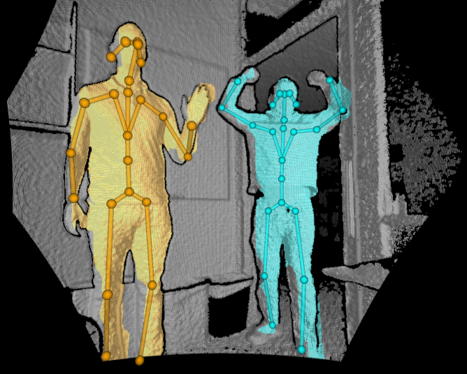

# Quickstart: Set up Azure Kinect body tracking

This quickstart will guide you through the process of getting body tracking running on your Azure Kinect DK.

## System requirements

The Body Tracking SDK requires a NVIDIA GPU installed in the host PC. The recommended body tracking host PC requirement is described in [system requirements](system-requirements.md) page.

## Install software

### [Install the latest NVIDIA Driver](https://www.nvidia.com/Download/index.aspx?lang=en-us)

Download and install the latest NVIDIA driver for your graphics card. Older drivers may not be compatible with the CUDA binaries redistributed with the body tracking SDK.

### [Visual C++ Redistributable for Visual Studio 2015](https://www.microsoft.com/en-us/download/details.aspx?id=48145)

Download and install Visual C++ Redistributable for Visual Studio 2015. 

## Set up hardware

### [Set up Azure Kinect DK](set-up-azure-kinect-dk.md)

Launch the [Azure Kinect Viewer](azure-kinect-viewer.md) to check that your Azure Kinect DK is set up correctly.

## Download the Body Tracking SDK
 
1. Select the link to [Download the Body Tracking SDK](body-sdk-download.md)
2. Install the Body Tracking SDK on your PC.

## Verify body tracking

Launch the **Azure Kinect Body Tracking Viewer** to check that the Body Tracking SDK is set up correctly. The viewer is installed with the SDK msi installer. You can find it at your start menu or at `<SDK Installation Path>\tools\k4abt_simple_3d_viewer.exe`.

If you don't have a powerful enough GPU and still want to test the result, you can launch the the **Azure Kinect Body Tracking Viewer** in the command line by the following command: `<SDK Installation Path>\tools\k4abt_simple_3d_viewer.exe CPU`

If everything is set up correctly, a window with a 3D point cloud and tracked bodies should appear.

## Specifying ONNX Runtime execution environment

The Body Tracking SDK supports CPU, CUDA, DirectML (Windows only) and TensorRT execution environments to inference the pose estimation model. The `K4ABT_TRACKER_PROCESSING_MODE_GPU` defaults to CUDA execution on Linux and DirectML execution on Windows. Three additional modes have been added to select specific execution environments: `K4ABT_TRACKER_PROCESSING_MODE_GPU_CUDA`, `K4ABT_TRACKER_PROCESSING_MODE_GPU_DIRECTML`, and `K4ABT_TRACKER_PROCESSING_MODE_GPU_TENSORRT`.

> [!NOTE]  
> ONNX Runtime displays warnings for opcodes that are not accelerated. These may be safely ignored.

ONNX Runtime includes environment variables to control TensorRT model caching. The recommended values are:
- ORT_TENSORRT_ENGINE_CACHE_ENABLE=1 
- ORT_TENSORRT_CACHE_PATH="pathname"

The folder must be created prior to starting body tracking.

> [!IMPORTANT]  
> TensorRT pre-processes the model prior to inference resulting in extended start up times when compared to other execution environments. Engine caching limits this to first execution however it is experimental and is specific to the model, ONNX Runtime version, TensorRT version and GPU model.

The TensorRT execution environment supports both FP32 (default) and FP16. FP16 trades ~2x performance increase for minimal accuracy decrease. To specify FP16:
- ORT_TENSORRT_FP16_ENABLE=1

## Required DLLs for ONNX Runtime execution environments

|Mode      | ORT 1.10                       | CUDA 11.4.3          | CUDNN 8.2.2.26      | TensorRT 8.0.3.4 |
|----------|--------------------------------|----------------------|---------------------|------------------|
| CPU      | msvcp140                       | -                    | -                   | -                |
|          | onnxruntime                    |                      |                     |                  |
| CUDA     | msvcp140                       | cudart64_110         | cudnn64_8           | -                |
|          | onnxruntime                    | cufft64_10           | cudnn_ops_infer64_8 |                  |
|          | onnxruntime_providers_cuda     | cublas64_11          | cudnn_cnn_infer64_8 |                  |
|          | onnxruntime_providers_shared   | cublasLt64_11        |                     |                  |
| DirectML | msvcp140                       | -                    | -                   | -                |
|          | onnxruntime                    |                      |                     |                  |
|          | directml                       |                      |                     |                  |
| TensorRT | msvcp140                       | cudart64_110         | -                   | nvinfer          |
|          | onnxruntime                    | cufft64_10           |                     | nvinfer_plugin   |
|          | onnxruntime_providers_cuda     | cublas64_11          |                     |                  |
|          | onnxruntime_providers_shared   | cublasLt64_11        |                     |                  |
|          | onnxruntime_providers_tensorrt | nvrtc64_112_0        |                     |                  |
|          |                                | nvrtc-builtins64_114 |                     |                  |

## Examples

You can find the examples about how to use the body tracking SDK [here](https://github.com/microsoft/Azure-Kinect-Samples/tree/master/body-tracking-samples).

## Next steps

> [!div class="nextstepaction"]
>[Build your first body tracking application](build-first-body-app.md)
