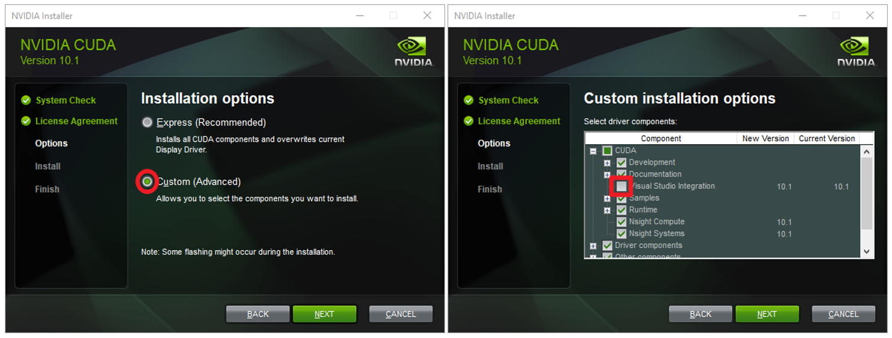

# Quickstart: Set up Azure Kinect body tracking

This quickstart will guide you through getting body tracking running on our Azure Kinect DK.

If you don't have an Azure subscription, create a [free account](https://azure.microsoft.com/free/?WT.mc_id=A261C142F) before you begin.

## System requirements

- Windows 10 PC
  - Core i5 or better
- NVIDIA GPU
  - GEFORCE GTX 1070 or better
  - GEFORCE RTX 2070 or better

## Install software

### [CUDA 10.1](https://developer.nvidia.com/cuda-downloads)

Follow the on-screen prompts to install CUDA 10.1 and all patches.

>[!NOTE]
> If installing with the "Express" installation options fails, please select "Custom" installation option and click "Next".
> Then expand the "CUDA" tag and unselect "Visual Studio Integration".

### [cuDNN v7.5.x for CUDA 10.1](https://developer.nvidia.com/rdp/cudnn-download)

Sign in to NVIDIA Developer site with your Developer Program membership and download the cudnn64_7.dll. Ensure the dll path is added to the "Environment Variables - Path":
1. Launch "Control Panel" -> Select "System and Security" -> Select "System" -> Select "Advanced system settings"

    

2. Select "Environment Variables" -> Double-click the "Path" variable under "System variables" block -> Make sure the path that contains your cudnn64_7.dll is there.

    

### [Install the latest NVIDIA Driver](https://www.nvidia.com/Download/index.aspx?lang=en-us)

CUDA 10.1 installs an older version of the NVIDIA graphics driver. Download and install the latest NVIDIA driver for your graphics card.

## Set-up hardware

### [Set-up Azure Kinect DK](set-up-azure-kinect-dk.md)

Launch `k4aviewer.exe` to check that your Azure Kinect DK is set up correctly.

## Verify body tracking

Launch `k4abt_simple-3d-viewer.exe` sample to check that the Body Tracking SDK is set up correctly. The single 3d viewer sample uses the Sensor SDK and Body Tracking SDK to visualize body tracking. A pre-complied binary for the sample is located in the `examples/bin` folder.

If everything is set up correctly, a window is displayed with a 3D point cloud and tracked bodies.

>[!NOTE]
> The first time an Azure Kinect Body Tracking application is launched on a machine it may take several minutes to load as CUDA is initialized. Subsequent launches on the same machine will be faster.

## Next steps

> [!div class="nextstepaction"]
>[Coordinate systems](azure-kinect-dk-coordinate-systems.md)