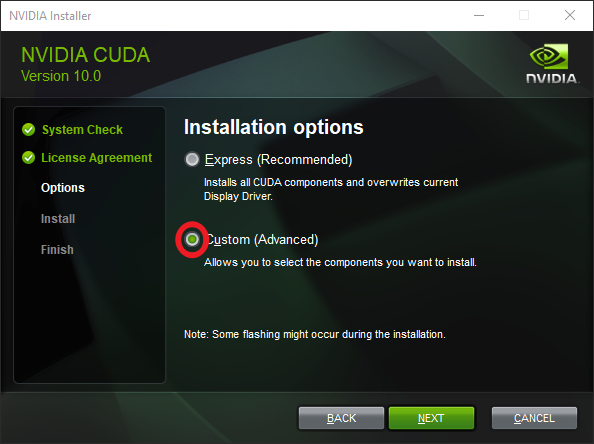
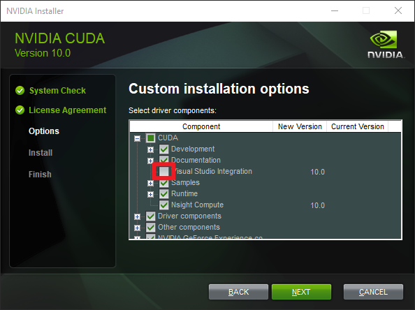
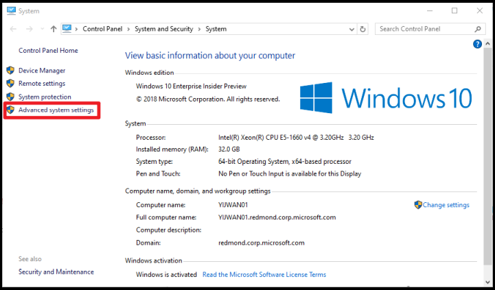
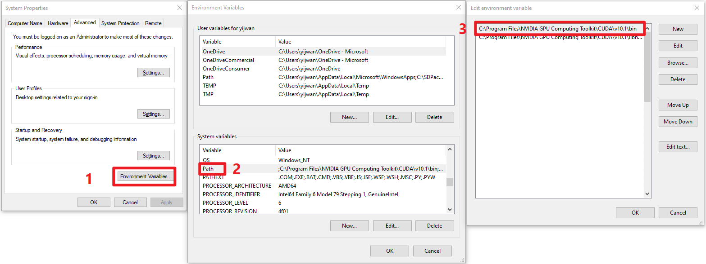

# Quickstart: Set up Azure Kinect body tracking

This quickstart will guide you through the process of getting body tracking running on your Azure Kinect DK.

## System requirements

The Body Tracking SDK requires a NVIDIA GPU installed in the host PC. The recommended body tracking host PC requirement is described in [system requirements](system-requirements.md) page.

## Install software

### [CUDA 10.0](https://developer.nvidia.com/cuda-10.0-download-archive)

Follow the on-screen prompts to install CUDA 10.0 and all patches.

>[!NOTE]
> If installing with the "Express" installation options fails, please select "Custom" installation option and click "Next".
> Then expand the "CUDA" tag and unselect "Visual Studio Integration".

### [cuDNN v7.5.x for CUDA 10.0](https://developer.nvidia.com/rdp/cudnn-archive)

Sign in to NVIDIA Developer site with your Developer Program membership and download the `cudnn64_7.dll`. Ensure the dll path is added to the "Environment Variables - Path":
1. Launch "Control Panel" -> Select "System and Security" -> Select "System" -> Select "Advanced system settings"

    

2. Select "Environment Variables" -> Double-click the "Path" variable under "System variables" block -> Make sure the path that contains your `cudnn64_7.dll` is there.

    

### [Install the latest NVIDIA Driver](https://www.nvidia.com/Download/index.aspx?lang=en-us)

CUDA 10.0 installs an older version of the NVIDIA graphics driver. Download and install the latest NVIDIA driver for your graphics card.

### [Visual C++ Redistributable for Visual Studio 2015](https://www.microsoft.com/en-us/download/details.aspx?id=48145)

Download and install Visual C++ Redistributable for Visual Studio 2015. 

## Set up hardware

### [Set up Azure Kinect DK](set-up-azure-kinect-dk.md)

Launch the [Azure Kinect Viewer](azure-kinect-viewer.md) to check that your Azure Kinect DK is set up correctly.

## Download the Body Tracking SDK
 
1. Select the link to [Download the Body Tracking SDK](body-sdk-download.md)
2. Install the Body Tracking SDK on your PC.

## Verify body tracking

Launch the **Azure Kinect Body Tracking Viewer** to check that the Body Tracking SDK is set up correctly. The viewer is installed with the SDK msi installer. You can find it at your start menu or at `<SDK Installation Path>\tools\k4abt_simple_3d_viewer.exe`.

If everything is set up correctly, a window with a 3D point cloud and tracked bodies should appear.

## Next steps

> [!div class="nextstepaction"]
>[Build your first body tracking application](build-first-body-app.md)

