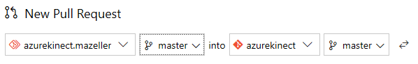
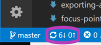
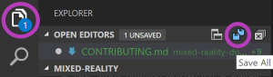
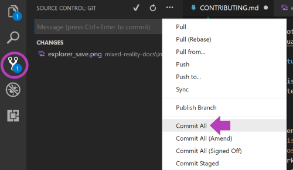
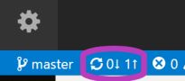

# Contributing to Azure Kinect developer documentation

Welcome to the [private repo for Azure Kinect developer documentation](https://cpubwin.visualstudio.com/mixed-reality/mixed-reality%20contributors/_git/azurekinect?path=%2FDocs&version=GBmaster)! Any articles you create or edit in this repo will **not** be visible to the public. 

Developer documentation uses the *Microsoft Docs* platform, which uses GitHub-flavored Markdown (with Markdig features). Essentially, the content you edit in this repo gets turned into formatted pages that show up at *docs.microsoft.com*.

This page covers the basic steps and guidelines for contributing, as well as links to Markdown basics, so that your content ends up looking good when it hits *docs.microsoft.com*. Thank you for your contribution!

## Before you start

If you're accessing this repo, it means you've been granted access to contribute to a project with many details that are not yet publicly available, and the information within shouldn't be shared externally. While this repo is permissions-controlled, the content in this repo gets published to a staging site (hosted at *https://review.docs.microsoft.com/azurekinect*; see ["Previewing your work"](#previewing-your-work) below for more information) which is accessible to all Microsoft employees, but is not discoverable by search. In other words, **do not share the review.docs URL for this content with anyone that hasn't been approved to access this information.**

## Editing an existing article

Use the following workflow to make updates to the documentation via web browser:

1. Navigate to the article you wish to edit in the "Docs" folder.
2. Select the **Edit** button () in the article's menu bar. This will automatically fork a disposable branch off master.
3. Edit the content of the article (see ["Markdown basics"](#markdown-basics) below for guidance).
4. Update metadata as relevant at the top of each article:
   * title: This is the page title that appears in the browser tab when the article is being viewed. As this is used for SEO and indexing, you shouldn't change the title unless necessary (though this is less critical before documentation goes public).
   * description: Write a brief description of the article's content. This aids in SEO and discovery.
   * author: If you are the primary owner of the page, add your GitHub alias here.
   * ms.author: If you are the primary owner of the page, add your Microsoft alias here (you don't need "@microsoft.com," just the alias).
   * ms.date: Update the date if you're adding major content to the page, but not for fixes like clarification, formatting, grammar, or spelling.
   * ms.topic: This will always be "article" for an article.
   * keywords: Keywords aid in SEO. Add keywords, separated by a comma and a space, that are specific to your article (but no punctuation after the last keyword in your list); you don't need to add global keywords that apply to all articles as those are managed elsewhere.
5. When you've completed your page edits, scroll down and select the **Propose file change** button. *needs to be validated by an account without direct commit perms*
6. On the next page, select **Create pull request** to merge your automatically-created branch into master. *needs to be validated by an account without direct commit perms*
7. After the pull request is completed, the site admin will delete your branch (this is easiest, so you don't have to keep it in sync with master). *needs to be validated by an account without direct commit perms*
8. Repeat the steps above for the next article you want to edit.

## Creating a new article

Use the following workflow to create new articles in the documentation via web browser:

1. Create a fork off the azurekinect 'master' branch (using the **Fork** button in the top right).

   
2. In your fork of the repo, open the "Docs" folder, select the **New** button in the folder's menu bar, and select **File**.

   

3. Create a page name for the article (use hyphens instead of spaces and don't use punctuation or apostrophes) and append ".md"

   

   >[!IMPORTANT]
   >Make sure you create the new article from within the "Docs" folder. You can confirm this by checking for "/Docs/" in the new file name line.

4. At the top of your new page, add the following metadata block:

   ```md
   ---
   title:
   description:
   author:
   ms.author:
   ms.date:
   ms.topic: article
   keywords:
   ---
   ```

5. Fill in the relevant metadata fields per the instructions in the [section above](#editing-an-existing-article).
6. Write article content using the skills you learned in the ["Markdown basics"](#markdown-basics) section.
7. Add a `## See also` section at the bottom of the article with cross-links to other relevant articles.
8. When finished, select **Commit** at the top of the page.
9. Select **New pull request** in the box that appears at the top of the page, and merge your fork's 'master' branch into azurekinect's 'master' branch.
   >[!NOTE]
   >Make sure the pull request goes from your fork's 'master' branch *into* the azurekinect repo's 'master' branch, and not the other way around.

   

## Markdown basics

The following resources will help you learn how to edit documentation using the Markdown language:

- [Markdown basics](https://help.github.com/articles/basic-writing-and-formatting-syntax/)
- [Markdown-at-a-glance reference poster](images/contributing/MarkdownPoster.pdf)
- [Additional resources for writing Markdown for docs.microsoft.com](https://review.docs.microsoft.com/en-us/help/contribute/contribute-how-to-write-use-markdown?branch=master)
- [Unique Markdig differences](https://review.docs.microsoft.com/en-us/new-hope/engineering/tools/markdig/markdig-migration-information?branch=master&tabs=dfm) and [Markdig multi-column support](https://review.docs.microsoft.com/en-us/curtcu-test/row-and-column?view=contososerver-2.1&branch=master)

### Adding tables

Because of the way docs.microsoft.com styles tables, they won’t have borders or custom styles, even if you try inline CSS. It will appear to work for a short period of time, but eventually the platform will strip the styling out of the table. So plan ahead and keep your tables simple. [Here’s a site that makes Markdown tables easy](http://www.tablesgenerator.com/markdown_tables).

The [Docs Markdown Extension for Visual Studio Code](https://docs.microsoft.com/en-us/teamblog/docs-extension) also makes table generation easy if you're using [Visual Studio Code](#using-visual-studio-code) to edit the documentation.

### Adding images

You’ll need to upload your images to the images folder in the repo, and then reference them appropriately in the article. Images will automatically show up at full-size, which means if your image is large, it’ll fill the entire width of the article. Thus, we recommend pre-sizing your images before uploading them. The recommended width is between 600 and 700 pixels, though you should size up or down if it’s a dense screenshot or a fraction of a screenshot, respectively. [You can find solid guidance here.](https://review.docs.microsoft.com/en-us/help/style/style-how-to-visuals-static-art-types?branch=master)

>[!IMPORTANT]
>You can only upload images to your forked repo. So, if you plan on adding images to an article, you'll need to [use Visual Studio Code](#using-visual-studio-code) or make sure you've done the following in a web browser:
>
>1. Forked the azurekinect 'master' repo.
>2. Edited the article in your fork.
>3. Uploaded the images you're referencing in your article to the "images" folder in your fork.
>4. Created a **pull request** to merge your fork's 'master' branch into the azurekinect 'master' branch.
>
>To learn how to set up your own forked repo, see step 1 of [creating a new article](#creating-a-new-article).

## Previewing your work

While editing in the browser, you can click the **Preview** tab near the top of the page to preview your work before committing.

Once your contributions have been merged into the 'master' branch, you can see what the documentation will look like when it goes public at https://review.docs.microsoft.com/en-us/azurekinect?branch=master (find your article using the table of contents in the left column.

## Editing in the browser vs. editing with a desktop client

Editing in the browser is the easiest way to make quick changes, however, there are a few disadvantages:

- You don't get spell-check.
- You don't get any smart-linking to other articles (you have to manually type the article's filename).
- It can be a hassle to upload and reference images.

If you'd rather not deal with these issues, you may prefer to use a desktop client like [Visual Studio Code](https://code.visualstudio.com/) with a couple [helpful extensions](#useful-extensions) to contribute to documentation.

## Using Visual Studio Code

For the reasons listed [above](#editing-in-the-browser-vs-editing-with-a-desktop-client), you may prefer using a desktop client to edit documentation instead of a web browser. We recommend using [Visual Studio Code](https://code.visualstudio.com/).

### Setup

Follow these steps to configure Visual Studio Code to work with this repo:

1. Install [Git for your PC](https://git-scm.com/downloads).
2. Install [Visual Studio Code](https://code.visualstudio.com/).
3. Fork the azurekinect repo if you haven't already (see step 1 of ["Creating a new article"](#creating-a-new-article)).
4. In *your* fork, select **Clone** in the top right corner, and select **Clone in VS Code**.

    
5. A prompt will ask you to allow the link to open Visual Studio Code. Choose **Yes**.
6. A prompt in Visual Studio Code will ask if you want to open the URL. Choose **Yes**.
7. Choose where to save the clone on your PC.
8. Click **Open repo** in the pop-up.

### Editing documentation

Use the following workflow to make changes to the documentation with Visual Studio Code:

>[!NOTE]
>All the guidance for [editing](#editing-an-existing-article) and [creating](#creating-a-new-article) articles, and the [basics of editing Markdown](#markdown-basics), from above applies when using Visual Studio Code as well.

1. Make sure your fork is up-to-date with the official repo.
   1. In a web browser, navigate to your fork and select **Pull requests** from the menu at the top.
   2. Select the **New pull request** button in the top right corner to sync recent changes from other contributors in the azurekinect repo to your fork.
      >[!IMPORTANT]
      >Make sure you are pulling from the azurekinect 'master' branch *into* your fork's 'master' branch. You don't want to accidentally overwrite newer changes in the azurekinect repo with your outdated fork. You can select the arrows button to swap the direction of the pull request.
      
      
   3. In Visual Studio Code, click the sync button to sync your freshly updated fork to the local clone on your PC.
      
      
2. Create or edit articles in your cloned repo on your PC using Visual Studio Code.
   1. Edit one or more articles (add images to “images” folder if necessary).
   2. **Save** changes in **Explorer**.
      
      
   3. **Commit all** changes in **Source Control** (write commit message when prompted).
      
      
   4. Click the **sync** button to sync your changes back to origin (your fork on GitHub).
      
      
3. In a web browser, navigate to your fork and create a pull request to sync new changes in your fork back to the azurekinect 'master' branch.
   >[!NOTE]
   >This time you *do* want to go from your fork's 'master' branch *into* the azurekinect repo's 'master' branch (the opposite of step 1 above).

   

### Useful extensions

The following Visual Studio Code extensions are very useful when editing documentation:

- [Docs Markdown Extension for Visual Studio Code](https://marketplace.visualstudio.com/items?itemName=docsmsft.docs-authoring-pack) - Use **Alt+M** to bring up a menu of docs authoring options like:
   - Search and reference images you've uploaded.
   - Add formatting like lists, tables, and docs-specific call-outs like `>[!NOTE]`.
   - Search and reference internal links and bookmarks (links to specific sections within a page).
   - Formatting errors are highlighted (hover your mouse over the error to learn more).
- [Code Spell Checker](https://marketplace.visualstudio.com/items?itemName=streetsidesoftware.code-spell-checker) - misspelled words will be underlined; right-click on a misspelled word to change it or save it to the dictionary.







