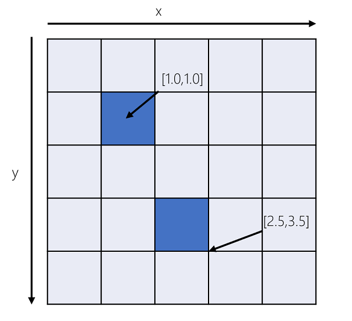
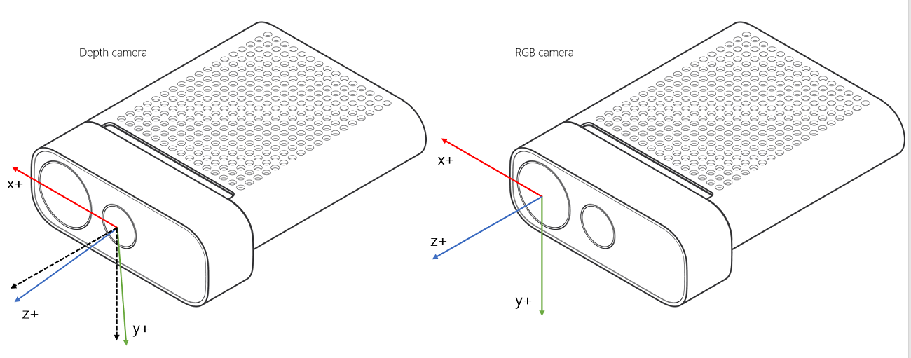
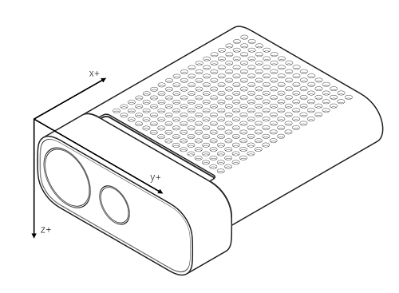

# Azure Kinect DK coordinate systems

In this article, we describe conventions used for 2D and 3D coordinate systems.  There are separate coordinate systems associated with each sensor's device and the [calibration functions](use-calibration-functions.md) allowed to transform points between them. The [transformation functions](use-image-transformation.md) transform entire images between coordinate systems.  

## 2D coordinate systems

 Both depth and color cameras are associated with an independent 2D coordinate system. An [x,y]-coordinate is represented in units of pixels where *x* ranges from 0 to width-1 and *y* ranges from 0 to height-1. Width and height depend on the chosen mode in which depth and color cameras are operated. The pixel coordinate `[0,0]` corresponds to the top-left pixel of the image. Pixel coordinates can be fractional representing subpixel coordinates.

The 2D coordinate system is 0-centered, that is, the subpixel coordinate `[0.0, 0.0]` represents the center and `[0.5,0.5]` the bottom-right corner of the pixel, as shown below.

   

## 3D coordinate systems

Each camera, the accelerometer, and the gyroscope, are associated with an independent 3D coordinate space system.

Points in the 3D-coordinate systems are represented as metric [X,Y,Z]-coordinate triplets with units in millimeters.

### Depth and color camera

The origin `[0,0,0]` is located at the focal point of the camera. The coordinate system is oriented such that the positive X-axis points right, the positive Y-axis points down, and the positive Z-axis points forward.

The depth camera is tilted 6 degrees downwards of the color camera, as shown below. 

There are two illuminators used by the depth camera. The illuminator used in narrow field-of-view (NFOV) modes is aligned with the depth camera case, so, the illuminator is not tilted. The illuminator used in wide field-of-view (WFOV) modes is tilted an additional 1.3 degrees downward relative to the depth camera.

### Gyroscope and accelerometer

The gyroscope's origin `[0,0,0]` is identical to the origin of the depth camera. The origin of the accelerometer coincides with its physical location. Both the accelerometer and gyroscope  coordinate systems are right-handed. The coordinate system's positive X-axis points backward, the positive Y-axis points left, and the positive Z-axis points down, as shown below.

## Next Steps

[Learn about Azure Kinect Sensor SDK](about-sensor-sdk.md)