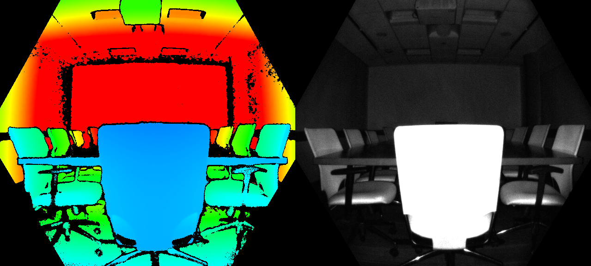
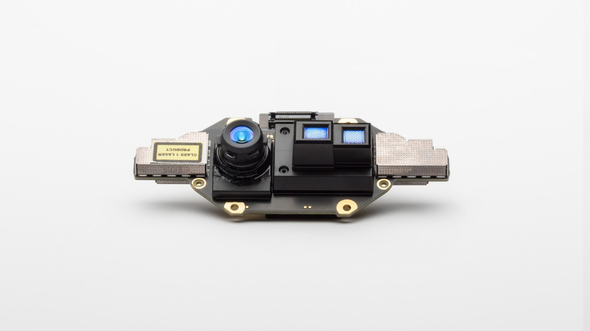
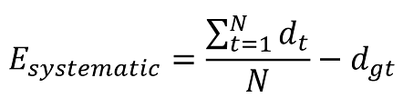
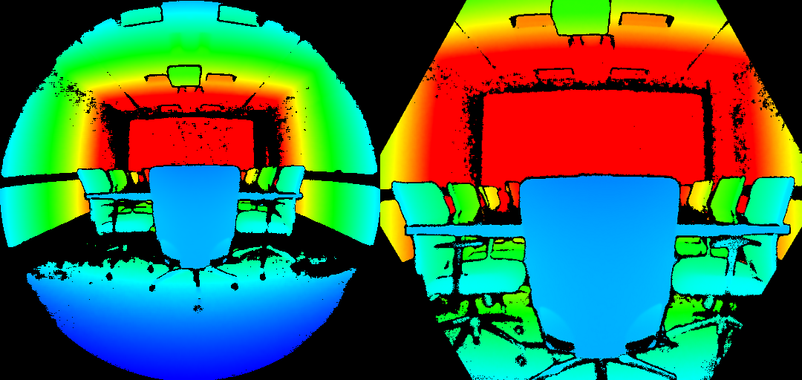
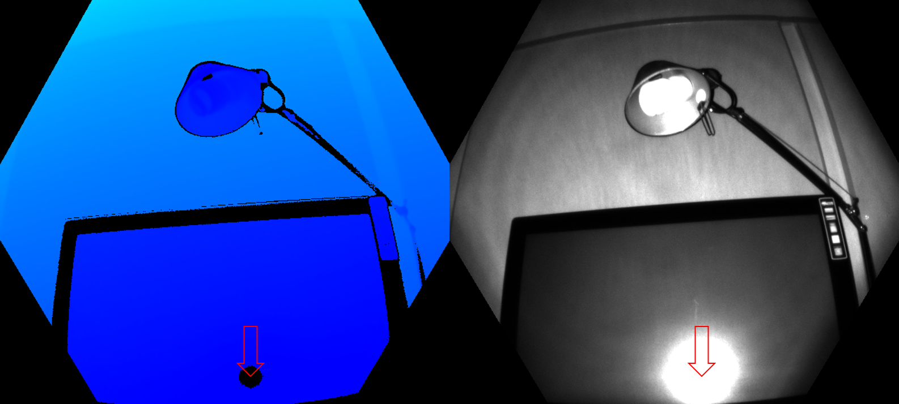
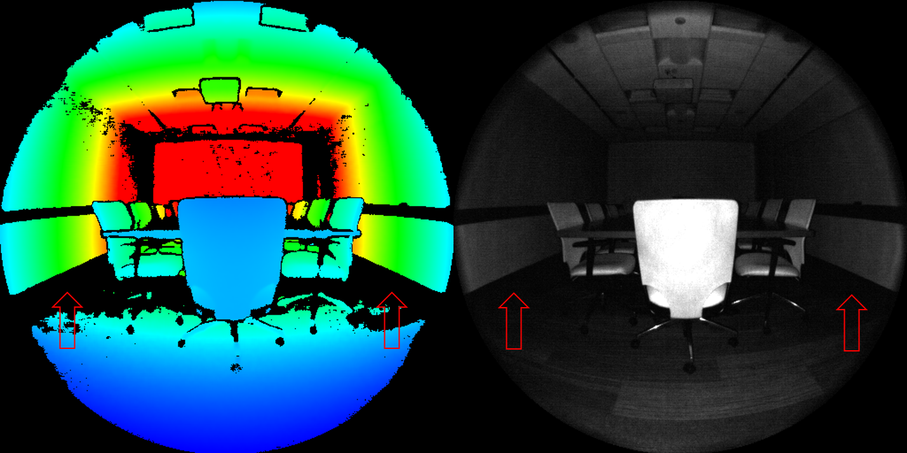
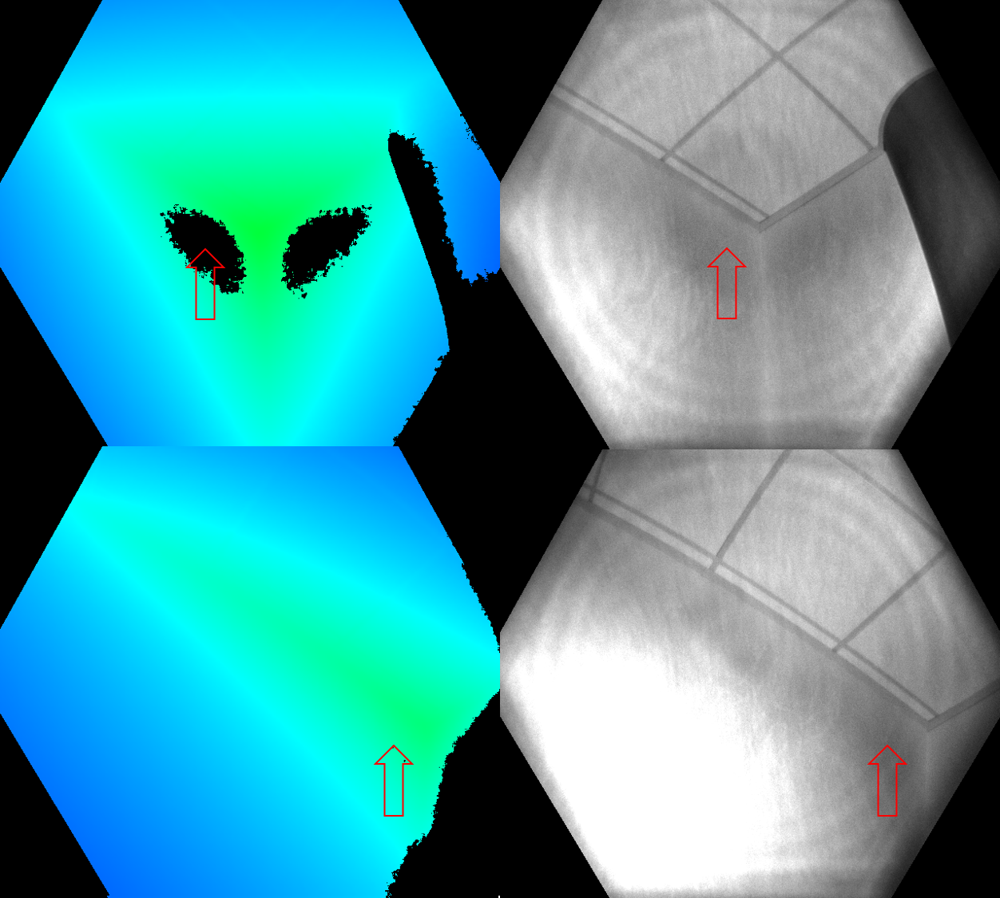
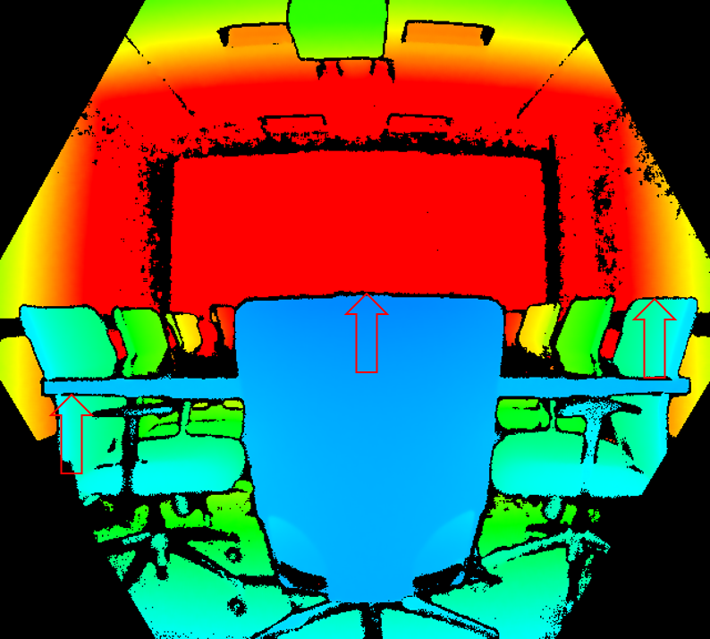

# Azure Kinect DK depth camera

This page covers how to use the depth camera in your Azure Kinect DK. The depth camera is the second of the two cameras. As covered in previous sections, the other camera is the RGB camera.  

## Operating principles

The Azure Kinect DK depth camera implements the Amplitude Modulated Continuous Wave (AMCW) Time-of-Flight (ToF) principle. The camera casts modulated illumination in the near-IR (NIR) spectrum onto the scene. It then records an indirect measurement of the time it takes the light to travel from the camera to the scene and back.

These measurements are processed to generate a depth map. A depth map is a set of Z-coordinate values for every pixel of the image, measured in units of millimeters.

Along with a depth map, we also obtain a so-called clean IR reading. The value of pixels in the clean IR reading is proportional to the amount of light returned from the scene. The image looks similar to a regular IR image. The figure below shows an example depth map (left) and a corresponding clean IR image (right).

## Key features

Technical characteristics of the depth camera include:

- 1-Megapixel ToF imaging chip with advanced pixel technology enabling higher modulation frequencies and depth precision.
- Two NIR Laser diodes enabling near and wide field-of-view (FoV) depth modes.
- The world’s smallest ToF pixel, at 3.5μm by 3.5μm.
- Automatic per pixel gain selection enabling large dynamic range allowing near and far objects to be captured cleanly.
- Global shutter that allows for improved performance in sunlight.
- Multi-phase depth calculation method that enables robust accuracy even in the presence of chip, laser, and power supply variation.
- Low systematic and random errors.

The depth camera transmits raw modulated IR images to the host PC. On the PC, the GPU accelerated depth engine software converts the raw signal into depth maps. The depth camera supports several modes. The **narrow field of view (FoV)** modes are ideal for scenes with smaller extents in X- and Y-dimensions, but larger extents in the Z-dimension. If the scene has large X- and Y-extents, but smaller Z-ranges, the **wide FoV modes** are better suited.

The depth camera supports **2x2 binning modes** to extend the Z-range in comparison to the corresponding **unbinned modes**. Binning is done at the cost of lowering image resolution. All modes can be run at up to 30 frames-per-second (fps) with exception of the 1 megapixel (MP) mode that runs at a maximum frame rate of 15 fps. The depth camera also provides a **passive IR mode**. In this mode, the illuminators on the camera aren't active and only ambient illumination is observed.

## Camera performance

The camera’s performance is measured as systematic and random errors.

### Systematic Error

Systematic error is defined as the difference between the measured depth after noise removal and the correct (ground truth) depth. We compute the temporal average over many frames of a static scene to eliminate depth noise as much as possible. More precisely, the systematic error is defined as:

Where *dt* denotes the measure depth at time *t*, *N* is the number of frames used in the averaging procedure and *dgt* is the ground truth depth.

The depth camera’s systematic error specification is excluding multi-path interference (MPI). MPI is when one sensor pixel integrates light that's reflected by more than one object. MPI is partly mitigated in our depth camera using higher modulation frequencies, along with the depth invalidation, which we'll introduce later.

### Random error

Let's assume we take 100 images of the same object without moving the camera. The depth of the object will be slightly different in each of the 100 images. This difference is caused by shot noise. Shot noise is the number of photons hitting the sensor varies by a random factor over time. We define this random error on a static scene as the standard deviation of depth over time computed as:

Where *N* denotes the number of depth measurements, *dt* represents the depth measurement at time *t* and *d* denotes the mean value computed over all depth measurements *dt*.

## Invalidation

In certain situations, the depth camera may not provide correct values for some pixels. In these situations depth pixels are invalidated. Invalid pixels are indicated by the depth value equals to 0. Reasons for the depth engine being unable to produce correct values include:

- Outside of active IR illumination mask
- Saturated IR signal
- Low IR signal
- Filter outlier
- Multi-path interference

### Illumination Mask

Pixels are invalidated when they're outside of the active IR illumination mask. We don't recommend using the signal of such pixels to compute depth. The figure below, shows the example of invalidation by illumination mask. The invalidated pixels are the black-color pixels outside the circle in the wide FoV modes (left), and the hexagon in the narrow FoV modes (right).

### Signal strength

Pixels are invalidated when they contain a saturated IR signal. When pixels are saturated,  phase information is lost. The image below, shows the example of invalidation by a saturated IR signal. See arrows pointed to the example pixels in both the depth and IR images.

Invalidation can also occur when the IR signal isn't strong enough to generate depth. The below figure, shows the example of invalidation by a low IR signal. See the arrows pointed to example pixels in both the depth and IR images.

### Ambiguous depth

Pixels can also be invalidated if they received signals from more than one object in the scene. A common case where this sort of invalidation can be seen is in corners.  Because of the scene geometry, the IR light from the camera reflected off one wall and onto the other. This reflected light causes ambiguity in the measured depth of the pixel. Filters in the depth algorithm detect these ambiguous signals and invalidate the pixels.

The figures below show examples of invalidation by multi-path detection. You also can see how the same surface area that was invalidated from one camera view (top row) may appear again from a different camera view (bottom row). This image demonstrates that surfaces invalidated from one perspective may be visible from another.

Another common case of multipath is pixels that contain the mixed signal from foreground and background (such as around object edges). During fast motion, you may see more invalidated pixels around the edges. The additional invalidated pixels are because of the exposure interval of the raw depth capture,

## Next steps

[Coordinate systems](coordinate-systems.md)
