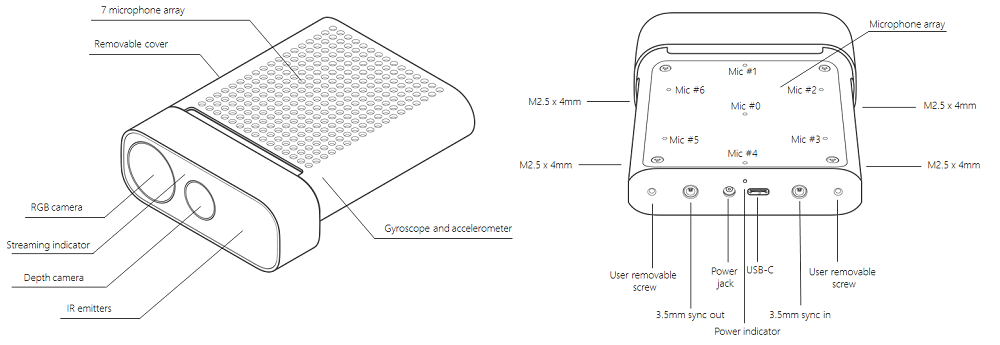
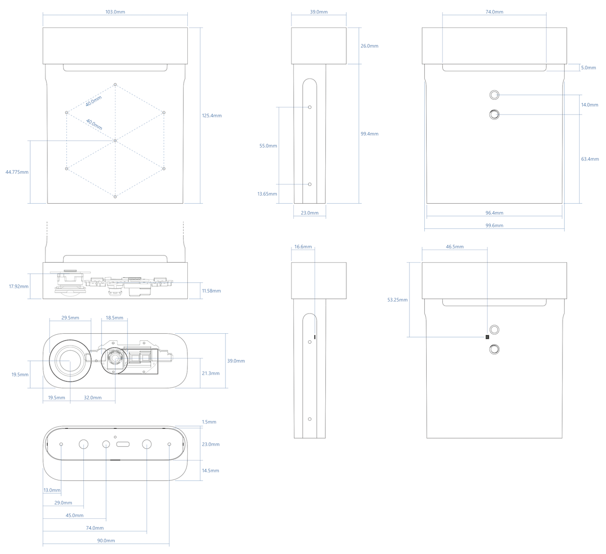
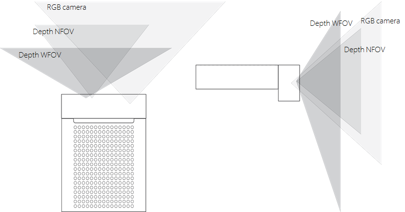
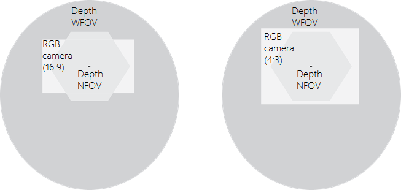
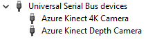
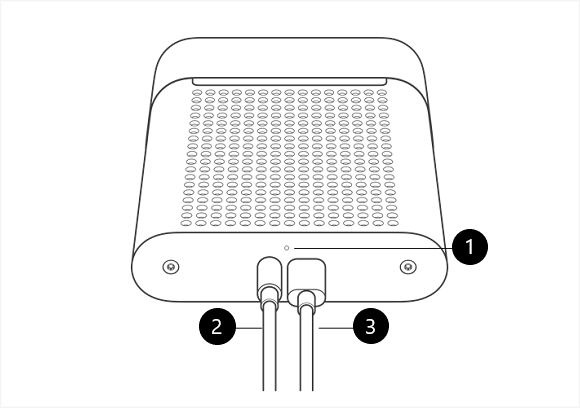
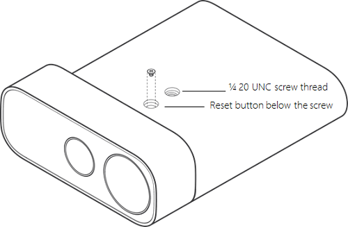

# Azure Kinect DK hardware specifications

This article provides details about how Azure Kinect hardware integrates Microsoft's latest sensor technology into a single, USB-connected accessory.

## Terms

These abbreviated terms are used throughout this article.

- NFOV (Narrow field-of-view depth mode)
- WFOV (Wide field-of-view depth mode)
- FOV (Field-of-view)
- FPS (Frames-per-second)
- IMU (Inertial Measurement Unit)
- FoI (Field of Interest)

## Product dimensions and weight

The Azure Kinect device consists of the following size and weight dimensions.

- **Dimensions**: 103 x 39 x 126 mm
- **Weight**: 440 g

## Operating environment

Azure Kinect DK is intended for developers and commercial businesses operating under the following ambient conditions:

- **Temperature**: 10-250C
- **Humidity**: 8-90% (non-condensing) Relative Humidity

> [!NOTE]
> Use outside of the ambient conditions could cause the device to fail and/or function incorrectly. These ambient conditions are applicable for the environment immediately around the device under all operational conditions. When used with an external enclosure, active temperature control and/or other cooling solutions are recommended to ensure the device is maintained within these ranges. The device design features a cooling channel in between the front section and rear sleeve. When you implement the device, make sure this cooling channel is not obstructed.

Refer to additional product [safety information](https://support.microsoft.com/help/4023454/safety-information).

## Depth camera supported operating modes

Azure Kinect DK integrates a Microsoft designed 1-Megapixel Time-of-Flight (ToF) depth camera using the [image sensor presented at ISSCC 2018](https://docs.microsoft.com/windows/mixed-reality/ISSCC-2018). The depth camera supports the modes indicated below:

 | Mode            | Resolution | FoI       | FPS                | Operating range* | Exposure time |
|-----------------|------------|-----------|--------------------|------------------|---------------|
| NFOV unbinned   | 640x576    | 75°x65°   | 0, 5, 15, 30       | 0.5 - 3.86 m       | 12.8 ms        |
| NFOV 2x2 binned (SW) | 320x288    | 75°x65°   | 0, 5, 15, 30       | 0.5 - 5.46 m       | 12.8 ms        |
| WFOV 2x2 binned | 512x512    | 120°x120° | 0, 5, 15, 30       | 0.25 - 2.88 m      | 12.8 ms        |
| WFOV unbinned   | 1024x1024  | 120°x120° | 0, 5, 15           | 0.25 - 2.21 m      | 20.3 ms        |
| Passive IR      | 1024x1024  | N/A       | 0, 5, 15, 30       | N/A              | 1.6 ms         |

\*15% to 95% reflectivity at 850nm, 2.2 μW/cm2/nm, random error std. dev. ≤ 17 mm, typical systematic error < 11 mm + 0.1% of distance without multi-path interference. Depth may be provided outside of the operating range indicated above. It depends on an object's reflectivity.

## Color camera supported operating modes

Azure Kinect DK includes an OV12A10 12MP CMOS sensor rolling shutter sensor. The native operating modes are listed below:

|             RGB Camera Resolution (HxV)  |          Aspect Ratio  |          Format Options   |          Frame Rates (FPS)  |          Nominal FOV (HxV)(post-processed)  |
|------------------------------------------|------------------------|---------------------------|-----------------------------|---------------------------------------------|
|       3840x2160                          |          16:9          |          MJPEG            |          0, 5, 15, 30       |          90°x59°                              |
|       2560x1440                          |          16:9          |          MJPEG            |          0, 5, 15, 30       |          90°x59°                              |
|       1920x1080                          |          16:9          |          MJPEG            |          0, 5, 15, 30       |          90°x59°                              |
|       1280x720                           |          16:9          |          MJPEG/YUY2/NV12  |          0, 5, 15, 30       |          90°x59°                              |
|       4096x3072                          |          4:3           |          MJPEG             |          0, 5, 15           |          90°x74.3°                            |
|       2048x1536                          |          4:3           |          MJPEG             |          0, 5, 15, 30       |          90°x74.3°                            |

The RGB camera is USB Video class-compatible and can be used without the Sensor SDK. The RGB camera color space: BT.601 full range [0..255]. 

> [!NOTE]
> The Sensor SDK can provide color images in the BGRA pixel format. This is not a native mode supported by the device and causes additional CPU load when used. The host CPU is used to convert from MJPEG images received from the device.

## RGB camera exposure time values

Below is the mapping for the acceptable RGB camera manual exposure values:

| exp| 2^exp | 50Hz   |60Hz    |
|----|-------|--------|--------|
| -11|     488|    500|    500 |
| -10|     977|   1250|   1250 |
|  -9|    1953|   2500|   2500 |
|  -8|    3906|  10000|   8330 |
|  -7|    7813|  20000|  16670 |
|  -6|   15625|  30000|  33330 |
|  -5|   31250|  40000|  41670 |
|  -4|   62500|  50000|  50000 |
|  -3|  125000|  60000|  66670 |
|  -2|  250000|  80000|  83330 |
|  -1|  500000| 100000| 100000 |
|   0| 1000000| 120000| 116670 |
|   1| 2000000| 130000| 133330 |

## Depth sensor raw timing

Depth Mode | IR  Pulses | Pulse  Width  | Idle  Periods| Idle Time | Exposure   Time
-|-|-|-|-|-
NFOV Unbinned    NFOV 2xx Binned   WFOV 2x2 Binned | 9 | 125 us | 8 | 1450 us | 12.8 ms 
WFOV Unbinned                                            | 9 | 125 us | 8 | 2390 us | 20.3 ms

## Camera field of view

The next image shows the depth and RGB camera field-of-view, or the angles that the sensors "see". This diagram shows the RGB camera in a 4:3 mode.

This image demonstrates the camera's field-of-view as seen from the front at a distance of 2000 mm.

> [!NOTE]
> When depth is in NFOV mode, the RGB camera has better pixel overlap in 4:3 than 16:9 resolutions.

## Motion sensor (IMU)

The embedded Inertial Measurement Unit (IMU) is an LSM6DSMUS and includes both an accelerometer and a gyroscope. The accelerometer and gyroscope are simultaneously sampled at 1.6 kHz. The samples are reported to the host at a 208 Hz.

## Microphone array

Azure Kinect DK embeds a high-quality, seven microphone circular array that identifies as a standard USB audio class 2.0 device. All 7 channels can be accessed. The performance specifications are:

- Sensitivity: -22 dBFS (94 dB SPL, 1 kHz)
- Signal to noise ratio > 65 dB
- Acoustic overload point: 116 dB

## USB

Azure Kinect DK is a USB3 composite device that exposes the following hardware endpoints to the operating system:

Vendor ID is 0x045E (Microsoft). Product ID table is shown below:

|    USB Interface        |    PNP IP    |     Notes            |
|-------------------------|--------------|----------------------|
|    USB3.1 Gen1 Hub    |    0x097A    |    The   main hub    |
|    USB2.0 Hub         |    0x097B    |    HS   USB          |
|    Depth camera       |    0x097C    |    USB3.0            |
|    Color camera       |    0x097D    |    USB3.0            |
|    Microphones        |    0x097E    |    HS   USB          |

## Indicators

The device has a camera streaming indicator on the front of the device that can be disabled programmatically using the Sensor SDK.

The status LED behind the device indicates device state:

| When the light is     | It means                                                   |
|-----------------------|------------------------------------------------------------|
| Solid white           | Device is on and working properly.                         |
| Flashing white        | Device is on but doesn't have a USB 3.0 data connection.   |
| Flashing amber        | Device doesn't have enough power to operate.               |
| Amber flashing white  | Firmware update or recovery in progress                    |

## Power device

The device can be powered in two ways:

1. Using the in-box power supply. The power connector is a 4.5mm OD with 3.0mm ID and a pin diameter of 0.6mm.
2. Using a Type-C to Type-C cable for both power and data.

A Type-C to Type-C cable isn't included with the Azure Kinect DK.

> [!NOTE]
> - The in-box power supply cable is a USB Type-A to single post barrel connector. Use the provided wall-power supply with this cable. The device is capable of drawing more power than two standard USB Type-A ports can provide.
> - USB cables do matter and we recommended to use high-quality cables and verify functionality before deploying the unit remotely.

> [!TIP]
> To select a good Type-C to Type-C cable:
> - The [USB certified cable](https://www.usb.org/products) must support both power and data.
> - A passive cable should be less than 1.5m in length. If longer, use an active cable. 
> - The cable needs to support at least 1.5A. Otherwise you need to connect an external power supply.

Verify cable:

- Connect device via the cable to the host PC.
- Validate that all devices enumerate correctly in Windows device manager. Depth and RGB camera should appear as shown in the example below.

  

- Validate that cable can stream reliably on all sensors in the Azure Kinect Viewer, with the  following settings:

  - Depth camera: NFOV unbinned
  - RGB Camera: 2160p
  - Microphones and IMU enabled

## What does the light mean?

The power indicator is an LED on the back of your Azure Kinect DK. The color of the LED changes depending on the status of your device.

This figure labels the following components:

1. Power indicator
1. Power cable (connected to the power source)
1. USB-C data cable (connected to the PC)

Make sure that the cables are connected as shown. Then check the following table to learn what the various states of the power light indicate.

|When the light is: |It means that: |And you should: |
| ---| --- | --- |
|Solid white |The device is powered on and working correctly. |Use the device. |
|Not lit |The device is not connected to the PC. |Make sure that the round power connector cable is connected to the device and to the USB power adapter.  Make sure that the USB-C cable is connected to the device and to your PC. |
|Flashing white |The device is powered on but doesn't have a USB 3.0 data connection. |Make sure that the round power connector cable is connected to the device and to the USB power adapter.  Make sure that the USB-C cable is connected to the device and to a USB 3.0 port on your PC.  Connect the device to a different USB 3.0 port on the PC.  On your PC, open Device Manager (**Start** > **Control Panel** > **Device Manager**), and verify that your PC has a supported USB 3.0 host controller. |
|Flashing amber |The device doesn't have enough power to operate. |Make sure that the round power connector cable is connected to the device and to the USB power adapter.  Make sure that the USB-C cable is connected to the device and to your PC. |
|Amber, then flashing white |The device is powered on and is receiving a firmware update, or the device is restoring the factory settings. |Wait for the power indicator light to become solid white. For more information, see [Reset Azure Kinect DK](reset-azure-kinect-dk.md). |

## Power consumption

Azure Kinect DK consumes up to 5.9 W; specific power consumption is use-case dependent.

## Calibration

Azure Kinect DK is calibrated at the factory. The calibration parameters for visual and inertial sensors may be queried programmatically through the Sensor SDK.

## Device recovery

Device firmware can be reset to original firmware using button underneath the lock pin.

To recover the device, see [instructions here](reset-azure-kinect-dk.md).

## Next steps

- [Use Azure Kinect Sensor SDK](about-sensor-sdk.md)
- [Set up hardware](set-up-azure-kinect-dk.md)
