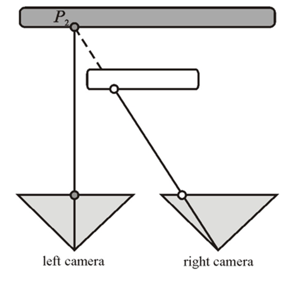
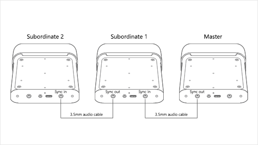
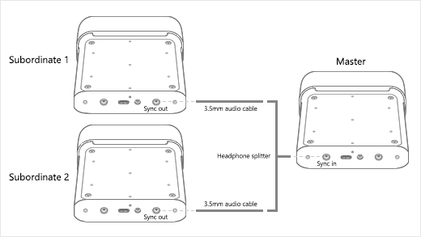
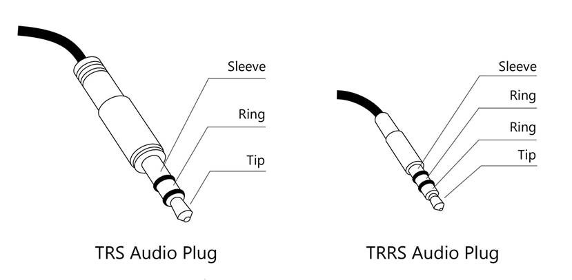
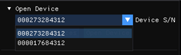
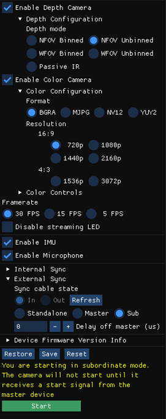

# Synchronize multiple Azure Kinect DK devices

Each Azure Kinect DK device includes 3.5-mm synchronization ports (**Sync in** and **Sync out**) that you can use to link multiple units together. When linked, your software can coordinate the trigger timing of multiple depth cameras and RGB cameras. 

This article introduces some of the benefits of synchronizing multiple devices, and provides instructions for how to connect the devices.

## Why use multiple Azure Kinect DK devices?

There are many reasons to use multiple Azure Kinect DK devices. Examples include the following:

- Fill in occlusions. An occlusion occurs when a foreground object blocks the view of part of a background object for one of the two cameras. In the resulting color image, the foreground object appears to cast a shadow on the background object. Although the Azure Kinect DK data transformations produce a single image, the two cameras (Depth and RGB) are actually a small distance apart. The offset makes occlusions possible.  
   For example, in the following diagram, the left camera sees the grey pixel "P2." However, the white foreground object blocks the right camera IR beam. The right camera has no data for "P2."  
     
   Additional synchronized devices can fill in the occluded data.
- Scan objects in three dimensions.
- Increase the effective frame rate to something higher than 30 frames per second (FPS).
- Capture multiple 4K color images of the same scene, all aligned within 100 microseconds (&mu;s) of the start of exposure.
- Increase camera coverage within the space.

## Plan your multi-device configuration

Before you start, make sure to review [Azure Kinect DK Hardware specification](hardware-specification.md) and [Azure Kinect DK depth camera](depth-camera.md).

### Select a device configuration

You can use two different approaches for your device configuration:

- **Daisy-chain configuration**. Synchronize one master device and up to eight subordinate devices.  
   
- **Star configuration**. Synchronize one master device with up to two subordinate devices.  
   

#### Using an external sync trigger

In both of the configurations described previously, the master device provides the triggering signal for the subordinate devices. However, you can use a custom external source for the synchronization trigger. For example, you can use this option to synchronize image captures with other equipment. In either the daisy-chain configuration or the star configuration, the external trigger source connects to the master device.

Your external trigger source must function in the same manner as the master device: it must deliver a sync signal that has the following characteristics:

- Active high
- Pulse width: greater than 8&mu;s
- 5V TTL/CMOS
- Maximum driving capacity: no less than 8 milliamps (mA)
- Frequency support: precisely 30 FPS, 15 FPS, and 5 FPS (the frequency of the color camera master VSYNC signal)

The trigger source must deliver the signal to the master device **Sync in** port by using a 3.5-mm audio cable. You can use a stereo or mono cable. The Azure Kinect DK shorts all of the sleeves and rings of the audio cable connector together, and grounds them. As shown in the following diagram, the device receives the sync signal from the connector tip only.



For more information about working with external equipment, see [Use Azure Kinect recorder with external synchronized devices](record-external-synchronized-units.md)

### Plan your camera settings and software configuration

For information about how to set up your software to control the cameras and use the image data, see the [Azure Kinect Sensor SDK](about-sensor-sdk.md).

This section addresses several factors that affect synchronized devices (but not single devices). Your software should take these factors into account.

#### Exposure considerations
If you want to control the precise timing of each device, we recommend that you use a manual exposure setting. Under the automatic exposure setting, each color camera can dynamically change the actual exposure. Because the exposure affects the timing, such changes quickly push the cameras out of sync.

In the image capture loop, avoid repeatedly setting the same exposure setting. When needed, just call the API once.

#### Timestamp considerations
Devices that are acting in master or subordinate roles report image timestamps in terms of *Start of Frame* instead of *Center of Frame*.

#### Avoiding interference between multiple depth cameras

When multiple depth cameras image overlapping fields of view, each camera must image its own associated laser. To prevent the lasers from interfering with each other, the camera captures should be offset from one another by 160μs or more.

For each depth camera capture, the laser turns on nine times and is active for only 125&mu;s each time. The laser is then idle for either 14505&mu;s or 23905&mu;s, depending on the mode of operation. This behavior means that the starting point for the offset calculation is 125&mu;s.

Additionally, difference between the camera clock and the device firmware clock increase the minimum offset to 160&mu;s. To calculate a more precise offset for your configuration, note the depth mode that you are using and refer to the [depth sensor raw timing table](hardware-specification.md#depth-sensor-raw-timing). Using the data from this table, you can calculate the minimum offset (the exposure time of each camera) by using the following equation:

> *Exposure Time* = (*IR Pulses* &times; *Pulse Width*) + (*Idle Periods* &times; *Idle Time*)

When you use an offset of 160&mu;s, you can configure up to nine additional depth cameras so that each laser fires while the other lasers are idle.

In your software, use ```depth_delay_off_color_usec``` or ```subordinate_delay_off_master_usec``` to make sure that each IR laser fires in its own 160&mu;s window or has a different field of view.

## Prepare your devices and other hardware

In addition to multiple Azure Kinect DK devices, you may have to obtain additional host computers and other hardware in order to support the configuration you want to build. Use the information in this section to make sure that all of your devices and hardware are ready before you begin setting up.

### Azure Kinect DK devices

For each of the Azure Kinect DK devices that you want to synchronize, do the following:

- Ensure that the latest firmware is installed on the device. For more info about updating your devices, go to [Update Azure Kinect DK firmware](update-device-firmware.md). 
- Remove the device cover to reveal the sync ports.
- Note the serial number for each device. You will use this number later in the setup process.

### Host computers

Typically, each Azure Kinect DK uses its own host computer. You can use a dedicated host controller, depending on how you're using the device and the amount of data being transferred over USB. 

Make sure that the Azure Kinect Sensor SDK is installed on each host computer. For more info on installing the Sensor SDK, go to [Quickstart: Set up your Azure Kinect DK](set-up-azure-kinect-dk.md). 

#### Linux computers: USB memory on Ubuntu

By default, Linux-based host computers allocate the USB controller only 16 MB of kernel memory for handling USB transfers. This amount is typically enough to support a single Azure Kinect DK. However, to support multiple devices, the USB controller has to have more memory. To increase the memory, follow these steps:

1. Edit /**etc/default/grub**.
1. Replace the following line:
   ```cmd
   GRUB_CMDLINE_LINUX_DEFAULT="quiet splash"
   ```
   with this line:
   ```cmd
   GRUB_CMDLINE_LINUX_DEFAULT="quiet splash usbcore.usbfs_memory_mb=32"
   ```
   These commands set the USB memory to 32 MB. This value is twice the default value. You can set a much larger value. Use a value that is right for your solution.
1. Run **sudo update-grub**.
1. Restart the computer.

### Cables

To connect the devices to each other and to the host computers, you need 3.5-mm male-to-male cables (also known as 3.5-mm audio cable). The cables should be less than 10 meters long, and may be stereo or mono.

The number of cables that you need depends on the number of devices that you are using as well as the specific device configuration. The Azure Kinect DK box does not include cables&mdash;you must purchase them separately.

If you're connecting the devices in the star configuration, you also need one headphone splitter.

## Connect your devices

**To connect Azure Kinect DK devices in a daisy chain configuration**

1. Connect each Azure Kinect DK to power.
1. Connect each device to its host PC. 
1. Select one device to be the master device, and plug a 3.5-mm audio cable into its **Sync out** port.
1. Plug the other end of the cable into the **Sync in** port of the first subordinate device.
1. To connect another device, plug another cable into the **Sync out** port of the first subordinate device, and plug the other end of that cable into the **Sync in** port of the next device.
1. Repeat the previous step until all of the devices are connected. The last device should have one cable plugged into its **Sync in** port, and its **Sync out** port should be empty.

**To connect Azure Kinect DK devices in a star configuration**

1. Connect each Azure Kinect DK to power.
1. Connect each device to its host PC. 
1. Select one device to be the master device, and plug the single end of the headphone splitter into its **Sync out** port.
1. Connect 3.5-mm audio cables to the "split" ends of the headphone splitter.
1. Plug the other end of each cable into the **Sync in** port of one of the subordinate devices.

## Verify that the devices are connected and communicating

To verify that the devices are connected correctly, use [Azure Kinect Viewer](azure-kinect-viewer.md). Repeat this procedure as needed to test each subordinate device in combination with the master device

> [!IMPORTANT]  
> For this procedure, you need the serial number of each Azure Kinect DK.

1. Open two instances of Azure Kinect Viewer.
1. Under **Open Device**, select the serial number of the subordinate device that you want to test.  
   
   > [!IMPORTANT]  
   > To get precise image capture alignment between all devices, you have to start the master device last.  
1. Under **External Sync**, select **Sub**.  
   
1.  Select **Start**.  
    > [!NOTE]  
    > Because this is a subordinate device, Azure Kinect Viewer does not display an image after the device starts. No image is displayed until the subordinate device receives a sync signal from the master device.
1. After the subordinate device has started, use the other instance of Azure Kinect Viewer to open the master device.
1. Under **External Sync**, select **Master**.
1. Select **Start**.

When the master Azure Kinect Device starts, both instances of Azure Kinect Viewer should display images.

## Calibrate the devices as a synchronized set

When you have verified that the devices are communicating correctly, you are ready to calibrate them to produce images in a single domain.

In a single device, the depth and RGB cameras are factory calibrated to work together. However, when multiple devices have to work together, they need to be calibrated in order to determine how to transform an image from the domain of the camera that captured it to the domain of the camera you want to use to process images.

There are multiple options for cross-calibrating devices. Microsoft provides the [GitHub green screen code sample](https://github.com/microsoft/Azure-Kinect-Sensor-SDK/tree/develop/examples/green_screen), which uses the OpenCV method. The Readme file for this code sample provides more details and instructions for calibrating the devices.

For more general information about calibration, see [Use Azure Kinect calibration functions](use-calibration-functions.md).

## Next steps

After you have set up synchronized devices, you can also learn how to use the
> [!div class="nextstepaction"]
> [Azure Kinect sensor SDK record and playback API](record-playback-api.md)

## Related topics

- [About Azure Kinect Sensor SDK](about-sensor-sdk.md)
- [Azure Kinect DK hardware specifications](hardware-specification.md) 
- [Quickstart: Set up your Azure Kinect DK](set-up-azure-kinect-dk.md) 
- [Update Azure Kinect DK firmware](update-device-firmware.md) 
- [Reset Azure Kinect DK](reset-azure-kinect-dk.md) 
- [Azure Kinect Viewer](azure-kinect-viewer.md) 
