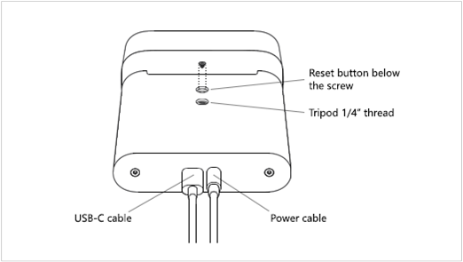

# Reset Azure Kinect DK

You may encounter a situation in which you have to reset your Azure Kinect DK back to its factory image (for example, if a firmware update didn't install correctly).

1. Power off your Azure Kinect DK. To do this, remove the USB cable and power cable.
  
1. To find the reset button, remove the screw that's located in the tripod mount lock.
1. Reconnect the power cable.
1. Insert the tip of a straightened paperclip into the empty screw hole, in the tripod mount lock.
1. Use the paperclip to gently press and hold the reset button.
1. While you hold the reset button, reconnect the USB cable.
1. After about 3 seconds, the power indicator light changes to amber. After the light changes, release the reset button.  
   
   After you release the reset button, the power indicator light blinks white and amber while the device resets. 
1. Wait for the power indicator light to become solid white.
1. Replace the screw in the tripod mount lock, over the reset button.
1. Use Azure Kinect Viewer to verify that the firmware was reset. To do this, launch the [Azure Kinect Viewer](azure-kinect-viewer.md), and then select **Device firmware version info** to see the firmware version that is installed on your Azure Kinect DK.

Always make sure that you have the latest firmware installed on the device. To get the latest firmware version, use the Azure Kinect Firmware Tool. For more information about how to check your firmware status, see [Check device firmware version](azure-kinect-firmware-tool.md#check-device-firmware-version).

## Related topics

- [About Azure Kinect DK](about-azure-kinect-dk.md)
- [Set up Azure Kinect DK](set-up-azure-kinect-dk.md)
- [Azure Kinect DK hardware specifications: Operating environment](hardware-specification.md#operating-environment)
- [Azure Kinect Firmware Tool](azure-kinect-firmware-tool.md)
- [Azure Kinect Viewer](azure-kinect-viewer.md)
- [Synchronization across multiple Azure Kinect DK devices](multi-camera-sync.md)
