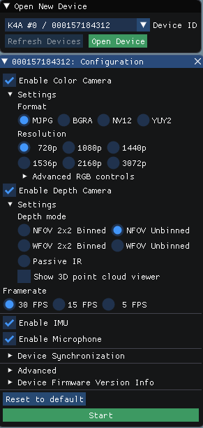

---
title: Set up hardware
description: Setup Azure Kinect DK hardware
author: joylital
ms.author: joylital
ms.date: 10/02/2018
keywords: kinect, azure, setup, hardware, quick, usb, power, viewer, sensor, streaming
---

# Set up Azure Kinect DK

This page will guide you getting Azure Kinect DK setup and testing sensor stream visualization using Azure Kinect Viewer.

>[!NOTE]
>Viewer is currently under active development and UI being refreshed therefore these pages may not accurately represent the latest software

## System requirements

Check [system requirements](system-requirements.md) to verify your host PC configuration meets Azure Kinect DK minimum requirements.

## Setup hardware

1. Connect power cable to device and power supply to wall outlet
2. Connect USB data cable to device and to PC (Note! Using connectors close to PC motherboard, e.g. back of the device can work better than ones on top of PC)
3. Verify that status LED next to USB cable is solid white
4. Device power on takes few seconds and it is ready to use when streaming indicator LED on front turns off



## Download SDK

5. Download SDK from here: [Download the SDK](download-sdk.md)
6. Unzip SDK on your PC

## Verify device streams data

7. Launch ```K4A Viewer.exe``` located under tools -directory (e.g. ```\tools\amd64\release\K4AViewer.exe```). You can launch it both command line or by double-clicking the executable.
8. For Windows Defender warning, click ***more info*** and ***Run anyway*** to application launched



9. Select Open Device and then Start

    

10. Verify that all device sensors stream data (Depth, RGB, IMU and microphones) and that get visualized in tool

    

11. **Done!**

Your setup is now working correctly and you are good to start developing your application or integrating services.
See [here](index.md) what you can do next! 

>[!TIP]
>If not already done, reminder to [update to latest device firmware](AzureKinect-FW-Update.md) before starting a project 

If you have any issues, check [troubleshooting](troubleshooting.md)

## Next steps
* See [code samples](https://microsoft.visualstudio.com/DefaultCollection/Analog/_git/analog.ai.depthcamera?path=%2Fsdk%2Fexamples&version=GBdevelop) and develop your first application (**Coming later!**)
* Try [recording sensor stream to file](k4a-recordplayback.md) and open up with video player

## See also
* [Azure Kinect Homepage](index.md)
* [Azure Kinect DK hardware information](azure-kinect-devkit.md)
* Learn more about [Kinect for Azure viewer](k4a-viewer.md)
* [Update device firmware](AzureKinect-FW-Update.md)
