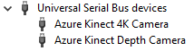
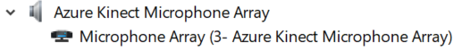
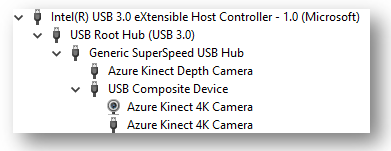

# Azure Kinect known issues and troubleshooting

This page contains known issues and troubleshooting tips when using Sensor SDK with Azure Kinect DK. See also [product support pages](./index.yml) for product hardware- specific issues.

## Known issues

- Compatibility issues with ASMedia USB host controllers (for example, ASM1142 chipset)
  - Some cases using Microsoft USB driver can unblock
  - Many PCs have also alternative host controllers and changing the USB3 port may help

For more Sensor SDK-related issues, check [GitHub Issues](https://github.com/Microsoft/Azure-Kinect-Sensor-SDK/issues)

## Collecting logs

Logging for K4A.dll is enabled through environment variables. By default logging is sent to stdout and only errors and critical messages are generated. These settings can be altered
so that logging goes to a file. The verbosity can also be adjusted as needed. Below is an example, for Windows, of enabling logging to a file, named k4a.log, and will capture warning
and higher-level messages.

1. `set K4A_ENABLE_LOG_TO_A_FILE=k4a.log`
2. `set K4A_LOG_LEVEL=w`
3. Run scenario from command prompt (for example, launch viewer)
4. Navigate to k4a.log and share file.

For more information, see below clip from header file:

```console
/**
* environment variables
* K4A_ENABLE_LOG_TO_A_FILE =
*    0    - completely disable logging to a file
*    log\custom.log - log all messages to the path and file specified - must end in '.log' to
*                     be considered a valid entry
*    ** When enabled this takes precedence over the value of K4A_ENABLE_LOG_TO_STDOUT
*
* K4A_ENABLE_LOG_TO_STDOUT =
*    0    - disable logging to stdout
*    all else  - log all messages to stdout
*
* K4A_LOG_LEVEL =
*    'c'  - log all messages of level 'critical' criticality
*    'e'  - log all messages of level 'error' or higher criticality
*    'w'  - log all messages of level 'warning' or higher criticality
*    'i'  - log all messages of level 'info' or higher criticality
*    't'  - log all messages of level 'trace' or higher criticality
*    DEFAULT - log all message of level 'error' or higher criticality
*/
```

Logging for the Body Tracking SDK K4ABT.dll is similar except that users should modify a different set of environment variable names:

```console
/**
* environment variables
* K4ABT_ENABLE_LOG_TO_A_FILE =
*    0    - completely disable logging to a file
*    log\custom.log - log all messages to the path and file specified - must end in '.log' to
*                     be considered a valid entry
*    ** When enabled this takes precedence over the value of K4A_ENABLE_LOG_TO_STDOUT
*
* K4ABT_ENABLE_LOG_TO_STDOUT =
*    0    - disable logging to stdout
*    all else  - log all messages to stdout
*
* K4ABT_LOG_LEVEL =
*    'c'  - log all messages of level 'critical' criticality
*    'e'  - log all messages of level 'error' or higher criticality
*    'w'  - log all messages of level 'warning' or higher criticality
*    'i'  - log all messages of level 'info' or higher criticality
*    't'  - log all messages of level 'trace' or higher criticality
*    DEFAULT - log all message of level 'error' or higher criticality
*/
```

## Device doesn't enumerate in device manager

- Check the status LED behind the device, if it's blinking amber you have USB connectivity issue and it doesn't get enough power. The power supply cable should be plugged into the
provided power adapter. While the power cable has a USB type A connected, the device requires more power than a PC USB port can supply. So, don't connect to it to a PC port or USB hub.
- Check that you have power cable connected and using USB3 port for data.
- Try changing USB3 port for the data connection (recommendation to use USB port close to motherboard, for example, in back of the PC).
- Check your cable, damaged or lower quality cables may cause unreliable enumeration (device keeps "blinking" in device manager).
- If you have connected to laptop and running on battery, it may be throttling the power to the port.
- Reboot host PC.
- If problem persists, there may be compatibility issue.
- If failure happened during firmware update and device has not recovered by itself, perform [factory reset](https://support.microsoft.com/help/4494277/reset-azure-kinect-dk).

## Azure Kinect Viewer fails to open

- Check first that your device enumerates in Windows Device Manager.

    

- Check if you have any other application using the device (for example, Windows camera application). Only one application at a time can access the device.
- Check k4aviewer.err log for error messages.
- Open Windows camera application and check of that works.
- Power cycle device, wait streaming LED to power off before using the device.
- Reboot host PC.
- Make sure you are using latest graphics drivers on your PC.
- If you are using your own build of SDK, try using officially released version if that fixes the issue.
- If problem persists, [collect logs](troubleshooting.md#collecting-logs) and file feedback.

## Cannot find microphone

- Check first that microphone array is enumerated in Device Manager.
- If a device is enumerated and works otherwise correctly in Windows, the issue may be that after firmware update Windows has assigned different container ID to Depth Camera.
- You can try to reset it by going to Device Manager, right-clicking on "Azure Kinect Microphone Array",  and select "Uninstall device". Once that is complete, detach and reattach the sensor.

    

- After that restart Azure Kinect Viewer and try again.

## Device Firmware update issues

- If correct version number is not reported after update, you may need to power cycle the device.
- If firmware update is interrupted, it may get into bad state and fail to enumerate. Detach and reattach the device and wait 60 seconds to see if it can recover.
If not then perform a [factory reset](https://support.microsoft.com/help/4494277/reset-azure-kinect-dk)

## Image quality issues

- Start [Azure Kinect viewer](azure-kinect-viewer.md) and check positioning of the device for interference or if sensor is blocked or lens is dirty.
- Try different operating modes to narrow down if issue is happening in specific mode.
- For sharing image quality issues with the team you can:

1) Take pause view on [Azure Kinect viewer](azure-kinect-viewer.md) and take a screenshot or
2) Take recording using [Azure Kinect recorder](azure-kinect-recorder.md), for example, `k4arecorder.exe -l 5 -r 5 output.mkv`

## Inconsistent or unexpected device timestamps

Calling ```k4a_device_set_color_control``` can temporarily induce timing changes to the device that may take a few captures to stabilize. Avoid calling the API in the image capture loop to avoid resetting the internal timing calculation with each new image. Instead call the API before the starting the camera or just when needing to change the value within the image capture loop. In particular avoid calling ```k4a_device_set_color_control(K4A_COLOR_CONTROL_AUTO_EXPOSURE_PRIORITY)```.

## USB3 host controller compatibility

If the device is not enumerating under device manager, it may be because it's plugged into an unsupported USB3 controller. 

For the Azure Kinect DK on **Windows, Intel**, **Texas Instruments (TI)**, and **Renesas** are the *only host controllers that are supported*. 
The Azure Kinect SDK on Windows platforms relies on a unified container ID, and it must span USB 2.0 and 3.0 devices so that the SDK can find the depth, color, and audio devices that are physically located on the same device. 
On Linux, more host controllers may be supported as that platform relies less on the container ID and more on device serial numbers. 

The topic of USB host controllers gets even more complicated when a PC has more than one host controller installed. When host controllers are mixed, a user may experience issues where some ports work fine and other do not work at all. Depending on how the ports are wired to the case, you may see all front ports having issues with the Azure Kinect

**Windows:** To find out what host controller you have open Device Manager

1. View -> Devices by Type 
2. With the Azure Kinect connected select Cameras->Azure Kinect 4K Camera
3. View -> Devices by Connection



To better understand which USB port is connected on your PC, repeat these steps for each USB port as you connect Azure Kinect DK to different USB ports on the PC.

## Depth camera auto powers down

The laser used by the depth camera to calculate image depth data, has a limited lifespan. To maximize the life of the lasers, the depth camera will detect when depth data is not being consumed. The depth camera power downs when the device is streaming for several minutes but the host PC is not reading the data. 
It also impacts Multi Device Synchronization where subordinate devices start up in a state where the depth camera is streaming and depth frames are actively help up waiting for the master device to start synchronizing captures. To avoid this problem in Multi Device capture scenarios, ensure the master device starts within a minute of the first subordinate being started. 

## Using Body Tracking SDK with Unreal

To use the Body Tracking SDK with Unreal, make sure you have added `<SDK Installation Path>\tools` to the environment variable `PATH` and copied `dnn_model_2_0.onnx` and `cudnn64_7.dll` to `Program Files/Epic Games/UE_4.23/Engine/Binaries/Win64`.

## Using Azure Kinect on headless Linux system

The Azure Kinect depth engine on Linux uses OpenGL. OpenGL requires a window instance which requires a monitor to be connected to the system. A workaround for this issue is:

1. Enable automatic login for the user account you plan to use. Refer to [this](https://vitux.com/how-to-enable-disable-automatic-login-in-ubuntu-18-04-lts/) article for instructions on enabling automatic login.
2. Power down the system, disconnect the monitor and power up the system. Automatic login forces the creation of an x-server session.
3. Connect via ssh and set the DISPLAY env variable `export DISPLAY=:0`
4. Start your Azure Kinect application.

The [xtrlock](http://manpages.ubuntu.com/manpages/xenial/man1/xtrlock.1x.html) utility may be used to immediately lock the screen after automatic login. Add the following command to the startup application or systemd service:

`bash -c “xtrlock -b”`

## Missing C# documentation

The Sensor SDK C# documentation is located [here](https://microsoft.github.io/Azure-Kinect-Sensor-SDK/master/namespace_microsoft_1_1_azure_1_1_kinect_1_1_sensor.html).

The Body Tracking SDK C# documentation is located [here](https://microsoft.github.io/Azure-Kinect-Body-Tracking/release/1.x.x/namespace_microsoft_1_1_azure_1_1_kinect_1_1_body_tracking.html).

## Changes to contents of Body Tracking packages

Both the MSI and NuGet packages no longer include the Microsoft Visual C++ Redistributable Package files. Download the latest package [here](/cpp/windows/latest-supported-vc-redist).

The NuGet package is back however it no longer includes Microsoft DirectML, or NVIDIA CUDA and TensorRT files.

## Next steps

[More support information](support.md)