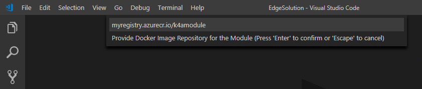

# Creating an Azure IoT Edge Container for Linux

This tutorial will walk through the creation of an IoT Edge Module incorporating the Kinect for Azure SDK.

If you don't have an Azure subscription, create a [free account](https://azure.microsoft.com/en-us/free/) before you begin.

## Prerequisites

An Azure IoT Edge device:

* This tutorial requires an Intel based PC with an Intel GPU. For more details check the [host PC hardware requirements](./system-requirements.md#host-pc-hardware-requirements)
* To configure the host PC as an Edge device use the following steps in the [quick start for Linux](https://docs.microsoft.com/en-us/azure/iot-edge/quickstart-linux)

Cloud resources:

* A free or standard-tier [IoT Hub](https://docs.microsoft.com/en-us/azure/iot-hub/iot-hub-create-through-portal) in Azure. 

Development resources:

* [Visual Studio Code](https://code.visualstudio.com/). 
* [C/C++ extension](https://marketplace.visualstudio.com/items?itemName=ms-vscode.cpptools) for Visual Studio Code.
* [Azure IoT Edge extension](https://marketplace.visualstudio.com/items?itemName=vsciot-vscode.azure-iot-edge) for Visual Studio Code.

## Create a container registry

In this tutorial, you use the Azure IoT Edge extension for Visual Studio Code to build a module and create a **container image** from the files. Then you push this image to a **registry** that stores and manages your images. Finally, you deploy your image from your registry to run on your IoT Edge device.  

You can use any Docker-compatible registry to hold your container images. Two popular Docker registry services are [Azure Container Registry](https://docs.microsoft.com/azure/container-registry/) and [Docker Hub](https://docs.docker.com/docker-hub/repos/#viewing-repository-tags). This tutorial uses Azure Container Registry. 

If you don't already have a container registry, follow these steps to create a new one in Azure:

1. In the [Azure portal](https://portal.azure.com), select **Create a resource** > **Containers** > **Container Registry**.

2. Provide the following values to create your container registry:

   | Field | Value | 
   | ----- | ----- |
   | Registry name | Provide a unique name. |
   | Subscription | Select a subscription from the drop-down list. |
   | Resource group | We recommend that you use the same resource group for all of the test resources that you create during the IoT Edge quickstarts and tutorials. For example, **IoTEdgeResources**. |
   | Location | Choose a location close to you. |
   | Admin user | Set to **Enable**. |
   | SKU | Select **Basic**. | 

3. Select **Create**.

4. After your container registry is created, browse to it, and then select **Access keys**. 

5. Copy the values for **Login server**, **Username**, and **Password**. You use these values later in the tutorial to provide access to the container registry. 

## Create an IoT Edge module project
The following steps show you how to create an IoT Edge module project based on .NET core 2.0 using Visual Studio Code and the Azure IoT Edge extension.

### Create a new solution

Create a C solution template that you can customize with your own code. 

1. Select **View** > **Command Palette** to open the VS Code command palette. 

2. In the command palette, type and run the command **Azure: Sign in** and follow the instructions to sign in your Azure account. If you've already signed in, you can skip this step.

3. In the command palette, type and run the command **Azure IoT Edge: New IoT Edge solution**. Follow the prompts in the command palette to create your solution.

   | Field | Value |
   | ----- | ----- |
   | Select folder | Choose the location on your development machine for VS Code to create the solution files. |
   | Provide a solution name | Enter a descriptive name for your solution or accept the default **EdgeSolution**. |
   | Select module template | Choose **C Module**. |
   | Provide a module name | Name your module **K4AModule**. |
   | Provide Docker image repository for the module | An image repository includes the name of your container registry and the name of your container image. Your container image is prepopulated from the last step. Replace **localhost:5000** with the login server value from your Azure container registry. You can retrieve the login server from the Overview page of your container registry in the Azure portal. The final string looks like \<registry name\>.azurecr.io/k4amodule. |
   


The VS Code window loads your IoT Edge solution workspace. The solution workspace contains five top-level components. The **modules** folder contains the C code for your module as well as Dockerfiles for building your module as a container image. The **\.env** file stores your container registry credentials. The **deployment.template.json** file contains the information that the IoT Edge runtime uses to deploy modules on a device. And **deployment.debug.template.json** file containers the debug version of modules. You won't edit the **\.vscode** folder or **\.gitignore** file in this tutorial.

If you didn't specify a container registry when creating your solution, but accepted the default localhost:5000 value, you won't have a \.env file. 


### Add your registry credentials

The environment file stores the credentials for your container registry and shares them with the IoT Edge runtime. The runtime needs these credentials to pull your private images onto the IoT Edge device. 

1. In the VS Code explorer, open the .env file. 
2. Update the fields with the **username** and **password** values that you copied from your Azure container registry. 
3. Save this file. 

### Add the Kinect for Azure SDK to your Dockerfile
1. In the VS Code explorer, open the Dockerfile.amd64 file.
2. Replace the entire contents of this file with the following. This will configure your Docker container with the necessary software dependencies, build the Kinect for Azure SDK and configure the IoT Edge module to access your GPU.
```dockerfile
FROM ubuntu:bionic AS base
RUN apt-get update && \
    apt-get install -y --no-install-recommends software-properties-common && \
    add-apt-repository -y ppa:aziotsdklinux/ppa-azureiot && \
    apt-get update && \
    apt-get install -y azure-iot-sdk-c-dev libusb-1.0-0 libgl1-mesa-glx libgl1-mesa-dri && \
    rm -rf /var/lib/apt/lists/*
    
FROM base AS build-env
RUN apt-get update && \
    apt-get install -y --no-install-recommends pkg-config ninja-build cmake git libgl-dev git-lfs clang gcc-multilib g++-multilib make libusb-1.0-0-dev libgl1-mesa-dev libsoundio-dev libvulkan-dev libx11-dev libxcursor-dev libxinerama-dev libxrandr-dev libssl-dev mesa-common-dev && \
    rm -rf /var/lib/apt/lists/* 

FROM build-env AS build-k4a
WORKDIR /build
RUN git clone https://github.com/Microsoft/Azure-Kinect-Sensor-SDK.git /build/Azure-Kinect-Sensor-SDK 
RUN mkdir -p /build/Azure-Kinect-Sensor-SDK/build
WORKDIR /build/Azure-Kinect-Sensor-SDK/build
RUN cmake .. -GNinja
RUN ninja
RUN ninja install
COPY ./libdepthengine.so.1.0 /opt/K4A/lib/libdepthengine.so.1.0
RUN ln -s /opt/K4A/lib/libdepthengine.so.1.0 /opt/K4A/lib/libdepthengine.so

FROM build-k4a AS build-iotedgemodule
COPY . /app
WORKDIR /app
RUN cmake .
RUN make

FROM base
COPY --from=build-k4a /opt/K4A/ /opt/K4A
RUN echo "/opt/K4A/lib/" >> /etc/ld.so.conf.d/k4a.conf
RUN echo "/opt/K4A/bin/" >> /etc/ld.so.conf.d/k4a.conf
RUN ldconfig
ENV DISPLAY :0
WORKDIR /app
COPY --from=build-iotedgemodule /app/main ./
RUN useradd -ms /bin/bash moduleuser
USER moduleuser
CMD ["./main"]
```

### Allow non-root users to access the Kinect
By default only root will have access to the Kinect. In order to allow access a udev rule must be added to the PC. 

1. Create a new file named 99-k4a.rules under /etc/udev/rules.d/ with the following contents.
   ```bash
   sudo nano /etc/udev/rules.d/99-k4a.rules
   ```
2. Add the following content to the file.
   ```
   BUS!="usb", ACTION!="add", SUBSYSTEM!=="usb_device", GOTO="k4a_logic_rules_end"

   ATTRS{idVendor}=="045e", ATTRS{idProduct}=="097a", MODE="0666", GROUP="plugdev"
   ATTRS{idVendor}=="045e", ATTRS{idProduct}=="097b", MODE="0666", GROUP="plugdev"
   ATTRS{idVendor}=="045e", ATTRS{idProduct}=="097c", MODE="0666", GROUP="plugdev"
   ATTRS{idVendor}=="045e", ATTRS{idProduct}=="097d", MODE="0666", GROUP="plugdev"
   ATTRS{idVendor}=="045e", ATTRS{idProduct}=="097e", MODE="0666", GROUP="plugdev"

   LABEL="k4a_logic_rules_end"
   ```
3. Save and close the file.

   `CTRL + X`, `Y`, `Enter`
4. Unplug and plug back in your Kinect to pick up these settings.

### Allow your container to access your Kinect for Azure

1. In the VS Code explorer, open the deployment.template.json file. 
2. Find the "modules" section and replace it to match the following. This will change the startup configuration of the IoT Edge Docker container to allow access to all usb devices and the Intel GPU.
   ```json
   "modules": {
     "K4AModule": {
       "version": "1.0",
       "type": "docker",
       "status": "running",
       "restartPolicy": "always",
       "settings": {
         "image": "${MODULES.K4AModule}",
         "createOptions": {
           "HostConfig": {
             "Binds": [
               "/tmp/.X11-unix:/tmp/.X11-unix"
             ],
             "Devices":[
               {
                 "PathOnHost": "/dev/dri",
                 "PathInContainer": "/dev/dri",
                 "CgroupPermissions": "mrw"
               },
               {
                 "PathOnHost": "/dev/bus/usb",
                 "PathInContainer": "/dev/bus/usb",
                 "CgroupPermissions": "mrw"
               }
             ]
           }
         }
       }
     }
   }
   ```
3. At the bottom of deployment.template.json, after "$edgeHub", add the following parameters. These parameters will control how close an object must be to trigger the sensor and how often the module will send updated counts.
   ```json
       ,
       "K4AModule": {
         "properties.desired":{
           "triggerDistance":1500,
           "sendFrequencyInMinutes":10
         }
       }
   ```

### Update the module with custom code

Add code to your C module that allows it to process depth frames from your Kinect, detect movement across the frame, and update the device twin with a count of how many detections have occurred since the last update.

1. Device twin updates are sent and received in JSON format. To best process this data import a JSON library for C. This tutorial uses Parson.

   1. Download the [Parson GitHub repository](https://github.com/kgabis/parson). Copy the **parson.c** and **parson.h** files into the **CModule** folder.

   2. Open **modules** > **CModule** > **CMakeLists.txt**. At the top of the file, import the Parson files as a library called **my_parson**.

      ```
      add_library(my_parson
          parson.c
          parson.h
      )
      ```

   3. Add **my_parson** to the list of libraries in the **target_link_libraries** function of CMakeLists.txt.

   4. Save the **CMakeLists.txt** file.

   5. Open **modules** > **CModule** > **main.c**. At the bottom of the list of include statements, add a new one to include `parson.h` for JSON support:

      ```c
      #include "parson.h"
      ```

2. Update the project to link against the Kinect for Azure SDK.
   1. Open **modules** > **CModule** > **CMakeLists.txt**. Add a variable for the Kinect SDK directory and a definition to link the library statically.

      ```
      set(K4A_SDK_DIR "/opt/K4A/")
      add_definitions( -DK4A_STATIC_DEFINE )
      ```
    1. Add **${K4A_SDK_DIR}/include** to the list of directories in the **include_directories** function of CMakeLists.txt.
    2. Add **${K4A_SDK_DIR}/lib** to the list of directories in the **link_directories** function of CMakeLists.txt.
    3. Add **k4a** to the list of libraries in the **target_link_libraries** function of CMakeLists.txt.
    4. Open **modules** > **CModule** > **main.c**. At the bottom of the list of include statements, add a new one to include `k4a/k4a.h`:

      ```c
      #include <k4a/k4a.h>
      ```
3. In the **main.c** file, remove the struct `MESSAGE_INSTANCE`, the variable `messagesReceivedByInput1Queue`, and the three functions `SendConfirmationCallback`, `CreateMessageInstance`, and `InputQueue1Callback`. They will not be used in this tutorial.
4. Add two global variables one called `triggerDistance` and one called `sendFrequencyInMin` after the include section. These variables will control how far an object must be away from the Kinect to trigger a count and how often the module sends updates to your IoT Hub.
    ```c
    static int triggerDistance = 1500;
    static int sendFrequencyInMin = 10;
    ```
5. Add a `MotionDetector` struct. This will be used to store the data being synced to your IoT Hub.
    ```c
    typedef struct MOTION_DETECTOR_TAG
    {
        char *serialNumber;
        int leftToRightCount;
        int rightToLeftCount;
    } MotionDetector;
    ```
6. Add a `ModuleTwinCallback` function. This will be called when the device module twin is updated and will allow you to configure the `triggerDistance` and `sendFrequencyInMin` variables remotely. 

    ```c
    static void ModuleTwinCallback(DEVICE_TWIN_UPDATE_STATE updateState, const unsigned char *payLoad, size_t size, void *userContextCallback)
    {
        printf("\r\nTwin callback called with (state=%s, size=%zu):\r\n%s\r\n",
              ENUM_TO_STRING(DEVICE_TWIN_UPDATE_STATE, updateState), size, payLoad);

        JSON_Value *root_value = json_parse_string(payLoad);
        JSON_Object *root_object = json_value_get_object(root_value);

        if (json_object_dotget_value(root_object, "desired.triggerDistance") != NULL)
        {
            triggerDistance = json_object_dotget_number(root_object, "desired.triggerDistance");
        }
        if (json_object_get_value(root_object, "triggerDistance") != NULL)
        {
            triggerDistance = json_object_get_number(root_object, "triggerDistance");
        }
        if (json_object_dotget_value(root_object, "desired.sendFrequencyInMinutes") != NULL)
        {
            sendFrequencyInMin = json_object_dotget_number(root_object, "desired.sendFrequencyInMinutes");
        }
        if (json_object_get_value(root_object, "sendFrequencyInMinutes") != NULL)
        {
            sendFrequencyInMin = json_object_get_number(root_object, "sendFrequencyInMinutes");
        }
    }
    ``` 
7. Add a `SerializeToJson` function. This function will create a JSON formated string for updating the device twin properties.
    ```c
    static char *SerializeToJson(MotionDetector *motionDetector)
    {
        char *result;

        JSON_Value *root_value = json_value_init_object();
        JSON_Object *root_object = json_value_get_object(root_value);

        (void)json_object_set_string(root_object, "serialNumber", motionDetector->serialNumber);
        (void)json_object_dotset_number(root_object, "leftToRightCount", motionDetector->leftToRightCount);
        (void)json_object_dotset_number(root_object, "rightToLeftCount", motionDetector->rightToLeftCount);

        result = json_serialize_to_string(root_value);

        json_value_free(root_value);

        return result;
    }
    ```
8. Add a function called `ReportedStateCallback`. This will be called to report the status of updating the device twin properties.
    ```c
    static void ReportedStateCallback(int statusCode, void *userContextCallback)
    {
        (void)userContextCallback;
        printf("Device Twin reported properties update completed with result: %d\r\n", statusCode);
    }
    ```
9. Replace the existing function `SetupCallbacksForModule` with the following code. 
    ```c
    static int SetupCallbacksForModule(IOTHUB_MODULE_CLIENT_LL_HANDLE iotHubModuleClientHandle)
    {
        int ret;

        if (IoTHubModuleClient_LL_SetModuleTwinCallback(iotHubModuleClientHandle, ModuleTwinCallback, (void *)iotHubModuleClientHandle) != IOTHUB_CLIENT_OK)
        {
            printf("ERROR: IoTHubModuleClient_LL_SetModuleTwinCallback(default)..........FAILED!\r\n");
            ret = __FAILURE__;
        }
        else
        {
            ret = 0;
        }

        return ret;
    }
    ```
10. Add a `CalculateAverageDepth` function. This function will calculate the average pixel depth value over a section of the depth image.
    ```c
    static int CalculateAverageDepth(k4a_image_t depthImage, int positionX, int positionY, int width, int height)
    {
        int count = 0;
        int total = 0;
        int average = 0;

        uint16_t *depthImageData = (uint16_t *)(void *)k4a_image_get_buffer(depthImage);
        int depthImageWidth = k4a_image_get_width_pixels(depthImage);

        for (int x = positionX - width / 2; x < positionX + width / 2; x++)
        {
            for (int y = positionY - height / 2; y < positionY + height / 2; y++)
            {
                uint16_t depthPixel = depthImageData[y * depthImageWidth + x];
                if (depthPixel != 0)
                {
                    total += depthPixel;
                    count++;
                }
            }
        }

        if (count != 0)
        {
            average = total / count;
        }

        return average;
    }
    ```
11. Replace the entire `iothub_module` function with the following. This function is the main loop of the module. It will perform the following tasks.
    1. Initialize the Kinect for Azure SDK and initialize the IoT Client Module. 
    2. Continuously capture depth frames from the Kinect and wait for something to pass through the center of the frame. It does this by analyzing the average depth value of an area just to the left of center and just to the right of center. Once something moves past the center and both sides are less than `triggerDistance` the bool `triggered` is set to `true`. Once it leaves the center of the frame the movement direction is inferred by which left or right area's depth value is smaller and the corresponding counter is incremented. 
    3. Every `sendFrequencyInMin` minutes the counters are sent to the IoT Hub through the device twin reported properties. 
    ```c
    static void iothub_module()
    {
        IOTHUB_MODULE_CLIENT_LL_HANDLE iotHubModuleClientHandle;

        const int32_t TIMEOUT_IN_MS = 1000;
        k4a_device_t device = NULL;
        k4a_capture_t capture = NULL;
        k4a_image_t depthImage = NULL;
        int depthImageWidth;
        int depthImageHeight;
        TICK_COUNTER_HANDLE tickHandle;
        tickcounter_ms_t currentMs = 0;

        const int DEPTH_SAMPLE_WIDTH = 20;
        const int DEPTH_SAMPLE_HEIGHT = 10;
        bool triggered = false;

        setbuf(stdout, NULL);
        srand((unsigned int)time(NULL));

        tickHandle = tickcounter_create();

        uint32_t device_count = k4a_device_get_installed_count();

        if (device_count == 0)
        {
            printf("No K4A devices found\n");
            goto Exit;
        }

        if (K4A_RESULT_SUCCEEDED != k4a_device_open(K4A_DEVICE_DEFAULT, &device))
        {
            printf("Failed to open device\n");
            goto Exit;
        }

        char *serialNumber = NULL;
        size_t serialNumberLength = 0;

        if (K4A_BUFFER_RESULT_TOO_SMALL != k4a_device_get_serialnum(device, NULL, &serialNumberLength))
        {
            printf("Failed to get serial number length\n");
            goto Exit;
        }

        serialNumber = malloc(serialNumberLength);
        if (serialNumber == NULL)
        {
            printf("Failed to allocate memory for serial number (%zu bytes)\n", serialNumberLength);
            goto Exit;
        }

        if (K4A_BUFFER_RESULT_SUCCEEDED != k4a_device_get_serialnum(device, serialNumber, &serialNumberLength))
        {
            printf("Failed to get serial number\n");
            goto Exit;
        }

        printf("Device \"%s\"\n", serialNumber);

        k4a_device_configuration_t config = K4A_DEVICE_CONFIG_INIT_DISABLE_ALL;
        config.depth_mode = K4A_DEPTH_MODE_NFOV_2X2BINNED;
        config.camera_fps = K4A_FRAMES_PER_SECOND_30;

        if (K4A_RESULT_SUCCEEDED != k4a_device_start_cameras(device, &config))
        {
            printf("Failed to start cameras\n");
            goto Exit;
        }

        if ((iotHubModuleClientHandle = InitializeConnection()) != NULL && SetupCallbacksForModule(iotHubModuleClientHandle) == 0)
        {
            tickcounter_ms_t lastReportedTimeMs;
            MotionDetector motionDetector = {0};
            motionDetector.serialNumber = serialNumber;

            char *reportedProperties = SerializeToJson(&motionDetector);

            (void)IoTHubModuleClient_LL_SendReportedState(iotHubModuleClientHandle, (const unsigned char *)reportedProperties, strlen(reportedProperties), ReportedStateCallback, NULL);
            json_free_serialized_string(reportedProperties);

            tickcounter_get_current_ms(tickHandle, &currentMs);
            lastReportedTimeMs = currentMs;

            while (true)
            {
                // Get a depth frame.
                switch (k4a_device_get_capture(device, &capture, TIMEOUT_IN_MS))
                {
                case K4A_WAIT_RESULT_SUCCEEDED:
                    break;
                case K4A_WAIT_RESULT_TIMEOUT:
                    printf("Timed out waiting for a capture\n");
                    continue;
                    break;
                case K4A_WAIT_RESULT_FAILED:
                    printf("Failed to read a capture\n");
                    goto Exit;
                }

                // Get the depth image.
                depthImage = k4a_capture_get_depth_image(capture);
                if (depthImage == 0)
                {
                    printf("Failed to get depth image from capture\n");
                    goto Exit;
                }

                depthImageWidth = k4a_image_get_width_pixels(depthImage);
                depthImageHeight = k4a_image_get_height_pixels(depthImage);

                // Get the average depth value for an area to the left and to the right of the center.
                int leftDepthAverage = CalculateAverageDepth(depthImage, depthImageWidth / 2 - DEPTH_SAMPLE_WIDTH / 2, depthImageHeight / 2, DEPTH_SAMPLE_WIDTH, DEPTH_SAMPLE_HEIGHT);
                int rightDepthAverage = CalculateAverageDepth(depthImage, depthImageWidth / 2 + DEPTH_SAMPLE_WIDTH / 2, depthImageHeight / 2, DEPTH_SAMPLE_WIDTH, DEPTH_SAMPLE_HEIGHT);

                if (leftDepthAverage != 0 && rightDepthAverage != 0)
                {
                    if (leftDepthAverage < triggerDistance && rightDepthAverage < triggerDistance)
                    {
                        // There is something closer then triggerDistance in the center of the image, so enter the triggered state.
                        triggered = true;
                    }
                    else if (triggered)
                    {
                        // If there was something in the center of the image, but now there is not then infer
                        // which direction it is moving by assuming it is still in either the left or right area.
                        if (leftDepthAverage < rightDepthAverage)
                        {
                            motionDetector.rightToLeftCount++;
                            printf("right to left movement detected\n");
                        }
                        else
                        {
                            motionDetector.leftToRightCount++;
                            printf("left to right movement detected\n");
                        }
                        triggered = false;
                    }
                }

                k4a_image_release(depthImage);
                k4a_capture_release(capture);

                IoTHubModuleClient_LL_DoWork(iotHubModuleClientHandle);

                tickcounter_get_current_ms(tickHandle, &currentMs);
                if (currentMs - lastReportedTimeMs > 1000 * 60 * sendFrequencyInMin)
                {
                    reportedProperties = SerializeToJson(&motionDetector);
                    (void)IoTHubModuleClient_LL_SendReportedState(iotHubModuleClientHandle, (const unsigned char *)reportedProperties, strlen(reportedProperties), ReportedStateCallback, NULL);
                    json_free_serialized_string(reportedProperties);
                    lastReportedTimeMs = currentMs;

                    // Only report the change in count since the last time it was reported.
                    motionDetector.rightToLeftCount = 0;
                    motionDetector.leftToRightCount = 0;
                }
            }
        }

    Exit:

        if (device != NULL)
        {
            k4a_device_stop_cameras(device);
            k4a_device_close(device);
        }

        if (serialNumber)
        {
            free(serialNumber);
        }

        tickcounter_destroy(tickHandle);

        DeInitializeConnection(iotHubModuleClientHandle);
    }
    ```
12. Save the **main.c** file.
