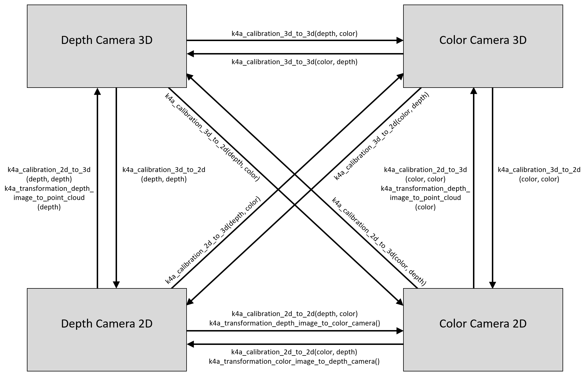

---
title: Use Azure Kinect calibration functions
description: Learn how to use the calibration functions for Azure Kinect DK.
author: cdedmonds
ms.author: cedmonds
ms.prod: kinect-dk
ms.date: 06/26/2019
ms.topic: conceptual
keywords: kinect, azure, sensor, sdk, coordinate system, calibration, functions, camera, intrinsic, extrinsic, project, unproject, transformation, rgb-d, point cloud
---

# Use Azure Kinect calibration functions

The calibration functions allow for transforming points between the coordinate systems of each sensor on the Azure Kinect device. Applications requiring conversion of whole images may take advantage of the accelerated operations available in [transformation functions](use-image-transformation.md).

## Retrieve calibration data

It is necessary to retrieve the device calibration to perform coordinate system transformations. The calibration data is stored in the [k4a_calibration_t](https://microsoft.github.io/Azure-Kinect-Sensor-SDK/master/structk4a__calibration__t.html#details) data type. It is obtained from the device via the function [k4a_device_get_calibration()](https://microsoft.github.io/Azure-Kinect-Sensor-SDK/master/group___functions_ga4e43940d8d8db48da266c7a7842c8d78.html#ga4e43940d8d8db48da266c7a7842c8d78). The calibration data is not only specific to each device, but also to the operating mode of the cameras. Hence [k4a_device_get_calibration()](https://microsoft.github.io/Azure-Kinect-Sensor-SDK/master/group___functions_ga4e43940d8d8db48da266c7a7842c8d78.html#ga4e43940d8d8db48da266c7a7842c8d78) requires the `depth_mode` and `color_resolution` parameters as input.

### OpenCV Compatibility

The calibration parameters are compatible with [OpenCV](https://opencv.org/). For more information about the individual camera calibration parameters, see also [OpenCV documentation](https://docs.opencv.org/3.2.0/d9/d0c/group__calib3d.html#gga7041b2a9c8f9f8ee93a2796981bc5546a204766e24f2e413e7a7c9f8b9e93f16c). Also see [OpenCV compatibility example](https://github.com/Microsoft/Azure-Kinect-Sensor-SDK/tree/develop/examples/opencv_compatibility) of the SDK that demonstrates conversion between the [k4a_calibration_t](https://microsoft.github.io/Azure-Kinect-Sensor-SDK/master/structk4a__calibration__t.html#details) type and the corresponding OpenCV data structures.

## Coordinate Transformation Functions

The figure below shows the different coordinate systems of Azure Kinect as well as the functions to convert between them. We omit the 3D coordinate systems of gyroscope and accelerometer to keep the figure simple.

   

Remark on lens distortion: 2D coordinates always refer to the distorted image in the SDK. The [undistortion example](https://github.com/Microsoft/Azure-Kinect-Sensor-SDK/tree/develop/examples/undistort) of the SDK demonstrates image undistortion. In general, 3D points will never be affected by lens distortion.

### Convert between 3D coordinate systems

The function [k4a_calibration_3d_to_3d()](https://microsoft.github.io/Azure-Kinect-Sensor-SDK/master/group___functions_gaacd1eab997ef964b5e436afa5295726e.html#gaacd1eab997ef964b5e436afa5295726e) converts a 3D point of the source coordinate system to a 3D point of the target coordinate system using the camera's extrinsic calibration. Source and target can be set to any of the four 3D coordinate systems, that is, color camera, depth camera, gyroscope, or accelerometer. If source and target are identical, the unmodified input 3D point is returned as output.

### Convert between 2D and 3D coordinate systems

The function [k4a_calibration_3d_to_2d()](https://microsoft.github.io/Azure-Kinect-Sensor-SDK/master/group___functions_ga2ed8b51d727425caa942aab190fc2ba9.html#ga2ed8b51d727425caa942aab190fc2ba9) converts a 3D point of the source coordinate system to a 2D pixel coordinate of the target camera. This function is often referred to as project function. While the source can be set to any of the four 3D coordinate systems, the target must be the depth or color camera. If source and target are different, the input 3D point is converted to the 3D coordinate system of the target camera using [k4a_calibration_3d_to_3d()](https://microsoft.github.io/Azure-Kinect-Sensor-SDK/master/group___functions_gaacd1eab997ef964b5e436afa5295726e.html#gaacd1eab997ef964b5e436afa5295726e). Once the 3D point is represented in the target camera coordinate system, the corresponding 2D pixel coordinates are computed using the target camera’s intrinsic calibration. If a 3D point falls out of the visible area of the target camera, the valid value is set to 0.

The function [k4a_calibration_2d_to_3d()](https://microsoft.github.io/Azure-Kinect-Sensor-SDK/master/group___functions_ga664602bdb48dab38117a6c1d14b880de.html#ga664602bdb48dab38117a6c1d14b880de) converts a 2D pixel coordinate of the source camera to a 3D point of the target camera coordinate system. The source must be color or depth camera. The target can be set to any of the four 3D coordinate systems. In addition to the 2D pixel coordinate, the pixel’s depth value (in millimeters) in the source camera’s image is required as an input to the function, one way to derive the depth value in the color camera geometry is to use the function [k4a_transformation_depth_image_to_color_camera()](https://microsoft.github.io/Azure-Kinect-Sensor-SDK/master/group___functions_gafacffb5f781a9c2df30d4a16241cd514.html#gafacffb5f781a9c2df30d4a16241cd514). The function computes the 3D ray leading from the source camera’s focal point through the specified pixel coordinate using the source camera’s intrinsic calibration. The depth value is then used to find the exact location of the 3D point on this ray. This operation is often referred to as unproject function. If source and target cameras are different, the function transforms the 3D point to the coordinate system of the target via [k4a_calibration_3d_to_3d()](https://microsoft.github.io/Azure-Kinect-Sensor-SDK/master/group___functions_gaacd1eab997ef964b5e436afa5295726e.html#gaacd1eab997ef964b5e436afa5295726e). If a 2D pixel coordinate falls out of the visible area of the source camera, the valid value is set to 0.

### Converting between 2D coordinate systems

The function [k4a_calibration_2d_to_2d()](https://microsoft.github.io/Azure-Kinect-Sensor-SDK/master/group___functions_ga3b6bf6dedbfe67468e2f895dcce68ed4.html#ga3b6bf6dedbfe67468e2f895dcce68ed4) converts a 2D pixel coordinate of the source camera to a 2D pixel coordinate of the target camera. Source and target must be set to color or depth camera. The function requires the pixel’s depth value (in millimeters) in the source camera image as an input, one way to derive the depth value in the color camera geometry is to use the function [k4a_transformation_depth_image_to_color_camera()](https://microsoft.github.io/Azure-Kinect-Sensor-SDK/master/group___functions_gafacffb5f781a9c2df30d4a16241cd514.html#gafacffb5f781a9c2df30d4a16241cd514). It calls [k4a_calibration_2d_to_3d()](https://microsoft.github.io/Azure-Kinect-Sensor-SDK/master/group___functions_ga664602bdb48dab38117a6c1d14b880de.html#ga664602bdb48dab38117a6c1d14b880de) to convert to a 3D point of the source camera system. It then calls [k4a_calibration_3d_to_2d()](https://microsoft.github.io/Azure-Kinect-Sensor-SDK/master/group___functions_ga2ed8b51d727425caa942aab190fc2ba9.html#ga2ed8b51d727425caa942aab190fc2ba9) to convert to a 2D pixel coordinate of the target camera image. The valid value is set to 0, if [k4a_calibration_2d_to_3d()](https://microsoft.github.io/Azure-Kinect-Sensor-SDK/master/group___functions_ga664602bdb48dab38117a6c1d14b880de.html#ga664602bdb48dab38117a6c1d14b880ded) or [k4a_calibration_3d_to_2d()](https://microsoft.github.io/Azure-Kinect-Sensor-SDK/master/group___functions_ga2ed8b51d727425caa942aab190fc2ba9.html#ga2ed8b51d727425caa942aab190fc2ba9) returns an invalid result.

## Related samples

- [OpenCV compatibility example](https://github.com/Microsoft/Azure-Kinect-Sensor-SDK/tree/develop/examples/opencv_compatibility)
- [Undistortion example](https://github.com/Microsoft/Azure-Kinect-Sensor-SDK/tree/develop/examples/undistort)
- [Fast point cloud example](https://github.com/Microsoft/Azure-Kinect-Sensor-SDK/tree/develop/examples/fastpointcloud)

## Next steps

Now you know about camera calibrations, you may also learn how to
>[!div class="nextstepaction"]
>[Capture device synchronization](capture-device-synchronization.md)

Also you can review

[Coordinate systems](coordinate-systems.md)
