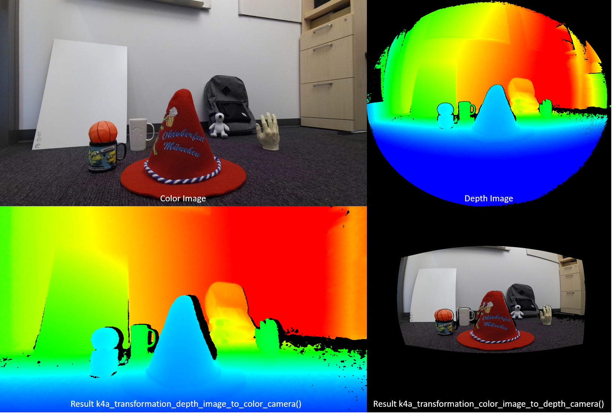

# Use Azure Kinect Sensor SDK image transformations

Follow the specific functions to use and transform images between coordinated camera systems in your Azure Kinect DK.

## k4a_transformation functions

 All functions prefixed with *k4a_transformation* operate on whole images. They require the transformation handle [k4a_transformation_t](https://microsoft.github.io/Azure-Kinect-Sensor-SDK/master/structk4a__transformation__t.html) obtained via [k4a_transformation_create()](https://microsoft.github.io/Azure-Kinect-Sensor-SDK/master/group___functions_ga853a1a5b6d521bbdf523a69e890c4f10.html#ga853a1a5b6d521bbdf523a69e890c4f10) and are unallocated via [k4a_transformation_destroy()](https://microsoft.github.io/Azure-Kinect-Sensor-SDK/master/group___functions_ga7d3ecaae66f26c1a89da9042b1bc6d44.html#ga7d3ecaae66f26c1a89da9042b1bc6d44). You can also refer to the SDK [Transformation Example](https://github.com/Microsoft/Azure-Kinect-Sensor-SDK/tree/develop/examples/transformation) that demonstrates how to use the three functions in this topic.

The following functions are covered:

* [`k4a_transformation_depth_image_to_color_camera()`](https://microsoft.github.io/Azure-Kinect-Sensor-SDK/master/group___functions_gafacffb5f781a9c2df30d4a16241cd514.html#gafacffb5f781a9c2df30d4a16241cd514)
* [`k4a_transformation_depth_image_to_color_camera_custom()`](https://microsoft.github.io/Azure-Kinect-Sensor-SDK/master/group___functions_gac00dd00e7612a86382e3d0a130f276bb.html#gac00dd00e7612a86382e3d0a130f276bb)
* [`k4a_transformation_color_image_to_depth_camera()`](https://microsoft.github.io/Azure-Kinect-Sensor-SDK/master/group___functions_gaf3a941f07bb0185cd7a72699a648fc29.html#gaf3a941f07bb0185cd7a72699a648fc29)
* [`k4a_transformation_depth_image_to_point_cloud()`](
https://microsoft.github.io/Azure-Kinect-Sensor-SDK/master/group___functions_ga7385eb4beb9d8892e8a88cf4feb3be70.html#ga7385eb4beb9d8892e8a88cf4feb3be70)

### k4a_transformation_depth_image_to_color_camera

#### Overview

 The function [k4a_transformation_depth_image_to_color_camera()](https://microsoft.github.io/Azure-Kinect-Sensor-SDK/master/group___functions_gafacffb5f781a9c2df30d4a16241cd514.html#gafacffb5f781a9c2df30d4a16241cd514) transforms the depth map from the viewpoint of the depth camera into the viewpoint of the color camera. This function is designed to produce so-called RGB-D images, where D represents an additional image channel recording the depth value. As seen in the figure below, the color image and the output of [k4a_transformation_depth_image_to_color_camera()](https://microsoft.github.io/Azure-Kinect-Sensor-SDK/master/group___functions_gafacffb5f781a9c2df30d4a16241cd514.html#gafacffb5f781a9c2df30d4a16241cd514) look as if they were taken from the same viewpoint, that is, the viewpoint of the color camera.

   

#### Implementation

 This transformation function is more complex than simply calling [k4a_calibration_2d_to_2d()](https://microsoft.github.io/Azure-Kinect-Sensor-SDK/master/group___functions_ga3b6bf6dedbfe67468e2f895dcce68ed4.html#ga3b6bf6dedbfe67468e2f895dcce68ed4) for every pixel. It warps a triangle mesh from the geometry of the depth camera into the geometry of the color camera. The triangle mesh is used to avoid generating holes in the transformed depth image. A Z-buffer ensures that occlusions are handled correctly. GPU acceleration is enabled for this function by default.

#### Parameters

 Input parameters are the transformation handle and a depth image. The depth image resolution must match the ```depth_mode``` specified at creation of the transformation handle. For example, if the transformation handle was created using the 1024x1024 ```K4A_DEPTH_MODE_WFOV_UNBINNED``` mode, the resolution of the depth image must be 1024x1024 pixels. The output is a transformed depth image that needs to be allocated by the user via calling [k4a_image_create()](https://microsoft.github.io/Azure-Kinect-Sensor-SDK/master/group___functions_ga859554581bb97a620ff8e92a893e71ef.html#ga859554581bb97a620ff8e92a893e71ef). The resolution of the transformed depth image must match the ```color_resolution``` specified at creation of the transformation handle. For example, if the color resolution was set to `K4A_COLOR_RESOLUTION_1080P`, the output image resolution must be 1920x1080 pixels. The output image stride is set to `width * sizeof(uint16_t)`, as the image stores 16-bit depth values.

### k4a_transformation_depth_image_to_color_camera_custom

#### Overview

 The function [k4a_transformation_depth_image_to_color_camera_custom()](https://microsoft.github.io/Azure-Kinect-Sensor-SDK/master/group___functions_gac00dd00e7612a86382e3d0a130f276bb.html#gac00dd00e7612a86382e3d0a130f276bb) transforms the depth map and a custom image from the viewpoint of the depth camera into the viewpoint of the color camera. As an extension of [k4a_transformation_depth_image_to_color_camera()](https://microsoft.github.io/Azure-Kinect-Sensor-SDK/master/group___functions_gafacffb5f781a9c2df30d4a16241cd514.html#gafacffb5f781a9c2df30d4a16241cd514), this function is designed to produce a corresponding custom image for which each pixel matches the corresponding pixel coordinates of the color camera additional to the transformed depth image.

#### Implementation

 This transformation function produces the transformed depth image the same way as [k4a_transformation_depth_image_to_color_camera()](https://microsoft.github.io/Azure-Kinect-Sensor-SDK/master/group___functions_gafacffb5f781a9c2df30d4a16241cd514.html#gafacffb5f781a9c2df30d4a16241cd514). To transform the custom image, this function provides options of using linear interpolation or nearest neighbor interpolation. Using linear interpolation could create new values in the transformed custom image. Using nearest neighbor interpolation will prevent values not present in the original image from appearing in the output image but will result in less smooth image. The custom image should be single channel 8-bit or 16-bit. GPU acceleration is enabled for this function by default.

#### Parameters

 Input parameters are the transformation handle, a depth image, a custom image and the interpolation type. The depth image and custom image resolution must match the `depth_mode` specified at creation of the transformation handle. For example, if the transformation handle was created using the 1024x1024 `K4A_DEPTH_MODE_WFOV_UNBINNED` mode, the resolution of the depth image and custom image must be 1024x1024 pixels. The `interpolation_type` should be either `K4A_TRANSFORMATION_INTERPOLATION_TYPE_LINEAR` or `K4A_TRANSFORMATION_INTERPOLATION_TYPE_NEAREST`. The output is a transformed depth image and a transformed custom image that need to be allocated by the user via calling [k4a_image_create()](https://microsoft.github.io/Azure-Kinect-Sensor-SDK/master/group___functions_ga859554581bb97a620ff8e92a893e71ef.html#ga859554581bb97a620ff8e92a893e71ef). The resolution of the transformed depth image and transformed custom image must match the `color_resolution` specified at creation of the transformation handle. For example, if the color resolution was set to `K4A_COLOR_RESOLUTION_1080P`, the output image resolution must be 1920x1080 pixels. The output depth image stride is set to `width * sizeof(uint16_t)`, as the image stores 16-bit depth values. The input custom image and transformed custom image must be of format `K4A_IMAGE_FORMAT_CUSTOM8` or `K4A_IMAGE_FORMAT_CUSTOM16`, corresponding image stride should be set accordingly. 

### k4a_transformation_color_image_to_depth_camera

#### Overview

 The function [k4a_transformation_color_image_to_depth_camera()](https://microsoft.github.io/Azure-Kinect-Sensor-SDK/master/group___functions_gaf3a941f07bb0185cd7a72699a648fc29.html#gaf3a941f07bb0185cd7a72699a648fc29) transforms the color image from the viewpoint of the color camera into the viewpoint of the depth camera (see figure above). It can be used to generate RGB-D images.

#### Implementation

 For every pixel of the depth map, the function uses the pixel’s depth value to compute the corresponding subpixel coordinate in the color image. We then look up the color value at this coordinate in the color image. Bilinear interpolation is performed in the color image to obtain the color value at subpixel precision. A pixel that does not have an associated depth reading is assigned to a BGRA value of `[0,0,0,0]` in the output image. GPU acceleration is enabled for this function by default. As this method produces holes in the transformed color image and does not handle occlusions, we recommend using the function [k4a_transformation_depth_image_to_color_camera()](https://microsoft.github.io/Azure-Kinect-Sensor-SDK/master/group___functions_gafacffb5f781a9c2df30d4a16241cd514.html#gafacffb5f781a9c2df30d4a16241cd514) instead.

#### Parameters

The input parameters are the transformation handle, a depth image, and a color image. The resolutions of depth and color images must match the depth_mode and color_resolution specified at creation of the transformation handle. The output is a transformed color image that needs to be allocated by the user via calling [k4a_image_create()](https://microsoft.github.io/Azure-Kinect-Sensor-SDK/master/group___functions_ga859554581bb97a620ff8e92a893e71ef.html#ga859554581bb97a620ff8e92a893e71ef). The resolution of the transformed color image must match the depth_resolution specified at creation of the transformation handle. The output image stores four 8-bit values representing BGRA for every pixel. Therefore, the stride of the image is ```width * 4 * sizeof(uint8_t)```. The data order is pixel interleaved, that is, blue value - pixel 0, green value - pixel 0, red value - pixel 0, alpha value - pixel 0, blue value - pixel 1 and so on.

### k4a_transformation_depth_image_to_point_cloud

#### Overview

The function [k4a_transformation_depth_image_to_point_cloud()](https://microsoft.github.io/Azure-Kinect-Sensor-SDK/master/group___functions_ga7385eb4beb9d8892e8a88cf4feb3be70.html#ga7385eb4beb9d8892e8a88cf4feb3be70) converts a 2D depth map taken by a camera into a 3D point cloud in the coordinate system of the same camera. The camera can thereby be the depth or color camera.

#### Implementation

 The function gives equivalent results to running [k4a_calibration_2d_to_2d()](https://microsoft.github.io/Azure-Kinect-Sensor-SDK/master/group___functions_ga3b6bf6dedbfe67468e2f895dcce68ed4.html#ga3b6bf6dedbfe67468e2f895dcce68ed4) for every pixel, but is computationally more efficient. When calling [k4a_transformation_create()](https://microsoft.github.io/Azure-Kinect-Sensor-SDK/master/group___functions_ga853a1a5b6d521bbdf523a69e890c4f10.html#ga853a1a5b6d521bbdf523a69e890c4f10), we precompute a so-called xy-lookup table that stores x- and y-scale factors for every image pixel. When calling [k4a_transformation_depth_image_to_point_cloud()](https://microsoft.github.io/Azure-Kinect-Sensor-SDK/master/group___functions_ga7385eb4beb9d8892e8a88cf4feb3be70.html#ga7385eb4beb9d8892e8a88cf4feb3be70), we obtain a pixel’s 3D X-coordinate by multiplying the pixel’s x-scale factor with the pixel’s Z-coordinate. Analogously, the 3D Y-coordinate is computed by multiplication with the y-scale factor. The [fast point cloud example](https://github.com/Microsoft/Azure-Kinect-Sensor-SDK/tree/develop/examples/fastpointcloud) of the SDK demonstrates how the xy-table is computed. Users can follow the example code to implement their own version of this function, for example, to speed up their GPU pipeline.

#### Parameters

 The input parameters are the transformation handle, a camera specifier, and a depth image. If the camera specifier is set to depth, the resolution of the depth image must match the depth_mode specified at creation of the transformation handle. Otherwise, if the specifier is set to the color camera, the resolution must match the resolution of the chosen color_resolution. The output parameter is an XYZ image that needs to be allocated by the user via calling [k4a_image_create()](https://microsoft.github.io/Azure-Kinect-Sensor-SDK/master/group___functions_ga859554581bb97a620ff8e92a893e71ef.html#ga859554581bb97a620ff8e92a893e71ef). The XYZ image resolution must match the resolution of the input depth map. We store three signed 16-bit coordinate values in millimeter for every pixel. The XYZ image stride is therefore set to `width * 3 * sizeof(int16_t)`. The data order is pixel interleaved, that is, X-coordinate – pixel 0, Y-coordinate – pixel 0, Z-coordinate – pixel 0, X-coordinate – pixel 1 and so on. If a pixel cannot be converted to 3D, the function assigns the values `[0,0,0]` to the pixel.

## Samples

[Transformation example](https://github.com/Microsoft/Azure-Kinect-Sensor-SDK/tree/develop/examples/transformation)

## Next steps

Now you know how to use Azure Kinect sensor SDK image transformation functions, you also can learn about

>[!div class="nextstepaction"]
>[Azure Kinect sensor SDK calibration functions](use-calibration-functions.md)

Also you can review

[Coordinate systems](coordinate-systems.md)
