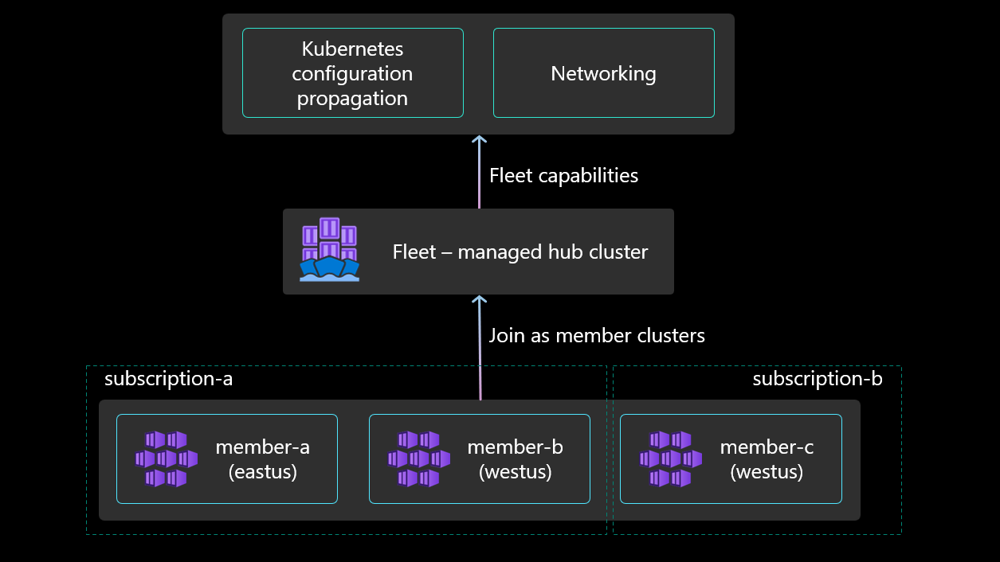
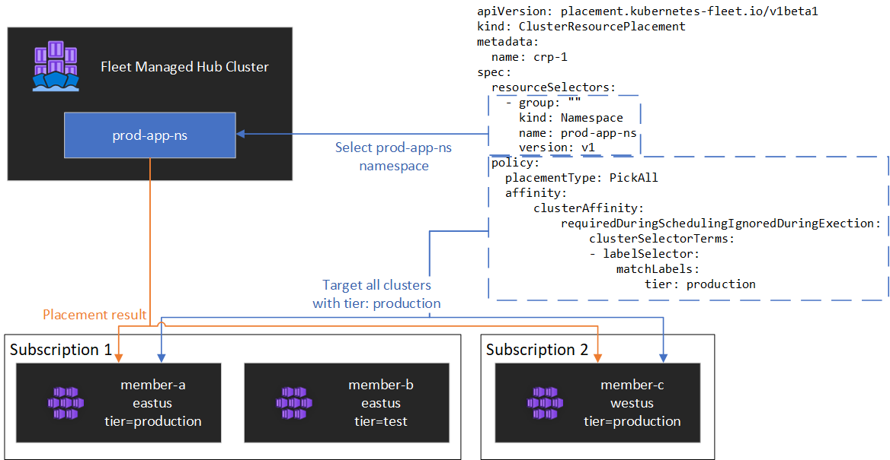
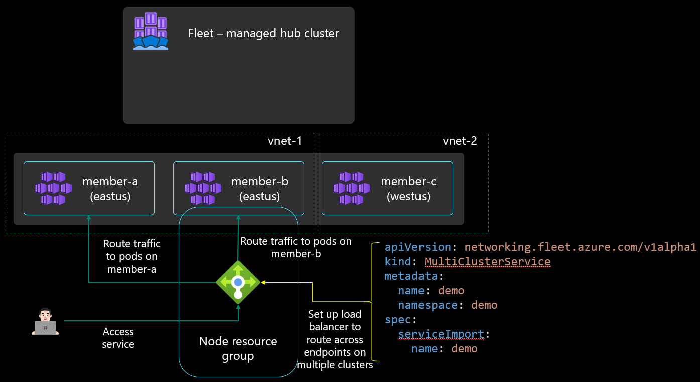

# Architectural overview of Azure Kubernetes Fleet Manager

Azure Kubernetes Fleet Manager (Fleet) solves at-scale and multi-cluster problems of Azure Kubernetes Service (AKS) clusters. This document provides an architectural overview of the relationship between a Fleet resource and AKS clusters. This document also provides a conceptual overview of scenarios available on top of Fleet resource, including update orchestration, Kubernetes resource propagation (preview) and multi-cluster Layer-4 load balancing (preview).

[!INCLUDE [preview features note](./includes/preview/preview-callout.md)]

## Relationship between Fleet and Azure Kubernetes Service clusters

[  ](./media/conceptual-fleet-aks-relationship.png#lightbox)

Fleet supports joining the following types of existing AKS clusters as member clusters:

* AKS clusters across same or different resource groups within same subscription
* AKS clusters across different subscriptions of the same Microsoft Entra tenant
* AKS clusters from different regions but within the same tenant

You can join up to 100 AKS clusters as member clusters to the same fleet resource.

If you want to use fleet only for the update orchestration scenario, you can create a fleet resource without the hub cluster. The fleet resource is treated just as a grouping resource, and does not have its own data plane. This is the default behavior when creating a new fleet resource.

If you want to use fleet for Kubernetes object propagation (preview) and multi-cluster load balancing (preview) in addition to update orchestration, then you need to create the fleet resource with the hub cluster enabled.

Note that once a fleet resource has been created, it is not possible to change the hub mode for the fleet resource.

## Update orchestration across multiple clusters

Platform admins managing Kubernetes fleets with large number of clusters often have problems with staging their updates in a safe and predictable way across multiple clusters. To address this pain point, Kubernetes Fleet Manager (Fleet) allows you to orchestrate updates across multiple clusters using update runs, stages, groups, and strategies.

:::image type="content" source="./media/conceptual-update-orchestration-inline.png" alt-text="A diagram showing an upgrade run containing two update stages, each containing two update groups with two member clusters." lightbox="./media/conceptual-update-orchestration.png":::

* **Update run**: An update run represents an update being applied to a collection of AKS clusters. An update run updates clusters in a predictable fashion by defining update stages and update groups. An update run can be stopped and started.
* **Update stage**: Update runs are divided into stages which are applied sequentially. For example, a first update stage might update test environment member clusters, and a second update stage would then subsequently update production environment member clusters. A wait time can be specified to delay between the application of subsequent update stages.
* **Update group**: Each update stage contains one or more update groups, which are used to select the member clusters to be updated. Update groups are also used to order the application of updates to member clusters. Within an update stage, updates are applied to all the different update groups in parallel; within an update group, member clusters update sequentially. Each member cluster of the fleet can only be a part of one update group.
* **Update strategy**: Update strategies allows you to store templates for your update runs instead of creating them individually for each update run.

Currently, the supported update operations on the cluster are upgrades. Within upgrades, you can either upgrade both the Kubernetes control plane version and the node image, or you can choose to upgrade only the node image. The latest available node image for a given cluster may vary based on its region (check [release tracker](../aks/release-tracker.md) for more information). Node image upgrades currently support upgrading each cluster to the latest node image available in its region, or applying a consistent node image across all clusters of the update run, regardless of the cluster regions. In this case the update run picks the **latest common** image across all these regions to achieve consistency.

## Member cluster representation on the hub

 Once each cluster is joined to a fleet resource, a corresponding MemberCluster custom resource is created on the fleet hub.

The member clusters can be viewed by running the following command:

```bash
kubectl get memberclusters -o yaml
```

The complete specification of the `MemberCluster` custom resource can be viewed by running the following command:

```bash
kubectl get crd memberclusters.fleet.azure.com -o yaml
```

The following labels are added automatically to all member clusters, which can then be used for target cluster selection in resource propagation.

* `fleet.azure.com/location`
* `fleet.azure.com/resource-group`
* `fleet.azure.com/subscription-id`

## Kubernetes resource propagation

Fleet provides `ClusterResourcePlacement` as a mechanism to control how cluster-scoped Kubernetes resources are propagated to member clusters. For more details, see the [resource propagation documentation](resource-propagation.md).

[  ](./media/conceptual-resource-propagation.png#lightbox)

## Multi-cluster load balancing

Fleet can be used to set up layer 4 multi-cluster load balancing across workloads deployed across a fleet's member clusters.

[  ](./media/conceptual-load-balancing.png#lightbox)

For multi-cluster load balancing, Fleet requires target clusters to be using [Azure CNI networking](../aks/configure-azure-cni.md). Azure CNI networking enables pod IPs to be directly addressable on the Azure virtual network so that they can be routed to from the Azure Load Balancer.

The ServiceExport itself can be propagated from the fleet cluster to a member cluster using the Kubernetes resource propagation feature, or it can be created directly on the member cluster. Once this ServiceExport resource is created, it results in a ServiceImport being created on the fleet cluster, and all other member clusters to build the awareness of the service

The user can then create a `MultiClusterService` custom resource to indicate that they want to set up Layer 4 multi-cluster load balancing. This `MultiClusterService` results in the member cluster mapped Azure Load Balancer being configured to load balance incoming traffic across endpoints of this service on multiple member clusters.

## Next steps

* Create an [Azure Kubernetes Fleet Manager resource and join member clusters](./quickstart-create-fleet-and-members.md)
