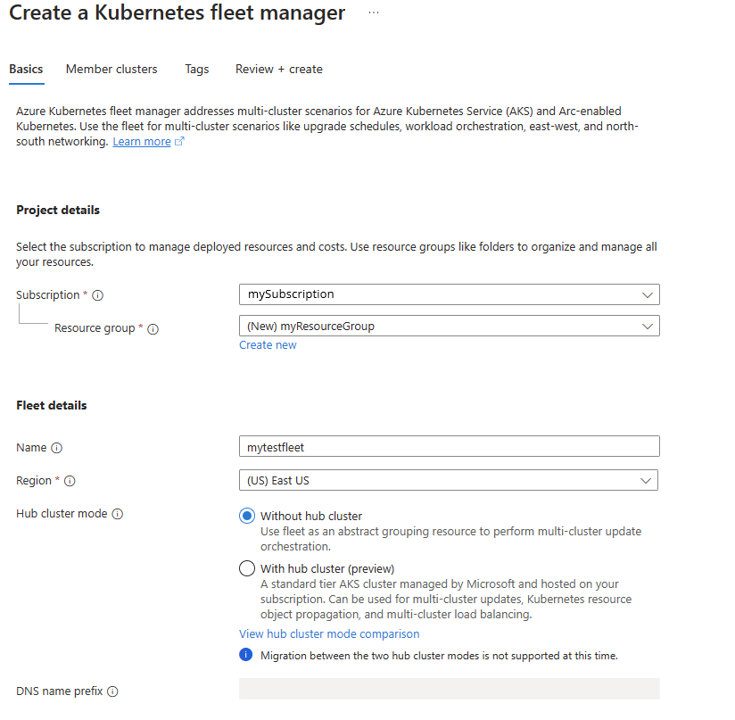
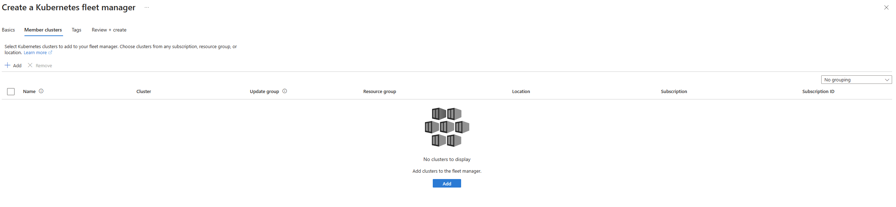

# Quickstart: Create an Azure Kubernetes Fleet Manager resource and join member clusters using Azure portal

Get started with Azure Kubernetes Fleet Manager (Fleet) by using the Azure portal to create a Fleet resource and later connect Azure Kubernetes Service (AKS) clusters as member clusters.

## Prerequisites

* Read the [conceptual overview of this feature](./concepts-fleet.md), which provides an explanation of fleets and member clusters referenced in this document.
* An Azure account with an active subscription. [Create an account for free](https://azure.microsoft.com/free/?WT.mc_id=A261C142F).
* An identity (user or service principal) with the following permissions on the Fleet and AKS resource types for completing the steps listed in this quickstart:

  * Microsoft.ContainerService/fleets/read
  * Microsoft.ContainerService/fleets/write
  * Microsoft.ContainerService/fleets/members/read
  * Microsoft.ContainerService/fleets/members/write
  * Microsoft.ContainerService/fleetMemberships/read
  * Microsoft.ContainerService/fleetMemberships/write
  * Microsoft.ContainerService/managedClusters/read
  * Microsoft.ContainerService/managedClusters/write
  * Microsoft.ContainerService/managedClusters/listClusterUserCredential/action

* The AKS clusters that you want to join as member clusters to the Fleet resource need to be within the supported versions of AKS. Learn more about AKS version support policy [here](../aks/supported-kubernetes-versions.md#kubernetes-version-support-policy).

## Create a Fleet resource

1. Sign in to the [Azure portal](https://portal.azure.com/).
2. On the Azure portal home page, select **Create a resource**.
3. In the search box, enter **Kubernetes Fleet Manager** and select **Create > Kubernetes Fleet Manager** from the search results.
4. On the **Basics** tab, configure the following options:

    * Under **Project details**:
      * **Subscription**: Select the Azure subscription that you want to use.
      * **Resource group**: Select an existing resource group or select **Create new** to create a new resource group.
    * Under **Fleet details**:
      * **Name**: Enter a unique name for the Fleet resource.
      * **Region**: Select the region where you want to create the Fleet resource.
      * **Hub cluster mode**: Select **Without hub cluster** if you want to use Fleet only for update orchestration. Select **With hub cluster (preview)** if you want to use Fleet for Kubernetes object propagation and multi-cluster load balancing in addition to update orchestration.

    

5. Select **Next: Member clusters**.
6. On the **Member clusters** tab, select **Add** to add an existing AKS cluster as a member cluster to the Fleet resource. You can add multiple member clusters to the Fleet resource.

    

7. Select **Review + create** > **Create** to create the Fleet resource.

    It takes a few minutes to create the Fleet resource. When your deployment is complete, you can navigate to your resource by selecting **Go to resource**.

## Next steps

* [Orchestrate updates across multiple member clusters](./update-orchestration.md).
* [Set up Kubernetes resource propagation from hub cluster to member clusters](./resource-propagation.md).
* [Set up multi-cluster layer-4 load balancing](./l4-load-balancing.md).
