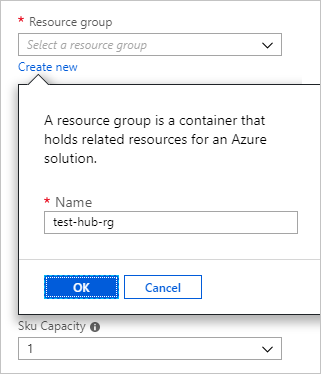
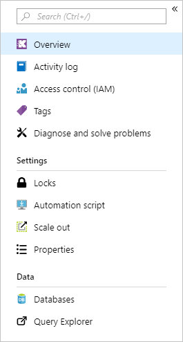
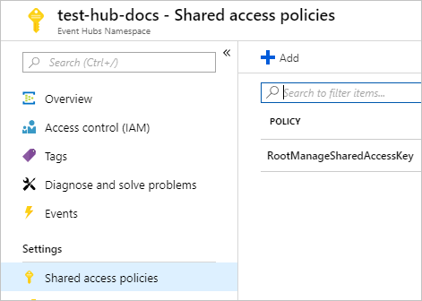
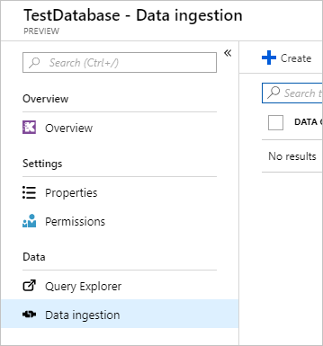
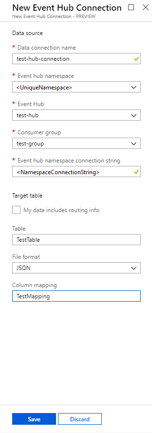

# Quickstart: Ingest data from Event Hub into Azure Data Explorer

Azure Data Explorer is a log analytics platform that is optimized for ad-hoc big data queries. Data Explorer offers ingestion (data loading) from Event Hubs, a big data streaming platform and event ingestion service. Event Hubs can process millions of events per second in near real-time. In this quickstart, create an event hub, connect to it from Data Explorer and see data flow through the system.

## Prerequisites

* An Azure Subscription. If you don't have an Azure subscription, create a [free Azure account](https://azure.microsoft.com/free/) before you begin.

* To complete this quickstart, first [create a test cluster and database](create-cluster-database-portal.md) in Data Explorer.

* Download the [sample app](https://github.com/Azure-Samples/event-hubs-dotnet-ingest) that generates data.

* Running the sample app requires [Visual studio 2017 Version 15.3.2 or greater](https://www.visualstudio.com/vs/).

## Sign in to the Azure portal

Sign in to the [Azure portal](https://portal.azure.com/).

## Create an event hub

In this quickstart, you generate sample data and send it to an event hub. The first step is to create an event hub. You do this by using an Azure Resource Manager (ARM) template in the Azure portal.

1. Select the following button to start the deployment.

    [](https://portal.azure.com/#create/Microsoft.Template/uri/https%3A%2F%2Fraw.githubusercontent.com%2FAzure%2Fazure-quickstart-templates%2Fmaster%2F201-event-hubs-create-event-hub-and-consumer-group%2Fazuredeploy.json)

    The **Deploy to Azure** button takes you to the Azure portal to fill out a deployment form.

    

1. Select the subscription where you want to create the event hub, and create a resource group named *test-hub-rg*.

    

1. Fill out the form with the following information.

    

    Use defaults for any settings not listed in the following table.

    **Setting** | **Suggested value** | **Field description**
    |---|---|---|
    | Subscription | Your subscription | Select the Azure subscription that you want to use for your event hub.|
    | Resource group | *test-hub-rg* | Create a new resource group. |
    | Location | *West US* | Select *West US* for this quickstart. For a production system, select the region that best meets your needs.
    | Namespace name | A unique namespace name | Choose a unique name that identifies your namespace. For example, *mytestnamespace*. The domain name *servicebus.windows.net* is appended to the name you provide. The name can contain only letters, numbers, and hyphens. The name must start with a letter, and it must end with a letter or number. The value must be between 6 and 50 characters long.
    | Event hub name | *test-hub* | The event hub sits under the namespace, which provides a unique scoping container. The event hub name must be unique within the namespace. |
    | Consumer group name | *test-group* | Consumer groups enable multiple consuming applications to each have a separate view of the event stream. |
    | | |

1. Select **Purchase**, which acknowledges that you're creating resources in your subscription.

1. Select **Notifications** on the toolbar (the bell icon) to monitor the provisioning process.

    It might take several minutes for the deployment to succeed, but you can move on to the next step.

## Create a target table in Data Explorer

Create a table in Data Explorer, to which Event Hubs will send data. You create the table in the cluster and database provisioned in Prerequisites.

1. In the Azure portal, under the cluster you created, select **Query Explorer**.

    

1. Copy the following command into the window and select **Run**.

    ```Kusto
    .create table TestTable (TimeStamp: datetime, Name: string, Metric: int, Source:string)
    ```

    

1. Copy the following command into the window and select **Run**.

    ```Kusto
    .create table TestTable ingestion json mapping 'TestMapping' '[{"column":"TimeStamp","path":"$.timeStamp","datatype":"datetime"},{"column":"Name","path":"$.name","datatype":"string"},{"column":"Metric","path":"$.metric","datatype":"int"},{"column":"Source","path":"$.source","datatype":"string"}]'
    ```
    This command maps incoming JSON data to the column names and data types used when creating the table.

## Connect to the event hub

Connect to the event hub from Data Explorer, so that data flowing into the event hub is streamed to the test table.

1. Select **Notifications** on the toolbar to verify that the event hub deployment was successful.

1. Under the event hub namespace you created, select **Shared access policies**, then **RootManageSharedAccessKey**.

    

1. Copy **Connection string - primary key**. You need this shortly.

    

1. Under the cluster you created, select **Databases** then **TestDatabase**.

    

1. Select **Data ingestion** then **Create**.

    

1. Fill out the form with the following information.

    

    **Setting** | **Suggested value** | **Field description**
    |---|---|---|
    | Data connection name | *test-hub-connection* | The name of the connection you want to create in Data Explorer.|
    | Event hub namespace | A unique namespace name | The name you chose earlier that identifies your namespace. |
    | Event hub | *test-hub* | The event hub you created. |
    | Consumer group | *test-group* | The consumer group defined in the event hub you created. |
    | Event hub namespace connection string | A unique string from your namespace | The string you copied earlier from **Connection string - primary key**. |
    | Table | *TestTable* | The table you created in **TestDatabase**. |
    | File format | *JSON* | JSON and CSV formats are supported. |
    | Column mapping | *TestMapping* | The mapping you created in **TestDatabase**. |

    For this quickstart, you use *static routing* from the event hub, where you specify the table name, file format, and mapping. You can also use dynamic routing, where your application sets these properties.

## Generate sample data

Now that Data Explorer and the event hub are connected, use the sample app you downloaded to generate data.

1. Open the sample app solution in Visual Studio.

1. In the *program.cs* file, update the `connectionString` constant to the connection string you copied from the event hub namespace.

    ```csharp
    const string eventHubName = "test-hub";
    // Copy the connection string ("Connection string-primary key") from your Event Hub namespace.
    const string connectionString = @"<YourConnectionString>";
    ```

1. Build and run the app. The app sends a message to the event hub every ten seconds, labeled *message 3*, *message 6*, *message 9*, and so on.

1. After the app has sent a few messages, move on to the next step: reviewing the flow of data into your event hub and test table.

## Review the data flow

1. In the Azure portal, under your event hub, you see the spike in activity while the app is running.

    

1. Go back to the app and stop it after it reaches message 99.

1. Run the following query in your test database to check whether all the messages have made it to the database.

    ```Kusto
    TestTable
    | count
    ```

1. Run the following query to see the content of the messages.

    ```Kusto
    TestTable
    ```

## Clean up resources

If you don't plan to use your event hub again, delete the resource group *test-hub-rg*.

1. In the Azure portal, select **Resource groups** on the far left, then select the resource group you created.  

    If the left menu is collapsed, select  to expand.

   

1. In the new window, select the resource group, and then select **Delete resource group**.

   

1. In the new window, type the name of the resource group to delete (*test-resource-group*), and then select **Delete**.

## Next steps

> [!div class="nextstepaction"]
> [Explore data](explore-data.md)
