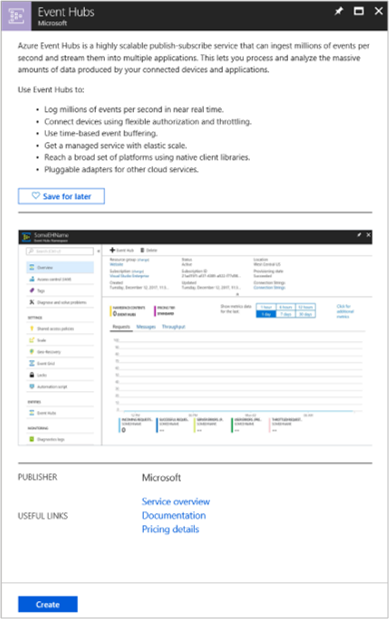
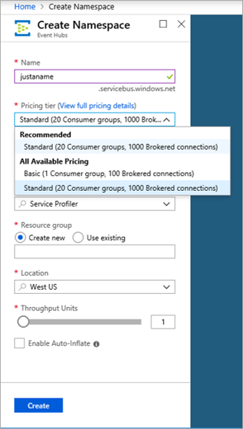
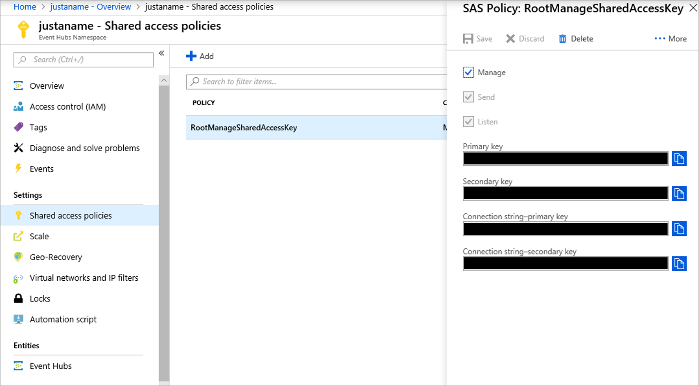
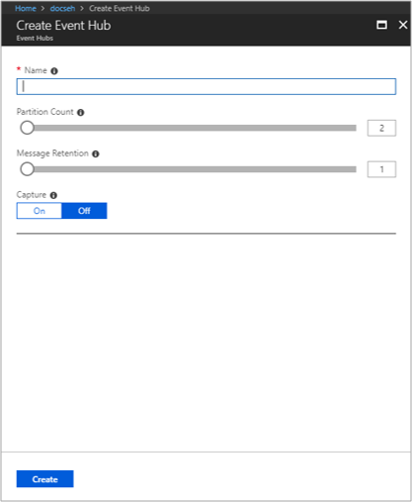
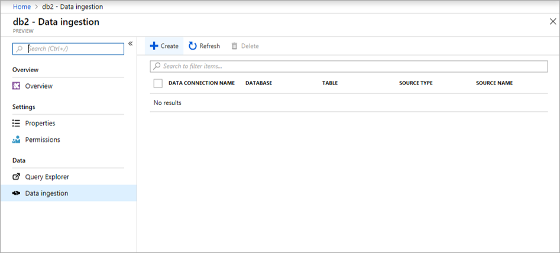
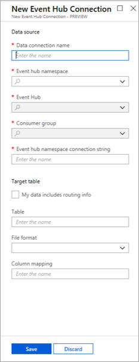

# Quickstart: Ingest data from Event Hub into Azure Kusto

Azure Kusto offers ingestion from [Event Hubs](https://docs.microsoft.com/en-us/azure/event-hubs/event-hubs-about), a big data streaming platform and event ingestion service that can handle the processing of millions of events per second in near real-time.

## Data format

* Kusto will read data from the Event Hub in form of [EventData](https://docs.microsoft.com/en-us/dotnet/api/microsoft.servicebus.messaging.eventdata?view=azure-dotnet) objects.
* Event payload must contain one or more records to be ingested, uncompressed.
* Supported formats are CSV and JSON.

## Events routing

Event Hub ingestion can be set up for either static or dynamic events routing:

* Dynamic routing means that events read from a single Event Hub can land in different tables in your Kusto cluster. This requires the following properties to be added to the [EventData.Properties](https://docs.microsoft.com/en-us/dotnet/api/microsoft.servicebus.messaging.eventdata.properties?view=azure-dotnet#Microsoft_ServiceBus_Messaging_EventData_Properties) bag:

  * Table - name (case sensitive) of the target Kusto table

  * Format - payload format ("csv" or "json")

  * IngestionMappingReference - name of the ingestion mapping object (pre-created on the table) to be used
    Kusto provides a control command to [create / edit / delete an ingestion mapping](../controlCommands/tables.md#create-ingestion-mapping).

* Static routing means that there is a 1:1 mapping from an Event Hub to the ingestion properties {Table, Format, IngestionMappingReference}, that need to be specified during onboarding.

## Prerequisites

* An Event Hub: Kusto will read data directly from your Event Hub.

* A Kusto cluster and a database.

* One or more tables. Using 'json' format requires ingestion mapping to be created on table(s).

## Provision an Event Hub

If you already own an Event Hub, skip this part.

* Go to [Event Hubs management](https://ms.portal.azure.com/#create/Microsoft.EventHub).

* Review service overview and pricing details if needed.

* Click 'Create'.

    

* Define your Event Hub Namespace:

  * Provide a name and select pricing tier, according to the expected data volume and rate. Consult [Event Hub pricing](https://azure.microsoft.com/en-us/pricing/details/event-hubs/).

  * Select a subscription, a resource group, and location.

  * Configure throughput. Consult [Event Hub pricing](https://azure.microsoft.com/en-us/pricing/details/event-hubs/).

  * Click 'Create'.

    

  * Event Hub Namespace Connection String: Once the namespace was created, go to 'Shared access policies'. Copy the connection string of 'RootManageSharedAccessKey', you will need it later.

    

* Create an Event Hub:

  * Go to 'Event Hubs' settings and click on add Event Hub.

  * Provide a name. Keep the Event Hub name for later.

  * Select partition count.

  * Select message retention.

  * Click 'Create'.

    

  * Go to the created Event Hub and optionally create a consumer group. A default one is created for you. Copy the consumer group name you wish to be used by Kusto for data ingestion.

## Connect your Event Hub to Kusto as an ingestion source

* Go your database on Azure portal and select 'Data Ingestion' settings.

    

* Provide the following details:
  
  * Data connection name
  
  * Event Hub namespace connection string
  
  * Event Hub name
  
  * Event Hub resource id
  
  * Consumer group name

* Optionally provide static ingestion properties:
  
  * Table name
  
  * Data format
  
  * Column mapping

* Click 'Create'.

    

Your Event Hub is now connected to your Kusto database. Start sending events to the Event Hub and watch the data flowing.
