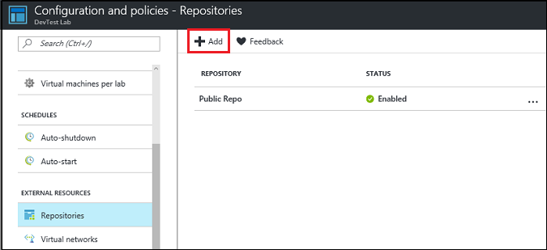

# Add an artifact repository to your lab in DevTest Labs
DevTest Labs allows you to specify an artifact to be added to a VM at the time of creating the VM or after the VM is created. This artifact could be a tool or an application that you want to install on the VM. Artifacts are defined in a JSON file loaded from a GitHub or Azure DevOps Git repository.

The [public artifact repository](https://github.com/Azure/azure-devtestlab/tree/master/Artifacts), maintained by DevTest Labs, provides many common tools for both Windows and Linux. A link to this repository is automatically added to your lab. You can create your own artifact repository with specific tools that aren't available in the public artifact repository. To learn about creating custom artifacts, see [Create custom artifacts](devtest-lab-artifact-author.md).

This article provides information on how to add your custom artifact repository by using Azure portal, Azure Resource Management templates, and Azure PowerShell. You can automate adding an artifact repository to a lab by writing PowerShell or CLI scripts.

[!INCLUDE [updated-for-az](../../includes/updated-for-az.md)]

## Prerequisites
To add a repository to your lab, first, get key information from your repository. The following sections describe how to get the required information for repositories that are hosted on **GitHub** or **Azure DevOps**.

### Get the GitHub repository clone URL and personal access token

1. Go to the home page of the GitHub repository that contains the artifact or Resource Manager template definitions.
2. Select **Clone or download**.
3. To copy the URL to the clipboard, select the **HTTPS clone url** button. Save the URL for later use.
4. In the upper-right corner of GitHub, select the profile image, and then select **Settings**.
5. In the **Personal settings** menu on the left, select **Developer Settings**.
6. Select **Personal access tokens** on the left menu.
7. Select **Generate new token**.
8. On the **New personal access token** page, under **Token description**, enter a description. Accept the default items under **Select scopes**, and then select **Generate Token**.
9. Save the generated token. You use the token later.
10. Close GitHub.   

### Get the Azure Repos clone URL and personal access token
1. Go to the home page of your team collection (for example, https://contoso-web-team.visualstudio.com), and then select your project.
2. On the project home page, select **Code**.
3. To view the clone URL, on the project **Code** page, select **Clone**.
4. Save the URL. You use the URL later.
5. To create a personal access token, in the user account drop-down menu, select **My profile**.
6. On the profile information page, select **Security**.
7. On the **Security** tab, select **Add**.
8. On the **Create a personal access token** page:
   1. Enter a **Description** for the token.
   2. In the **Expires In** list, select **180 days**.
   3. In the **Accounts** list, select **All accessible accounts**.
   4. Select the **All scopes** option.
   5. Select **Create Token**.
9. The new token appears in the **Personal Access Tokens** list. Select **Copy Token**, and then save the token value for later use.
10. Continue to the Connect your lab to the repository section.

## Use Azure portal
This section provides steps to add an artifact repository to a lab in the Azure portal.

1. Sign in to the [Azure portal](https://portal.azure.com).
2. Select **More Services**, and then select **DevTest Labs** from the list of services.
3. From the list of labs, select your lab.
4. Select **Configuration and policies** on the left menu.
5. Select **Repositories** under **External resources** section on the left menu.
6. Select **+ Add** on the toolbar.

    
5. On the **Repositories** page, specify the following information:
   1. **Name**. Enter a name for the repository.
   2. **Git Clone Url**. Enter the Git HTTPS clone URL that you copied earlier from either GitHub or Azure DevOps Services.
   3. **Branch**. To get your definitions, enter the branch.
   4. **Personal Access Token**. Enter the personal access token that you got earlier from either GitHub or Azure DevOps Services.
   5. **Folder Paths**. Enter at least one folder path relative to the clone URL that contains your artifact or Resource Manager template definitions. When you specify a subdirectory, make sure you include the forward slash in the folder path.

        
6. Select **Save**.

## Use Azure Resource Manager template
Azure Resource Management (Azure Resource Manager) templates are JSON files that describe resources in Azure that you want to create. For more information about these templates, see [Authoring Azure Resource Manager templates](../azure-resource-manager/templates/template-syntax.md).

This section provides steps to add an artifact repository to a lab by using an Azure Resource Manager template.  The template creates the lab if it doesn't already exist.

### Template
The sample template used in this article gathers the following information via parameters. Most of the parameters do have smart defaults, but there are a few values that must be specified. You must specify the lab name, URI for the artifact repository, and the security token for the repository.

- Lab name.
- Display name for the artifact repository in the DevTest Labs user interface (UI). The default value is: `Team Repository`.
- URI to the repository (Example: `https://github.com/<myteam>/<nameofrepo>.git` or `"https://MyProject1.visualstudio.com/DefaultCollection/_git/TeamArtifacts"`.
- Branch in the repository that contains artifacts. The default value is: `master`.
- Name of the folder that contains artifacts. The default value is: `/Artifacts`.
- Type of the repository. Allowed values are `VsoGit` or `GitHub`.
- Access token for the repository.

    ```json
    {

    	"$schema": "https://schema.management.azure.com/schemas/2015-01-01/deploymentTemplate.json#",
    	"contentVersion": "1.0.0.0",
    	"parameters": {
    		"labName": {
    			"type": "string"
    		},
    		"artifactRepositoryDisplayName": {
    			"type": "string",
    			"defaultValue": "Team Repository"
    		},
    		"artifactRepoUri": {
    			"type": "string"
    		},
    		"artifactRepoBranch": {
    			"type": "string",
    			"defaultValue": "master"
    		},
    		"artifactRepoFolder": {
    			"type": "string",
    			"defaultValue": "/Artifacts"
    		},
    		"artifactRepoType": {
    			"type": "string",
    			"allowedValues": ["VsoGit", "GitHub"]
    		},
    		"artifactRepoSecurityToken": {
    			"type": "securestring"
    		}
    	},
    	"variables": {
    		"artifactRepositoryName": "[concat('Repo-', uniqueString(subscription().subscriptionId))]"
    	},
    	"resources": [{
    			"apiVersion": "2016-05-15",
    			"type": "Microsoft.DevTestLab/labs",
    			"name": "[parameters('labName')]",
    			"location": "[resourceGroup().location]",
    			"resources": [
    				{
    					"apiVersion": "2016-05-15",
    					"name": "[variables('artifactRepositoryName')]",
    					"type": "artifactSources",
    					"dependsOn": [
    						"[resourceId('Microsoft.DevTestLab/labs', parameters('labName'))]"
    					],
    					"properties": {
    						"uri": "[parameters('artifactRepoUri')]",
    						"folderPath": "[parameters('artifactRepoFolder')]",
    						"branchRef": "[parameters('artifactRepoBranch')]",
    						"displayName": "[parameters('artifactRepositoryDisplayName')]",
    						"securityToken": "[parameters('artifactRepoSecurityToken')]",
    						"sourceType": "[parameters('artifactRepoType')]",
    						"status": "Enabled"
    					}
    				}
    			]
    		}
    	]
    }
    ```


### Deploy the template
There are a few ways to deploy the template to Azure and have the resource created, if it doesn’t exist, or updated, if it does exist. For details, see the following articles:

- [Deploy resources with Resource Manager templates and Azure PowerShell](../azure-resource-manager/templates/deploy-powershell.md)
- [Deploy resources with Resource Manager templates and Azure CLI](../azure-resource-manager/templates/deploy-cli.md)
- [Deploy resources with Resource Manager templates and Azure portal](../azure-resource-manager/templates/deploy-portal.md)
- [Deploy resources with Resource Manager templates and Resource Manager REST API](../azure-resource-manager/templates/deploy-rest.md)

Let’s go ahead and see how to deploy the template in PowerShell. Cmdlets used to deploy the template are context-specific, so current tenant and current subscription are used. Use [Set-AzContext](/powershell/module/az.accounts/set-azcontext) before deploying the template, if needed, to change context.

First, create a resource group using [New-AzResourceGroup](/powershell/module/az.resources/new-azresourcegroup). If the resource group you want to use already exists, skip this step.

```powershell
New-AzResourceGroup -Name MyLabResourceGroup1 -Location westus
```

Next, create a deployment to the resource group using [New-AzResourceGroupDeployment](/powershell/module/az.resources/new-azresourcegroupdeployment). This cmdlet applies the resource changes to Azure. Several resource deployments can be made to any given resource group. If you are deploying several times to the same resource group, make sure the name of each deployment is unique.

```powershell
New-AzResourceGroupDeployment `
    -Name MyLabResourceGroup-Deployment1 `
    -ResourceGroupName MyLabResourceGroup1 `
    -TemplateFile azuredeploy.json `
    -TemplateParameterFile azuredeploy.parameters.json
```

After New-AzResourceGroupDeployment run successfully, the command outputs important information like the provisioning state (should be succeeded) and any outputs for the template.

## Use Azure PowerShell
This section provides you a sample PowerShell script that can be used to add an artifact repository to a lab. If you don't have Azure PowerShell, see [How to install and configure Azure PowerShell](/powershell/azure/overview?view=azps-1.2.0) for detailed instructions to install it.

### Full script
Here is the full script, including some verbose messages and comments:

**New-DevTestLabArtifactRepository.ps1**:

```powershell

<#

.SYNOPSIS
This script creates a new custom repository and adds it to an existing DevTest Lab.

.PARAMETER LabName
The name of the lab.

.PARAMETER LabResourceGroupName
The name of the resource group that contains the lab.

.PARAMETER ArtifactRepositoryName
Name for the new artifact repository.
Script creates a random name for the respository if it is not specified.

.PARAMETER ArtifactRepositoryDisplayName
Display name for the artifact repository.
This is the name that shows up in the Azure portal (https://portal.azure.com) when viewing all the artifact repositories for a lab.

.PARAMETER RepositoryUri
Uri to the repository.

.PARAMETER RepositoryBranch
Branch in which artifact files can be found. Defaults to 'master'.

.PARAMETER FolderPath
Folder under which artifacts can be found. Defaults to '/Artifacts'

.PARAMETER PersonalAccessToken
Security token for access to GitHub or VSOGit repository.
See https://azure.microsoft.com/documentation/articles/devtest-lab-add-artifact-repo/ for instructions to get personal access token

.PARAMETER SourceType
Whether artifact is VSOGit or GitHub repository.

.EXAMPLE
Set-AzContext -SubscriptionId 11111111-1111-1111-1111-111111111111
.\New-DevTestLabArtifactRepository.ps1 -LabName "mydevtestlab" -LabResourceGroupName "mydtlrg" -ArtifactRepositoryName "MyTeam Repository" -RepositoryUri "https://github.com/<myteam>/<nameofrepo>.git" -PersonalAccessToken "1111...." -SourceType "GitHub"

.NOTES
Script uses the current Az context. To set the context, use the Set-AzContext cmdlet

#>


[CmdletBinding()]
Param(

    [Parameter(Mandatory=$true)]
    $LabName,

    [Parameter(Mandatory=$true)]
    $LabResourceGroupName,
    $ArtifactRepositoryName,
    $ArtifactRepositoryDisplayName  = 'Team Artifact Repository',

    [Parameter(Mandatory=$true)]
    $RepositoryUri,
    $RepositoryBranch = 'master',
    $FolderPath = '/Artifacts',

    [Parameter(Mandatory=$true)]
    $PersonalAccessToken ,

    [Parameter(Mandatory=$true)]
    [ValidateSet('VsoGit', 'GitHub')]
    $SourceType
)


#Set artifact repository internal name,
# if not set by user.

if ($ArtifactRepositoryName -eq $null){
    $ArtifactRepositoryName = "PrivateRepo" + (Get-Random -Maximum 999)
}

# Sign in to Azure
Connect-AzAccount


#Get Lab Resource
$LabResource = Get-AzResource -ResourceType 'Microsoft.DevTestLab/labs' -ResourceName $LabName -ResourceGroupName $LabResourceGroupName

Write-Verbose "Lab Name: $($LabResource.Name)"
Write-Verbose "Lab Resource Group Name: $($LabResource.ResourceGroupName)"
Write-Verbose "Lab Resource Location: $($LabResource.Location)"

Write-Verbose "Artifact Repository Internal Name: $ArtifactRepositoryName"

#Prepare properties object for call to New-AzResource
$propertiesObject = @{
    uri = $RepositoryUri;
    folderPath = $FolderPath;
    branchRef = $RepositoryBranch;
    displayName = $ArtifactRepositoryDisplayName;
    securityToken = $PersonalAccessToken;
    sourceType = $SourceType;
    status = 'Enabled'
}

Write-Verbose @"Properties to be passed to New-AzResource:$($propertiesObject | Out-String)"

#Resource will be added to current subscription.
$resourcetype = 'Microsoft.DevTestLab/labs/artifactSources'
$resourceName = $LabName + '/' + $ArtifactRepositoryName
Write-Verbose "Az ResourceType: $resourcetype"
Write-Verbose "Az ResourceName: $resourceName"

Write-Verbose "Creating artifact repository '$ArtifactRepositoryDisplayName'..."
$result = New-AzResource -Location $LabResource.Location -ResourceGroupName $LabResource.ResourceGroupName -properties $propertiesObject -ResourceType $resourcetype -ResourceName $resourceName -ApiVersion 2016-05-15 -Force


#Alternate implementation:
# Use resourceId rather than resourcetype and resourcename parameters.
# Using resourceId allows you to specify the $SubscriptionId rather than using the
# subscription id of Get-AzContext.
#$resourceId = "/subscriptions/$SubscriptionId/resourceGroups/$($LabResource.ResourceGroupName)/providers/Microsoft.DevTestLab/labs/$LabName/artifactSources/$ArtifactRepositoryName"
#$result = New-AzResource -properties $propertiesObject -ResourceId $resourceId -ApiVersion 2016-05-15 -Force


# Check the result
if ($result.Properties.ProvisioningState -eq "Succeeded") {
    Write-Verbose ("Successfully added artifact repository source '$ArtifactRepositoryDisplayName'")
}
else {
    Write-Error ("Error adding artifact repository source '$ArtifactRepositoryDisplayName'")
}

#Return the newly created resource so it may be used in subsequent scripts
return $result
```

### Run the PowerShell script
The following example shows you how to run the script:

```powershell
Set-AzContext -SubscriptionId <Your Azure subscription ID>

.\New-DevTestLabArtifactRepository.ps1 -LabName "mydevtestlab" -LabResourceGroupName "mydtlrg" -ArtifactRepositoryName "MyTeam Repository" -RepositoryUri "https://github.com/<myteam>/<nameofrepo>.git" -PersonalAccessToken "1111...." -SourceType "GitHub"
```


### Parameters
The sample PowerShell script in this article takes the following parameters:

| Parameter | Description |
| --------- | ----------- |
| LabName | The name of the lab. |
| ArtifactRepositoryName | Name for the new artifact repository. The script creates a random name for the respository if it is not specified. |
| ArtifactRepositoryDisplayName | Display name for the artifact repository. This is the name that shows up in the Azure portal (https://portal.azure.com) when viewing all the artifact repositories for a lab. |
| RepositoryUri | Uri to the repository. Examples: `https://github.com/<myteam>/<nameofrepo>.git` or `"https://MyProject1.visualstudio.com/DefaultCollection/_git/TeamArtifacts"`.|
| RepositoryBranch | Branch in which artifact files can be found. Defaults to 'master'. |
| FolderPath | Folder under which artifacts can be found. Defaults to '/Artifacts' |
| PersonalAccessToken | Security token for accessing the GitHub or VSOGit repository. See the prerequisites section for instructions to get personal access token |
| SourceType | Whether artifact is VSOGit or GitHub repository. |

The repository itself need an internal name for identification, which is different that the display name that is seen in the Azure portal. You do not see the internal name using the Azure portal, but you see it when using Azure REST APIs or Azure PowerShell. The script provides a name, if one is not specified by the user of our script.

```powershell
#Set artifact repository name, if not set by user
if ($ArtifactRepositoryName -eq $null){
    $ArtifactRepositoryName = "PrivateRepo" + (Get-Random -Maximum 999)
}
```

### PowerShell commands used in the script

| PowerShell command | Notes |
| ------------------ | ----- |
| [Get-AzResource](/powershell/module/az.resources/get-azresource) | This command is used to get details about the lab such as its location. |
| [New-AzResource](/powershell/module/az.resources/new-azresource) | There is no specific command for adding artifact repositories. The generic [New-AzResource](/powershell/module/az.resources/new-azresource) cmdlet does the job. This cmdlet needs either the **ResourceId** or the **ResourceName** and **ResourceType** pair to know the type of resource to create. This sample script uses the resource name and resource type pair. <br/><br/>Notice that you are creating the artifact repository source in the same location and under the same resource group as the lab.|

The script adds a new resource to the current subscription. Use [Get-AzContext](/powershell/module/az.accounts/get-azcontext) to see this information. Use [Set-AzContext](/powershell/module/az.accounts/set-azcontext) to set the current tenant and subscription.

The best way to discover the resource name and resource type information is to use the [Test Drive Azure REST APIs](https://azure.github.io/projects/apis/) website. Check out the [DevTest Labs – 2016-05-15](https://aka.ms/dtlrestapis) provider to see the available REST APIs for the DevTest Labs provider. The script users the following resource ID.

```powershell
"/subscriptions/$SubscriptionId/resourceGroups/$($LabResource.ResourceGroupName)/providers/Microsoft.DevTestLab/labs/$LabName/artifactSources/$ArtifactRepositoryName"
```

The resource type is everything listed after ‘providers’ in the URI, except for items listed in the curly brackets. The resource name is everything seen in the curly brackets. If more than one item is expected for the resource name, separate each item with a slash as we have done.

```powershell
$resourcetype = 'Microsoft.DevTestLab/labs/artifactSources'
$resourceName = $LabName + '/' + $ArtifactRepositoryName
```


## Next steps
- [Specify mandatory artifacts for your lab in Azure DevTest Labs](devtest-lab-mandatory-artifacts.md)
- [Create custom artifacts for your DevTest Labs virtual machine](devtest-lab-artifact-author.md)
- [Diagnose artifact failures in the lab](devtest-lab-troubleshoot-artifact-failure.md)
