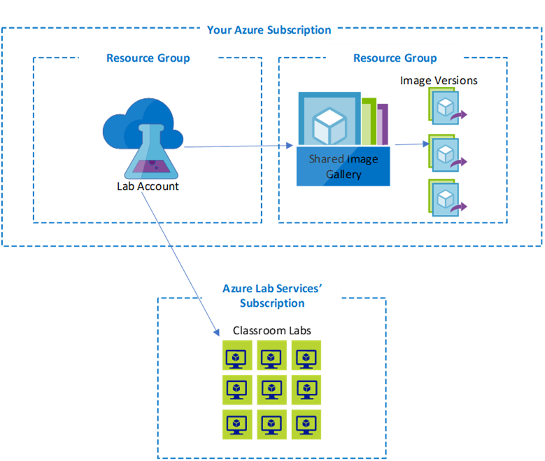

# Azure Lab Services - Administrator guide when using lab accounts

[!INCLUDE [lab account focused article](./includes/lab-services-labaccount-focused-article.md)]

Information technology (IT) administrators who manage a university's cloud resources are ordinarily responsible for setting up the lab account for their school. After they've set up a lab account, administrators or educators create the labs that are contained within the account. This article provides a high-level overview of the Azure resources that are involved and the guidance for creating them.

- Labs are hosted within an Azure subscription that's owned by Azure Lab Services.
- Lab accounts, a shared image gallery, and image versions are hosted within your subscription.
- You can have your lab account and the shared image gallery in the same resource group. In this diagram, they are in different resource groups.

For more information about the architecture, see [Labs architecture fundamentals](./classroom-labs-fundamentals.md).

## Subscription

Your university might have one or more Azure subscriptions. You use subscriptions to manage billing and security for all Azure resources and services that are used within it, including lab accounts.

The relationship between a lab account and its subscription is important because:

- Billing is reported through the subscription that contains the lab account.
- You can grant users in the subscription's Microsoft Entra tenant access to Azure Lab Services. You can add a user as a lab account Owner or Contributor, or as a Lab Creator or lab Owner.

Labs and their virtual machines (VMs) are managed and hosted for you within a subscription that's owned by Azure Lab Services.

## Resource group

A subscription contains one or more resource groups. Resource groups are used to create logical groupings of Azure resources that are used together within the same solution.  

When you create a lab account, you must configure the resource group that contains the lab account.

A resource group is also required when you create a [shared image gallery](#shared-image-gallery). You can place your lab account and shared image gallery in the same resource group or in two separate resource groups. You might want to take this second approach if you plan to share the image gallery across various solutions.

When you create a lab account, you can automatically create and attach a shared image gallery at the same time.  This option results in the lab account and the shared image gallery being created in separate resource groups. You'll see this behavior when you follow the steps that are described in the [Configure shared image gallery at the time of lab account creation](how-to-attach-detach-shared-image-gallery-1.md#configure-at-the-time-of-lab-account-creation) tutorial. The image at the beginning of this article uses this configuration.

We recommend that you invest time up front to plan the structure of your resource groups, because it's *not* possible to change a lab account or shared image gallery resource group once it's created. If you need to change the resource group for these resources, you'll need to delete and re-create your lab account or shared image gallery.

## Lab account

A lab account serves as a container for one or more labs. When you're getting started with Azure Lab Services, it's most common to have a single lab account. As your lab usage scales up, you can choose to create more lab accounts later.

The following list highlights scenarios where more than one lab account might be beneficial:

- **Manage different policy requirements across labs**

  When you set up a lab account, you set policies that apply to *all* labs under the lab account, such as:
  - The Azure virtual network with shared resources that the lab can access. For example, you might have a set of labs that need access to a shared data set within a virtual network.
  - The virtual machine images that the labs can use to create VMs. For example, you might have a set of labs that need access to the [Data Science VM for Linux](https://azuremarketplace.microsoft.com/marketplace/apps?search=Data%20science%20Virtual%20machine&page=1&filters=microsoft%3Blinux) Azure Marketplace image.

    If each of your labs has unique policy requirements, it might be beneficial to create separate lab accounts for managing each lab separately.

- **Assign a separate budget to each lab account**
  
    Instead of reporting all lab costs through a single lab account, you might need a more clearly apportioned budget. For example, you can create separate lab accounts for your university's Math department, Computer Science department, and so forth, to distribute the budget across departments.  You can then view the cost for each individual lab account by using [Azure Cost Management](../cost-management-billing/cost-management-billing-overview.md).

- **Isolate pilot labs from active or production labs**
  
    You might have cases where you want to pilot policy changes for a lab account without potentially affecting your active or production labs. In this type of scenario, creating a separate lab account for piloting purposes allows you to isolate changes.

## Lab

A lab contains VMs that are each assigned to a single student.  In general, you can expect to:

- Have one lab for each class.
- Create a new set of labs for each semester, quarter, or other academic system you're using. For classes that need to use the same image, you should use a [shared image gallery](#shared-image-gallery). This way, you can reuse images across labs and academic periods.

When you're determining how to structure your labs, consider the following points:

- **All VMs within a lab are deployed with the same image that's published**

    As a result, if you have a class that requires different lab images to be published at the same time, a separate lab must be created for each image.
  
- **The usage quota is set at the lab level and applies to all users within the lab**

    To set different quotas for users, you must create separate labs. However, it's possible to add more hours to specific users after you've set the quota.
  
- **The startup or shutdown schedule is set at the lab level and applies to all VMs within the lab**

    Similar to quota setting, if you need to set different schedules for users, you need to create a separate lab for each schedule.

By default, each lab has its own virtual network.  If you have virtual network peering enabled, each lab will have its own subnet peered with the specified virtual network.

## Shared image gallery

A shared image gallery is attached to a lab account and serves as a central repository for storing images. An image is saved in the gallery when an educator chooses to export it from a lab's template VM. Each time an educator makes changes to the template VM and exports it, new image definitions and\or versions are created in the gallery.  

Educators can publish an image version from the shared image gallery when they create a new lab. Although the gallery stores multiple versions of an image, educators can select only the most recent version during lab creation.  The most recent version is chosen based on the highest value of MajorVersion, then MinorVersion, then Patch.  For more information about versioning, see [Image versions](../virtual-machines/shared-image-galleries.md#image-versions).

The shared image gallery service is an optional resource that you might not need immediately if you're starting with only a few labs. However, shared image gallery offers many benefits that are helpful as you scale up to more labs:

- **You can save and manage versions of a template VM image**

    It's useful to create a custom image or make changes (software, configuration, and so on) to an image from the Azure Marketplace gallery.  For example, it's common for educators to require different software or tooling be installed. Rather than requiring students to manually install these prerequisites on their own, different versions of the template VM image can be exported to a shared image gallery. You can then use these image versions when you create new labs.

- **You can share and reuse template VM images across labs**

    You can save and reuse an image so that you don't have to configure it from scratch each time that you create a new lab. For example, if multiple classes need to use the same image, you can create it once and export it to the shared image gallery so that it can be shared across labs.

- **You can upload your own custom images from other environments outside of labs**

    You can [upload custom images other environments outside of the context of labs](how-to-attach-detach-shared-image-gallery-1.md).  For example, you can upload images from your own physical lab environment or from an Azure VM into shared image gallery.  Once an image is imported into the gallery, you can then use the images to create labs.

To logically group shared images, you can do either of the following:

- Create multiple shared image galleries. Each lab account can connect to only one shared image gallery, so this option also requires you to create multiple lab accounts.
- Use a single shared image gallery that's shared by multiple lab accounts. In this case, each lab account can enable only images that are applicable to the labs in that account.

## Naming

As you get started with Azure Lab Services, we recommend that you establish naming conventions for Azure and Azure Lab Services related resources.  Although the naming conventions that you establish will be unique to the needs of your organization, the following table provides general guidelines:

| Resource type | Role | Suggested pattern | Examples |
| ------------- | ---- | ----------------- | -------- |
| Resource group | Contains one or more lab plans, labs and/or shared image galleries. |{org-name}labs-{env}-rg, {dept-name}labs-rg | contosolabs-rg, contosolabs-pilot-rg, contosolabs-prod-rg, mathdept-rg |
| Lab account | Contains one or more labs. | {org-name}-{env}-la, {dept-name}-{env}-la | contoso-la, mathdept-la, cs-pilot-la |
| Lab | Contains one or more student VMs. | {class-name}-{time}-{educator} | CS101-Fall2021, CS101-Fall2021-JohnDoe |
| Shared image gallery | Contains one or more VM image versions | {org-name}-sig, {dept-name}-sig | contoso-sig, mathdept-sig |

In the proceeding table, we used some terms and tokens in the suggested name patterns.  Let's go over those terms in a little more detail.

| Pattern term/token | Definition | Example |
| ------------ | ---------- | ------- |
| {org-name} | Token for organization short name with no spaces. | contoso |
| {dept-name} | Token for short name of department in organization. | math, bio, cs |
| {env} | Token for environment name | prod for production, pilot for small test |
| {class-name} | Token for short name or code for class being supported. | CS101, Bio101 |
| {educator} | Alias of educator running the lab. | johndoe |
| {time} | Token for short name (with no spaces) for time the class is being offered. | Spring2021, Dec 2021|
| rg | Indicates resource is a resource group. | |
| la | Indicates resource is a lab account. | |
| sig | Indicates resource is a shared image gallery. | |

For more information about naming other Azure resources, see [Naming conventions for Azure resources](/azure/architecture/best-practices/naming-conventions).

## Regions/locations

When you set up your Azure Lab Services resources, you're required to provide a region or location of the datacenter that will host the resources. The next sections describe how a region or location might affect each resource that's involved with setting up a lab.

### Resource group

The region specifies the datacenter where information about a resource group is stored. Azure resources contained within the resource group can be in a different region from that of their parent.

### Lab account

A lab account's location indicates the region that a resource exists in.  

### Lab

The location that a lab exists in varies, depending on the following factors:

- **The lab account is peered with a virtual network**
  
    You can [peer a lab account with a virtual network](./how-to-connect-peer-virtual-network.md) when they're in the same region.  When a lab account is peered with a virtual network, labs are automatically created in the same region as both the lab account and the virtual network.

    > [!NOTE]
    > When a lab account is peered with a virtual network, the **Allow lab creator to pick lab location** setting is disabled. For more information, see [Allow lab creator to pick location for the lab](./allow-lab-creator-pick-lab-location.md).

- **No virtual network is peered *and* Lab Creators aren't allowed to pick the lab location**
  
    When *no* virtual network is peered with the lab account and [Lab Creators are *not allowed* to pick the lab location](./allow-lab-creator-pick-lab-location.md), labs are automatically created in a region that has available VM capacity.  Specifically, Azure Lab Services looks for availability in [regions that are within the same geography as the lab account](https://azure.microsoft.com/global-infrastructure/regions).

- **No virtual network is peered *and* Lab Creators are allowed to pick the lab location**

    When *no* virtual network is peered and [Lab Creators *are allowed* to pick the lab location](./allow-lab-creator-pick-lab-location.md), the locations that can be selected by the Lab Creator depend on available capacity.

> [!NOTE]
> To help ensure that a region has sufficient VM capacity, it's important to first request capacity through the lab account when you're creating the lab.

A general rule is to set a resource's region to one that's closest to its users. For labs, this means creating the lab that's closest to your students. For online courses whose students are located all over the world, use your best judgment to create a lab that's centrally located. Or you can split a class into multiple labs according to your students' regions.

## VM sizing

When administrators or Lab Creators create a lab, they can choose from various VM sizes, depending on the needs of their classroom. Remember that the size availability depends on the region that your lab account is located in.

In the following table, notice that several of the VM sizes map to more than one VM series.  Depending on capacity availability, Lab Services may use any of the VM series that are listed for a VM size.  For example, the *Small* VM size maps to using either the [Standard_A2_v2](../virtual-machines/av2-series.md) or the [Standard_A2](../virtual-machines/sizes-previous-gen.md#a-series) VM series.  When you choose *Small* as the VM size for your lab, Lab Services will first attempt to use the *Standard_A2_v2* series.  However, when there isn't sufficient capacity available, Lab Services will instead use the *Standard_A2* series.  The pricing is determined by the VM size and is the same regardless of which VM series Lab Services uses for that specific size. For more information on pricing for each VM size, read the [Lab Services pricing guide](https://azure.microsoft.com/pricing/details/lab-services/).

| Size | Minimum vCPUs | Minimum RAM | Series | Suggested use |
| ---- | ----- |  ----- | ------ | ------------- |
| Small| 2 vCPUs | 3.5 GB RAM | [Standard_A2_v2](../virtual-machines/av2-series.md), [Standard_A2](../virtual-machines/sizes-previous-gen.md#a-series) | Best suited for command line, opening web browser, low-traffic web servers, small to medium databases. |
| Medium | 4 vCPUs | 7 GB RAM | [Standard_A4_v2](../virtual-machines/av2-series.md), [Standard_A3](../virtual-machines/sizes-previous-gen.md#a-series) | Best suited for relational databases, in-memory caching, and analytics. |
| Medium (nested virtualization) | 4 vCPUs  | 16 GBs RAM | [Standard_D4s_v3](../virtual-machines/dv3-dsv3-series.md#dsv3-series) | Best suited for relational databases, in-memory caching, and analytics.  This size also supports nested virtualization.
| Large | 8 vCPUs | 16 GB RAM  | [Standard_A8_v2](../virtual-machines/av2-series.md), [Standard_A7](../virtual-machines/sizes-previous-gen.md#a-series) | Best suited for applications that need faster CPUs, better local disk performance, large databases, large memory caches. |
| Large (nested virtualization) | 8 vCPUs | 32 GB RAM | [Standard_D8s_v3](../virtual-machines/dv3-dsv3-series.md#dsv3-series) | Best suited for applications that need faster CPUs, better local disk performance, large databases, large memory caches.  This size also supports nested virtualization. |
| Small GPU (visualization) | 6 vCPUs | 56 GB RAM  | [Standard_NV6](../virtual-machines/nv-series.md) | Best suited for remote visualization, streaming, gaming, and encoding using frameworks such as OpenGL and DirectX. |
| Small GPU (Compute) | 6 vCPUs | 56 GB RAM | [Standard_NC6](../virtual-machines/nc-series.md), [Standard_NC6s_v3](../virtual-machines/ncv3-series.md) |Best suited for computer-intensive applications such as AI and deep learning. |
| Medium GPU (visualization) | 12 vCPUs | 112 GB RAM  | [Standard_NV12](../virtual-machines/nv-series.md), [Standard_NV12s_v3](../virtual-machines/nvv3-series.md), [Standard_NV12s_v2](../virtual-machines/sizes-previous-gen.md#nvv2-series)  | Best suited for remote visualization, streaming, gaming, and encoding using frameworks such as OpenGL and DirectX. |

## Manage identity

By using [Azure role-based access control (RBAC)](../role-based-access-control/overview.md) for access to lab accounts and labs, you can assign the following roles:

- Lab account **Owner**

  An administrator who creates a lab account is automatically assigned the lab account Owner role. The Owner role can:
  - Change the lab account settings.
  - Grant other administrators access to the lab account as an Owner or Contributor.
  - Grant educators access to labs as a Creator, Owner, or Contributor.
  - Create and manage all labs in the lab account.

- Lab account **Contributor**

  An administrator who's assigned the Contributor role can:
  - Change the lab account settings.
  - Create and manage all labs in the lab account.

  However, the Contributor *can't* grant other users access to either lab accounts or labs.

- **Lab Creator**

    To create labs within a lab account, an educator must be a member of the Lab Creator role.  An educator who creates a lab is automatically added as a lab Owner. For more information, see [Add a user to the Lab Creator role](./tutorial-setup-lab-account.md#add-a-user-to-the-lab-creator-role).

- Lab **Owner** or **Contributor**
  
    An educator in either a lab Owner or Contributor role can view and change a lab's settings. The person must also be a member of the lab account Reader role.

    A key difference between the lab Owner and Contributor roles is that only an Owner can grant other users access to manage a lab. A Contributor *can't* grant other users access to manage a lab.

- **Shared image gallery**

    When you attach a shared image gallery to a lab account, lab account Owners and Contributors and Lab Creators, lab Owners, and lab Contributors are automatically granted access to view and save images in the gallery.

When you're assigning roles, it helps to follow these tips:

- Ordinarily, only administrators should be members of a lab account Owner or Contributor role. The lab account might have more than one Owner or Contributor.
- To give educators the ability to create new labs and manage the labs that they create, you need only assign them the Lab Creator role.
- To give educators the ability to manage specific labs, but *not* the ability to create new labs, assign them either the Owner or Contributor role for each lab that they'll manage. For example, you might want to allow a professor and a teaching assistant to co-own a lab. For more information, see [Add Owners to a lab](./how-to-add-user-lab-owner.md).

## Content filtering

Your school may need to do content filtering to prevent students from accessing inappropriate websites.  For example, to comply with the [Children's Internet Protection Act (CIPA)](https://www.fcc.gov/consumers/guides/childrens-internet-protection-act).  Lab Services doesn't offer built-in support for content filtering.

There are two approaches that schools typically consider for content filtering:

- Configure a firewall to filter content at the network level.
- Install 3rd party software directly on each computer that performs content filtering.

The first approach isn't currently supported by Lab Services.  Lab Services hosts each lab's virtual network within a Microsoft-managed Azure subscription.  As a result, you don't have access to the underlying virtual network to do content filtering at the network level.  For more information on Lab Services' architecture, read the article [Architecture Fundamentals](./classroom-labs-fundamentals.md).

Instead, we recommend the second approach which is to install 3rd party software on each lab's template VM.  There are a few key points to highlight as part of this solution:

- If you plan to use the [auto-shutdown settings](./cost-management-guide.md#automatic-shutdown-settings-for-cost-control), you will need to unblock several Azure host names with the 3rd party software.  The auto-shutdown settings use a diagnostic extension that must be able to communicate back to Lab Services.  Otherwise, the auto-shutdown settings will fail to enable for the lab.
- You may also want to have each student use a non-admin account on their VM so that they can't uninstall the content filtering software.  By default, Lab Services creates an admin account that each student uses to sign into their VM.  It is possible to add a non-admin account using a specialized image, but there are some known limitations.

If your school needs to do content filtering, contact us via the [Azure Lab Services' forums](https://techcommunity.microsoft.com/t5/azure-lab-services/bd-p/AzureLabServices) for more information.

## Endpoint management

Many endpoint management tools, such as [Microsoft Configuration Manager](https://techcommunity.microsoft.com/t5/azure-lab-services/configuration-manager-azure-lab-services/ba-p/1754407), require Windows VMs to have unique machine security identifiers (SIDs).  Using SysPrep to create a *generalized* image typically ensures that each Windows machine will have a new, unique machine SID generated when the VM boots from the image.

With Lab Services, even if you use a *generalized* image to create a lab, the template VM and student VMs will all have the same machine SID.  The VMs have the same SID because the template VM's image is in a *specialized* state when it's published to create the student VMs.

For example, the Azure Marketplace images are generalized.  If you create a lab from the Win 10 marketplace image and publish the template VM, all of the student VMs within a lab will have the same machine SID as the template VM.  The machine SIDs can be verified by using a tool such as [PsGetSid](/sysinternals/downloads/psgetsid).

If you plan to use an endpoint management tool or similar software, we recommend that you test it with lab VMs to ensure that it works properly when machine SIDs are the same.  

## Pricing

### Azure Lab Services

To learn about pricing, see [Azure Lab Services pricing](https://azure.microsoft.com/pricing/details/lab-services/).

### Shared Image Gallery

You also need to consider the pricing for the Shared Image Gallery service if you plan to use shared image galleries for storing and managing image versions.

Creating a shared image gallery and attaching it to your lab account is free. No cost is incurred until you save an image version to the gallery. The pricing for using a shared image gallery is ordinarily fairly negligible, but it's important to understand how it's calculated, because it isn't included in the pricing for Azure Lab Services.  

#### Storage charges

To store image versions, a shared image gallery uses standard hard disk drive (HDD) managed disks by default.  We recommend using HDD-managed disks when using shared image gallery with Lab Services.  The size of the HDD-managed disk that's used depends on the size of the image version that's being stored.  Lab Services supports image and disk sizes up to 128 GB.  To learn about pricing, see [Managed disks pricing](https://azure.microsoft.com/pricing/details/managed-disks/).

#### Replication and network egress charges

When you save an image version by using a lab template VM, Azure Lab Services first stores it in a source region and then automatically replicates the source image version to one or more target regions.

It's important to note that Azure Lab Services automatically replicates the source image version to all [target regions within the geography](https://azure.microsoft.com/global-infrastructure/regions/) where the lab is located. For example, if your lab is in the US geography, an image version is replicated to each of the eight regions that exist within the US.

A network egress charge occurs when an image version is replicated from the source region to additional target regions. The amount charged is based on the size of the image version when the image's data is initially transferred outbound from the source region.  For pricing details, see [Bandwidth pricing details](https://azure.microsoft.com/pricing/details/bandwidth/).

Egress charges might be waived for [Education Solutions](https://www.microsoft.com/licensing/licensing-programs/licensing-for-industries?rtc=1&activetab=licensing-for-industries-pivot:primaryr3) customers. To learn more, contact your account manager.

For more information, see "What data transfer programs exist for academic customers and how do I qualify?" in the FAQ section of the [Programs for educational institutions](https://azure.microsoft.com/pricing/details/bandwidth/) page.

#### Pricing example

Let's look at an example of the cost of saving a template VM image to a shared image gallery. Assume the following scenarios:

- You have one custom VM image.
- You're saving two versions of the image.
- Your lab is in the US, which has a total of eight regions.
- Each image version is 32 GB in size; as a result, the HDD-managed disk price is $1.54 per month.

The total cost per month is estimated as:

* *Number of images &times; number of versions &times; number of replicas &times; managed disk price = total cost per month*

In this example, the cost is:

* 1 custom image (32 GB) &times; 2 versions &times; 8 US regions &times; $1.54 = $24.64 per month

> [!NOTE]
> The preceding calculation is for example purposes only. It covers storage costs associated with using Shared Image Gallery and does *not* include egress costs. For actual pricing for storage, see [Managed Disks pricing](https://azure.microsoft.com/pricing/details/managed-disks/).

#### Cost management

It's important for lab account administrators to manage costs by routinely deleting unneeded image versions from the gallery.

Don't delete replication to specific regions as a way to reduce the costs, though this option exists in the shared image gallery. Replication changes might have adverse effects on the ability of Azure Lab Services to publish VMs from images saved within a shared image gallery.

## Next steps

For more information about setting up and managing labs, see:

- [Lab account setup guide](account-setup-guide.md)  
- [Lab setup guide](setup-guide.md)  
- [Cost management for labs](cost-management-guide.md)  
- [Use Azure Lab Services in Teams](lab-services-within-teams-overview.md)
