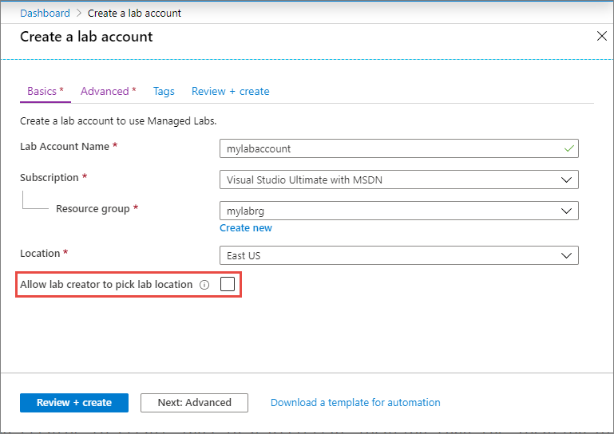
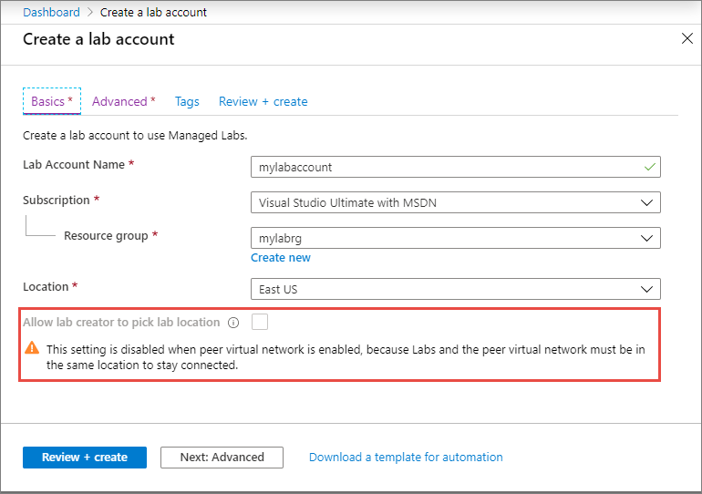
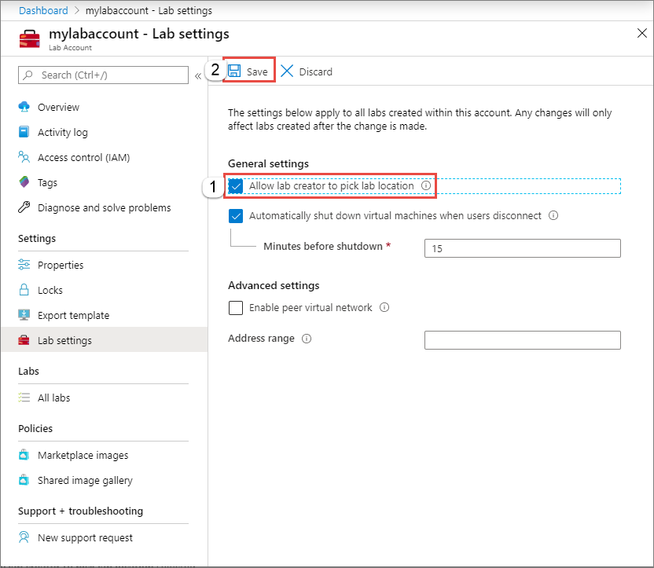
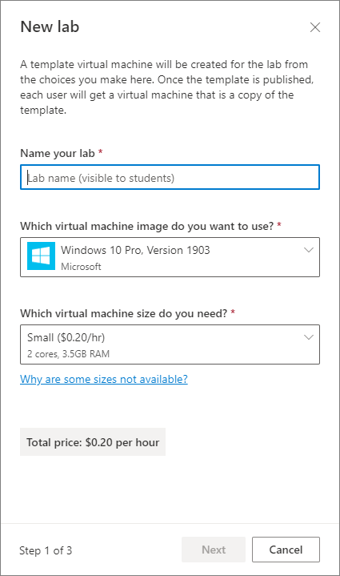
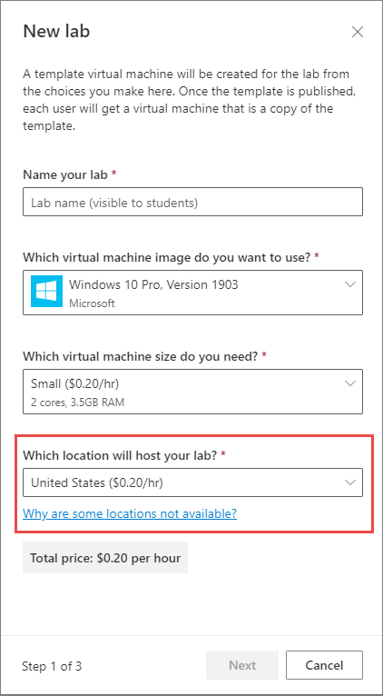
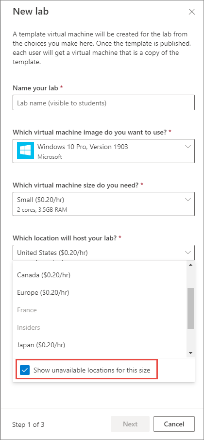

# Allow lab creator to pick location for the lab in Azure Lab Services

[!INCLUDE [preview note](./includes/lab-services-labaccount-focused-article.md)]

In Azure Lab Services, a lab account owner can allow lab creators (educators) to pick a location for the lab they create. This location can be different from the location of the lab account. A location is a group of Azure regions. For example, United States location is a group of regions such as East US, West US, and so on.

You, as a lab account owner, can select the **Allow lab creator to pick lab location** option when you create a lab account and after you create the lab account (or an existing lab account).

## At the time of lab account creation

When you create a lab account, you see this option on the first screen (**Basics** tab).

This option is disabled if you select a peer virtual network for your lab account in the **Advanced** tab.  

## After the lab account is created

After you create the lab account, you can enable or disable this option by following these steps:

1. On the **Lab Account** page, select **Lab settings** on the left menu.
2. Select the **Allow lab creator to pick lab location** option if you want to allow the lab creator to select a location for the lab. If it's disabled, the labs are automatically created in the same location in which the lab account exists.

    This field is disabled when you select a virtual network for the **Peer virtual network** field. It's because labs in the lab account must be in the same region as the lab account for them to access resources in the peer virtual network.
1. Select **Save** on the toolbar.

    

## No virtual network and location selection isn't allowed

In this scenario, you haven't enabled the **Allow lab creator to pick lab location** option.

Then, lab creators (educators) don't see an option to pick a location for the lab. They will see the price per hour for every size option available to them. When they create a lab, it will be created in an Azure region that's in the same location as the Azure region that their lab account is in. For example, if the lab account is in **West US**, then the lab might be created in **South Central US** but would not be created in **Canada East**. We don't guarantee anything about the region we choose aside from that it's in the location. If a size is currently constrained, then the lab creator will see a checkbox where they can see the sizes that we normally support but are currently unavailable.

## In virtual network and location selection isn't allowed

In this scenario, the **Allow lab creator to pick lab location** option is disabled because you have selected a peer virtual network for the lab account. Then, lab creators will see the same screen as with the previous option. Because all VMs have to be in the same Azure region as the virtual network, the lab will be created in the same Azure region that the virtual network is in. If that particular region is constrained for a size, the size will appear as unavailable.

## Location selection is enabled

When you select **Allow lab creator to pick lab location**, lab creators (educators) see an option to select a location when creating a lab.

Lab creators see the range of prices for all locations that size is in, and can choose a Location. The lab will be created in any Azure region that maps to that location.

If a location is constrained, it's not shown in the list by default. Expand the drop-down list, and select **Show unavailable locations for this size**.

## Cost

Earlier, the pricing was based on the VM size that you choose for the lab. Now, the price is based on the combination of Operating System (OS), Size, and location.

## Next steps

See the following articles:

- [Connect your lab's network with a peer virtual network](how-to-connect-peer-virtual-network.md)
- [Attach a shared image gallery to a lab](how-to-attach-detach-shared-image-gallery-1.md)
- [Add a user as a lab owner](how-to-add-user-lab-owner.md)
- [View firewall settings for a lab](how-to-configure-firewall-settings.md)
- [Configure other settings for a lab](how-to-configure-lab-accounts.md)
