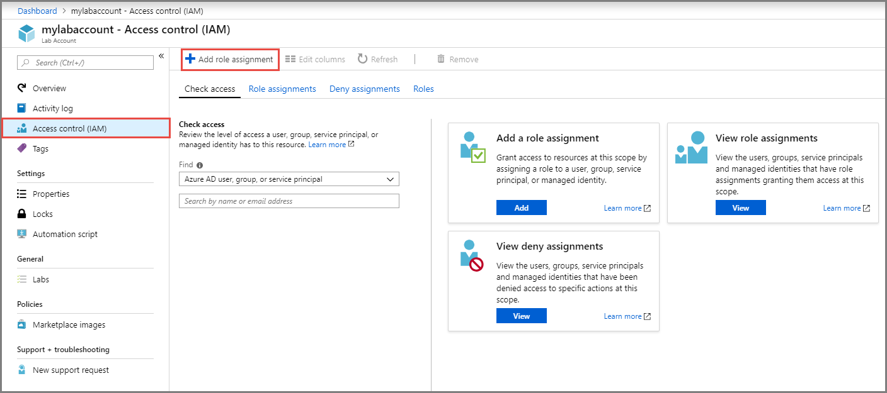
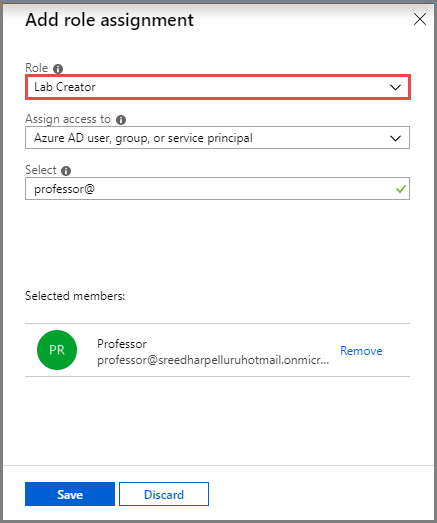

# Add lab creators to a lab account in Azure Lab Services
This article shows you how to add users as lab creators to a lab account in Azure Lab Services. These uses then can create classroom labs in the lab account. 

## Add Microsoft user account to Lab Creator role
To set up a classroom lab in a lab account, the user must be a member of the **Lab Creator** role in the lab account. The account you used to create the lab account is automatically added to this role. If you are planning to use the same user account to create a classroom lab, you can skip this step. To use another user account to create a classroom lab, do the following steps: 

To provide educators the permission to create labs for their classes, add them to the **Lab Creator** role:

1. On the **Lab Account** page, select **Access control (IAM)**, and click **+ Add role assignment** on the toolbar. 

    
1. On the **Add role assignment** page, select **Lab Creator** for **Role**, select the user you want to add to the Lab Creators role, and select **Save**. 

    

    > [!NOTE]
    > If you are adding a non-Microsoft account user as a lab creator, see the [Add a non-Microsoft account user as a lab creator](#add-a-non-microsoft-account-user-as-a-lab-creator) section. 

## Add a non-Microsoft account user as a lab creator
To add a user as a lab creator, you use their email accounts. The following types of email accounts might be used:

- An email account that's provided by your university’s Office 365 Azure Active Directory (AAD). 
- A Microsoft email account, such as `@outlook.com`, `@hotmail.com`, `@msn.com`, or `@live.com`.
- A non-Microsoft email account, such as one provided by Yahoo or Google. However, these types of accounts must be linked with a Microsoft account.
- A GitHub account. This account must be linked with a Microsoft account.

### Using a non-Microsoft email account
Lab creators/instructors can use non-Microsoft email accounts to register and sign in to a classroom lab.  However, the sign-in to the Lab Services portal requires that instructors first create a Microsoft account that's linked to their non-Microsoft email address.

Many instructors might already have a Microsoft account linked to their non-Microsoft email addresses. For example, instructors already have a Microsoft account if they have used their email address with Microsoft’s other products or services, such as Office, Skype, OneDrive, or Windows.  

When instructors sign in to the Lab Services portal, they are prompted for their email address and password. If the instructor attempts to sign in with a non-Microsoft account that does not have a Microsoft account linked, the instructor will receive the following error message: 

To sign up for a Microsoft account, instructors should go to [http://signup.live.com](http://signup.live.com).  

### Using a GitHub Account
Instructors can also use an existing GitHub account to register and sign in to a classroom lab. If the instructor already has a Microsoft account linked to their GitHub account, then they can sign in and provide their password as shown in the previous section. If they have not yet linked their GitHub account to a Microsoft account, they should select **Sign-in options**:

On the **Sign-in options** page, select **Sign in with GitHub**.

Finally, they are prompted to create a Microsoft account that's linked to their GitHub account. It happens automatically when the instructor selects **Next**.  The instructor is then immediately signed in and connected to the classroom lab.

## Next steps
See the following articles:

- [As a lab owner, create and manage labs](how-to-manage-classroom-labs.md)
- [As a lab owner, set up and publish templates](how-to-create-manage-template.md)
- [As a lab owner, configure and control usage of a lab](how-to-configure-student-usage.md)
- [As a lab user, access classroom labs](how-to-use-classroom-lab.md)
