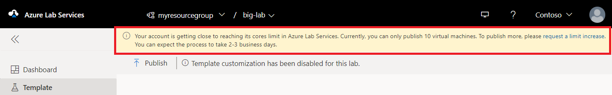

# Capacity limits in Azure Lab Services
Azure Lab Services has default capacity limits on Azure subscriptions to adhere to Azure Compute quota limitations and to mitigate fraud. All Azure subscriptions will have an initial capacity limit, which can vary based on subscription type, number of standard compute cores, and GPU cores available inside Azure Lab Services. It restricts how many virtual machines you can create inside your labs before you need to request for a limit increase.  

If you are close to or have reached your subscription’s virtual machine cores limit, you will see messages from Azure Lab Services when you try to perform actions that create additional virtual machines. For example: 

- Create a lab
- Publish a lab
- Adjust lab capacity to add more virtual machines to an existing lab

These actions may also be disabled if you have already reached the cores limit. 

## Subscriptions with default limit of zero cores
Some rare subscription types that are more commonly used for fraud can have a default limit of 0 standard cores and 0 GPU cores. If you are using one of these subscription types, the admin who creates your lab account will need to request a limit increase before you can use Azure Lab Services. 

The admin can follow these steps to request a limit increase:  

1.	In your subscription, [create a lab account](tutorial-setup-lab-account.md).
2.	On the **Overview** page of the lab account, click **Request limit increase** button at the top. 
3.	Follow the steps in the form to submit a support request to increase the limit.

## Request a limit increase
If you reach the cores limit, you can request a limit increase to continue using Azure Lab Services. The request process is a checkpoint to ensure your subscription isn't involved in any cases of fraud or unintentional, sudden large-scale deployments.

The messages about the virtual machine cores limit in the Azure Lab Services portal includes a link to request a limit increase. The link opens a new browser tab where you can create a new support request. The issue type, subscription, and quota type information will be automatically filled out for you as shown in the following image: 

Then, you will be prompted to provide more information about the limit increase. In the **Description** field, provide the following details:

- What you are trying to do (for example, creating a lab to teach a Computer Science class, run a hackathon, and so on.)
- Virtual machine size you are using for this lab
- Number of virtual machines you need

Once you submit the support request, we will review the request. If necessary, we will contact you to get additional details. 

## Next steps
See the following article:
- [Frequently asked questions](classroom-labs-faq.md).