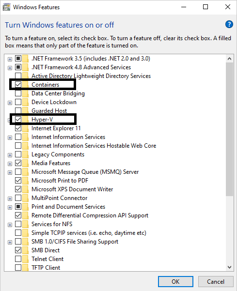

# Set up a lab for big data analytics using Docker deployment of HortonWorks Data Platform

This article shows you how to set up a lab to teach a big data analytics class.  With this type of class, students learn how to handle large volumes of data and apply machine and statistical learning algorithms to derive data insights.  A key objective for students is to learn to use data analytics tools, such as [Apache Hadoop's open-source software package](https://hadoop.apache.org/) which provides tools for storing, managing, and processing big data.

In this lab, students will use a popular commercial version of Hadoop provided by [Cloudera](https://www.cloudera.com/), called [Hortonworks Data Platform (HDP)](https://www.cloudera.com/products/hdp.html).  Specifically, students will use [HDP Sandbox 3.0.1](https://www.cloudera.com/tutorials/getting-started-with-hdp-sandbox/1.html) which is a simplified, easy-to-use version of the platform that is free of cost and intended for learning and experimentation.  Although this class may use either Windows or Linux virtual machines (VM) with HDP Sandbox deployed, this article will show how to use Windows.

Another interesting aspect of this lab, is that we will deploy HDP Sandbox on the lab VMs using [Docker](https://www.docker.com/) containers.  Each Docker container provides its own isolated environment for software applications to run inside.  Conceptually, Docker containers are like nested VMs and can be used to easily deploy and run a wide variety of software applications based on container images provided on [Docker Hub](https://www.docker.com/products/docker-hub).  Cloudera's deployment script for HDP Sandbox automatically pulls the [HDP Sandbox 3.0.1 Docker image](https://hub.docker.com/r/hortonworks/sandbox-hdp) from Docker Hub and runs two Docker containers:
  - sandbox-hdp
  - sandbox-proxy

## Lab configuration

To set up this lab, you need an Azure subscription and lab account to get started. If you don't have an Azure subscription, create a [free account](https://azure.microsoft.com/free/) before you begin. Once you get an Azure subscription, you can create a new lab account in Azure Lab Services. For more information about creating a new lab account, see [Tutorial to Setup a Lab Account](tutorial-setup-lab-account.md).  You can also use an existing lab account.

### Lab account settings

Enable the settings described in the table below for the lab account. For more information about how to enable marketplace images, see [Specify Marketplace images available to lab creators](https://docs.microsoft.com/azure/lab-services/classroom-labs/specify-marketplace-images).

| Lab account setting | Instructions |
| ------------------- | ------------ |
|Marketplace image| Enable the Windows 10 Pro image for use within your lab account.|

### Lab settings

Use the settings in the table below when setting up a classroom lab.  For more information how to create a classroom lab, see [set up a classroom lab tutorial](tutorial-setup-classroom-lab.md).

| Lab settings | Value/instructions |
| ------------ | ------------------ |
|Virtual Machine Size| Medium (Nested Virtualization). This VM size is best suited for relational databases, in-memory caching, and analytics.  This size also supports nested virtualization.|  
|Virtual Machine Image| Windows 10 Pro|

> [!NOTE] 
> We need to use Medium (Nested Virtualization) since deploying HDP Sandbox using Docker requires:
>   - Windows Hyper-V with nested virtualization
>   - At least 10 GB of RAM

## Template machine configuration

To set up the template machine, we will:
- Install Docker
- Deploy HDP Sandbox
- Use PowerShell and Windows Task Scheduler to automatically start the Docker containers

### Install Docker

The steps in this section are based on [Cloudera's instructions for deploying with Docker containers](https://www.cloudera.com/tutorials/sandbox-deployment-and-install-guide/3.html). 

To use Docker containers, you must first install Docker Desktop on the template VM:

1. Follow the steps in the [Prerequisites section](https://www.cloudera.com/tutorials/sandbox-deployment-and-install-guide/3.html#prerequisites) to install [Docker for Windows](https://docs.docker.com/docker-for-windows/install/). 

    > [!IMPORTANT] 
    > Ensure that the **Use Windows containers instead of Linux containers** configuration option is left unchecked.

1. Ensure that **Windows Containers and Hyper-V features** are turned on.
   

1. Follow the steps in the [Memory for Windows](https://www.cloudera.com/tutorials/sandbox-deployment-and-install-guide/3.html#memory-for-windows) section to configure Docker's memory configuration.

    > [!WARNING]
    > If you inadvertently check the **Use Windows containers instead of Linux containers** option when installing Docker, you won't see the memory configuration settings.  To fix this, you can switch to using Linux containers by [clicking on the Docker icon in Windows System tray](https://docs.docker.com/docker-for-windows/#docker-settings-dialog); when the Docker Desktop menu opens, select **Switch to Linux containers**.
 
### Deploy HDP Sandbox

In this section, you will deploy HDP Sandbox and then also access HDP Sandbox using the browser.

1. Ensure that you have installed [Git Bash](https://gitforwindows.org/) as listed in the [Prerequisites section](https://www.cloudera.com/tutorials/sandbox-deployment-and-install-guide/3.html#prerequisites) of the guide since this is recommended for completing the next steps.

1. Using [Cloudera's Deployment and Install Guide for Docker](https://www.cloudera.com/tutorials/sandbox-deployment-and-install-guide/3.html), complete the steps in the following sections:
   
   -    Deploy HDP Sandbox
   -    Verify HDP Sandbox

    > [!WARNING] 
    > When you download the latest .zip file for HDP, ensure that you do *not* save the .zip file in a directory path that includes whitespace.

    > [!NOTE] 
    > If you receive an exception during deployment stating **Drive has not been shared**, you need to share your C drive with Docker so that HDP's Linux containers can access local Windows files.  To fix this, [click on the Docker icon in Windows System tray](https://docs.docker.com/docker-for-windows/#docker-settings-dialog) to open the Docker Desktop menu and select **Settings**.  When **Docker's Settings** dialog opens, select **Resources > File Sharing** and check the **C** drive.  You can then repeat the steps to deploy HDP Sandbox.

1. Once the Docker containers for HDP Sandbox are deployed and running, you can access the environment by launching your browser and following Cloudera's instructions for opening the [Sandbox Welcome Page](https://www.cloudera.com/tutorials/learning-the-ropes-of-the-hdp-sandbox.html#welcome-page) and launching the HDP Dashboard.

    > [!NOTE] 
    > These instructions assume that you have first mapped the local IP address of the sandbox environment to the sandbox-hdp.hortonworks.com in the host file on your template VM.  If you do **not** do this mapping, you can access the Sandbox Welcome page by navigating to `http://localhost:8080`.

### Automatically start Docker containers when students log in

To provide an easy to use experience for students, we'll use a PowerShell script that automatically:
  - Starts the HDP Sandbox Docker containers when a student starts and connects to their lab VM.
  - Launches the browser and navigates to the Sandbox Welcome Page.
We'll also use Windows Task Scheduler to automatically run this script when a student logs into their VM.
To set this up, follow these steps: [Big Data Analytics scripting](https://github.com/Azure/azure-devtestlab/tree/master/samples/ClassroomLabs/Scripts/BigDataAnalytics/).

## Cost estimate

If you would like to estimate the cost of this lab, you can use the following example.

For a class of 25 students with 20 hours of scheduled class time and 10 hours of quota for homework or assignments, the price for the lab would be:
  - 25 students * (20 + 10) hours * 55 Lab Units * 0.01 USD per hour = 412.50 USD

Further more details on pricing, see [Azure Lab Services Pricing](https://azure.microsoft.com/pricing/details/lab-services/).

## Conclusion

This article walked you through the steps necessary to create a lab for a big data analytics class that using Hortonworks Data Platform deployed with Docker.  The setup for this class type may be used for similar data analytics classes.  This setup may also be applicable to other types of classes that use Docker for deployment.

## Next steps

Next steps are common to setting up any lab.

- [Create and manage a template](how-to-create-manage-template.md)
- [Add users](tutorial-setup-classroom-lab.md#add-users-to-the-lab)
- [Set quota](how-to-configure-student-usage.md#set-quotas-for-users)
- [Set a schedule](tutorial-setup-classroom-lab.md#set-a-schedule-for-the-lab)
- [Email registration links to students](how-to-configure-student-usage.md#send-invitations-to-users)
