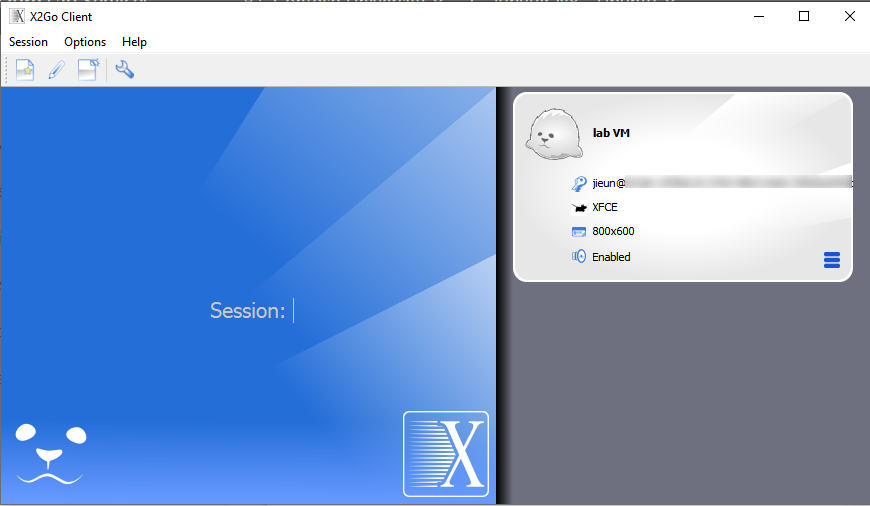

# Set up a lab to teach data science with Python and Jupyter Notebooks
This article outlines how to set up a template virtual machine (VM) in Lab Services with the tools that are needed to teach students how to use [Jupyter Notebooks](http://jupyter-notebook.readthedocs.io/), and how students can connect to their notebooks on their virtual machines (VMs).

Jupyter Notebooks is an open-source project that lets you easily combine rich text and executable Python source code on a single canvas called a notebook. Running a notebook results in a linear record of inputs and outputs. Those outputs can include text, tables of information, scatter plots, and more.

## Set up the lab

### Lab configuration
To set up this lab, you need access to an Azure subscription and a lab account. Discuss with your organization's admin to see if you can get access to an existing Azure subscription. If you don't have an Azure subscription, create a [free account](https://azure.microsoft.com/free/) before you begin.

Once you have an Azure subscription, create a new lab account in Azure Lab Services by following instructions in the tutorial: [Setup a lab account](tutorial-setup-lab-account.md). You can also use an existing lab account.

### Lab account settings
Enable settings described in the table below for the lab account. For more information on enabling marketplace images, see [specify Marketplace images available to lab creators](specify-marketplace-images.md).

| Lab account setting | Instructions |
| ------------------- | ------------ |
| Marketplace image | Inside your lab account, enable one of the Azure Marketplace images based on your operating system needs: <br/><ul><li>Data Science Virtual Machine – Windows Server 2019</li><li>Data Science Virtual Machine – Ubuntu 18.04</li></ul> |

> [!NOTE]
> This article uses the Data Science virtual machine images available on the Azure marketplace because they are preconfigured with Jupyter Notebook. These images, however, also include many other development and modeling tools for data science. If you don't want those extra tools and want a lightweight setup with just Jupyter notebooks, create a custom VM image. For an example, [Installing JupyperHub on Azure](http://tljh.jupyter.org/en/latest/install/azure.html). Once the custom image is created, you can upload it to a shared image gallery to use the image inside Azure Lab Services. Learn more about [using Shared Image Gallery in Azure Lab Services](how-to-attach-detach-shared-image-gallery.md). 

### Lab settings
Configure **Virtual machine size** and **Virtual machine image** settings as shown in the following table when setting up a classroom lab. For instructions on creating a classroom lab, see [Set up a classroom lab](tutorial-setup-classroom-lab.md).

| Lab settings | Value/instructions |
| ------------ | ------------------ | 
| Virtual machine size | <p>The size you pick here depends on the workload you want to run:</p><ul><li>Small or Medium – good for a basic setup of accessing Jupyter Notebooks</li><li>Small GPU (Compute) – best suited for compute-intensive and network-intensive applications like Artificial Intelligence and Deep Learning</li></ul> | 
| Virtual machine image | <p>Choose one of the following images based on your operating system needs:</p><ul><li>[Data Science Virtual Machine – Windows Server 2019](https://azuremarketplace.microsoft.com/marketplace/apps/microsoft-dsvm.dsvm-win-2019)</li><li>[Data Science Virtual Machine – Ubuntu 18.04](https://azuremarketplace.microsoft.com/marketplace/apps/microsoft-dsvm.ubuntu-1804?tab=Overview)</li></ul> |


### Template virtual machine
Once you create a lab, a template VM will be created based on the virtual machine size and image you chose. You configure the template VM with everything you want to provide to your students for this class. To learn more, see [how to manage the template virtual machine](how-to-create-manage-template.md). 

The Data Science VM images by default come with many of data science frameworks and tools required for this type of class. For example, the images include:

- [Jupyter Notebooks](http://jupyter-notebook.readthedocs.io/): A web application that allows data scientists to take raw data, run computations, and see the results all in the same environment. It will run locally in the template VM.  
- [Visual Studio Code](https://code.visualstudio.com/): An integrated development environment (IDE) that provides a rich interactive experience when writing and testing a notebook. For more information, see [Working with Jupyter Notebooks in Visual Studio Code](https://code.visualstudio.com/docs/python/jupyter-support).

### Provide notebooks for the class
The next task is to provide students with notebooks that you want them to use. To provide your own notebooks, you can save notebooks locally on the template VM. 

If you want to use sample notebooks from Azure Machine Learning, see [how to configure an environment with Jupyter Notebooks](../../machine-learning/how-to-configure-environment.md#jupyter). 

### Optional: enable graphical desktop for Linux 
The **Data Science Virtual Machine – Ubuntu** image is already provisioned with X2GO server and is ready to accept client connections. No further steps are required when setting up the template VM. 

### Publish the template machine
When you publish the template, each student registered to your lab will get a copy of the template VM with all the local tools and notebooks you’ve set up on it.

## How students connect to Jupyter Notebooks?
Once you publish the template, each student will have access to a VM that comes with everything you’ve preconfigured for the class, including the Jupyter Notebooks. The following sections show different ways for students to connect to Jupyter Notebooks. 

### For Windows VMs
If you’ve provided students with Windows VMs, they need to connect to their VMs and use Jupyter Notebooks that are available locally on them. 

To connect to a Windows VM, a student can use a remote desktop connection (RDP). For detailed steps, see [how to access a classroom lab](how-to-use-classroom-lab.md). 

A student using a Mac or Chromebook can follow instructions from following articles to connect to the Data Science Windows VM. 

- [Connect to a VM using RDP on a Mac](connect-virtual-machine-mac-remote-desktop.md)
- [Connect to a VM using RDP on a Chromebook](connect-virtual-machine-chromebook-remote-desktop.md)

### For Linux VMs
If you’ve provided students with Linux VMs, there are several options students can use to connect to their Jupyter Notebooks in the VMs:

- Access Jupyter Notebooks locally after connecting to the VM
    - SSH to the VM for terminal sessions
	 - X2Go connection to the VM for graphical sessions
- Use SSH tunneling to connect from the student’s local computer directly to the Jupyter Server on the VM. 

The following sections provide details about these ways to connect to Jupyter notebooks. 

#### SSH to virtual machine
Students can connect via SSH to their Linux VMs from a terminal session. For detailed steps, see [how to access a classroom lab](how-to-use-classroom-lab.md). If they are using a Windows client machine, they will need to enable an SSH client by downloading [PuTTY](https://www.putty.org/) or enabling [OpenSSH in Windows](https://docs.microsoft.com/windows-server/administration/openssh/openssh_install_firstuse) to SSH from the command prompt. 

1.	Start the VM.
2.	Once the VM is running, click **Connect**, which will pop up a dialog box that provides the SSH command string, which will look like the following sample:
    
	 ```shell
    ssh -p 12345 student@ml-lab-00000000-0000-0000-0000-000000000000.eastus2.cloudapp.azure.com
	 ```
3.	Go to your command prompt or terminal, and paste in this command, and then press **ENTER**.
4.	Enter the password to sign in to the VM. 

Once students are connected to VMs, they can access and run Jupyter Notebooks locally.

#### X2Go to virtual machine
The **Data Science Virtual Machine – Ubuntu** image is already provisioned with X2GO Server and is ready to accept client connections. To connect to the graphical desktop of the Linux machine, students need to follow these one-time steps to set up X2Go on their client machines:

1.	Download and install the [X2Go client](https://wiki.x2go.org/doku.php/doc:installation:x2goclient) for your client platform.
2.	In the [Azure Lab Services portal](https://labs.azure.com), make sure that the Linux VM you want to connect to is started.
3.	Once the VM is running, click **Connect**, which will pop a dialog box that provides the SSH command string, which will look like the following sample:

    ```
	 ssh -p 12345 student@ml-lab-00000000-0000-0000-0000-000000000000.eastus2.cloudapp.azure.com
	 ```	
4. Once you have this info, open the X2Go client app and create a new session. 
5.	Fill in the following values in the **Session Preferences** pane:
    - **Session name**: It can be whatever you want, but we recommend using the name of your Lab VM.
	 - **Host**: `ml-lab-00000000-0000-0000-0000-000000000000.eastus2.cloudapp.azure.com`
	 - **Login**: student
	 - **SSH port**: 12345
	 - **Session type**: XFCE
6. Select **OK**. 

    > [!NOTE]
	 > When creating a new X2Go session, make sure to use the SSH port, **not** the RDP port.

Now, to connect to the VM, follow these steps:    

1.	In the X2Go client, double-click on the VM you want to connect to. 

    
2. Enter the password to connect to the VM. (You may have to give X2Go permission to bypass your firewall to finish connecting.)
3.	You should now see the graphical interface for your Ubuntu Data Science VM.


#### SSH tunnel to Jupyter server on the VM
Some students may want to connect directly from their local computer directly to the Jupyter server inside their VMs. The SSH protocol enables port forwarding between the local computer and a remote server (in our case, the student’s lab VM), so that an application running on a certain port on the server is **tunneled** to the mapping port on the local computer. Students should follow these steps to SSH tunnel to the Jupyter server on their lab VMs:

1.	In the [Azure Lab Services portal](https://labs.azure.com), make sure that the Linux VM that you want to connect is started.
2.	Once the VM is running, click **Connect**, which will pop a dialog box that provides the SSH command string, which will look like the following string:

    ```bash
	 ssh -p 12345 student@ml-lab-00000000-0000-0000-0000-000000000000.eastus2.cloudapp.azure.com
	 ```
3. On your local computer, launch a terminal or command prompt, and copy the SSH connection string to it. Then, add `-L 8888:localhost:8888` to the command string, which creates the **tunnel** between the ports. The final string should look like:

    ```bash
	 ssh –L 8888:localhost:8888 -p 12345 student@ml-lab-b720853e-570f-49ac-9cb2-bd0bd2aeec35.eastus.cloudapp.azure.com
	 ```
4. Press **ENTER** to run the command. 
5.	When prompted, provide the password to connect to the lab VM. 
6.	Once you’re connected to the VM, start the Jupyter server using this command: 

    ```bash
	 jupyter notebook
	 ```
7. Running the command will provide you with a URL in the terminal or command prompt. The URL should look like:

    ```bash
	 http://localhost:8888/?token=8c09ecfc93e6a8cbedf9c66dffdae19670a64acc1d37
	 ```
8. Paste this URL into a browser on your local computer to connect and work on your Jupyter Notebook. 

    > [!NOTE]
    > Visual Studio Code also enables a great [Jupyter Notebook editing experience](https://code.visualstudio.com/docs/python/jupyter-support). You can follow the instructions on [how to connect to a remote Jupyter server](https://code.visualstudio.com/docs/python/jupyter-support#_connect-to-a-remote-jupyter-server) and use the same URL from the previous step to connect from VS Code instead of from the browser. 


## Cost estimate
Let's cover a possible cost estimate for this class. We'll use a class of 25 students. There are 20 hours of scheduled class time. Also, each student gets 10 hours quota for homework or assignments outside scheduled class time. The VM size we chose was small GPU (compute), which is 139 lab units. If you want to use the Small (20 lab units) or Medium size (42 lab units), you can replace the lab unit part in the equation below with the correct number.  

Here is an example of a possible cost estimate for this class:
25 students * (20 scheduled hours + 10 quota hours) * 139 lab units * 0.01 USD per hour = 1042.5 USD

Further more details on pricing, see [Azure Lab Services Pricing](https://azure.microsoft.com/pricing/details/lab-services/).

## Conclusion
In this article, we walked through the steps to create a lab for a Jupyter Notebooks class. You can use a similar setup for other machine learning classes.

## Next steps

Next steps are common to setting up any lab.

- [Create and manage a template](how-to-create-manage-template.md)
- [Add users](tutorial-setup-classroom-lab.md#add-users-to-the-lab)
- [Set quota](how-to-configure-student-usage.md#set-quotas-for-users)
- [Set a schedule](tutorial-setup-classroom-lab.md#set-a-schedule-for-the-lab)
- [Email registration links to students](how-to-configure-student-usage.md#send-invitations-to-users)
