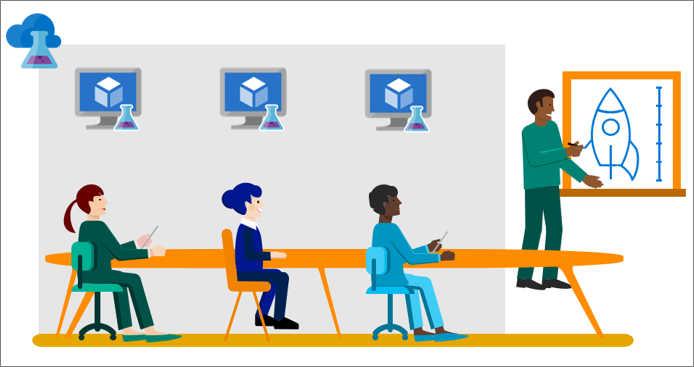

# Use Classroom Labs for trainings
You can set up a lab for trainings. Classroom Labs of Azure Lab Services allow you to create a lab for your training where each trainee uses identical and isolated environments for training. You can apply policies to ensure that training environments are available to each trainee only when they need them and contain enough resources - such as virtual machines - required for the training. 

Classroom Labs meets the following requirements that are required to conduct training in any virtual environment: 

- Trainees can quickly provision their training environments
- Every training machine should be identical
- Trainees cannot see VMs created by other trainees
- Control cost by ensuring that trainees cannot get more VMs than they need for the training and also shutdown VMs when they are not using them
- Easily share the training lab with each trainee
- Reuse the training lab again and again

In this article, you learn about various Azure Lab Services features that can be used to meet the previously described training requirements and detailed steps that you can follow to set up a lab for training.  

## Create the lab account as a lab account administrator
The first step in using Azure Lab Services is to create a lab account in the Azure portal. After a lab account administrator creates the lab account, the admin adds users who want to create labs to the **Lab Creator** role. The trainers create labs with virtual machines for students to do exercises for the course they are teaching. For details, see [Create and manage lab account](how-to-manage-lab-accounts.md).

## Create and manage classroom labs
A trainer, who is a member of the Lab Creator role in a lab account, can create one or more labs in the lab account. You create and configure a template VM with all the required software for doing exercises in your course. You pick a ready-made image from the available images for creating a classroom lab and then customize it by installing the software required for the lab. For details, see [Create and manage classroom labs](how-to-manage-classroom-labs.md).

## Configure usage settings and policies
The lab creator can add or remove users to the lab, get registration link to send to lab users, set up policies such as setting individual quotas per user, update the number of VMs available in the lab, and more. For details, see [Configure usage settings and policies](how-to-configure-student-usage.md).

## Create and manage schedules
Schedules allow you to configure a classroom lab such that VMs in the lab automatically start and shut down at a specified time. You can define a one-time schedule or a recurring schedule. For details, see [Create and manage schedules for classroom labs](how-to-create-schedules.md).

## Set up and publish a template VM
A template in a lab is a base virtual machine image from which all users’ virtual machines are created. Set up the template VM so that it is configured with exactly what you want to provide to the training attendees. You can provide a name and description of the template that the lab users see. Then, you publish the template to make instances of the template VM available to your lab users. When you publish a template, Azure Lab Services creates VMs in the lab by using the template. The number of VMs created in this process is same as the maximum number of users allowed into the lab, which you can set in the usage policy of the lab. All virtual machines have the same configuration as the template. For details, see [Set up and publish template virtual machines](how-to-create-manage-template.md). 

## Use VMs in the classroom lab
A student or training attendee registers to the lab, and connects to the VM to do exercises for the course. For details, see [How to access a classroom lab](how-to-use-classroom-lab.md).

## Next steps
Start with creating a lab account in Classroom Labs by following instructions in the article: [Tutorial: Setup a lab account with Azure Lab Services](tutorial-setup-lab-account.md).