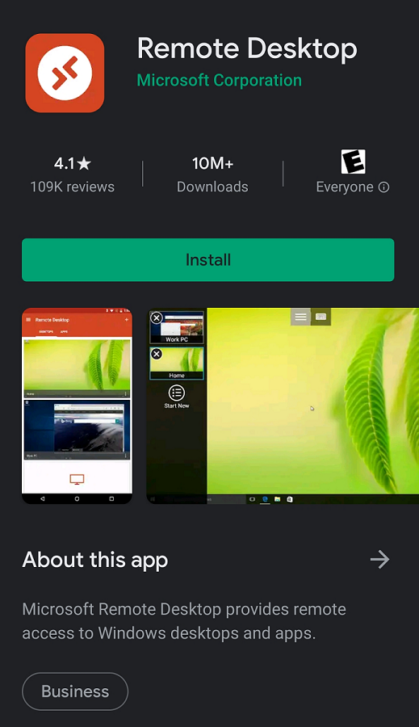
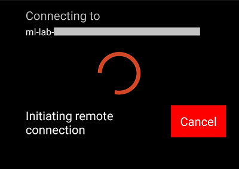
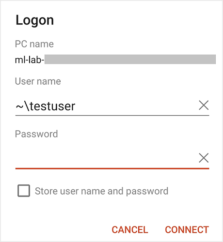
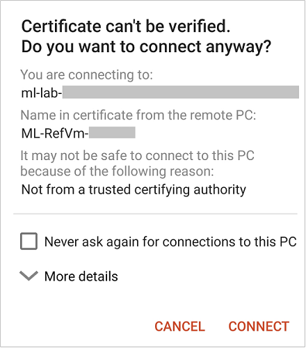

# Connect to a VM using Remote Desktop Protocol on a Chromebook
This section shows how a student can connect to a classroom lab VM from a Chromebook by using RDP.

## Install Microsoft Remote Desktop on a Chromebook
1. Open the App Store on your Chromebook, and search for **Microsoft Remote Desktop**.

    
1. Install the latest version of Microsoft Remote Desktop. 

## Access the VM from your Chromebook using RDP
1. Open the **RDP** file that's downloaded on your computer with **Microsoft Remote Desktop** installed. It should start connecting to the VM. 

    

1. When prompted, enter your password.
    

1. Select **Continue** if you receive the following warning. 

    

1. You should see the desktop of the VM that you are connecting to.

## Next steps
To learn more about connecting to Linux VMs, see [Connect to Linux virtual machines](how-to-use-remote-desktop-linux-student.md)

