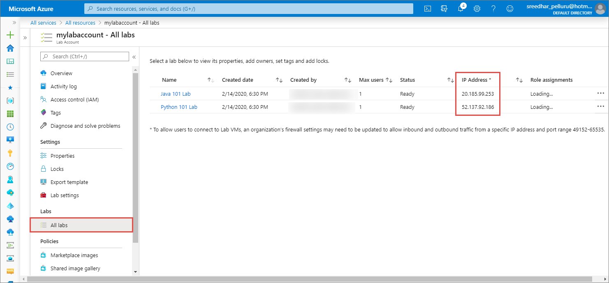

# Firewall settings for Azure Lab Services

Each organization or school will set up their own network in a way that best fits their needs.  Sometimes that includes setting firewall rules that block Remote Desktop Protocol (rdp) or Secure Shell (ssh) connections to machines outside their own network.  Because Azure Lab Services runs in the public cloud, some extra configuration maybe needed to allow students to access their VM when connecting from the campus network.

Each lab uses single public IP address and multiple ports.  All VMs, both the template VM and student VMs, will use this public IP address.  The public IP address will not change for the life of lab.  However, each VM will have a different port number.  The port numbers range from 49152 to 65535.  The combination of public IP address and port number is used to connect instructor and students to the correct VM.  This article will cover how to find the specific public IP address used by a lab.  That information can be used to update inbound and outbound firewall rules so students can access their VMs.

>[!IMPORTANT]
>Each lab will have a different public IP address.

## Find public IP for a lab

The public IP addresses for each lab are listed in the **All labs** page of the Lab Services lab account.  For directions how to find the **All labs** page, see [View labs in a lab account](manage-labs.md#view-labs-in-a-lab-account).  

> [!div class="mx-imgBorder"]
> 

>[!NOTE]
>You won’t see the public IP address if the template machine for your lab isn’t published yet.

## Conclusion

Now we know the public IP address for the lab.  Inbound and outbound rules can be created for the organization's firewall for the public ip address and the port range  49152-65535.  Once the rules are updated, students can access their VMs without the network firewall blocking access.

## Next steps
See the following articles:

- [Allow lab creator to pick lab location](allow-lab-creator-pick-lab-location.md)
- [Connect your lab's network with a peer virtual network](how-to-connect-peer-virtual-network.md)
- [Attach a shared image gallery to a lab](how-to-attach-detach-shared-image-gallery.md)
- [Add a user as a lab owner](how-to-add-user-lab-owner.md)
- [View firewall settings for a lab](how-to-configure-firewall-settings.md)
- [Configure other settings for a lab](how-to-configure-lab-accounts.md)
