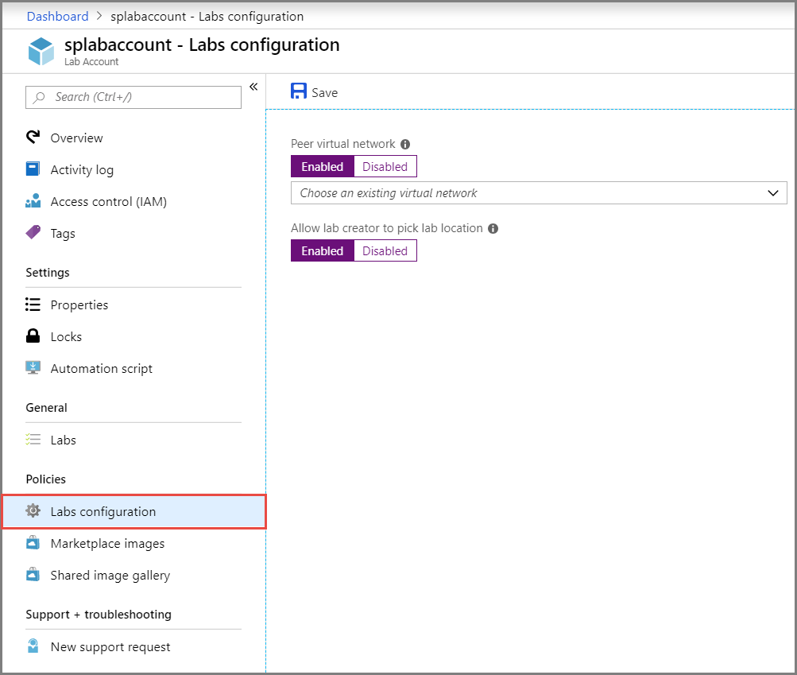
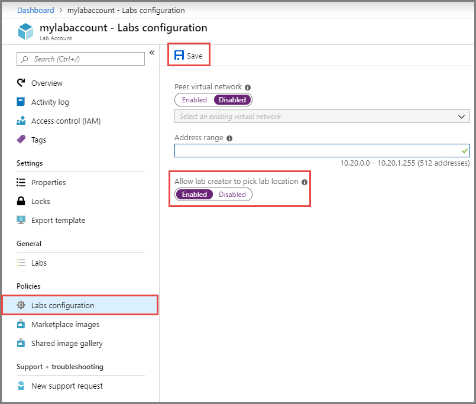
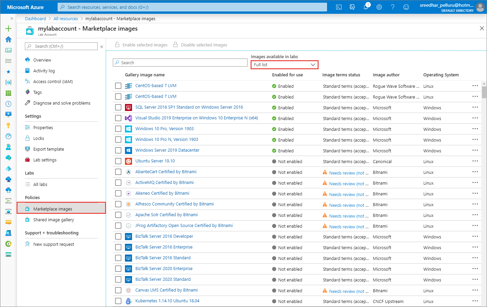
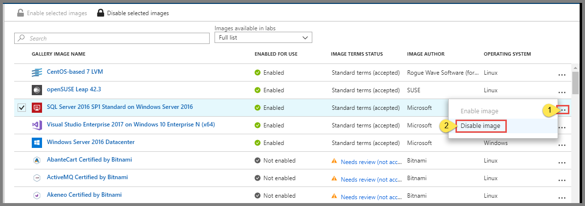
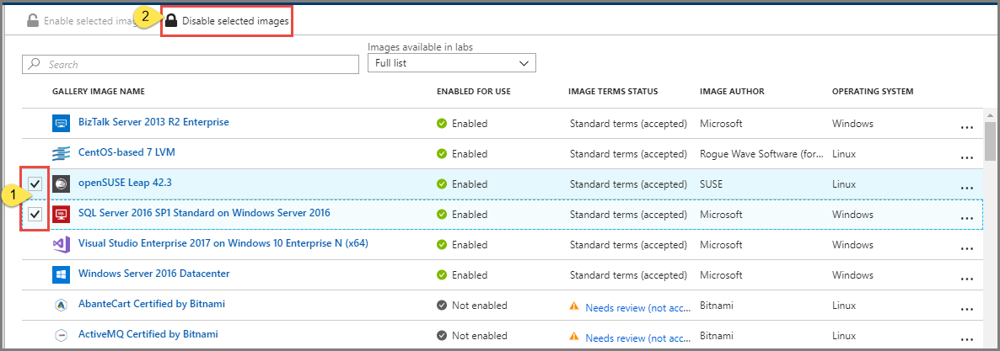

# Configure lab accounts in Azure Lab Services 
In Azure Lab Services, a lab account is a container for managed lab types such as classroom labs. An administrator sets up a lab account with Azure Lab Services and provides access to lab owners who can create labs in the account. This article describes how to create a lab account, view all lab accounts, or delete a lab account.

## Connect with a peer virtual network
To connect a virtual network as a peer network to the lab's virtual network, follow these steps:

1. On the **Lab Account** page, select **Labs configuration** on the left menu.

     
1. For **Peer virtual network**, select **Enabled** or **Disabled**. The default value is **Disabled**. To enable the peer virtual network, do the following steps: 
    1. Select **Enabled**.
    2. Select the **VNet** from the drop-down list. 
3. Select **Save** on the toolbar. 

Labs created in this account are connected to the selected virtual network. They can access to the resources in the selected virtual network. For more information, see [Connect your lab's network with a peer virtual network in Azure Lab Services](how-to-connect-peer-virtual-network.md).

When you select a virtual network for the **Peer virtual network** field, the **Allow lab creator to pick lab location** option is disabled. It's because labs in the lab account must be in the same region as the lab account for them to connect with resources in the peer virtual network. 

## Allow lab creator to pick location for the lab
You can allow lab creator to create labs in a different location than the location of the lab account by following these steps: 

1. On the **Lab Account** page, select **Labs configuration** on the left menu.
2. For the **Allow lab creator to pick lab location**, select **Enabled** if you want the lab creator to be able to select a location for the lab. If it's disabled, the labs are automatically created in the same location in which the lab account exists. 
    
    This field is disabled when you select a virtual network for the **Peer virtual network** field. It's because labs in the lab account must be in the same region as the lab account for them to access resources in the peer virtual network. 
1. Select **Save** on the toolbar. 

    

## Specify an address range for VMs in the lab
The following procedure has steps to specify an address range for VMs in the lab. If you update the range that you previously specified, the modified address range applies only to VMs that are created after the change was made. 

Here are some restrictions when specifying the address range that you should keep in mind. 

- The prefix must be smaller than or equal to 23. 
- If a virtual network is peered to the lab account, the provided address range cannot overlap with address range from peered virtual network.

1. On the **Lab Account** page, select **Labs configuration** on the left menu.
2. For the **Address range** field, specify the address range for VMs that will be created in the lab. The address range should be in the classless inter-domain routing (CIDR) notation (example: 10.20.0.0/23). Virtual machines in the lab will be created in this address range.
3. Select **Save** on the toolbar. 

    

## Add a user to the Lab Creator role
To set up a classroom lab in a lab account, the user must be a member of the **Lab Creator** role in the lab account. The account you used to create the lab account is automatically added to this role. If you are planning to use the same user account to create a classroom lab, you can skip this step. To use another user account to create a classroom lab, do the following steps: 

To provide educators the permission to create labs for their classes, add them to the **Lab Creator** role:

1. On the **Lab Account** page, select **Access control (IAM)**, and click **+ Add role assignment** on the toolbar. 

    
1. On the **Add role assignment** page, select **Lab Creator** for **Role**, select the user you want to add to the Lab Creators role, and select **Save**. 

    

## Specify Marketplace images available to lab creators
As a lab account owner, you can specify the Marketplace images that lab creators can use to create labs in the lab account. 

1. Select **Marketplace images** on the menu to the left. By default, you see the full list of images (both enabled and disabled). You can filter the list to see only enabled/disabled images by selecting the **Enabled only**/**Disabled only** option from the drop-down list at the top. 
    
    

    The Marketplace images that are displayed in the list are only the ones that satisfy the following conditions:
        
    - Creates a single VM.
    - Uses Azure Resource Manager to provision VMs
    - Doesn't require purchasing an extra licensing plan
2. To **disable** a Marketplace image that has been enabled, do one of the following actions: 
    1. Select **... (ellipsis)** in the last column, and select **Disable image**. 

         
    2. Select one or more images from the list by selecting the checkboxes before the image names in the list, and select **Disable selected images**. 

         
1. Similarly, to **enable** a Marketplace image, do one of the following actions: 
    1. Select **... (ellipsis)** in the last column, and select **Enable image**. 
    2. Select one or more images from the list by selecting the checkboxes before the image names in the list, and select **Enable selected images**. 

## Next steps
See the following articles:

- [As a lab owner, create and manage labs](how-to-manage-classroom-labs.md)
- [As a lab owner, set up and publish templates](how-to-create-manage-template.md)
- [As a lab owner, configure and control usage of a lab](how-to-configure-student-usage.md)
- [As a lab user, access classroom labs](how-to-use-classroom-lab.md)
