# Add and manage lab users

This article describes how to add student users to a lab, register them with the lab, control the number of additional hours they can use the virtual machine (VM), and more. 

## Add users to a lab

In this section, you add students to a lab manually or by uploading a CSV file. Do the following:

1. In the left pane, select **Users**. 

    By default, the **Restrict access** option is turned on and, unless they're in the list of users, students can't register with the lab even if they have a registration link. Only listed users can register with the lab by using the registration link you send. In this procedure, you add users to the list. Alternatively, you can turn off **Restrict access**, which allows students to register with the lab as long as they have the registration link. 

1. At the top of the **Users** pane, select **Add users**, and then select **Add by email address**. 

    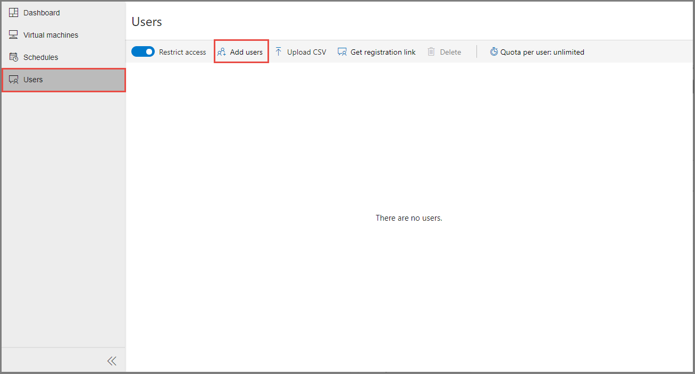

1. In the **Add users** pane, enter the students' email addresses on separate lines or on a single line separated by semicolons. 

    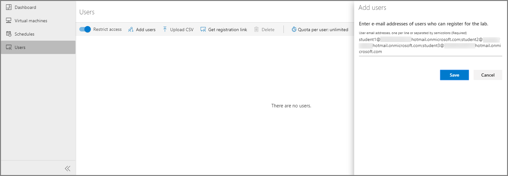

1. Select **Save**. 

    The list displays the email addresses and statuses of the current users, whether they're registered with the lab or not. 

    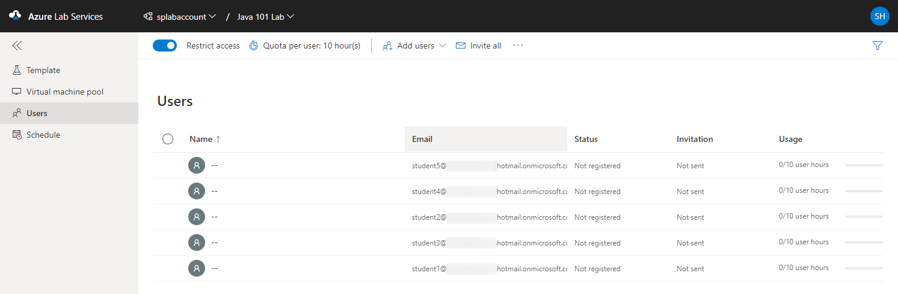

    > [!NOTE]
    > After the students are registered with the lab, the list displays their names. The name that's shown in the list is constructed by using the first and last names of the students in Azure Active Directory. 

### Add users by uploading a CSV file

You can also add users by uploading a CSV file that contains their email addresses.

1. In Microsoft Excel, create a CSV file that lists students' email addresses in one column.

    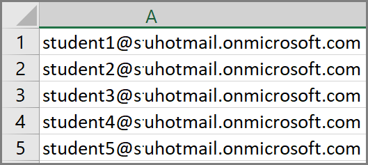

1. At the top of the **Users** pane, select **Add users**, and then select **Upload CSV**.

    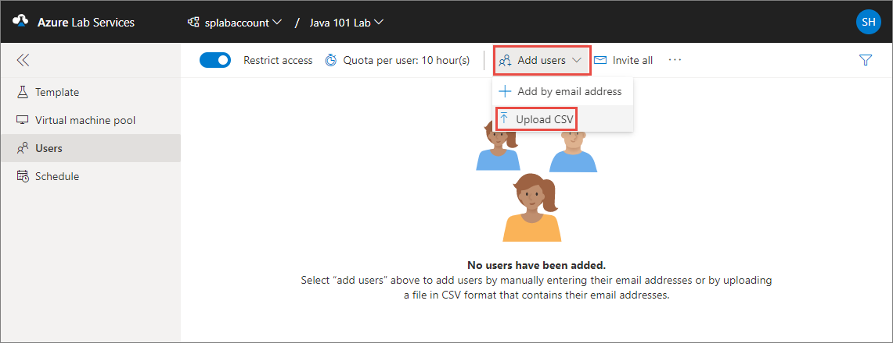

1. Select the CSV file that contains the students' email addresses, and then select **Open**.

    The **Add users** window displays the email address list from the CSV file. 

    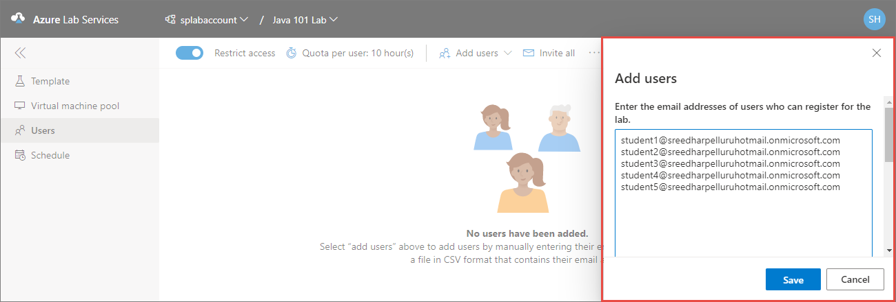

1. Select **Save**. 

1. In the **Users** pane, view the list of added students. 

    

## Send invitations to users

To send a registration link to new users, use one of the following methods. 

If the **Restrict access** option is enabled for the lab, only listed users can use the registration link to register to the lab. This option is enabled by default. 

### Invite all users

This method shows you how to send email with a registration link and an optional message to all listed students.

1. In the **Users** pane, select **Invite all**. 

    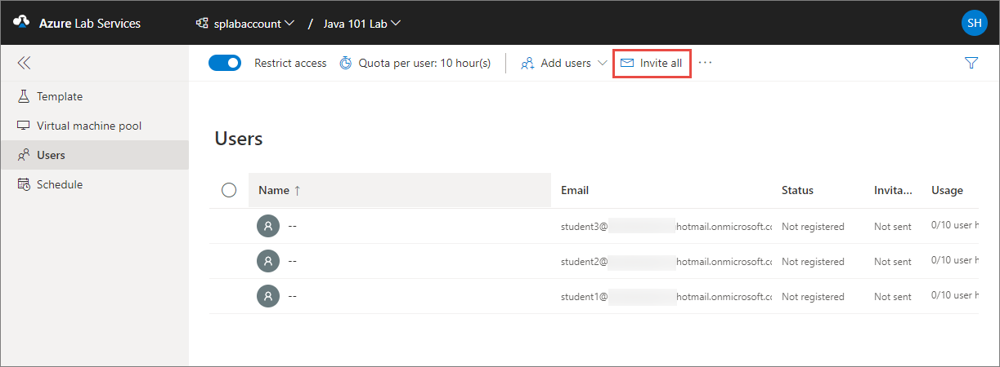

1. In the **Send invitation by email** window, enter an optional message, and then select **Send**. 

    The email automatically includes the registration link. To get and save the registration link separately, select the ellipsis (**...**) at the top of the **Users** pane, and then select **Registration link**. 

    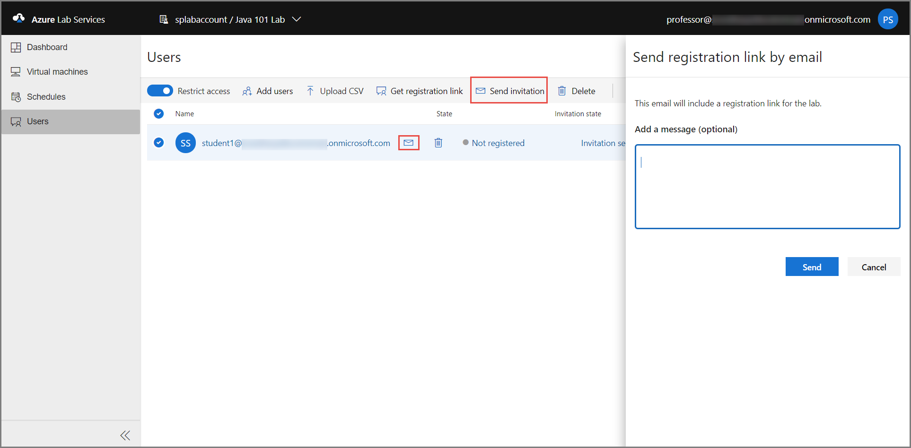

    The **Invitation** column of the **Users** list displays the invitation status for each added user. The status should change to **Sending** and then to **Sent on \<date>**. 

### Invite selected users

This method shows you how to invite only certain students and get a registration link that you can share with other people.

1. In the **Users** pane, select a student or multiple students in the list. 

1. In the row for the student you've selected, select the **envelope** icon or, on the toolbar, select **Invite**. 

    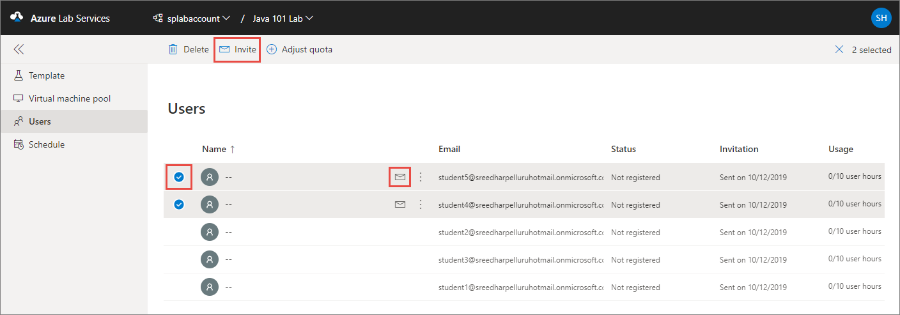

1. In the **Send invitation by email** window, enter an optional **message**, and then select **Send**. 

    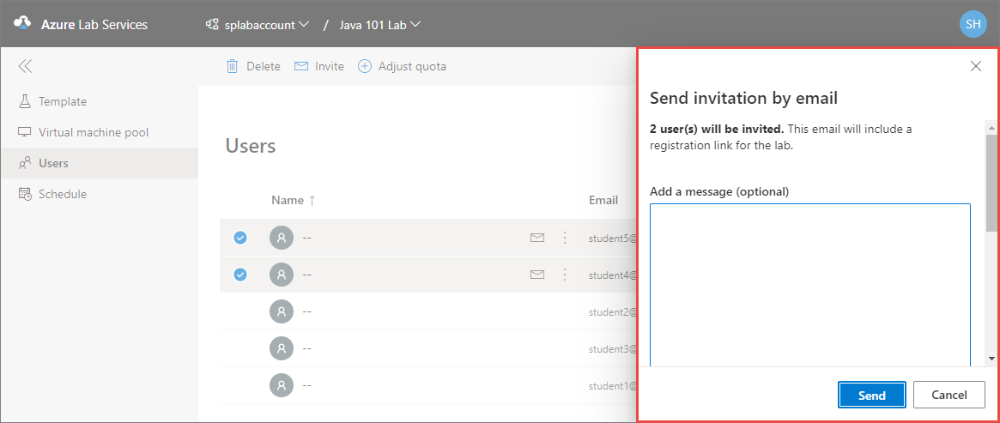

    The **Users** pane displays the status of this operation in the **Invitation** column of the table. The invitation email includes the registration link that students can use to register with the lab.

## Get the registration link

In this section, you can get the registration link from the portal and send it by using your own email application. 

1. In the **Users** pane, select **Registration link**.

    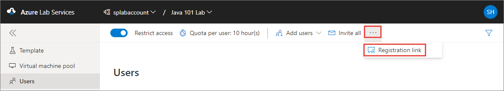

1. In the **User registration** window, select **Copy**, and then select **Done**. 

    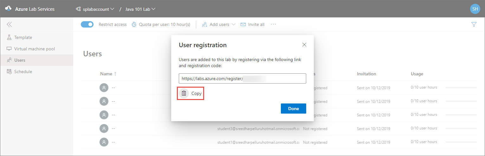

    The link is copied to the clipboard. 
    
1. In your email application, paste the registration link, and then send the email to a student so that the student can register for the class. 

## View registered users

1. Go to the [Azure Lab Services](https://labs.azure.com) website. 
1. Select **Sign in**, and then enter your credentials. Azure Lab Services supports organizational accounts and Microsoft accounts.
1. On the **My labs** page, select the lab whose usage you want to track. 
1. In the left pane, select **Users**, or select the **Users** tile. 

    The **Users** pane displays a list of students who have registered with your lab.  

    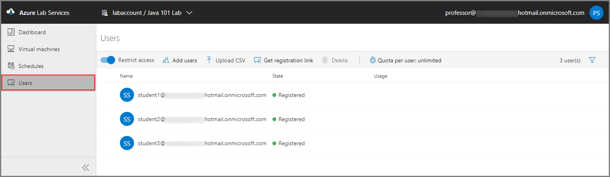

## Set quotas for users

You can set an hour quota for each student by doing the following: 

1. In the **Users** pane, select **Quota per user: \<number> hour(s)** on the toolbar. 
1. In the **Quota per user** window, specify the number of hours you want to give to each student outside the scheduled class time, and then select **Save**.

    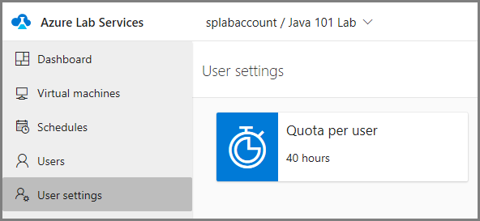    

    The changed values are now displayed on the **Quota per user: \<number of hours>** button on the toolbar and in the users list, as shown here:

    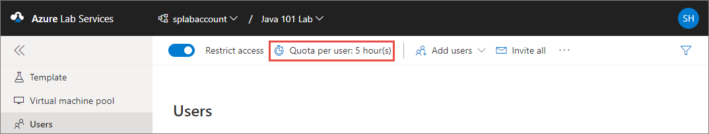

    > [!IMPORTANT]
    > The [scheduled running time of VMs](how-to-create-schedules.md) does not count against the quota that's allotted to a student. The quota is for the time outside of scheduled hours that a student spends on VMs. 

## Set additional quotas for specific users

You can specify quotas for certain students beyond the common quotas that were set for all users in the preceding section. For example, if you, as an instructor, set the quota for all students to 10 hours and set an additional quota of 5 hours for a specific student, that student gets 15 (10 + 5) hours of quota. If you change the common quota later to, say, 15, the student gets 20 (15 + 5) hours of quota. Remember that this overall quota is outside the scheduled time. The time that a student spends on a lab VM during the scheduled time does not count against this quota. 

To set additional quotas, do the following:

1. In the **Users** pane, select a student from the list, and then select **Adjust quota** on the toolbar. 

    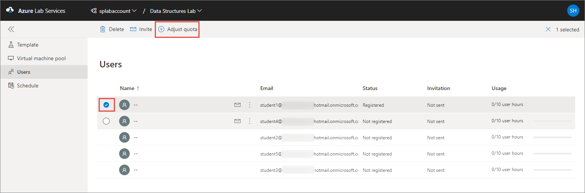

1. In the **Adjust quota for \<selected user or users email address>**, enter the number of additional lab hours you want to grant to the selected student or students, and then select **Apply**. 

    

    The **Usage** column displays the updated quota for the selected students. 

    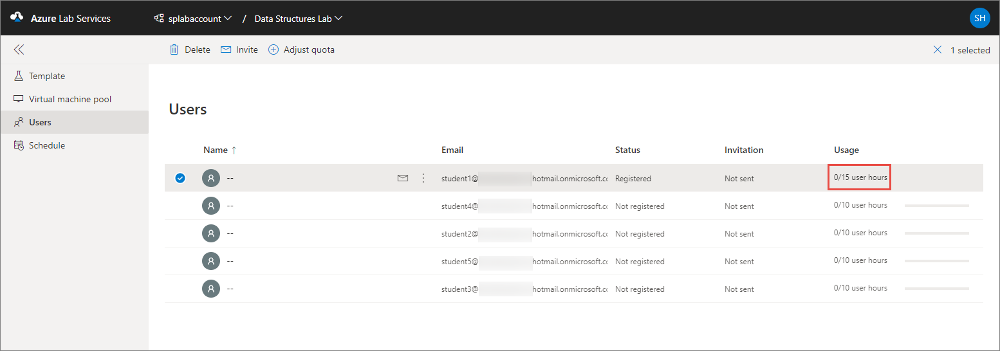

## Student accounts

To add students to a classroom lab, you use their email accounts. Students might have the following types of email accounts:

- A student email account that's provided by your university's Azure Active Directory instance for Office 365. 
- A Microsoft-domain email account, such as *outlook.com*, *hotmail.com*, *msn.com*, or *live.com*.
- A non-Microsoft email account, such as one provided by Yahoo! or Google. However, these types of accounts must be linked with a Microsoft account.
- A GitHub account. This account must be linked with a Microsoft account.

### Use a non-Microsoft email account
Students can use non-Microsoft email accounts to register and sign in to a classroom lab.  However, the registration requires that they first create a Microsoft account that's linked to their non-Microsoft email address.

Many students might already have a Microsoft account that's linked to their non-Microsoft email address. For example, students already have a Microsoft account if they've used their email address with other Microsoft products or services, such as Office, Skype, OneDrive, or Windows.  

When students use the registration link to sign in to a classroom, they're prompted for their email address and password. Students who attempt to sign in with a non-Microsoft account that's not linked to a Microsoft account will receive the following error message: 

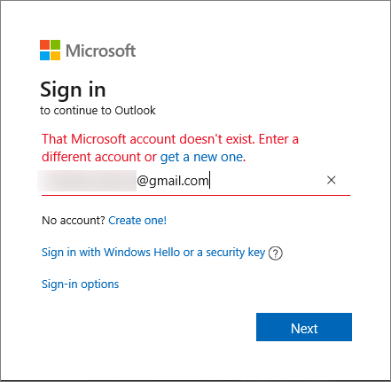

Here's a link for students to [sign up for a Microsoft account](http://signup.live.com).  

> [!IMPORTANT]
> When students sign in to a classroom lab, they aren't given the option to create a Microsoft account. For this reason, we recommend that you include this sign-up link, http://signup.live.com, in the classroom lab registration email that you send to students who are using non-Microsoft accounts.

### Use a GitHub account
Students can also use an existing GitHub account to register and sign in to a classroom lab. If they already have a Microsoft account linked to their GitHub account, students can sign in and provide their password as shown in the preceding section. 

If they haven't yet linked their GitHub account to a Microsoft account, they can do the following:

1. Select the **Sign-in options** link, as shown here:

    

1. In the **Sign-in options** window, select **Sign in with GitHub**.

    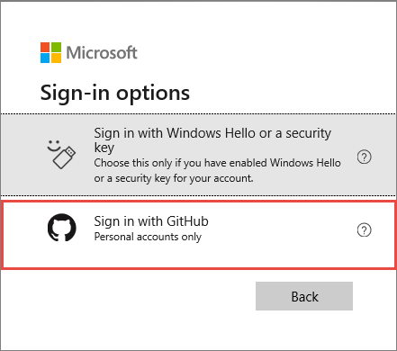

    At the prompt, students then create a Microsoft account that's linked to their GitHub account. The linking happens automatically when they select **Next**. They're then immediately signed in and connected to the classroom lab.

## Export a list of users to a CSV file

1. Go to the **Users** pane.
1. On the toolbar, select the ellipsis (**...**), and then select **Export CSV**. 

    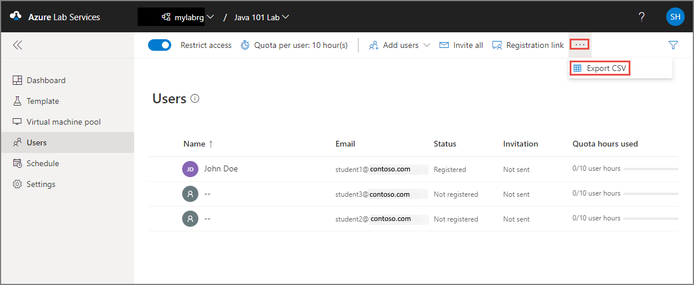

## Next steps
See the following articles:

- For administrators: [Create and manage lab accounts](how-to-manage-lab-accounts.md)
- For lab owners: [Create and manage labs](how-to-manage-classroom-labs.md) and [Set up and publish templates](how-to-create-manage-template.md)
- For lab users: [Access classroom labs](how-to-use-classroom-lab.md)
