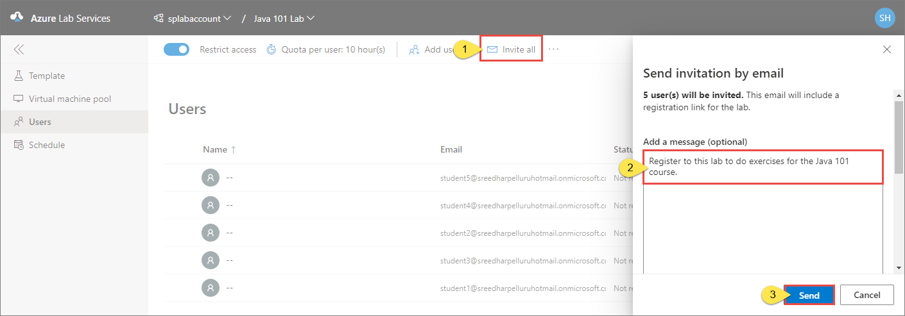

# Add and manage lab users
This article describes how to add users to the lab, get them registered with the lab, control the number of hours they can use the VM, and more. 

## Add users to the lab

1. Select **Users** on the left menu. By default, the **Restrict access** option is enabled. When this setting is on, a user can't register with the lab even if the user has the registration link unless the user is in the list of users. Only users in the list can register with the lab by using the registration link you send. In this procedure, you add users to the list. Alternatively, you can turn off **Restrict access**, which allows users to register with the lab as long as they have the registration link. 
2. Select **Add users** on the toolbar, and then select **Add by email addresses**. 

    
1. On the **Add users** page, enter email addresses of users in separate lines or in a single line separated by semicolons. 

    
4. Select **Save**. You see the email addresses of users and their statuses (registered or not) in the list. 

    

### Add users by uploading a CSV file
You can also add users by uploading a CSV file with email addresses of users.

1. Create a CSV file with email addresses of users in one column.

    
2. On the **Users** page of the lab, select **Add users** on the toolbar, and then select **Upload CSV**.

    
3. Select the CSV file with user email addresses. When you select **Open** after selecting the CSV file, you see the following **Add users** window. The email address list is filled with email addresses from the CSV file. 

    
4. Select **Save** in the **Add users** window. 
5. Confirm that you see users in the list of users. 

    

## Send invitations to users
To send the registration link to students, use one of the following methods. The first method shows you how to send emails to students with the registration link and an optional message. The second method shows you how to get the registration link that you can share with others any way you want. 

If the **Restrict access** is enabled for the lab, only users in the list of users can use the registration link to register to the lab. This option is enabled by default. 

### Invite all users

1. Switch to the **Users** page of the lab. 
2. Select **Invite all** from the toolbar. 
3. Enter a **message** to the users. This is an optional step.
4. Then, select **Send**.

    

    You will see the status of this operation in the **Invitation** column of the **Users** list. The invitation email will include the registration link that users can use to register with the lab. 

### Invite selected users

1. Select an user or multiple users in the list. 
2. Then, select **envelope** icon you see in the selected row (or) select **Invite** on the toolbar. 

    
3. In the **Send invitation by email** window, enter an optional **message**, and then select **Send**. 

    

    You will see the status of this operation in the **Invitation** column of the **Users** list. The invitation email will include the registration link that users can use to register with the lab.

1. Switch to the **Users** view if you are not on the page already. 

## Get registration link
You can also get the registration link from the portal and send it using your own email client application. 

1. Switch to the **Users** view by selecting **Users** on the left menu. 
2. Select **...(ellipsis)** on the toolbar, and then select **Registration link**.

    
1. On the **User registration** dialog box, select the **Copy** button. The link is copied to the clipboard. Paste it in an email editor, and send an email to the student. 

    
2. On the **User registration** dialog box, select **Done**. 
4. Send the **registration link** to a student so that the student can register for the class. 

## View users registered with the lab

Select **Users** on the left menu to see the list of users registered with the lab. 

## Set quotas for users
You can set quotas per user by using the following steps: 

1. Select **Users** on the left menu if the page isn't already active. 
2. Select **Quota per user: &lt;number&gt; hours** on the toolbar. 
3. On the **Quota per user** page, specify the number of hours you want to give to each user (student) outside the scheduled class time, and then select **Save**.

        
5. You see the changed values on the toolbar now: **Quota per user: &lt;number of hours&gt;**. 

    

    > [!IMPORTANT]
    > The [scheduled running time of VMs](how-to-create-schedules.md) does not count against the quota allotted to a user. The quota is for the time outside of schedule hours that a student spends on VMs. 

## Set additional quota for a specific user
You can set a separate quota for a user. To do so, follow these steps:

1. Select a user(student) from the list of users on the **Users** page.
2. Then, select **Adjust quota** from the toolbar. 

    
3. Enter the number of **additional hours** for the selected user or users, and then select **Apply**. 

    
4. You will see the updated usage for the user in the **Usage** column. 

    

## Next steps
See the following articles:

- [As an admin, create and manage lab accounts](how-to-manage-lab-accounts.md)
- [As a lab owner, create and manage labs](how-to-manage-classroom-labs.md)
- [As a lab owner, set up and publish templates](how-to-create-manage-template.md)
- [As a lab user, access classroom labs](how-to-use-classroom-lab.md)
