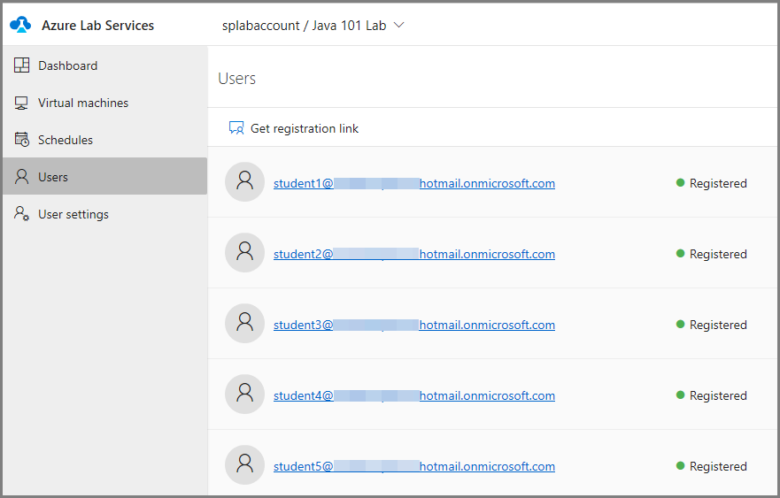

# Configure usage settings and policies
This article describes how to configure the number of users for the lab, get them registered with the lab, control the number of hours they can use the VM, and more. 

## Specify the number of users allowed into the lab

1. Select **Usage policy**. 
2. In the **Usage policy**, settings, enter the **number of users** allowed to use the lab.
3. Select **Save**. 

    

## Send registration link to students

1. Switch to the **Users** view by selecting **Users** on the left menu. 
2. Select **Get registration link** tile.

    
1. In the **User registration** dialog box, select the **Copy** button. The link is copied to the clipboard. Paste it in an email editor, and send an email to the student. 

    
2. On the **User registration** dialog box, select **Close**. 
4. Share the registration link with a student so that the student can register for the class. If you have the **Restrict option** setting enabled and have a list of users in the list, do the following actions:
    1. Select the **email address** of the user in the list. 
    2. You see a window from your default email program with the **TO** address filled in. 
    3. Paste the **registration URL** you copied earlier. 
    4. Send the **email**. 

## View users registered with the lab

Select **Users** on the left menu to see the list of users registered with the lab. 

## Set quotas per user

1. Select **Users** on the left menu.
2. Select **Quota per user: unlimited** on the toolbar. 
3. On the **Quota per user** page, select **Limit the number of hours a user can use a VM**. 
4. For **How many hours do you want to give to each user**, enter the number of hours, and select **Save**. 

    
5. You see the number of hours on the toolbar now: **Quota per user: &lt;number of hours&gt;**. 

    

## Add users to the lab
If you have the **Restrict access** enabled, add users (email addresses) to the list.

1. Select **Users** on the left menu.
2. Select **Add users** on the toolbar. 
3. On the **Add users** page, enter email addresses of users in separate lines or in a single line separated by semicolons. 

    
4. Select **Save**. You see the email addresses of users and their statuses (registered or not) in the list. 

    

### Add users by uploading a CSV file
You can also add users by uploading a CSV file with email addresses of users.

1. Select **Upload CSV** on the toolbar.
2. Select the CSV file with user email addresses. All the email addresses should be in one column when you open it with Excel. 

## Manage user VMs
Once students register with Azure Lab Services using the registration link you provided to them, you see the VMs assigned to students on the **Virtual machines** tab. 

You can do the following tasks on a student VM: 

- Stop a VM if the VM is running. 
- Start a VM if the VM is stopped. 
- Connect to the VM. 
- Delete the VM. 
- View the number of hours that users used the virtual machine. 

## Next steps
See the following articles:

- [As an admin, create and manage lab accounts](how-to-manage-lab-accounts.md)
- [As a lab owner, create and manage labs](how-to-manage-classroom-labs.md)
- [As a lab owner, set up and publish templates](how-to-create-manage-template.md)
- [As a lab user, access classroom labs](how-to-use-classroom-lab.md)
